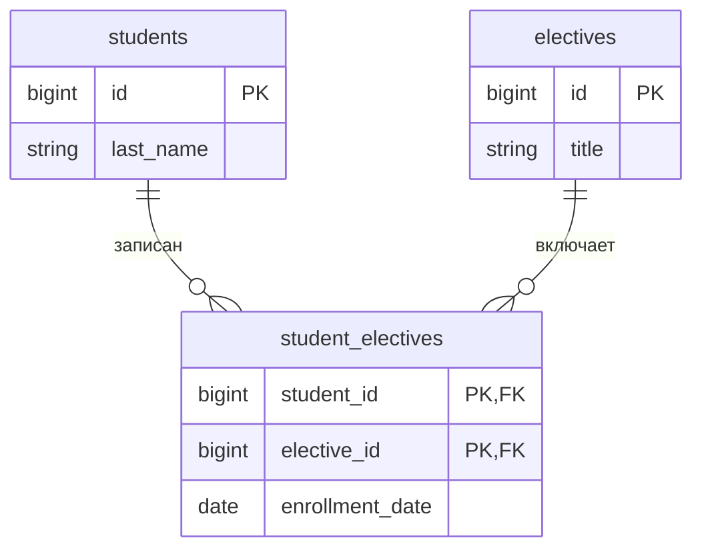

# Основы проектирования баз данных

Проектирование базы данных представляет собой систематический инженерный процесс построения информационной модели, удовлетворяющей требованиям к хранению, производительности, целостности и безопасности данных. Данный процесс является разработкой фундаментального слоя архитектуры программного обеспечения, а не технической процедурой создания таблиц.

Значимость этапа проектирования обусловлена закономерностью, известной как «Кривая стоимости изменений» (Cost of Change Curve). Согласно данной модели, изменение структуры базы данных на этапе эксплуатации обходится значительно дороже, чем рефакторинг программного кода. Ошибки, допущенные при моделировании данных, ведут к потере целостности, ограничению масштабируемости и деградации производительности информационных систем.

Классическая теория баз данных, базирующаяся на архитектуре ANSI/SPARC, регламентирует разделение процесса проектирования на три уровня абстракции. Подход **нисходящего проектирования (Top-Down Design)** предполагает последовательное снижение степени неопределенности: от абстрактных понятий предметной области до физического размещения данных на носителе.

## Жизненный цикл проектирования: Три уровня абстракции

### Уровень 1: Концептуальное проектирование (Conceptual Design)

**Цель:** Семантическое моделирование предметной области и формализация информационных потребностей.

На данном этапе осуществляется абстрагирование от технических деталей реализации. Выбор конкретной СУБД (PostgreSQL, Oracle), аппаратной платформы или форматов хранения не учитывается. Основная задача — формирование формального описания предметной области, интерпретируемого как разработчиками, так и заказчиками.

**Ключевые задачи этапа:**

1.  **Идентификация сущностей (Entities):** Определение ключевых объектов реального мира, информация о которых подлежит хранению (например, «Курсант», «Контракт», «Транзакция»).
2.  **Определение атрибутивного состава:** Выявление характеристик сущностей, значимых для функционирования системы. Осуществляется фильтрация данных: фиксируется необходимость хранения атрибутов, влияющих на логику работы, и исключаются избыточные характеристики.
3.  **Формализация связей (Relationships):** Описание взаимодействий между сущностями. Определяются кардинальность связей (Один-ко-многим, Многие-ко-многим) и степень обязательности участия сущности в связи.

**Результат (Артефакт):** Концептуальная ER-диаграмма (Entity-Relationship Diagram) — высокоуровневая схема данных, инвариантная к программной реализации.

### Уровень 2: Логическое проектирование (Logical Design)

**Цель:** Трансляция концептуальной модели в структуры данных выбранной модели (в рамках данной дисциплины — реляционной).

На этом уровне производится преобразование семантики предметной области в строгие математические структуры. Принимается архитектурное решение об использовании реляционной модели данных, что накладывает ряд ограничений. Проектирование не привязано к специфике конкретного программного продукта, но подчиняется законам реляционной алгебры.

**Ключевые задачи этапа:**

1.  **Отображение сущностей в отношения:** Преобразование концептуальных сущностей в таблицы.
2.  **Нормализация отношений:** Систематическое приведение таблиц к Третьей нормальной форме (3НФ) для устранения избыточности, минимизации объема хранения и предотвращения аномалий модификации данных.
3.  **Разрешение сложных связей:** Реляционная модель не поддерживает прямые связи типа «Многие-ко-многим» (M:M). На данном этапе вводятся ассоциативные сущности (связующие таблицы) для декомпозиции M:M в две связи 1:M.
4.  **Определение системы ключей:** Спецификация Первичных ключей (Primary Keys) для обеспечения целостности сущности и Внешних ключей (Foreign Keys) для обеспечения ссылочной целостности.

**Результат (Артефакт):** Логическая схема данных (L-ERD), содержащая спецификацию отношений, атрибутов, ключей и ограничений без привязки к физическим типам данных конкретной СУБД.

### Уровень 3: Физическое проектирование (Physical Design)

**Цель:** Оптимизация логической модели под конкретную СУБД и профиль нагрузки для достижения целевых показателей производительности.

Уровень технологической реализации. Абстрактная модель преобразуется в инструкции для конкретного программного обеспечения (например, PostgreSQL). Принятие решений основывается на знаниях о внутренней архитектуре СУБД, механизмах хранения и прогнозируемых паттернах доступа к данным.

**Ключевые задачи этапа:**

1.  **Спецификация физических типов данных:** Выбор оптимальных машинных типов для хранения атрибутов. Например, выбор между `INTEGER` (4 байта) и `BIGINT` (8 байт) на основе прогноза роста объема данных, или выбор между `VARCHAR`, `TEXT` и `CHAR` с учетом специфики TOAST-механизма в PostgreSQL.
2.  **Проектирование индексов:** Анализ предикатов в SQL-запросах и создание структур доступа (B-Tree, Hash, GIN, GiST) для минимизации операций ввода-вывода (I/O).
3.  **Контролируемая денормализация:** Намеренное нарушение правил нормализации (дублирование данных, использование предвычисленных агрегатов) для ускорения операций чтения за счет замедления операций записи.
4.  **Секционирование (Partitioning):** Горизонтальное разбиение крупных таблиц на физические сегменты (партиции) для повышения управляемости и производительности.

**Результат (Артефакт):** DDL-скрипты (Data Definition Language) для создания объектов базы данных и конфигурационные параметры подсистемы хранения.

## Пример сквозного проектирования: «Контакты студента»

Рассмотрим эволюцию архитектурных решений на примере задачи реализации хранения контактной информации студентов (номера телефонов, адреса электронной почты, идентификаторы в мессенджерах).

### 1. Концептуальный уровень (Семантический взгляд)

На основе анализа требований предметной области фиксируются следующие правила:

- У одного студента может быть несколько каналов связи.
- Тип канала связи (Телефон, Telegram, Email) является значимой характеристикой.
- Контакты являются неотъемлемой частью профиля студента.

**Решение:** В концептуальной модели создается сущность **Студент**, содержащая множественный атрибут **Контакты**. Вопрос технической реализации множественности атрибута на данном уровне не рассматривается.

### 2. Логический уровень (Реляционный взгляд)

При трансляции модели в реляционную среду вступает в силу ограничение **Первой нормальной формы (1НФ)**, требующей атомарности значений атрибутов. Хранение списка контактов в одной ячейке таблицы недопустимо.

**Решение:** Производится декомпозиция данных на два отношения:

1.  **Отношение "Студенты":** Содержит идентификатор и ФИО.
2.  **Отношение "Контакты":** Содержит значение контакта, тип контакта и Внешний ключ, ссылающийся на сущность "Студенты".

Таким образом, отношение «один-ко-многим» реализуется посредством двух таблиц, что обеспечивает соответствие требованиям реляционной теории и отсутствие избыточности.

### 3. Физический уровень (Инженерный взгляд на PostgreSQL)

На этапе реализации производится анализ профиля нагрузки (Access Patterns). Выявлено:

- Поиск студента _по_ номеру телефона выполняется редко.
- В подавляющем большинстве случаев контакты запрашиваются _совместно_ с профилем студента.
- Хранение контактов в отдельной таблице требует выполнения ресурсоемкой операции соединения (`JOIN`) при каждом запросе профиля.

**Инженерное решение:** Принимается решение об использовании специфических возможностей PostgreSQL — типа данных `JSONB`. Контакты сохраняются в виде полуструктурированного JSON-документа (массива объектов) непосредственно в таблице студентов.

**Итог:** Физическая модель **отклоняется** от логической (формальное нарушение 1НФ), но обеспечивает более высокую производительность за счет локальности данных и устранения необходимости в операции соединения.

## Эволюция методологии

Описанная выше каскадная модель (Waterfall) была сформулирована в период становления реляционных СУБД. В современной индустрии разработки программного обеспечения подходы к проектированию трансформировались.

::: warning Эволюция процесса
В современной инженерной практике границы между уровнями проектирования размыты, а процесс носит циклический (итеративный) характер.
:::

**1. Технологический детерминизм**
В классической теории выбор СУБД осуществляется на завершающем этапе. В современной практике технологический стек определяется на старте проекта. Архитектор, осведомленный об использовании PostgreSQL, уже на этапе логического проектирования может закладывать использование специфических нереляционных структур (массивов, JSON, геопространственных данных PostGIS), создавая гибридные модели.

**2. Итеративность и рефакторинг**
Проектирование не является однократным актом. База данных эволюционирует совместно с приложением.

- _Итерация 1:_ Реализация модуля «Пользователи».
- _Итерация 2:_ При реализации модуля «Заказы» выявляется неэффективность текущей структуры «Пользователей». Производится возврат на логический уровень и рефакторинг схемы (миграция данных).

**3. Влияние ORM и Code-First**
Распространение инструментов ORM (Object-Relational Mapping) способствовало популяризации подхода Code-First, где первичным источником истины является программный код классов приложения, а схема базы данных генерируется автоматически. В данном сценарии физическая модель формируется на основе программного кода, а концептуальная и логическая модели существуют имплицитно.

::: info Вывод
Три классических уровня проектирования сохраняют актуальность как методологический инструмент, обеспечивающий системный подход. Однако их применение требует адаптивности и понимания влияния функциональных возможностей конкретной СУБД на архитектурные решения высокого уровня.
:::

## ER-моделирование (Entity-Relationship)

Модель «Сущность-Связь» (Entity-Relationship Model) является стандартом де-факто для семантического описания предметной области. Это графический язык, позволяющий трансформировать словесное описание требований в формализованную схему, пригодную для последующей реализации в СУБД.

Основная задача этапа — абстрагироваться от технических деталей (типов данных `integer` или `varchar`, индексов, табличных пространств) и сосредоточиться на логике взаимодействия объектов.

## Графические нотации: Эволюция стандартов

В инженерной практике сосуществуют два основных стандарта визуализации. Понимание обоих необходимо для работы с технической литературой и современными CASE-средствами проектирования.

### Нотация Питера Чена (Peter Chen Notation)

Разработана в 1976 году. Является классической академической нотацией. Ориентирована на концептуальное описание, где приоритет отдается смысловой нагрузке, а не компактности.

**Графические примитивы:**

- **Прямоугольник:** Сущность (Объект).
- **Ромб:** Связь (Действие). Соединяет сущности. Внутри ромба пишется глагол (например, «Изучает», «Состоит»).
- **Овал (Эллипс):** Атрибут (Свойство). Присоединяется линией к сущности.

::: warning Недостатки
Низкая информационная плотность. На диаграммах реальных систем (50+ таблиц) обилие овалов и ромбов делает схему нечитаемой («эффект спагетти»). Используется преимущественно в учебных целях.
:::

### Нотация IDEF1X (Integration Definition for Information Modeling)

Разработана в 1980-х годах в рамках программы компьютеризации ВВС США (ICAM). Является федеральным стандартом обработки информации (FIPS 184). Отличается строгой формализацией и жесткими правилами синтаксиса, что делает ее приоритетной при проектировании систем специального назначения и в государственном секторе.

**Графические примитивы:**

- **Прямоугольник:** Сущность. Форма углов имеет семантическое значение:
  - _Прямые углы:_ Независимая сущность (Parent / Independent).
  - _Скругленные углы:_ Зависимая сущность (Child / Dependent), идентификация которой невозможна без связи с родителем.
- **Структура блока:** Горизонтальная черта строго отделяет область Первичного ключа (сверху) от области неключевых атрибутов (снизу). Внешние ключи (FK) явно указываются в соответствующей области.
- **Линия связи:** Графическое начертание линии определяет тип миграции ключей:
  - _Сплошная линия:_ Идентифицирующая связь (PK родителя становится частью PK потомка).
  - _Пунктирная линия:_ Неидентифицирующая связь (PK родителя становится обычным атрибутом потомка).
- **Терминатор (Точка):** Жирная точка на конце линии обозначает мощность «Много» (N). Отсутствие символа обозначает «Один» (1).

::: info Специфика применения
Ключевое преимущество IDEF1X — визуальное разделение идентифицирующих и неидентифицирующих связей. Это позволяет инженеру мгновенно определить структуру первичных ключей и иерархию зависимостей, просто взглянув на схему, без анализа списка атрибутов.
:::

### Нотация «Воронья лапка» или Нотация Мартина (Crow’s Foot / IE Notation)

Индустриальный стандарт (Information Engineering), используемый в современных инструментах моделирования (DataGrip, pgModeler). Ориентирована на компактность и прямое отображение в структуру таблиц базы данных.

**Графические примитивы:**

- **Прямоугольник (Таблица):** Представляет собой сущность. Имя сущности пишется в заголовке.
- **Список внутри прямоугольника:** Атрибуты перечисляются внутри фигуры, не загромождая пространство вокруг.
- **Линия связи:** Соединяет прямоугольники напрямую, без промежуточных фигур. Семантика связи кодируется специальными маркерами на концах линии.

::: tip Преимущество
Высокая плотность информации. Позволяет разместить сложную схему данных на одном экране.
:::

## Сущности и атрибуты

### Сущность (Entity)

Объект реального мира или абстрактное понятие, информация о котором подлежит хранению в базе данных. В реляционной модели сущность преобразуется в **Таблицу**.

Сущности классифицируются по степени их автономности:

#### Сильная сущность (Strong / Independent Entity)

Объект, существование которого не зависит от других объектов в системе.

- **Признак:** Обладает собственным Первичным ключом (PK), который однозначно идентифицирует экземпляр без привлечения сторонних данных.
- **Пример:** `Курсант`, `Дисциплина`, `Оружие`. Удаление всех взводов не означает физического исчезновения курсантов (они могут быть перераспределены). Курсант существует сам по себе.
- **Отображение:** Обычный прямоугольник.

#### Слабая сущность (Weak / Dependent Entity)

Объект, существование которого невозможно (или не имеет смысла) без связи с родительской (сильной) сущностью.

- **Признак:** Не имеет собственного полного идентификатора. Первичный ключ слабой сущности является **составным** и обязательно включает в себя Внешний ключ (FK) родителя.
- **Пример:** `Родственник_Курсанта` или `Запись_В_Медицинской_Карте`.
  - Нельзя внести в базу данных «Отца» без привязки к конкретному «Курсанту».
  - Если удалить «Курсанта», информация о его родственниках должна быть удалена каскадно, так как она теряет смысл.
- **Отображение:** Скругленные углы прямоугольника (зависит от ПО) или идентификация через линию связи.

### Атрибут (Attribute)

Характеристика сущности, детализирующая её описание. В реляционной модели преобразуется в **Столбец (Column)**.

#### Простой атрибут (Simple Attribute)

Неделимая единица информации.

- **Пример:** `Звание`, `Год рождения`, `Оклад`.
- **Реализация:** Один столбец в таблице.

#### Составной атрибут (Composite Attribute)

Характеристика, которая может быть логически разделена на более мелкие части.

- **Пример:** `Адрес` (Страна, Регион, Город, Улица, Дом), `ФИО` (Фамилия, Имя, Отчество).
- **Реализация:** В реляционной базе данных составные атрибуты **запрещены** (требование 1НФ). На этапе физического проектирования составной атрибут должен быть разложен на отдельные простые атрибуты (столбцы `city`, `street`, `house`).

#### Производный атрибут (Derived Attribute)

Значение, которое не хранится в базе явно, а вычисляется на основе других атрибутов.

- **Пример:** `Возраст` (вычисляется как `Текущая_Дата - Дата_Рождения`), `Сумма_Контракта`.
- **Реализация:** Обычно не создается как столбец таблицы (чтобы избежать избыточности и рассинхронизации). Вычисляется динамически в момент SQL-запроса (`SELECT`) или реализуется через виртуальные генерируемые столбцы.

## Связи: кардинальность и модальность

Связь (Relationship) описывает характер взаимодействия между двумя сущностями. В нотации «Воронья лапка» линия связи читается с двух сторон. Концы линии содержат графические символы, кодирующие два параметра:

1.  **Кардинальность (Cardinality):** «Сколько?» (Максимум). Один или Много.
2.  **Модальность / Обязательность (Modality / Optionality):** «Обязательно?» (Минимум). Ноль или Один.

Символы комбинируются, образуя четыре базовых сценария на каждом конце линии.

### Четыре комбинации (чтение концов линии)

При чтении диаграммы используется мнемоническое правило: сначала читается символ, ближний к центру линии (минимум), затем символ, ближний к сущности (максимум).

#### 1. Обязательно один (Mandatory One) — `||`

- **Графика:** Две вертикальные черты поперек линии.
- **Значение:** Экземпляр сущности **должен** существовать и может быть **только один**.
- **Пример:** В сущности `Личное_Дело` ссылка на `Курсанта`. Личное дело не может быть анонимным (обязательность), и оно принадлежит только одному лицу (уникальность).

#### 2. Обязательно много (Mandatory Many) — `|<`

- **Графика:** Вертикальная черта и «лапка».
- **Значение:** Экземпляр сущности **должен** иметь связь минимум с одним объектом, но верхний предел не ограничен.
- **Пример:** В сущности `Заказ` ссылка на `Позиции_Заказа`. Заказ не может существовать пустым (минимум 1 товар), но товаров может быть много.

#### 3. Опционально один (Optional One) — `0|`

- **Графика:** Круг и вертикальная черта.
- **Значение:** Связи может **не быть** (ноль), но если она есть — то объект **только один**.
- **Пример:** Сущность `Сотрудник` и сущность `Служебный_Автомобиль`. У сотрудника может не быть машины (0), но если закреплена — то одна (1).

#### 4. Опционально много (Optional Many) — `0<`

- **Графика:** Круг и «лапка».
- **Значение:** Связи может **не быть**, либо может быть **любое количество**.
- **Пример:** Сущность `Читатель` и сущность `Книга`. У читателя на руках может быть 0 книг, 1 книга или 10 книг.

## Аномалии баз данных: проблематика избыточности

В основе реляционной теории лежит принцип разделения фактов. Однако на начальных этапах проектирования часто совершается фундаментальная ошибка: попытка объединить разнородные данные в рамках одной структуры. Такой подход, часто именуемый «мышлением в стиле электронных таблиц» (Excel-thinking), предполагает хранение всей доступной информации в едином массиве.

В теории баз данных структура, содержащая все атрибуты предметной области в одной таблице, называется **Универсальным отношением (Universal Relation)**. Использование такой модели в системах оперативной обработки транзакций (OLTP) является недопустимым, так как неизбежно приводит к **аномалиям модификации**.

Аномалия — это состояние противоречия или потери данных, возникающее в базе данных при выполнении операций вставки, обновления или удаления записей в ненормализованных таблицах. Корень проблемы кроется в **избыточности данных**: один и тот же факт реального мира записан в базе данных многократно.

### Анализ ненормализованного отношения

Рассмотрим сущность `Ведомость_Студентов`. В ней искусственно консолидирована информация о трех различных объектах реального мира: Студентах, Учебных группах и Кафедрах.

**Атрибутивный состав:**
`{ID_Студента (PK), ФИО_Студента, Номер_Группы, Староста_Группы, Название_Кафедры, Зав_Кафедрой}`

| ID  | ФИО           | Группа | Староста    | Кафедра     | Зав_Кафедрой  |
| :-- | :------------ | :----- | :---------- | :---------- | :------------ |
| 101 | Иванов И.И.   | ИТ-41  | Петров П.П. | Информатика | Проф. Сидоров |
| 102 | Смирнов А.А.  | ИТ-41  | Петров П.П. | Информатика | Проф. Сидоров |
| 103 | Кузнецов К.К. | ИТ-41  | Петров П.П. | Информатика | Проф. Сидоров |
| 205 | Морозов М.М.  | ЭК-22  | Орлова О.О. | Экономика   | Проф. Волков  |

::: danger Диагноз: Смешение жизненных циклов
Главная проблема данной таблицы — объединение объектов с разными жизненными циклами.

1. Студент может отчислиться, но группа должна остаться.
2. Группа может быть создана до зачисления студентов.
3. Заведующий кафедрой может смениться независимо от студентов.
   В текущей структуре эти события жестко сцеплены, что порождает аномалии.
   :::

### Аномалия вставки (Insertion Anomaly)

Аномалия вставки — это невозможность добавить в базу данных информацию об одном объекте, не добавляя при этом информацию о другом, логически независимом объекте.

**Сценарий:**
Ученый совет утвердил создание новой учебной группы «МТ-10» на кафедре «Мехатроника». Набор студентов в группу только объявлен, списки еще пусты.

**Техническая проблема:**
В рассматриваемой таблице Первичным ключом (Primary Key) является атрибут `ID_Студента`. Это означает, что именно студент является стержневой сущностью записи. Согласно правилу **целостности сущности (Entity Integrity)**, первичный ключ не может быть неопределенным (`NULL`).

**Результат:**
Система управления базами данных (СУБД) технически запретит создание записи вида:
`{NULL, NULL, "МТ-10", NULL, "Мехатроника", "Проф. Чайкин"}`.

**Последствия:**
Мы сталкиваемся с парадоксом: факт существования группы и кафедры в реальном мире есть, а отразить его в информационной системе невозможно. Данные о структуре вуза становятся заложниками данных о контингенте. Нельзя завести кафедру, пока на неё не поступит первый студент.

### Аномалия обновления (Update Anomaly)

Аномалия обновления — это несогласованность данных, возникающая при изменении дублированной информации.

**Сценарий:**
На кафедре «Информатика» произошла кадровая перестановка. Вместо профессора Сидорова заведующим назначен профессор Новиков.

**Техническая проблема (Performance Impact):**
В нормализованной базе данных это изменение потребовало бы обновления одной ячейки в таблице `Кафедры`.
В текущей схеме СУБД вынуждена выполнять ресурсоемкую операцию: сканировать всю таблицу `Ведомость` (которая может содержать тысячи записей) и менять значение «Сидоров» на «Новиков» в каждой строке каждого студента, относящегося к этой кафедре.

**Риск целостности (Integrity Risk):**
Представим, что в процессе массового обновления произошел сбой (ошибка диска, разрыв соединения, блокировка транзакции), и операция выполнилась лишь частично. Например, у первых 100 студентов данные обновились, а у остальных 50 — остались прежними.

База данных переходит в **несогласованное состояние**:

- Запрос: _"Кто заведует кафедрой у студента Иванова?"_ -> Ответ: _"Новиков"_.
- Запрос: _"Кто заведует кафедрой у студента Смирнова?"_ -> Ответ: _"Сидоров"_.

Система дает противоречивые ответы об одном и том же факте реального мира. Доверие к данным падает до нуля.

### Аномалия удаления (Deletion Anomaly)

Аномалия удаления — это непреднамеренная потеря информации об одной сущности при удалении данных о другой сущности.

**Сценарий:**
Студент Морозов М.М. (группа ЭК-22) забирает документы. Это последний студент в данной группе (остальные уже выпустились или перевелись).

**Техническая проблема:**
Оператор производит удаление записи о студенте (строка с `ID=205`). С точки зрения оператора, он удаляет человека.
Однако, поскольку атрибуты `Номер_Группы`, `Староста`, `Кафедра`, `Зав_Кафедрой` не вынесены в отдельные справочники, а хранятся как текстовые поля в строке студента, они удаляются вместе с ним.

**Результат:**
В базе данных полностью исчезает информация о существовании группы «ЭК-22» и кафедры «Экономика».

- Мы потеряли историю (какая группа была).
- Мы потеряли настройки (кто был старостой).
- Мы потеряли структуру (кто заведует кафедрой).

Если завтра потребуется зачислить нового студента в группу «ЭК-22», систему придется настраивать заново, так как она «забыла» этот объект.

## Корень проблемы: функциональные зависимости

Чтобы понять, как бороться с аномалиями, необходимо рассмотреть их математическую природу. Аномалии возникают из-за неправильных функциональных зависимостей внутри одной таблицы.

В нашей таблице `Ведомость` присутствуют зависимости, нарушающие принципы "здоровой" архитектуры:

1.  **Студент -> Группа:** `ID_Студента` определяет `Номер_Группы`. (Это нормально).
2.  **Группа -> Староста:** `Номер_Группы` определяет `Старосту`.
    - _Проблема:_ Староста зависит не от студента (ключа таблицы), а от группы. Это **транзитивная зависимость**.
3.  **Группа -> Кафедра:** `Номер_Группы` определяет `Название_Кафедры`.
    - _Проблема:_ Кафедра зависит от группы, а не от студента.
4.  **Кафедра -> Зав. Кафедрой:** `Название_Кафедры` определяет `Зав_Кафедрой`.
    - _Проблема:_ Заведующий зависит только от кафедры.

::: info Вывод
В одной таблице смешаны зависимости разных уровней.
Атрибуты `Староста`, `Кафедра`, `Зав_Кафедрой` не описывают сущность `Студент` (первичный ключ), но хранятся в ней. Это нарушение **Третьей нормальной формы (3НФ)**.

**Единственное решение:** Декомпозиция (разделение) отношения на три независимые таблицы:

1.  `Студенты` (ссылаются на группу).
2.  `Группы` (ссылаются на кафедру).
3.  `Кафедры`.

:::

## Нормализация: первая нормальная форма (1НФ)

Нормализация — это пошаговый процесс реорганизации данных, направленный на устранение избыточности и зависимостей, приводящих к аномалиям. Базовым уровнем, без достижения которого структура не может называться реляционной таблицей, является **Первая нормальная форма (1НФ)**.

::: info Первая нормальная форма

Отношение считается находящимся в 1НФ тогда и только тогда, когда соблюдаются три фундаментальных условия:

1.  Атомарность атрибутов.
2.  Отсутствие повторяющихся групп.
3.  Наличие Первичного ключа.

:::

### Атомарность атрибутов

Принцип атомарности гласит: **«В одной ячейке таблицы должно храниться только одно значение»**.

Нарушение этого принципа часто встречается при миграции данных из Excel или бумажных носителей, когда в одно поле записывается список значений, разделенных разделителем (запятой, точкой с запятой, переносом строки).

#### Пример нарушения (Неатомарные данные)

Рассмотрим таблицу `Студенты`, где необходимо хранить контактные телефоны.

| ID  | ФИО         | Телефоны                         |
| :-- | :---------- | :------------------------------- |
| 101 | Иванов И.И. | 8-900-111-22-33, 8-900-555-66-77 |
| 102 | Петров П.П. | 8-911-000-00-00                  |

#### Проблемы реализации

1.  **Сложность поиска:** Чтобы найти студента с конкретным номером, СУБД вынуждена сканировать строки и применять медленные текстовые функции (например, `LIKE '%...%'`). Использование индексов невозможно.
2.  **Сложность обновления:** Изменение одного из номеров требует чтения всей строки, парсинга текста, замены подстроки и обратной записи.
3.  **Ограничение типа:** Поле `Телефоны` вынужденно имеет строковый тип (`VARCHAR`), даже если номера состоят из цифр, что исключает валидацию формата.

### Отсутствие повторяющихся групп

Пытаясь решить проблему атомарности без создания новых таблиц, неопытные проектировщики часто совершают ошибку горизонтального масштабирования, создавая **повторяющиеся группы атрибутов**.

#### Пример нарушения (Повторяющиеся группы)

| ID  | ФИО         | Телефон_1       | Телефон_2       | Телефон_3 |
| :-- | :---------- | :-------------- | :-------------- | :-------- |
| 101 | Иванов И.И. | 8-900-111-22-33 | 8-900-555-66-77 | NULL      |
| 102 | Петров П.П. | 8-911-000-00-00 | NULL            | NULL      |

#### Проблемы реализации

1.  **Негибкость схемы:** Если у студента появится четвертый телефон, потребуется изменение физической структуры таблицы (`ALTER TABLE`), переписывание программного кода и перекомпиляция отчетов.
2.  **Сложность выборки:** Поиск по номеру превращается в громоздкую конструкцию:
    `WHERE Phone_1 = 'X' OR Phone_2 = 'X' OR Phone_3 = 'X'`.
3.  **Потеря дискового пространства:** Хранение множества `NULL`-значений для студентов с одним телефоном нерационально расходует ресурсы.

### Наличие Первичного ключа (Primary Key)

Третье требование 1НФ вытекает из определения отношения как множества. Все строки в таблице должны быть уникальны. Чтобы обеспечить механизм адресации конкретной строки, должен быть определен атрибут (или набор атрибутов), уникально идентифицирующий кортеж.

Без первичного ключа невозможно надежно ссылаться на запись из других таблиц, что делает невозможным построение связей.

### Приведение к 1НФ

Для приведения отношения к Первой нормальной форме необходимо выполнить декомпозицию данных. Множественные значения (в данном случае — телефоны) выносятся из основной сущности в отдельную зависимую таблицу.

Таким образом, отношение «Один-ко-Многим» реализуется физически.

**Шаг 1. Очистка родительской таблицы `Студенты`**
Оставляем только атомарные атрибуты, присущие студенту в единственном числе.

| ID (PK) | ФИО         |
| :------ | :---------- |
| 101     | Иванов И.И. |
| 102     | Петров П.П. |

**Шаг 2. Создание дочерней таблицы `Контакты`**
Каждый телефон записывается в отдельную строку. Связь обеспечивается через Внешний ключ (`student_id`).

| ID (PK) | student_id (FK) | Номер_Телефона  | Тип       |
| :------ | :-------------- | :-------------- | :-------- |
| 1       | 101             | 8-900-111-22-33 | Мобильный |
| 2       | 101             | 8-900-555-66-77 | Домашний  |
| 3       | 102             | 8-911-000-00-00 | Рабочий   |

#### Результат

1.  **Атомарность:** В каждой ячейке — один номер.
2.  **Масштабируемость:** Можно добавить хоть 100 телефонов одному студенту, просто добавляя новые строки в таблицу `Контакты`. Структура БД при этом не меняется.
3.  **Производительность:** Поиск по столбцу `Номер_Телефона` может быть мгновенным за счет использования B-Tree индекса.

## Нормализация: вторая нормальная форма (2НФ)

Переход ко Второй нормальной форме направлен на устранение избыточности, возникающей в отношениях со **составным первичным ключом**. Если отношение имеет простой ключ (состоящий из одного атрибута) и находится в 1НФ, оно автоматически находится во 2НФ.

### Функциональная зависимость

Прежде чем формулировать правила 2НФ, необходимо ввести понятие функциональной зависимости.

::: info Определение
**Функциональная зависимость** ($X \to Y$) существует между атрибутами $X$ и $Y$, если каждому значению $X$ соответствует в точности одно значение $Y$.
:::

В контексте баз данных мы говорим, что атрибут $Y$ **функционально зависит** от атрибута $X$, если, зная значение $X$, можно однозначно определить значение $Y$.

- **Пример 1:** `ID_Студента` $\to$ `ФИО`. (Зная ID, мы точно знаем ФИО).
- **Пример 2:** `Номер_Паспорта` $\to$ `Гражданство`.

::: info Вторая нормальная форма

Отношение находится во 2НФ, если:

1.  Оно находится в **1НФ**.
2.  Каждый неключевой атрибут **полностью функционально зависит** от Первичного ключа.

:::

Это означает отсутствие **частичной зависимости** (Partial Dependency). Частичная зависимость возникает, когда неключевой атрибут зависит не от всего составного ключа, а только от его части.

$$ \{Ключ_1, Ключ_2\} \to Атрибут $$

Если $Атрибут$ зависит только от $Ключ_2$, но хранится в таблице с составным ключом $\{Ключ_1, Ключ_2\}$ — это нарушение 2НФ.

### Практический пример: Анализ таблицы «Заказы-Товары»

Рассмотрим отношение `Строки_Заказа` (Order_Details), предназначенное для хранения информации о составе заказов.

**Первичный ключ (Составной):** `{Номер_Заказа, ID_Товара}`.
Один заказ может содержать много товаров. Один товар может быть во многих заказах. Уникальной является именно пара значений.

**Исходная схема (Нарушение 2НФ):**
`{Номер_Заказа, ID_Товара, Название_Товара, Цена_За_Единицу, Количество}`

| Номер_Заказа (PK) | ID_Товара (PK) | Название_Товара | Цена*За*Единицу | Количество |
| :---------------- | :------------- | :-------------- | :-------------- | :--------- |
| 5001              | **P-10**       | **Ноутбук**     | **50 000**      | 2          |
| 5002              | **P-10**       | **Ноутбук**     | **50 000**      | 1          |
| 5003              | P-20           | Мышь            | 500             | 5          |

### Анализ зависимостей

Проверим зависимость неключевых атрибутов от составного ключа:

1.  **Атрибут `Количество`:**
    - Зависит ли он от `Номер_Заказа`? Нет, сам по себе заказ не определяет число (в заказе разные товары в разном количестве).
    - Зависит ли он от `ID_Товара`? Нет, товар сам по себе не определяет количество (в разных заказах покупают разное количество).
    - **Вывод:** `Количество` зависит от **пары** `{Номер_Заказа, ID_Товара}`. Это **полная функциональная зависимость**. Здесь всё корректно.

2.  **Атрибут `Название_Товара` (и `Цена`):**
    - Зависит ли он от `Номер_Заказа`? Нет.
    - Зависит ли он от `ID_Товара`? Да. Если мы знаем, что товар — `P-10`, мы знаем, что это «Ноутбук». Номер заказа для этого знания не нужен.
    - **Вывод:** Налицо **частичная зависимость**. Атрибут зависит только от части первичного ключа.

Данное нарушение приводит к избыточности. Название «Ноутбук» и цена «50 000» дублируются в каждой строке заказа, где встречается этот товар. Это создает риски **аномалии обновления**: если цена товара изменится, придется обновлять все прошлые записи о заказах (что может быть некорректно для истории) или допустить рассогласование.

### Приведение ко 2НФ

Для устранения частичной зависимости необходимо выполнить декомпозицию. Атрибуты, зависящие только от части ключа, выносятся в отдельную таблицу, где эта часть ключа станет полным Первичным ключом.

**Шаг 1. Создание справочника `Товары`**
Сюда переносятся атрибуты, зависящие только от `ID_Товара`.

| ID_Товара (PK) | Название_Товара | Цена*За*Единицу |
| :------------- | :-------------- | :-------------- |
| P-10           | Ноутбук         | 50 000          |
| P-20           | Мышь            | 500             |

**Шаг 2. Оптимизация таблицы `Строки_Заказа`**
В таблице остаются только атрибуты, зависящие от полного составного ключа.

| Номер_Заказа (PK) | ID_Товара (PK, FK) | Количество |
| :---------------- | :----------------- | :--------- |
| 5001              | P-10               | 2          |
| 5002              | P-10               | 1          |
| 5003              | P-20               | 5          |

Теперь система находится во 2НФ:

1.  Информация о товаре хранится в одном месте (нет дублирования).
2.  Таблица `Строки_Заказа` связывает факты покупки, оперируя только ссылками и количеством.
3.  Обеспечена полная функциональная зависимость всех полей от ключей своих таблиц.

## Нормализация: третья нормальная форма (3НФ)

Третья нормальная форма является «золотым стандартом» проектирования реляционных баз данных. В большинстве инженерных задач приведение схемы к 3НФ считается достаточным условием для обеспечения целостности и производительности.

Отношение находится в 3НФ, если:

1.  Оно находится во **2НФ**.
2.  В нем отсутствуют **транзитивные функциональные зависимости** неключевых атрибутов от первичного ключа.

### Понятие транзитивной зависимости

Транзитивная зависимость возникает, когда неключевой атрибут зависит от ключа не напрямую, а через другой промежуточный атрибут.

Формально:
Если $A \to B$ и $B \to C$, то существует зависимость $A \to C$.
В контексте базы данных:
$$ Ключ \to Неключевой*Атрибут_1 \to Неключевой*Атрибут_2 $$

При наличии такой цепочки атрибут $C$ зависит от $B$, а не жестко от $A$. Это создает избыточность, так как связь $B \to C$ дублируется во всех строках.

### Практический пример: «Студент — Группа — Староста»

Вернемся к рассмотрению отношения `Студенты`. Пусть схема приведена к 1НФ и 2НФ, но содержит следующие атрибуты:

`{ID_Студента (PK), ФИО, Номер_Группы, ФИО_Старосты}`

| ID (PK) | ФИО          | Группа | Староста    |
| :------ | :----------- | :----- | :---------- |
| 101     | Иванов И.И.  | 441    | Петров П.П. |
| 102     | Сидоров С.С. | 441    | Петров П.П. |
| 103     | Волков В.В.  | 442    | Орлова О.О. |

### Анализ зависимостей

1.  **Прямая зависимость:** `ID_Студента` $\to$ `Номер_Группы`. (Студент приписан к группе).
2.  **Зависимость атрибутов:** `Номер_Группы` $\to$ `ФИО_Старосты`. (Староста назначается на группу, а не лично каждому студенту).
3.  **Транзитивность:** `ID_Студента` $\to$ `Номер_Группы` $\to$ `ФИО_Старосты`.

Атрибут `ФИО_Старосты` находится в таблице `Студенты` ошибочно. Он описывает характеристику **группы**, а не студента.
Это приводит к **аномалии обновления**: если старосту группы 441 заменят на Смирнова, придется обновлять записи всех студентов этой группы.

### Устранение нарушения (Декомпозиция)

Для приведения к 3НФ необходимо разорвать транзитивную цепочку, вынеся зависимые атрибуты в отдельное отношение.

**Таблица 1. Студенты** (Зависит только от ключа)
| ID (PK) | ФИО | Номер_Группы (FK) |
| :--- | :--- | :--- |
| 101 | Иванов И.И. | 441 |
| 102 | Сидоров С.С.| 441 |

**Таблица 2. Группы** (Справочник атрибутов группы)
| Номер*Группы (PK) | ФИО*Старосты |
| :--- | :--- |
| 441 | Петров П.П. |
| 442 | Орлова О.О. |

### Мнемоническое правило («Клятва Кодда»)

Для запоминания требований 3НФ в инженерной среде используется фраза, адаптированная из судебной клятвы. Каждый атрибут в таблице должен зависеть:

> **«От ключа, от всего ключа и ни от чего, кроме ключа».**

::: details Историческая справка
Эту фразу, описывающую Третью Нормальную Форму (3NF) в базах данных, сформулировал Уильям Кент (William Kent), выдающийся ученый в области данных, а не сам Codd (Эдгар Ф. Кодд), который создал основы реляционных баз данных. Кент обобщил принцип, что каждый неключевой атрибут должен быть фактом о ключе, обо всех ключах (если их несколько) и ни о чем другом, а не косвенно зависимым от ключа (транзитивная зависимость).

В оригинале фраза звучит так:
_"Every non-key attribute must provide a fact about the key, the whole key, and nothing but the key, **so help me Codd**."_

Это игра слов: фамилия **Codd** (Кодд) созвучна слову **God** (Бог) в стандартной судебной клятве (_"So help me God"_).

:::

Разбор правила:

1.  **«От ключа»** — Соблюдение **1НФ**. (В таблице есть ключ, и все записи уникальны).
2.  **«От всего ключа»** — Соблюдение **2НФ**. (Отсутствие частичных зависимостей от составного ключа).
3.  **«Ни от чего, кроме ключа»** — Соблюдение **3НФ**. (Отсутствие транзитивных зависимостей от других неключевых полей).

## Нормализация: нормальная форма Бойса-Кодда (BCNF)

BCNF (Boyce-Codd Normal Form) является усиленной версией 3НФ. Часто её называют «3.5 НФ».
В подавляющем большинстве случаев отношение, находящееся в 3НФ, автоматически удовлетворяет требованиям BCNF. Коллизии возникают только в специфических архитектурах, где выполняются одновременно три условия:

1.  В таблице есть **несколько** потенциальных ключей (Candidate Keys).
2.  Эти ключи являются **составными**.
3.  Эти ключи **перекрываются** (имеют общие атрибуты).

::: info Определение
Отношение находится в BCNF тогда и только тогда, когда для любой нетривиальной функциональной зависимости $X \to Y$, детерминант $X$ является **суперключом**.
:::

Проще говоря: **левая часть любой стрелки зависимости должна быть ключом таблицы**. Если атрибут (или группа), не являющийся ключом, определяет значение другого атрибута — это нарушение BCNF.

### Практический пример нарушения

Рассмотрим отношение `Учебная_Нагрузка`, фиксирующее, какой преподаватель ведет какой предмет у конкретного студента.

**Правила:**

1.  Один преподаватель ведет только **один** предмет (узкая специализация).
2.  Студент может изучать много предметов.
3.  По каждому предмету у студента может быть только один преподаватель.

**Атрибуты:** `{Студент, Предмет, Преподаватель}`

| Студент | Предмет    | Преподаватель  |
| :------ | :--------- | :------------- |
| Иванов  | Физика     | Проф. Бор      |
| Иванов  | Математика | Проф. Эйлер    |
| Петров  | Физика     | Проф. Эйнштейн |
| Сидоров | Физика     | Проф. Бор      |

**Анализ ключей:**
В данной таблице существуют два перекрывающихся составных ключа:

1.  $\{Студент, Предмет\}$ — определяет Преподавателя. (Студент Иванов по Физике учится у Бора).
2.  $\{Студент, Преподаватель\}$ — определяет Предмет. (Так как Преподаватель ведет только один предмет, зная пару "Иванов + Бор", мы понимаем, что это Физика).

**Анализ зависимостей:**

1.  $\{Студент, Предмет\} \to Преподаватель$ (Левая часть — ключ. **OK**).
2.  $Преподаватель \to Предмет$ (Левая часть — **НЕ ключ**).

Зависимость $Преподаватель \to Предмет$ нарушает требование BCNF. Атрибут `Преподаватель` не является ключом всей таблицы (один преподаватель учит многих студентов), но он жестко определяет `Предмет`.

**Аномалии:**

1.  **Вставка:** Мы не можем добавить в базу нового преподавателя «Тесла» и указать, что он ведет «Электротехнику», пока у него не появится хотя бы один студент (так как `Студент` — часть Primary Key).
2.  **Обновление:** Если Проф. Бор переквалифицируется с «Физики» на «Химию», придется обновлять все строки студентов, у которых он ведет занятия.

**Решение (Декомпозиция):**
Разделение на две таблицы:

1.  `Специализация` ({Преподаватель, Предмет}).
2.  `Назначения` ({Студент, Преподаватель}).

## Нормализаци: Высшие нормальные формы

Существуют уровни нормализации, выходящие за пределы 3НФ/BCNF. На практике они почти не прмиеняются.

1.  **Четвертая нормальная форма (4НФ):**
    - Устраняет **многозначные зависимости**.
    - _Пример:_ Студент имеет список хобби и список навыков. Хранение их в одной таблице порождает декартово произведение (каждое хобби дублируется с каждым навыком). Требуется разнесение на две таблицы: `Студент_Хобби` и `Студент_Навыки`.

2.  **Пятая нормальная форма (5НФ):**
    - Устраняет **зависимости соединения**.
    - Рассматривает сложные случаи, когда информацию можно восстановить только соединением трех и более таблиц, а разбиение на две приводит к потере семантики.

3.  **Шестая нормальная форма (6НФ) и DKNF:**
    - Теоретические пределы декомпозиции, используемые в исследованиях реляционной теории. В промышленной разработке практически не применяются из-за катастрофического падения производительности на операциях `JOIN`.

Для инженера достаточно твердого соблюдения **3НФ**. Это обеспечивает необходимый баланс между отсутствием аномалий и сложностью написания SQL-запросов. Дальнейшая нормализация часто ведет к неоправданному увеличению количества таблиц.

## Практические приемы проектирования и денормализация

Переход от теоретической модели к физической реализации требует учета ограничений оборудования и требований к быстродействию. В данном разделе рассматриваются стандартные инженерные паттерны, применяемые при разработке промышленных систем.

### Реализация связи «Многие-ко-Многим»

Реляционная модель не поддерживает прямую связь многие ко многим. Для её реализации используется паттерн **Связующая таблица** (Junction Table).

**Задача:**
Организовать хранение данных о том, какие студенты посещают какие факультативы.

- Студент может посещать несколько факультативов.
- Факультатив посещают несколько студентов.

**Техническая реализация:**
Создается третья, промежуточная таблица (например, `Студенты_Факультативы`), которая содержит всего два значимых столбца:

1.  **ID Студента** (Ссылка на таблицу студентов).
2.  **ID Факультатива** (Ссылка на таблицу факультативов).

Совокупность этих двух столбцов образует **Составной Первичный Ключ** этой таблицы, гарантируя, что один и тот же студент не будет записан на один и тот же курс дважды.

Связующая таблица часто превращается в полноценную сущность. Например, если добавить в неё атрибут «Оценка» или «Дата записи», абстрактная связь превращается в «Ведомость сдачи предмета».

### Стратегия денормализации

Денормализация — это процесс намеренного добавления избыточности в структуру базы данных с целью оптимизации производительности операций чтения. Данный шаг выполняется **только** после проведения полной нормализации и выявления «узких мест».

**Принцип:** Мы платим замедлением операций записи и усложнением логики за мгновенное чтение данных.

#### Сценарий 1: кеширование агрегатов (Счетчики)

**Проблема:** Для отображения списка групп в интерфейсе необходимо каждый раз пересчитывать количество студентов в каждой из них. На больших объемах данных это вызывает высокую нагрузку на процессор.

**Решение:** В таблицу `Группы` добавляется числовой столбец `Количество_Студентов`.

- **Плюс:** Мгновенное получение списка без необходимости сканировать таблицу студентов.
- **Минус:** При каждом зачислении или отчислении студента система обязана обновлять этот счетчик, чтобы данные не разошлись с реальностью.

#### Сценарий 2: хранение полуструктурированных данных (JSON)

**Проблема:** Хранение разнородных характеристик оборудования. Например, у монитора есть диагональ, у системного блока — мощность блока питания, у мыши — DPI. Создавать отдельные столбцы для каждого свойства невозможно (их сотни).

**Решение:** Использование специальных типов данных (например, `JSONB` в PostgreSQL) для хранения характеристик в виде единого документа внутри ячейки.
Это позволяет сочетать строгость реляционной схемы для ключевых полей (Инвентарный номер, Цена) с гибкостью для специфических параметров.

#### Сценарий 3: аналитические витрины (DWH)

В аналитических системах используется подход, при котором данные намеренно дублируются, чтобы минимизировать необходимость соединения таблиц при построении сложных отчетов за год или квартал.

### Культура именования (Naming Conventions)

Единообразие стиля — залог поддерживаемости системы.

1.  **Регистр:** В базах данных принято использовать **«змеиный_регистр»** (`snake_case`). Все названия пишутся строчными буквами, слова разделяются нижним подчеркиванием.
    - _Верно:_ `user_role`, `creation_date`.
    - _Неверно:_ `UserRole`, `creationDate`.
2.  **Множественное число:** Таблицы именуются во множественном числе, так как они представляют собой _множество_ записей.
    - _Таблица:_ `students` (Студенты), `orders` (Заказы).
    - _Столбец:_ `student_id` (так как ссылка идет на одну сущность).
3.  **Ключи:**
    - Первичный ключ рекомендуется называть просто `id`.
    - Внешний ключ формируется как `имя_сущности` + `_id` (например: `group_id` ссылается на таблицу `groups`).

### Дополнительные инженерные паттерны

#### Мягкое удаление (Soft Delete)

В корпоративных системах полное физическое удаление данных часто запрещено регламентом безопасности.

**Реализация:**
Вместо удаления строки, в таблицу добавляется логический атрибут (флаг) `is_deleted` (Удален) либо метку времени `deleted_at` (Когда удален).

- При удалении система просто меняет значение этого флага с "Ложь" на "Истина" либо проставляется время удаление вместо `NULL`.
- Данные остаются на диске, но скрываются от пользователя (система фильтрует их при показе).

#### Поля аудита (Audit Fields)

Каждая таблица должна содержать технические атрибуты, фиксирующие хронологию изменений:

1.  **Дата создания:** `created_at` заполняется автоматически при появлении записи.
2.  **Дата обновления:** `updated_at` обновляется автоматически при любом изменении записи.

Наличие этих полей критически важно для разбора инцидентов и синхронизации данных между различными системами.

## Выводы по второму учебному вопросу

Проектирование базы данных представляет собой системный процесс трансформации информационных потребностей предметной области в устойчивую физическую структуру хранения. Фундаментом данной деятельности является методология нормализации, обеспечивающая минимизацию избыточности и устранение аномалий модификации. Последовательное приведение отношений к Третьей нормальной форме гарантирует математическую корректность модели и защиту от логических противоречий при выполнении транзакций.

Вместе с тем, инженерная практика требует гибкого подхода к применению теоретических постулатов. В условиях высоких нагрузок и требований к скорости отклика допускается и приветствуется использование методов контролируемой денормализации, а также применение специфических архитектурных паттернов, таких как связующие таблицы и механизмы мягкого удаления. Отказ от жесткого следования академическим догмам в пользу производительности должен быть осознанным и обоснованным решением архитектора.

Таким образом, профессиональная компетентность специалиста в области баз данных определяется не только знанием синтаксиса SQL или нотаций моделирования, но и способностью находить оптимальный баланс между строгостью реляционной теории и прагматизмом физической реализации. Качественно спроектированная схема данных является ключевым фактором, определяющим масштабируемость, надежность и стоимость сопровождения информационной системы на протяжении всего ее жизненного цикла.
