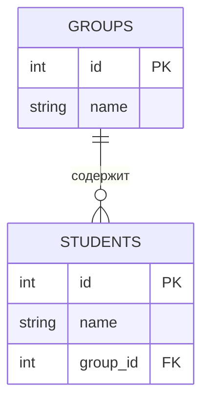
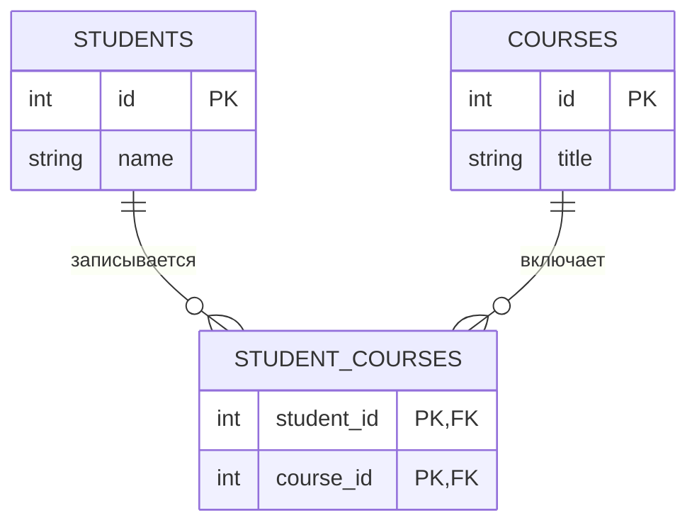
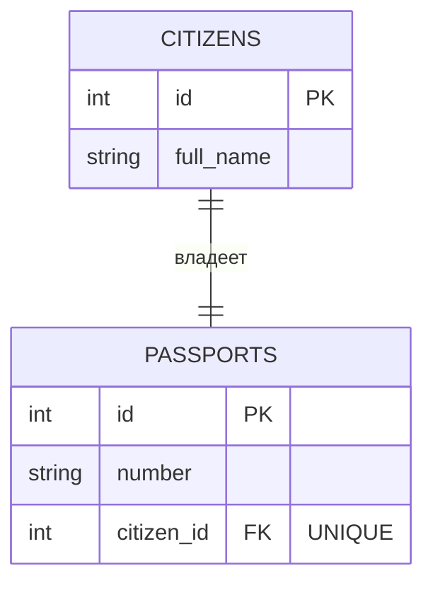
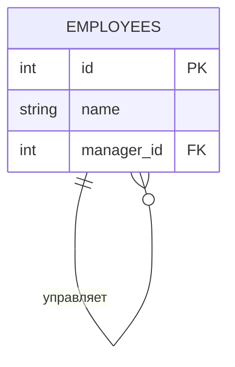

# Реляционная модель данных

В 1970 году Эдгар Франк Кодд, сотрудник IBM, опубликовал статью _«A Relational Model of Data for Large Shared Data Banks»_. Эту дату можно считать днем рождения современных баз данных. До Кодда в мире царил хаос: данные хранились в виде графов, иерархических деревьев или просто файлов, и чтобы найти информацию, программист должен был знать физический путь к каждому байту.

Кодд предложил революционную идею: **представить все данные в виде математических отношений (Relations)**.

## Анатомия отношения: Терминология

Для инженера важно владеть двумя языками: языком **теории** (чтобы читать документацию и фундаментальные книги) и языком **практики** (чтобы общаться с коллегами). По сути, это одни и те же вещи, названные по-разному.

::: info Определение
**Отношение (Relation)** — это фундаментальная структура данных реляционной модели.
В повседневной инженерной практике мы называем это **Таблицей**.
:::

Давайте разберем анатомию таблицы на абстрактном примере сущности «Студент».

### Отношение (Relation)

Это двумерная структура, имеющая уникальное имя (например, `Student`).
С точки зрения математики, отношение — это подмножество декартова произведения доменов. Но для нас важно понимать, что это неупорядоченное множество записей об объектах одного класса.

### Кортеж (Tuple)

Горизонтальный слой отношения.

- **В теории:** Кортеж — это упорядоченный набор значений, описывающий **один** конкретный экземпляр сущности.
- **На практике:** Мы называем это **Строкой (Row)** или **Записью (Record)**.

### Атрибут (Attribute)

Вертикальный слой отношения.

- **В теории:** Атрибут — это поименованная характеристика сущности.
- **На практике:** Мы называем это **Столбцом (Column)** или **Полем (Field)**.

### Домен (Domain)

Это множество допустимых значений для одного или нескольких атрибутов.

- **В теории:** Домен — это пул значений, из которого мы имеем право брать данные. Например, домен «Оценка» содержит только целые числа `{2, 3, 4, 5}`. Значение `6` или `A` в этот домен не входит.
- **На практике:** Это реализуется через **Типы данных** (Integer, Date, Varchar) и **Ограничения (Constraints)**.

::: tip Словарь терминов
| Математический термин | Инженерный термин | Пример |
| :--- | :--- | :--- |
| **Отношение** | Таблица | Список студентов |
| **Кортеж** | Строка / Запись | Иванов Иван Иванович |
| **Атрибут** | Столбец / Поле | Фамилия, Номер зачетки |
| **Домен** | Тип данных | Целое число, Строка |
| **Мощность (Cardinality)** | Количество строк | 150 студентов |
| **Степень (Degree)** | Количество столбцов | 5 характеристик |
:::

## Свойства отношений

Отношение в базе данных — это не просто электронная таблица, где можно произвольно менять ячейки местами. Это строгая математическая структура, подчиняющаяся жестким аксиомам. Нарушение этих правил приводит к нарушению целостности и переводит базу данных в несогласованное состояние.

### Неупорядоченность кортежей (строк)

В математическом множестве `{A, B, C}` и `{C, A, B}` — это одно и то же множество. Элементы в нем не пронумерованы. В реляционной таблице у строк нет порядкового номера. Нельзя сказать «дай мне пятую строку», пока вы явно не отсортируете данные по какому-либо значению. Физически данные на диске могут перемещаться (например, после процедур очистки). Приложение не должно полагаться на порядок вставки данных.

### Неупорядоченность атрибутов (столбцов)

Столбцы в отношении идентифицируются по **имени**, а не по позиции.
Смысл записи не меняется от того, напишем ли мы сначала «Фамилию», а потом «Имя», или наоборот.

### Уникальность кортежей (Отсутствие дубликатов)

В множестве не может быть двух одинаковых элементов. Множество `{1, 2, 2}` автоматически редуцируется до `{1, 2}`. В таблице не может быть двух абсолютно идентичных строк. Для обеспечения этого правила вводится понятие **Первичного ключа**, который делает каждую строку уникальной.

### Атомарность значений (Первая нормальная форма)

На пересечении конкретной строки и конкретного столбца может находиться **только одно** значение.

- **Запрещено:** Хранить массивы или списки в одной ячейке (например, «Иванов: 8-900-111, 8-900-222»).
- **Разрешено:** Один атрибут — одно значение. Если у студента два телефона, это должно быть реализовано через отдельную таблицу или структуру.

::: warning Теория и реальность (PostgreSQL)
Важно понимать различие между чистой математикой и инженерной реальностью PostgreSQL.

1.  **Дубликаты:** Стандарт SQL и PostgreSQL работают не с множествами (Sets), а с мультимножествами (Multisets/Bags). Это значит, что если вы **явно** не создадите Первичный ключ (PK) или ограничение `UNIQUE`, база данных **позволит** вам создать полные дубликаты строк. Технически это возможно, хотя и является признаком плохого проектирования.
2.  **Неатомарные значения:** PostgreSQL — это **Объектно-Реляционная** СУБД. Она официально поддерживает сложные типы данных, нарушающие правило атомарности: массивы (`integer[]`, `text[]`), `JSON` и `JSONB`. Опытные инженеры часто используют их для удобства и производительности (де-нормализация), сознательно нарушая строгие академические правила.

:::

## Трехзначная логика и NULL

В классической булевой алгебре существуют два состояния: Истина (`True`) и Ложь (`False`). Реляционная модель оперирует объектами реального мира, где информация часто бывает неполной. Для моделирования отсутствующей информации используется специальный маркер — `NULL`.

::: warning NULL — это не значение!
Критически важно понимать природу `NULL`.

- Это **не** ноль (число 0).
- Это **не** пустая строка (текст нулевой длины).
- Это состояние **«Значение неизвестно»** или **«Значение отсутствует»**.

:::

Например, у нас есть атрибут «Номер телефона». Значение `NULL` может означать, что у человека нет телефона, либо он есть, но мы его не знаем.

### Логика неизвестности

Поскольку `NULL` — это «неизвестно», любые операции сравнения с ним дают результат «неизвестно».

Представим переменные: `A = 5`, `B = NULL`.

1.  `A > 0`? -> **Истина**.
2.  `A > B`? -> **Неизвестно** (Больше ли 5 неизвестного числа? Нельзя сказать).
3.  `B = B`? -> **Неизвестно** (Равно ли одно неизвестное другому? Результат неопределен).

Именно поэтому в реляционной алгебре и языках запросов нельзя использовать стандартные операторы равенства для поиска пустых значений. Проверка всегда звучит как вопрос к состоянию: «Является ли значение неопределенным?».

## Понятие ключей (Идентификация)

В реляционной модели невозможно обратиться к строке по её порядковому номеру (например, «дай мне десятую запись»). Единственный способ получить доступ к конкретному экземпляру сущности — это знать значение его атрибутов, которое гарантированно отличает этот экземпляр от всех остальных.

Система ключей — это иерархия понятий, позволяющая формализовать уникальность.

### Суперключ (Superkey)

Это самое широкое понятие.
**Суперключ** — это **любой** набор атрибутов (один или несколько), который позволяет уникально идентифицировать строку в таблице.

Представим таблицу `Студенты` с атрибутами:

- `Номер_зачетки` (Уникален)
- `Паспорт` (Уникален)
- `Email` (Уникален)
- `ФИО` (Не уникально)
- `Группа` (Не уникальна)

**Примеры суперключей:**

1.  `{Номер_зачетки}` — Суперключ (однозначно определяет студента).
2.  `{Номер_зачетки, ФИО}` — Тоже Суперключ! (Если зачетка уникальна, то и комбинация с фамилией будет уникальна).
3.  `{Паспорт, Группа, Email}` — Тоже Суперключ.

**Проблема:** Суперключи могут быть избыточными. Нам не нужно знать ФИО студента, чтобы его найти, если мы уже знаем номер его зачетки.

### Потенциальный ключ (Candidate Key)

Это отфильтрованные суперключи.
**Потенциальный ключ** — это **минимальный** суперключ.
«Минимальный» здесь означает свойство **неизбыточности**: если из этого набора атрибутов убрать хотя бы одно поле, он перестанет быть уникальным.

Давайте проверим наши суперключи на «кандидатство»:

1.  `{Номер_зачетки}` -> Убирать нечего. Это **Потенциальный ключ**.
2.  `{Номер_зачетки, ФИО}` -> Попробуем убрать `Номер_зачетки`. Останется `ФИО`. ФИО не уникально. Попробуем убрать `ФИО`. Останется `Номер_зачетки`. Он уникален! Значит, исходный набор был избыточен. Это **НЕ** потенциальный ключ.
3.  `{Паспорт}` -> **Потенциальный ключ**.
4.  `{Email}` -> **Потенциальный ключ**.

::: info Итог
У одной таблицы может быть **много** потенциальных ключей. Все они равноправны с точки зрения уникальности, но мы должны выбрать только один главный.
:::

### Первичный ключ (Primary Key)

Это «Избранный» среди потенциальных ключей.
**Первичный ключ (PK)** — это один конкретный потенциальный ключ, который проектировщик базы данных выбрал в качестве основного идентификатора строки.

**Критерии выбора Первичного ключа:**

1.  **Гарантированная уникальность.**
2.  **NOT NULL:** Первичный ключ никогда не может быть пустым (в отличие от других уникальных полей, где в некоторых СУБД допускается NULL).
3.  **Компактность:** Желательно использовать числовые типы или короткие строки. Индексы по огромным строкам работают медленно.
4.  **Неизменность (Immutability):** Хороший первичный ключ никогда не меняется.

**Пример выбора:**
У нас есть кандидаты: `{Номер_зачетки}`, `{Паспорт}`, `{Email}`.

- `Email` — плохой выбор. Человек может сменить почту или потерять доступ.
- `Паспорт` — плохой выбор. Человек меняет паспорт в 20 и 45 лет, плюс возможны ошибки при вводе.
- `Номер_зачетки` — хороший выбор. Он выдается вузом и не меняется во время учебы.

Остальные потенциальные ключи, которые не стали первичным, называют **Альтернативными ключами (Alternate Keys)**. В базе данных на них обычно вешается ограничение `UNIQUE`.

### Простые и Составные ключи

- **Простой ключ (Simple Key):** Состоит из одного атрибута (например, `ID`).
- **Составной ключ (Composite Key):** Состоит из двух и более атрибутов. Например, в таблице «Успеваемость» уникальным идентификатором может быть связка `{ID_Студента, ID_Предмета}`. Один студент может получить только одну итоговую оценку по одному предмету.

::: warning Ловушка составных ключей
Составные ключи сложны в поддержке. При создании внешних ключей (Foreign Keys) в дочерних таблицах вам придется тащить за собой все поля составного родителя. Поэтому в современной практике чаще используют искусственные суррогатные ключи (просто `ID`).
:::

## Виды ключей: Естественные и суррогатные

Когда мы проектируем таблицу, перед нами всегда встает вопрос: какое поле назначить Первичным ключом (PK)? У нас есть два фундаментальных пути.

### Естественные ключи (Natural Keys)

**Естественный ключ** — это атрибут (или набор атрибутов), который уже существует у сущности в реальном мире и обладает свойством уникальности.

- **Примеры:**
  - Номер паспорта (для Гражданина).
  - СНИЛС / ИНН.
  - VIN-код (для Автомобиля).
  - ISBN (для Книги).
  - Email (для Пользователя веб-сервиса).

**Преимущества:**

1.  **Экономия места:** Не нужно создавать лишний столбец `id`.
2.  **Читаемость:** В таблице `Заказы` ссылка `customer_email='ivan@mail.ru'` понятнее, чем `customer_id=4592`.

**Недостатки:**

1.  **Изменчивость (Mutability):** Это главная проблема. В реальном мире меняется почти всё. _Пример:_ Вы использовали «Номер паспорта» как PK. Клиент потерял паспорт и получил новый. Вам нужно не просто поменять это поле в таблице `Клиенты`, но и обновить (Cascade Update) **все** миллионы записей в связанных таблицах (Заказы, Платежи, Логи), где этот паспорт использовался как внешний ключ. Это тяжелейшая операция.
2.  **Защита персональных данных (Privacy):** Если ID клиента — это его паспорт или СНИЛС, он будет везде: в URL браузера (`/user/4512-123456`), в логах сервера, в кэшах. Это огромный риск утечки данных.
3.  **Сложность формата:** Естественные ключи часто являются длинными строками. Индексы по строкам работают медленнее и занимают больше места, чем по числам.

### Суррогатные ключи (Surrogate Keys)

**Суррогатный ключ** — это искусственно созданный идентификатор, который не имеет никакого смысла в реальном мире. Он служит исключительно для технических целей — связывать строки в базе данных. Например:

- **Sequence / Serial:** Просто порядковый номер (`1`, `2`, `3`...). Самый популярный вариант (`Integer` / `BigInt`).
- **UUID (Universally Unique Identifier):** Глобально уникальная строка вида `a0eebc99-9c0b-4ef8-bb6d-6bb9bd380a11`.

**Плюсы:**

1.  **Неизменность (Immutability):** Суррогатный ключ никогда не меняется. Пользователь может сменить фамилию, пол, паспорт и страну проживания — его `id=101` останется прежним. Ссылочная целостность не пострадает.
2.  **Производительность:** Сравнение целых чисел (`Integer`) процессором выполняется за такты, это самый быстрый тип данных для JOIN-ов.
3.  **Абстракция:** ID скрывает бизнес-логику.

**Минусы:**

1.  **Разрыв с реальностью:** Глядя на `product_id=55`, вы не знаете, что это за товар, пока не сделаете `JOIN` с таблицей товаров.
2.  **Проблема дубликатов:** Это критический момент. Если вы ввели суррогатный ключ `id`, база данных позволит вам создать двух людей с одинаковым паспортом, но разными `id`.

::: warning Золотое правило проектирования
Использование суррогатного ключа (PK) **не отменяет** необходимость создания ограничений уникальности (Unique Constraints) для естественных ключей.
**Правильный дизайн:**

- `id` (PK, Serial) — для связей внутри базы.
- `passport_number` (Unique) — для бизнес-логики, чтобы не допустить дублей людей.

:::

Среди суррогатных ключей тоже есть выбор:

| Тип              | Integer (Serial/Identity)                           | UUID                                                                           |
| :--------------- | :-------------------------------------------------- | :----------------------------------------------------------------------------- |
| **Читаемость**   | Высокая (`user/1`)                                  | Нулевая (`user/a0eeb...`)                                                      |
| **Размер**       | 4 или 8 байт                                        | 16 байт (плюс медленнее индекс)                                                |
| **Генерация**    | Централизованная (СУБД выдает номера по порядку)    | Децентрализованная (Приложение может сгенерировать ID само, не спрашивая базу) |
| **Безопасность** | Низкая (можно перебрать `id+1` и выкачать всю базу) | Высокая (невозможно угадать следующий ID)                                      |
| **Применение**   | Монолиты, классические системы                      | Микросервисы, распределенные системы                                           |

## Связи и внешние ключи (Foreign Key)

В реляционной базе данных таблицы не живут в вакууме. Они постоянно ссылаются друг на друга. Механизмом реализации этих ссылок является **Внешний ключ (Foreign Key)**.

::: info Определение
**Внешний ключ (FK)** — это столбец (или набор столбцов) в одной таблице, который ссылается на **Первичный ключ (PK)** в другой таблице.
Это «мост», по которому СУБД находит связанные данные.
:::

::: warning Правило
Внешний ключ всегда находится на стороне «Ребенка» (Child Table) и указывает на «Родителя» (Parent Table).
:::

### Связь «Один-ко-Многим» (One-to-Many / 1:M)

Это наиболее распространенный тип взаимодействия сущностей, покрывающий более 90% всех сценариев в проектировании баз данных. Логика этой связи описывает иерархические отношения, где один родительский объект «владеет» множеством дочерних объектов.

Классическим примером является отношение **«Группа — Студенты»**. В реальном мире одна учебная группа включает в себя десятки студентов, однако каждый конкретный студент может числиться только в одной группе.

С точки зрения реализации, мы не можем добавить список студентов в таблицу групп — это нарушило бы правило атомарности (1НФ). Поэтому мы поступаем наоборот: мы «метим» каждого студента. В таблицу `Students` (сторона «Многих») добавляется столбец `group_id`, который является внешним ключом, ссылающимся на `id` таблицы `Groups` (сторона «Один»). Таким образом, база данных знает, к какой группе принадлежит каждая запись студента.

### Связь «Многие-ко-Многим» (Many-to-Many / M:M)

Этот тип связи представляет наибольшую сложность для начинающих проектировщиков, так как он не имеет прямой реализации в реляционной модели. Рассмотрим пример взаимодействия сущностей **«Студенты»** и **«Учебные курсы»**.

Логика здесь двусторонняя: один студент (например, Иванов) может записаться на множество курсов (Математика, Физика, История). С другой стороны, один курс (Математика) посещают сотни студентов. Если мы попытаемся добавить `course_id` в таблицу студентов, Иванов сможет выбрать только один предмет. Если добавим `student_id` в таблицу курсов, там сможет учиться только один человек.

Для разрешения этой коллизии используется паттерн **Связующая таблица** (также известная как Junction Table, Link Table или Bridge Table). Мы создаем новую, третью таблицу, например `Student_Courses`. Её единственная задача — хранить пары идентификаторов: «Студент X записан на Курс Y».

Фактически, мы искусственно разбиваем одну сложную связь «Многие-ко-Многим» на две простые связи «Один-ко-Многим», направленные в эту промежуточную таблицу. Это элегантное решение позволяет масштабировать систему до любых объемов без нарушения нормализации.

### Связь «Один-к-Одному» (One-to-One / 1:1)

Данный тип связи встречается значительно реже и часто вызывает вопросы о своей целесообразности. Суть его в том, что одной записи в таблице A соответствует ровно одна запись в таблице B.

Примером может служить пара **«Гражданин — Паспорт»**. Упрощая реальность, примем, что у человека может быть только один действующий документ, и этот документ принадлежит только одному человеку. Казалось бы, зачем создавать две таблицы, если данные паспорта можно хранить прямо в таблице граждан?

Разделение на две таблицы (вертикальное партицирование) обычно оправдано в двух инженерных случаях:

1.  **Безопасность:** Таблица `Users` с именами и логинами открыта для чтения многим сервисам, а таблица `User_Passports` или `User_Secrets` доступна только узкому кругу процессов с повышенными привилегиями.
2.  **Производительность:** Если у пользователя есть «тяжелый» атрибут, например, биография на 10 страниц текста или фотография профиля, его выносят в отдельную таблицу `User_Profiles`. Это позволяет основной таблице оставаться компактной и быстро работать в памяти.

Технически это реализуется так же, как связь 1:M, но на столбец внешнего ключа накладывается ограничение уникальности (`UNIQUE`).

### Рекурсивная связь (Self-Referencing)

Иногда сущность должна ссылаться сама на себя. Это особый случай связи «Один-ко-Многим», необходимый для хранения иерархических структур, таких как деревья каталогов или организационная структура предприятия.

Рассмотрим таблицу **«Сотрудники»**. У каждого сотрудника есть начальник. Но начальник — это не какая-то отдельная сущность, это такой же человек из той же самой таблицы «Сотрудники».

Для реализации такой структуры в таблицу добавляется столбец `manager_id`. Особенность в том, что этот внешний ключ ссылается на первичный ключ `id` **этой же самой таблицы**. Таким образом, запись «Иванов» может ссылаться на запись «Петров» как на своего руководителя, выстраивая цепочку подчинения любой глубины. У самого главного начальника (корня дерева) поле `manager_id` будет пустым (`NULL`).

## Ограничения целостности (Integrity Constraints)

Фундаментальной характеристикой любой промышленной СУБД является обеспечение **целостности данных (Data Integrity)**. В контексте реляционной теории под целостностью понимается корректность, непротиворечивость и точность информации в любой момент времени.

СУБД выступает не пассивным хранилищем, а активным гарантом качества данных. Для этого используется механизм **Ограничений целостности (Integrity Constraints)** — декларативных правил, определяющих допустимые состояния базы данных. Любая транзакция, результат которой переводит базу данных в недопустимое состояние, автоматически отклоняется системой.

### Целостность сущности (Entity Integrity)

Данный вид целостности относится к идентификации записей в пределах одного отношения (таблицы). Каждая сущность в реальном мире различима. Следовательно, каждый кортеж в отношении должен обладать уникальным идентификатором — **Первичным ключом (Primary Key)**.

**Формальные требования:**

1.  **Уникальность:** Значение первичного ключа не может повторяться в пределах таблицы. Это гарантирует математическую различимость кортежей.
2.  **Определенность (NOT NULL):** Ни один из атрибутов, входящих в состав первичного ключа, не может принимать значение `NULL`. Потому что `NULL` семантически означает «неизвестное значение». Если часть ключа неизвестна, то идентификация сущности становится невозможной, что противоречит самой идее ключа.

### Ссылочная целостность (Referential Integrity)

Данный вид целостности регламентирует взаимосвязи между отношениями и гарантирует согласованность ссылок. Если отношение `B` ссылается на отношение `A` посредством Внешнего ключа (Foreign Key), то ссылающееся значение в `B` должно либо совпадать с одним из значений Первичного ключа в `A`, либо быть полностью неопределенным (`NULL`).

**Проблема модификации ссылочных данных:**
Нарушение целостности может возникнуть при удалении или изменении ключа в родительской таблице (referenced table). СУБД обязана обработать ситуацию, когда на удаляемую запись существуют ссылки в дочерних таблицах.

При проектировании схемы данных инженер обязан определить стратегию поддержания целостности для операции удаления:

| Стратегия                | Техническое описание                                                                                                                                | Область применения                                                                                                                       | Пример реализации                                                                                                                                                                                                    |
| :----------------------- | :-------------------------------------------------------------------------------------------------------------------------------------------------- | :--------------------------------------------------------------------------------------------------------------------------------------- | :------------------------------------------------------------------------------------------------------------------------------------------------------------------------------------------------------------------- |
| **RESTRICT / NO ACTION** | **Блокирующая стратегия.** Транзакция на удаление родительской записи отклоняется, если существует хотя бы одна ссылающаяся на неё дочерняя запись. | Является стандартом по умолчанию. Гарантирует максимальную сохранность данных, предотвращая случайное удаление критических справочников. | Вы пытаетесь удалить отдел организации. СУБД запрещает операцию и выдает ошибку, так как в этом отделе числятся 5 активных сотрудников. Сначала нужно перевести их в другой отдел.                                   |
| **CASCADE**              | **Распространение изменений.** Удаление родительской записи инициирует автоматическое удаление всех связанных дочерних записей.                     | Используется для жестко связанных сущностей, где дочерний объект не имеет смысла без родительского.                                      | Вы удаляете «Заказ №555». СУБД автоматически удаляет все 10 позиций товаров («Строки заказа»), которые входили в этот заказ, так как хранить товары несуществующего заказа бессмысленно.                             |
| **SET NULL**             | **Диссоциация.** Родительская запись удаляется, а во всех связанных дочерних записях значение внешнего ключа заменяется на `NULL`.                  | Применяется, когда связь является необязательной (опциональной). Объект сохраняется, но теряет привязку к иерархии.                      | Вы удаляете учетную запись руководителя отдела. У всех отделов, которые он курировал, поле «Куратор» очищается (становится пустым), но сами отделы не удаляются и остаются в системе для назначения нового куратора. |
| **SET DEFAULT**          | **Переназначение.** Значение внешнего ключа заменяется на заранее определенное дефолтное значение.                                                  | Используется в специфических бизнес-сценариях автоматического переназначения ответственности.                                            | Вы удаляете сотрудника. Все его незакрытые задачи автоматически переназначаются на дежурного пользователя «System» или «Admin», чтобы клиенты не остались без ответа.                                                |

### Доменная целостность (Domain Integrity)

Данный уровень описывает правила допустимости значений для каждого отдельного атрибута. Атрибут должен содержать данные, соответствующие его семантике (смыслу) в предметной области.

Механизмы обеспечения доменной целостности:

1.  **Типизация данных (Data Typing):**
    Базовое ограничение, определяемое на уровне схемы. СУБД физически запрещает запись данных неверного формата (например, строки в числовое поле). Это предотвращает ошибки интерпретации битовых последовательностей.

2.  **Ограничение обязательности (NOT NULL Constraint):**
    Явный запрет на отсутствие значения. Применяется для критически важных атрибутов, без которых существование записи не имеет смысла (например, ИНН организации или Фамилия сотрудника).

3.  **Предикаты проверки (CHECK Constraints):**
    Наиболее гибкий инструмент, позволяющий задать логическое выражение (предикат), которое должно быть истинным для каждой строки таблицы.
    - _Контроль диапазонов:_ «Возраст должен быть в интервале [18, 65]».
    - _Контроль форматов:_ «Email должен содержать символ @».
    - _Перекрестная проверка:_ «Дата закрытия договора должна быть больше или равна дате открытия».

4.  **Значения по умолчанию (Default Constraints):**
    Механизм автоматического заполнения атрибутов при вставке записи, если значение не было предоставлено явно. Обеспечивает наличие валидных данных даже при неполном входном потоке (например, автоматическая установка статуса «Новый» для создаваемого заказа).

::: tip Принцип независимости данных
Использование ограничений целостности на уровне СУБД реализует архитектурный принцип **независимости данных**.

Правила валидации выносятся из кода приложений (Application Layer) на уровень хранения (Storage Layer). Это гарантирует, что бизнес-правила (например, «цена не может быть отрицательной») будут соблюдены независимо от того, через какой интерфейс происходит обращение к данным — через веб-сайт, мобильное приложение, административную консоль или сторонний API. СУБД выступает последним и самым надежным рубежом защиты качества информации.
:::

## Реляционная алгебра (Фундаментальные операции)

Реляционная алгебра, разработанная Эдгаром Коддом, представляет собой теоретический процедурный язык, описывающий манипуляции над данными. В отличие от реляционного исчисления (которое является декларативным и говорит _«что»_ получить), алгебра описывает _«как»_ это получить, шаг за шагом.

Понимание этих операций критически важно для инженера, так как именно на их основе работает **Оптимизатор запросов (Query Optimizer)** любой СУБД. Когда вы пишете SQL-запрос, движок базы данных транслирует его в дерево операций реляционной алгебры, пытаясь найти наиболее эффективный путь выполнения.

Фундаментальным свойством реляционной алгебры является **Замкнутость (Closure)**.

> **Принцип замкнутости:** Результатом любой операции над отношением (таблицей) всегда является новое отношение.

Это означает, что мы можем создавать вложенные выражения произвольной глубины, где выход одной операции служит входом для следующей, подобно тому как в арифметике мы можем строить выражения вида $(A + B) \times C$.

Операторы алгебры классифицируются на две категории:

1.  **Теоретико-множественные:** Операции, заимствованные из теории множеств (объединение, пересечение, разность, декартово произведение).
2.  **Специальные реляционные:** Операции, разработанные специально для работы с табличной структурой (Выборка, проекция, соединение, деление).

### Совместимость по объединению (Union Compatibility)

Для выполнения бинарных теоретико-множественных операций (Объединение, Пересечение, Разность) участвующие отношения не могут быть произвольными. Они должны быть **совместимы**.

Два отношения $A$ и $B$ называются совместимыми по объединению, если выполняются два условия:

1.  **Равная степень:** Количество атрибутов (столбцов) в обоих отношениях должно быть одинаковым.
2.  **Совместимость доменов:** $i$-й атрибут отношения $A$ должен принадлежать тому же домену (типу данных), что и $i$-й атрибут отношения $B$. Грубо говоря, нельзя объединять столбец «Фамилии» со столбцом «Дата рождения», даже если количество столбцов совпадает.

### Теоретико-множественные операции

В следующих определениях предположим, что $A$ и $B$ — это два отношения, совместимых по объединению.

#### Объединение (Union, $A \cup B$)

Операция объединения создает отношение, включающее в себя все кортежи, которые принадлежат либо $A$, либо $B$, либо обоим сразу.

- **Математически:** $A \cup B = \{ t \mid t \in A \lor t \in B \}$
- **Свойства:**
  - **Коммутативность:** $A \cup B = B \cup A$. Порядок таблиц не важен.
  - **Устранение дубликатов:** В строгой реляционной теории, если одинаковая строка есть и в $A$, и в $B$, в результирующем множестве она появится только один раз. (Примечание: в SQL для этого используется `UNION`, а для сохранения дубликатов — `UNION ALL`).
- **Пример:** Объединение списков сотрудников двух разных филиалов для получения полного штатного расписания компании.

#### Пересечение (Intersection, $A \cap B$)

Операция пересечения создает отношение, содержащее только те кортежи, которые присутствуют **одновременно** и в $A$, и в $B$.

- **Математически:** $A \cap B = \{ t \mid t \in A \land t \in B \}$
- **Свойства:**
  - **Коммутативность:** $A \cap B = B \cap A$.
- **Пример:** Найти студентов, которые одновременно находятся в списке «Получающие стипендию» и в списке «Имеющие задолженности».

#### Разность (Difference, $A - B$ или $A \setminus B$)

Операция разности создает отношение, содержащее кортежи, которые присутствуют в $A$, но **отсутствуют** в $B$. Это способ «вычесть» одни данные из других.

- **Математически:** $A - B = \{ t \mid t \in A \land t \notin B \}$
- **Свойства:**
  - **Некоммутативность:** $A - B \neq B - A$. Вычесть должников из всех студентов — это не то же самое, что вычесть всех студентов из должников.
- **Пример:** Получить список товаров, которые есть на складе ($A$), но по которым еще не было продаж ($B$).

#### Декартово произведение (Cartesian Product, $A \times B$)

В отличие от предыдущих операций, декартово произведение **не требует** совместимости по объединению. Эта операция соединяет каждый кортеж отношения $A$ с каждым кортежем отношения $B$.

- **Результат:**
  - Степень (кол-во столбцов) результата = Сумма степеней $A$ и $B$.
  - Мощность (кол-во строк) результата = Произведение мощностей $A$ и $B$.
- **Смысл:** Само по себе декартово произведение редко несет бизнес-смысл, так как порождает огромный объем избыточной информации. Однако оно является **фундаментальной базой** для всех операций соединения (JOIN). Соединение — это, по сути, декартово произведение, к которому применен фильтр совместимости строк.

### Специальные реляционные (Унарные) операции

Эти операции называются унарными, так как применяются к одному отношению. Они служат для «нарезки» таблицы в пространстве: горизонтально или вертикально.

#### Выборка / Ограничение (Selection, $\sigma$)

Выборка выполняет **горизонтальную фильтрацию** отношения. Она выбирает подмножество кортежей, удовлетворяющих заданному логическому условию (предикату).

- **Нотация:** $\sigma_{условие}(R)$
- **Характеристики:**
  - В результирующем отношении количество атрибутов (столбцов) остается неизменным.
  - Количество кортежей (строк) может уменьшиться или остаться прежним.
  - Предикат может включать операторы сравнения ($=, \neq, <, \leq, >, \geq$) и логические связки ($\land, \lor, \neg$).
- **Физический смысл:** Операция отсекает иррелевантные данные, оставляя только кортежи, соответствующие критериям запроса. Например, отбираем только совершеннолетних пользователей: $\sigma_{age \geq 18}(Users)$.

#### Проекция (Projection, $\pi$)

Проекция выполняет **вертикальную выборку** отношения. Она создает новое отношение, содержащее только указанное подмножество атрибутов, отбрасывая остальные.

- **Нотация:** $\pi_{список\_атрибутов}(R)$
- **Характеристики:**
  - Количество атрибутов уменьшается до заданного списка.
  - **Удаление дубликатов:** Это критически важный аспект теории. Если после удаления различительных атрибутов (например, уникального ID) в таблице образуются идентичные строки, проекция обязана их «схлопнуть» в одну.
- **Физический смысл:** Мы уменьшаем размерность данных, оставляя только нужные характеристики. Например, нам нужен только список телефонов сотрудников, без их имен и адресов: $\pi_{phone}(Employees)$.

## Операции соединения (JOINs)

Операция соединения является ключевым инструментом реляционной модели, позволяющим восстанавливать декомпозированные данные. Математически она представляет собой композицию декартова произведения двух отношений и последующей операции выборки (фильтрации) по заданному предикату.

В зависимости от типа предиката в теории выделяют два фундаментальных класса соединений.

#### Тета-соединение (Theta-Join, $\theta$-join)

Является наиболее общим случаем операции соединения.

**Определение:** Тета-соединением отношений $A$ и $B$ по предикату $F$ называется отношение, полученное путем применения операции выборки $\sigma_F$ к декартову произведению $A \times B$.
$$A \bowtie_F B = \sigma_F(A \times B)$$
Здесь $F$ — это логическое выражение вида $A.a\ \theta\ B.b$, где $a$ и $b$ — атрибуты соответствующих отношений, а $\theta$ — бинарный оператор сравнения из множества $\{ =, \neq, <, \leq, >, \geq \}$.

**Пример:** Соединение отношения «Сотрудники» и «Руководители» по условию $Salary_{emp} > Salary_{mgr}$ (поиск сотрудников, зарабатывающих больше своих руководителей).

#### Эквисоединение (Equi-Join)

Является частным случаем тета-соединения и наиболее распространенным типом в прикладных задачах.

**Определение:** Эквисоединение — это соединение, в котором предикат $F$ использует исключительно оператор равенства ($=$).
$$A \bowtie_{A.a = B.b} B$$
Обычно эквисоединение выполняется по паре атрибутов «Внешний ключ» (в дочернем отношении) и «Первичный ключ» (в родительском отношении).

::: info Свойство избыточности
Результат эквисоединения формально содержит два столбца с идентичными значениями (атрибут соединения из $A$ и атрибут соединения из $B$). В теоретической реляционной алгебре применяется дополнительная операция проекции для удаления дублирующего столбца (естественное соединение). В реализации SQL, однако, сохраняются оба столбца, если не указано иное.
:::

### Классификация соединений в SQL

В стандарте SQL операции соединения классифицируются на основе стратегии обработки кортежей, для которых не было найдено соответствие в другом отношении.

#### Внутреннее соединение (INNER JOIN)

Данная операция является прямой реализацией эквисоединения.

**Алгоритм:**
СУБД формирует результирующее множество, включая в него только те пары кортежей из левого и правого отношения, для которых предикат соединения принимает значение `TRUE`.

**Свойства:**

- **Симметричность:** Результат $A \bowtie B$ семантически эквивалентен $B \bowtie A$ (с точностью до порядка столбцов).
- **Фильтрация:** Кортежи, не имеющие соответствия (например, внешний ключ равен `NULL` или ссылается на отсутствующее значение при отсутствии ссылочной целостности), исключаются из результата. Операция работает по принципу пересечения множеств.

#### Внешние соединения (OUTER JOINs)

Внешние соединения являются расширением внутреннего соединения. Они предназначены для сохранения информации о кортежах, не удовлетворяющих условию соединения. Для отсутствующих атрибутов используется заполнитель `NULL` (маркер неопределенности).

**1. Левое внешнее соединение (LEFT OUTER JOIN)**

- **Характеристика:** Сохраняет (не отбрасывает) все кортежи левого отношения (первого операнда).
- **Формальная логика:** Результат содержит все строки внутреннего соединения $A \bowtie B$, плюс все строки из $A$, для которых не нашлось пары в $B$. Для таких строк атрибуты отношения $B$ заполняются значением `NULL`.
- **Применение:** Получение полных списков сущностей (например, Клиентов) с присоединением опциональных данных (Заказов), где отсутствие связанных данных не должно исключать сущность из выборки.

**2. Правое внешнее соединение (RIGHT OUTER JOIN)**

- **Характеристика:** Сохраняет все кортежи правого отношения (второго операнда).
- **Формальная логика:** Симметрична левому соединению. В результат попадают все кортежи из $B$. Если для кортежа из $B$ нет соответствия в $A$, атрибуты $A$ принимают значение `NULL`.
- **Применение:** В инженерной практике используется редко, так как эквивалентна операции `LEFT JOIN` с переставленными местами операндами. Обычно заменяется на левое соединение для улучшения читаемости кода (слева направо).

**3. Полное внешнее соединение (FULL OUTER JOIN)**

- **Характеристика:** Сохраняет кортежи обоих отношений.
- **Формальная логика:** Является теоретико-множественным объединением (`UNION`) результатов левого и правого соединений.
- **Результат:** Отношение содержит:
  - Совпадающие пары (Inner part).
  - Кортежи из $A$ без соответствия в $B$ (дополненные `NULL`).
  - Кортежи из $B$ без соответствия в $A$ (дополненные `NULL`).
- **Применение:** Задачи сверки данных (Reconciliation), поиск расхождений в двух наборах данных, агрегация полной статистики по двум независимым критериям.

::: tip Резюме

- **INNER JOIN:** Пересечение множеств. Исключает несовпадающие данные.
- **LEFT/RIGHT JOIN:** Направленное дополнение. Сохраняет данные одной из сторон, дополняя их информацией другой стороны или `NULL`-значениями.
- **FULL JOIN:** Объединение множеств с сохранением всех данных и заполнением пропусков `NULL`-значениями.
  :::

## Выводы по учебному вопросу

Реляционная модель данных, предложенная Э. Коддом, является не просто историческим этапом развития информационных технологий, а строгим математическим базисом, на котором функционирует подавляющее большинство современных промышленных СУБД. Понимание анатомии отношений, системы ключей и нормализации позволяет инженеру переходить от интуитивного хранения данных к проектированию устойчивых, масштабируемых и целостных информационных систем.

Особое место в теории занимает реляционная алгебра. Несмотря на то, что современные разработчики используют декларативный язык SQL («что получить»), под капотом СУБД этот запрос неизбежно транслируется в процедурную последовательность операций реляционной алгебры («как получить»). Глубокое понимание механики селекции, проекции и, особенно, различных видов соединений (JOIN) является ключом к написанию производительных запросов и оптимизации работы базы данных.

Таким образом, ограничения целостности и правила реляционной алгебры выступают гарантом качества данных. Они превращают базу данных из пассивного хранилища байтов в интеллектуальную систему, способную самостоятельно поддерживать логическую непротиворечивость информации и обеспечивать достоверность результатов аналитической обработки.
