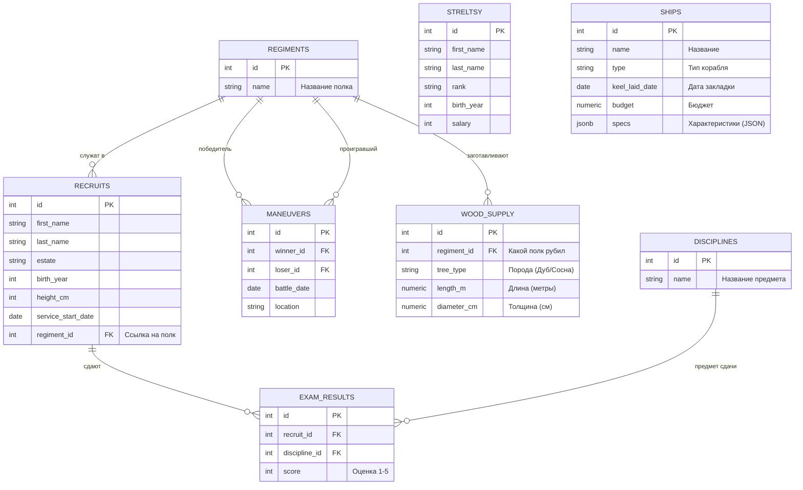

<script setup>
import Conversation from "../../../../components/Conversation.vue";
import alexey from "../../../assets/databases/heroes/clerk_alexey.png";
import ivan from "../../../assets/databases/heroes/clerk_fedor.png";
import petr from "../../../assets/databases/heroes/petr_young.png";
import { defineAsyncComponent } from "vue";

const Repl = defineAsyncComponent(() => import("../../../../components/Repl.vue"))
</script>

# Встроенные функции СУБД PostgreSQL

## Введение

**Осень 1695 года.** Под стенами турецкой крепости Азов русская армия получила по зубам. Первый поход обернулся жестким фиаско. План Петра был хорош на бумаге: подойти, окружить, закидать ядрами и взять штурмом. Но гладко было только в «потешных» боях. Азов стоял у самого устья Дона, выходящего в море. Пока русские солдаты мерзли в траншеях и экономили порох, к туркам регулярно подходили пузатые корабли. Они спокойно сгружали свежих янычар, провизию, оружие и уплывали обратно. Крепость смеялась Петру в лицо. Вывод был суровым: осаждать приморскую цитадель без военного флота — это как пытаться вычерпать реку решетом. Без кораблей море нам не светит.

Петр не привык сдаваться. Раз нужен флот — значит, мы его построим. Причем прямо сейчас. Царь переносит свою ставку глубоко в тыл, в заснеженный **Воронеж**. Место выбрано не случайно: кругом густые дубовые и сосновые леса, а река Воронеж впадает прямо в Дон, по которому новая эскадра весной спустится прямиком к Азову.


Начинается грандиозная стройка. Более 25 тысяч человек — крестьяне со всей страны, бородатые стрельцы и элита «Нового строя» — согнаны на промерзшие берега. Лес валят день и ночь, стоя по колено в снегу. За одну зиму с нуля закладываются десятки боевых галер (по чертежам, привезенным из Голландии), сотни грузовых стругов и брандеров — плавучих бомб для поджога вражеских судов.

Но просто махать топором мало. Постройка флота — это не избушку срубить. Это суровая инженерия, логистика и жесткая математика. Какова площадь парусов? Сколько кубометров дуба нужно на киль? Хватит ли казенных денег на закупку пушек? А главное — сроки! Если корабли не будут готовы к весеннему паводку, вода уйдет, и флот застрянет на мели до следующего года.

В штабной избе стоит дым коромыслом и пахнет смолой. Дьяк Федор сидит над горами чертежей. Вместо привычных списков рекрутов ему теперь несут сметы, диаметры бревен, сроки поставок и расчеты бюджета. Мозг отказывается это обрабатывать, и Федор тихо воет от безысходности.

<Conversation :phrases="[
    {
        name: 'Петр',
        position: 'left',
        text: 'Федька! Сколько смолы нужно на один дубовый ствол? И когда мы закончим галеру «Святой Петр»? Мне нужны точные цифры! Сроки горят!',
        photo: petr
    },
    {
        name: 'Федор',
        position: 'right',
        text: 'Мин херц, да я ж писарь, а не Архимед! Я могу посчитать людей, могу свести ведомости... Но как мне в базе данных высчитать объем круглого бревна? Это же геометрия!',
        photo: ivan
    },
    {
        name: 'Алексей',
        position: 'right',
        text: 'Отставить панику. База данных — это не просто хранилище списков. Внутри нее зашиты мощные инструменты: математика, работа со строками и временем. Они называются «Встроенные функции». Сейчас мы заставим базу считать за нас.',
        photo: alexey
    }
]"/>

Для новой главы нам понадобится расширить нашу базу данных. Старые таблицы никуда не делись (солдаты все еще с нами), но теперь мы добавляем корабли и лес.



::: details Структура БД

Мы добавляем только две новые таблицы: `ships` (корабли) и `wood_supply` (поставки леса). Все остальные таблицы остаются с прошлого занятия.

```sql
-- === 0. СОЗДАЕМ И ЗАПОЛНЯЕМ РЕКРУТОВ И СТРЕЛЬЦОВ ===
CREATE TABLE recruits (
    id SERIAL PRIMARY KEY,
    first_name VARCHAR(50),
    last_name VARCHAR(50),
    estate VARCHAR(50), -- Сословие: Дворянин, Мещанин, Крестьянин, Иноземец
    birth_year INTEGER,
    height_cm INTEGER,
    service_start_date DATE
);
INSERT INTO recruits (first_name, last_name, estate, birth_year, height_cm, service_start_date) VALUES
-- Реальные исторические личности
('Сергей', 'Бухвостов', 'Дворянин', 1659, 198, '1683-01-01'), -- Первый солдат, высокий!
('Александр', 'Меншиков', 'Мещанин', 1673, 185, '1686-02-12'), -- Алексашка, молодой
('Франц', 'Лефорт', 'Иноземец', 1656, 178, '1680-05-10'), -- Наставник
('Патрик', 'Гордон', 'Иноземец', 1635, 175, '1680-01-15'), -- Самый старший
('Федор', 'Апраксин', 'Дворянин', 1661, 180, '1683-04-20'),
('Михаил', 'Голицын', 'Дворянин', 1675, 176, '1687-06-01'), -- Совсем юный
('Яков', 'Брюс', 'Иноземец', 1669, 182, '1686-08-14'), -- Брюс
('Аникита', 'Репнин', 'Дворянин', 1668, 184, '1685-03-30'),
('Автоном', 'Головин', 'Дворянин', 1667, 179, '1684-11-20'),
('Иван', 'Бутурлин', 'Дворянин', 1661, 177, '1683-09-12'),
-- Массовка (Дворяне)
('Петр', 'Волков', 'Дворянин', 1668, 185, '1683-06-12'),
('Дмитрий', 'Морозов', 'Дворянин', 1671, 190, '1684-03-01'),
('Николай', 'Новиков', 'Дворянин', 1673, 182, '1685-02-10'),
('Сергей', 'Соловьев', 'Дворянин', 1667, 188, '1683-09-30'),
('Яков', 'Семенов', 'Дворянин', 1669, 184, '1684-05-25'),
('Гаврила', 'Романов', 'Дворянин', 1675, 192, '1685-04-12'),
('Ефим', 'Никитин', 'Дворянин', 1668, 186, '1683-12-01'),
-- Массовка (Крестьяне - их много, они пониже, но есть богатыри)
('Алексей', 'Смирнов', 'Крестьянин', 1665, 175, '1683-05-10'),
('Федор', 'Козлов', 'Крестьянин', 1662, 168, '1683-05-20'),
('Михаил', 'Соколов', 'Крестьянин', 1669, 178, '1683-07-07'),
('Андрей', 'Зайцев', 'Крестьянин', 1660, 165, '1683-04-12'),
('Григорий', 'Титов', 'Крестьянин', 1664, 176, '1683-06-18'),
('Степан', 'Кузнецов', 'Крестьянин', 1661, 169, '1683-05-05'),
('Макар', 'Егоров', 'Крестьянин', 1666, 173, '1683-08-01'),
('Лука', 'Антонов', 'Крестьянин', 1671, 177, '1685-01-20'),
('Илья', 'Муромец', 'Крестьянин', 1660, 195, '1683-02-02'), -- Пасхалка, очень высокий
('Савелий', 'Громов', 'Крестьянин', 1665, 188, '1684-07-15'),
('Прохор', 'Дубов', 'Крестьянин', 1670, 180, '1686-03-03'),
-- Массовка (Мещане)
('Иван', 'Попов', 'Мещанин', 1670, 172, '1684-01-15'),
('Василий', 'Лебедев', 'Мещанин', 1665, 170, '1683-08-22'),
('Павел', 'Борисов', 'Мещанин', 1672, 174, '1684-11-05'),
('Александр', 'Виноградов', 'Мещанин', 1670, 171, '1684-02-14'),
('Тихон', 'Медведев', 'Мещанин', 1663, 167, '1683-10-10'),
('Кузьма', 'Минин', 'Мещанин', 1662, 176, '1683-09-09'), -- Тезка знаменитого
('Ермолай', 'Рыбаков', 'Мещанин', 1668, 169, '1685-06-20'),
-- Еще Иноземцы (для статистики)
('Иоганн', 'Вейс', 'Иноземец', 1660, 176, '1684-01-01'),
('Петер', 'Шмидт', 'Иноземец', 1665, 181, '1685-12-12');

CREATE TABLE streltsy (
    id SERIAL PRIMARY KEY,
    first_name VARCHAR(50),
    last_name VARCHAR(50),
    rank VARCHAR(50),
    birth_year INTEGER,
    salary INTEGER
);
INSERT INTO streltsy (first_name, last_name, rank, birth_year, salary) VALUES
('Лаврентий', 'Сухарев', 'Полковник', 1655, 150),
('Иван', 'Цыклер', 'Полковник', 1660, 140),
('Кузьма', 'Борода', 'Стрелец', 1670, 10),
('Ерофей', 'Хабаров', 'Стрелец', 1665, 12),
('Агап', 'Тихий', 'Стрелец', 1672, 10),
('Прокоп', 'Громкий', 'Десятник', 1668, 25),
('Сидор', 'Лютый', 'Стрелец', 1660, 10),
('Фома', 'Кистенев', 'Стрелец', 1669, 11),
('Епифан', 'Коловрат', 'Стрелец', 1667, 10),
('Никита', 'Пустосвят', 'Стрелец', 1659, 10),
('Савва', 'Морозов', 'Стрелец', 1671, 15),
('Тихон', 'Хренников', 'Стрелец', 1668, 10),
('Елизар', 'Молот', 'Стрелец', 1666, 12),
('Акакий', 'Башмачкин', 'Писарь', 1675, 8),
('Остап', 'Бендер', 'Десятник', 1673, 50),
('Паниковский', 'Михаил', 'Стрелец', 1660, 5),
('Шура', 'Балаганов', 'Стрелец', 1674, 10),
('Алексей', 'Смирнов', 'Стрелец', 1665, 10),
('Федор', 'Козлов', 'Стрелец', 1662, 10),
('Иван', 'Иванов', 'Сотник', 1670, 45),
('Михаил', 'Соколов', 'Десятник', 1669, 30),
('Андрей', 'Зайцев', 'Стрелец', 1660, 10),
('Григорий', 'Титов', 'Стрелец', 1664, 10),
('Василий', 'Теркин', 'Стрелец', 1675, 12),
('Степан', 'Калашников', 'Стрелец', 1670, 15),
('Кирилл', 'Туров', 'Стрелец', 1668, 10),
('Мефодий', 'Буквоед', 'Писарь', 1660, 9),
('Добрыня', 'Никитич', 'Сотник', 1655, 100),
('Алеша', 'Попович', 'Десятник', 1678, 30),
('Илья', 'Муромец', 'Стрелец', 1650, 20),
('Соловей', 'Разбойник', 'Стрелец', 1665, 10),
('Кощей', 'Бессмертный', 'Полковник', 1600, 200),
('Яга', 'Костяная', 'Стряпуха', 1620, 5);

-- === 1. СОЗДАЕМ И ЗАПОЛНЯЕМ ПОЛКИ ===
CREATE TABLE regiments (
id SERIAL PRIMARY KEY,
name VARCHAR(50) -- Название полка (Преображенский, Семеновский)
);

INSERT INTO regiments (name) VALUES
('Преображенский полк'),
('Семеновский полк'),
('Лефортовский полк'),
('Бутырский полк');


-- === 2. РАСПРЕДЕЛЯЕМ ЛЮДЕЙ (UPDATE) ===

-- Привязываем рекрутов к полкам (Добавляем внешний ключ)
ALTER TABLE recruits ADD COLUMN regiment_id INTEGER;

-- А. Исторические личности (Точечное распределение)
UPDATE recruits SET regiment_id = 1 WHERE last_name IN ('Бухвостов', 'Меншиков', 'Брюс', 'Репнин', 'Головин', 'Бутурлин'); -- Преображенцы
UPDATE recruits SET regiment_id = 2 WHERE last_name IN ('Апраксин', 'Голицын'); -- Семеновцы
UPDATE recruits SET regiment_id = 3 WHERE last_name = 'Лефорт'; -- Лефортовский
UPDATE recruits SET regiment_id = 4 WHERE last_name = 'Гордон'; -- Бутырский

-- Б. Массовка - Дворяне (Все офицеры должны быть при деле)
UPDATE recruits
SET regiment_id = floor(random() * 4 + 1)::int
WHERE estate = 'Дворянин' AND id > 10;


-- В. Массовка - Крестьяне и Мещане (Солдаты)
UPDATE recruits
SET regiment_id = floor(random() * 2 + 1)::int -- Только в Преображенский или Семеновский (пехота)
WHERE estate IN ('Крестьянин', 'Мещанин')
AND id > 10
AND random() > 0.3;

-- ВАЖНО: Иноземец Петер Шмидт - зачислим его к Лефорту
UPDATE recruits SET regiment_id = 3 WHERE last_name = 'Шмидт';

-- 3. Добавляем ДИСЦИПЛИНЫ
CREATE TABLE disciplines (
id SERIAL PRIMARY KEY,
name VARCHAR(50)
);

INSERT INTO disciplines (name) VALUES
('Мушкетная стрельба'),
('Фехтование'),
('Инженерное дело'),
('Метание гранат'); -- Эту дисциплину еще никто не сдавал

-- === 3. ЗАПОЛНЯЕМ ОЦЕНКИ (INSERT) ===
CREATE TABLE exam_results (
id SERIAL PRIMARY KEY,
recruit_id INTEGER, -- Ссылка на recruits
discipline_id INTEGER, -- Ссылка на disciplines
score INTEGER -- Оценка (от 1 до 5)
);

-- А. Исторические личности (Сдали все)
INSERT INTO exam_results (recruit_id, discipline_id, score) VALUES
-- Сергей Бухвостов (Преображенец, 1-й солдат) - Отличник
(1, 1, 5), -- Стрельба
(1, 2, 5), -- Фехтование
(1, 3, 4), -- Инженерное

-- Александр Меншиков (Преображенец) - Хитрый, но не усидчивый
(2, 1, 3), -- Стрельба (руки дрожали)
(2, 2, 5), -- Фехтование (дерзкий)
(2, 3, 5), -- Инженерное (смекалка)

-- Франц Лефорт (Командир)
(3, 1, 5),
(3, 2, 5),
(3, 3, 5),

-- Патрик Гордон (Старый вояка)
(4, 1, 5), -- Стрельба (опыт)
(4, 3, 5), -- Инженерное (фортификация - его конек)

-- Яков Брюс (Ученый)
(7, 1, 2), -- Стрельба (слеповат)
(7, 3, 5); -- Инженерное (Гений!)

-- Б. Дворяне (Массовка)
INSERT INTO exam_results (recruit_id, discipline_id, score)
SELECT id, 1, floor(random() * 3 + 3)::int -- Стрельба (оценки 3, 4, 5)
FROM recruits
WHERE estate = 'Дворянин' AND id > 10 AND random() > 0.5;

INSERT INTO exam_results (recruit_id, discipline_id, score)
SELECT id, 2, floor(random() * 4 + 2)::int -- Фехтование
FROM recruits
WHERE estate = 'Дворянин' AND id > 10 AND random() > 0.5;

-- В. Крестьяне (Массовка) - Сдали немногие (только стрельбу)
INSERT INTO exam_results (recruit_id, discipline_id, score)
SELECT id, 1, floor(random() * 5 + 1)::int -- Стрельба (оценки 1-5, как повезет)
FROM recruits
WHERE estate = 'Крестьянин' AND regiment_id IS NOT NULL AND random() > 0.7;

-- Г. Специально добавим "Двоечника" для примера
INSERT INTO exam_results (recruit_id, discipline_id, score)
VALUES ((SELECT id FROM recruits WHERE estate='Крестьянин' LIMIT 1), 3, 1); -- Инженерное дело - 1

-- === 4. УЧЕБНЫЕ МАНЕВРЫ (Новая таблица!) ===
CREATE TABLE maneuvers (
    id SERIAL PRIMARY KEY,
    winner_id INTEGER, -- Кто победил (ссылка на regiments)
    loser_id INTEGER,  -- Кто проиграл (ссылка на regiments)
    battle_date DATE,
    location VARCHAR(50)
);

INSERT INTO maneuvers (winner_id, loser_id, battle_date, location) VALUES
(1, 2, '1694-10-01', 'Кожухово'), -- Преображенский побил Семеновский
(3, 4, '1694-10-02', 'Яуза'),     -- Лефортовский побил Бутырский
(1, 3, '1694-10-03', 'Кожухово'), -- Преображенский побил Лефортовский
(2, 4, '1694-10-04', 'Пресбург'), -- Семеновский побил Бутырский
(4, 1, '1694-10-05', 'Яуза'),     -- Бутырский (внезапно) побил Преображенский (реванш)
(3, 2, '1694-10-06', 'Пресбург'),
(1, 4, '1694-10-07', 'Кожухово'),
(2, 3, '1694-10-08', 'Яуза'),
(4, 3, '1694-10-09', 'Пресбург'),
(1, 2, '1694-10-10', 'Финал'),    -- Гранд-финал
(3, 1, '1694-10-11', 'Утешительный'),
(4, 2, '1694-10-12', 'Пьяная драка');

-- === 5. ФЛОТ (Корабли) ===
CREATE TABLE ships (
    id SERIAL PRIMARY KEY,
    name VARCHAR(50),
    type VARCHAR(50),
    keel_laid_date DATE,
    budget NUMERIC(10, 2),
    specs JSONB -- колонка для хитрых голландских чертежей
);

INSERT INTO ships (name, type, keel_laid_date, budget, specs) VALUES
('Апостол Петр', 'Галера', '1695-11-01', 5000.00, '{"crew": 150, "captain": {"name": "Лефорт", "rank": "Адмирал"}, "weapons": ["пушки", "мушкетоны"]}'),
('Апостол Павел', 'Галера', '1695-11-15', 5200.50, '{"crew": 140, "captain": {"name": "Головин", "rank": "Капитан"}, "weapons": ["пушки"]}'),
('Страх', 'Брандер', '1695-12-01', 1500.00, '{"explosives_kg": 500, "crew": 5, "weapons": ["греческий огонь"]}'),
('Смелость', 'Брандер', '1695-12-05', 1450.75, '{"explosives_kg": 600, "crew": 4, "weapons": []}'),
('Святой Марк', 'Струг', '1696-01-10', 800.00, '{"cargo_capacity_tons": 50, "captain": {"name": "Смирнов", "rank": "Боцман"}}'),
('Святой Лука', 'Струг', '1696-01-12', NULL, '{"cargo_capacity_tons": 60}'); -- Бюджет еще не утвержден

-- === 6. ЛЕСОЗАГОТОВКИ ===
CREATE TABLE wood_supply (
id SERIAL PRIMARY KEY,
regiment_id INTEGER, -- Какой полк рубил
tree_type VARCHAR(50),
length_m NUMERIC(5, 2), -- Длина в метрах
diameter_cm NUMERIC(5, 2) -- Диаметр в сантиметрах
);

-- Полки рубят лес (Преображенцы и Семеновцы)
INSERT INTO wood_supply (regiment_id, tree_type, length_m, diameter_cm) VALUES
(1, 'Дуб', 8.5, 45.0),
(1, 'Дуб', 9.0, 50.5),
(1, 'Сосна', 12.0, 30.0),
(2, 'Сосна', 11.5, 28.5),
(2, 'Дуб', 7.8, 42.0),
(2, 'Сосна', 13.0, 35.0),
(1, 'Дуб', 8.0, 48.0),
(3, 'Сосна', 10.0, 25.0);
```

:::

<ClientOnly>
<Repl :initial-queries="[
`CREATE TABLE recruits (
    id SERIAL PRIMARY KEY,
    first_name VARCHAR(50),
    last_name VARCHAR(50),
    estate VARCHAR(50),
    birth_year INTEGER,
    height_cm INTEGER,
    service_start_date DATE
);`,
`INSERT INTO recruits (first_name, last_name, estate, birth_year, height_cm, service_start_date) VALUES
('Сергей', 'Бухвостов', 'Дворянин', 1659, 198, '1683-01-01'), 
('Александр', 'Меншиков', 'Мещанин', 1673, 185, '1686-02-12'),
('Франц', 'Лефорт', 'Иноземец', 1656, 178, '1680-05-10'),
('Патрик', 'Гордон', 'Иноземец', 1635, 175, '1680-01-15'),
('Федор', 'Апраксин', 'Дворянин', 1661, 180, '1683-04-20'),
('Михаил', 'Голицын', 'Дворянин', 1675, 176, '1687-06-01'),
('Яков', 'Брюс', 'Иноземец', 1669, 182, '1686-08-14'),
('Аникита', 'Репнин', 'Дворянин', 1668, 184, '1685-03-30'),
('Автоном', 'Головин', 'Дворянин', 1667, 179, '1684-11-20'),
('Иван', 'Бутурлин', 'Дворянин', 1661, 177, '1683-09-12'),
('Петр', 'Волков', 'Дворянин', 1668, 185, '1683-06-12'),
('Дмитрий', 'Морозов', 'Дворянин', 1671, 190, '1684-03-01'),
('Николай', 'Новиков', 'Дворянин', 1673, 182, '1685-02-10'),
('Сергей', 'Соловьев', 'Дворянин', 1667, 188, '1683-09-30'),
('Яков', 'Семенов', 'Дворянин', 1669, 184, '1684-05-25'),
('Гаврила', 'Романов', 'Дворянин', 1675, 192, '1685-04-12'),
('Ефим', 'Никитин', 'Дворянин', 1668, 186, '1683-12-01'),
('Алексей', 'Смирнов', 'Крестьянин', 1665, 175, '1683-05-10'),
('Федор', 'Козлов', 'Крестьянин', 1662, 168, '1683-05-20'),
('Михаил', 'Соколов', 'Крестьянин', 1669, 178, '1683-07-07'),
('Андрей', 'Зайцев', 'Крестьянин', 1660, 165, '1683-04-12'),
('Григорий', 'Титов', 'Крестьянин', 1664, 176, '1683-06-18'),
('Степан', 'Кузнецов', 'Крестьянин', 1661, 169, '1683-05-05'),
('Макар', 'Егоров', 'Крестьянин', 1666, 173, '1683-08-01'),
('Лука', 'Антонов', 'Крестьянин', 1671, 177, '1685-01-20'),
('Илья', 'Муромец', 'Крестьянин', 1660, 195, '1683-02-02'),
('Савелий', 'Громов', 'Крестьянин', 1665, 188, '1684-07-15'),
('Прохор', 'Дубов', 'Крестьянин', 1670, 180, '1686-03-03'),
('Иван', 'Попов', 'Мещанин', 1670, 172, '1684-01-15'),
('Василий', 'Лебедев', 'Мещанин', 1665, 170, '1683-08-22'),
('Павел', 'Борисов', 'Мещанин', 1672, 174, '1684-11-05'),
('Александр', 'Виноградов', 'Мещанин', 1670, 171, '1684-02-14'),
('Тихон', 'Медведев', 'Мещанин', 1663, 167, '1683-10-10'),
('Кузьма', 'Минин', 'Мещанин', 1662, 176, '1683-09-09'), 
('Ермолай', 'Рыбаков', 'Мещанин', 1668, 169, '1685-06-20'),
('Иоганн', 'Вейс', 'Иноземец', 1660, 176, '1684-01-01'),
('Петер', 'Шмидт', 'Иноземец', 1665, 181, '1685-12-12');`,
`CREATE TABLE streltsy (
    id SERIAL PRIMARY KEY,
    first_name VARCHAR(50),
    last_name VARCHAR(50),
    rank VARCHAR(50),
    birth_year INTEGER,
    salary INTEGER
);`,
`INSERT INTO streltsy (first_name, last_name, rank, birth_year, salary) VALUES
('Лаврентий', 'Сухарев', 'Полковник', 1655, 150),
('Иван', 'Цыклер', 'Полковник', 1660, 140),
('Кузьма', 'Борода', 'Стрелец', 1670, 10),
('Ерофей', 'Хабаров', 'Стрелец', 1665, 12),
('Агап', 'Тихий', 'Стрелец', 1672, 10),
('Прокоп', 'Громкий', 'Десятник', 1668, 25),
('Сидор', 'Лютый', 'Стрелец', 1660, 10),
('Фома', 'Кистенев', 'Стрелец', 1669, 11),
('Епифан', 'Коловрат', 'Стрелец', 1667, 10),
('Никита', 'Пустосвят', 'Стрелец', 1659, 10),
('Савва', 'Морозов', 'Стрелец', 1671, 15),
('Тихон', 'Хренников', 'Стрелец', 1668, 10),
('Елизар', 'Молот', 'Стрелец', 1666, 12),
('Акакий', 'Башмачкин', 'Писарь', 1675, 8),
('Остап', 'Бендер', 'Десятник', 1673, 50),
('Паниковский', 'Михаил', 'Стрелец', 1660, 5),
('Шура', 'Балаганов', 'Стрелец', 1674, 10),
('Алексей', 'Смирнов', 'Стрелец', 1665, 10),
('Федор', 'Козлов', 'Стрелец', 1662, 10),
('Иван', 'Иванов', 'Сотник', 1670, 45),
('Михаил', 'Соколов', 'Десятник', 1669, 30),
('Андрей', 'Зайцев', 'Стрелец', 1660, 10),
('Григорий', 'Титов', 'Стрелец', 1664, 10),
('Василий', 'Теркин', 'Стрелец', 1675, 12),
('Степан', 'Калашников', 'Стрелец', 1670, 15),
('Кирилл', 'Туров', 'Стрелец', 1668, 10),
('Мефодий', 'Буквоед', 'Писарь', 1660, 9),
('Добрыня', 'Никитич', 'Сотник', 1655, 100),
('Алеша', 'Попович', 'Десятник', 1678, 30),
('Илья', 'Муромец', 'Стрелец', 1650, 20),
('Соловей', 'Разбойник', 'Стрелец', 1665, 10),
('Кощей', 'Бессмертный', 'Полковник', 1600, 200),
('Яга', 'Костяная', 'Стряпуха', 1620, 5);`,
`CREATE TABLE regiments (
id SERIAL PRIMARY KEY,
name VARCHAR(50)
);`,
`INSERT INTO regiments (name) VALUES
('Преображенский полк'),
('Семеновский полк'),
('Лефортовский полк'),
('Бутырский полк');`,
`ALTER TABLE recruits ADD COLUMN regiment_id INTEGER;`,
`UPDATE recruits SET regiment_id = 1 WHERE last_name IN ('Бухвостов', 'Меншиков', 'Брюс', 'Репнин', 'Головин', 'Бутурлин');`,
`UPDATE recruits SET regiment_id = 2 WHERE last_name IN ('Апраксин', 'Голицын');`,
`UPDATE recruits SET regiment_id = 3 WHERE last_name = 'Лефорт'; `,
`UPDATE recruits SET regiment_id = 4 WHERE last_name = 'Гордон';`,
`UPDATE recruits
SET regiment_id = floor(random() * 4 + 1)::int
WHERE estate = 'Дворянин' AND id > 10;`,
`UPDATE recruits
SET regiment_id = floor(random() * 2 + 1)::int 
WHERE estate IN ('Крестьянин', 'Мещанин')
AND id > 10
AND random() > 0.3;`,
`UPDATE recruits SET regiment_id = 3 WHERE last_name = 'Шмидт';`,
`CREATE TABLE disciplines (
id SERIAL PRIMARY KEY,
name VARCHAR(50)
);`,
`INSERT INTO disciplines (name) VALUES
('Мушкетная стрельба'),
('Фехтование'),
('Инженерное дело'),
('Метание гранат'); `,
`CREATE TABLE exam_results (
id SERIAL PRIMARY KEY,
recruit_id INTEGER, 
discipline_id INTEGER, 
score INTEGER 
);`,
`INSERT INTO exam_results (recruit_id, discipline_id, score) VALUES
(1, 1, 5), -- Стрельба
(1, 2, 5), -- Фехтование
(1, 3, 4), -- Инженерное
(2, 1, 3), -- Стрельба (руки дрожали)
(2, 2, 5), -- Фехтование (дерзкий)
(2, 3, 5), -- Инженерное (смекалка)
(3, 1, 5),
(3, 2, 5),
(3, 3, 5),
(4, 1, 5), 
(4, 3, 5),
(7, 1, 2),
(7, 3, 5);`,
`INSERT INTO exam_results (recruit_id, discipline_id, score)
SELECT id, 1, floor(random() * 3 + 3)::int
FROM recruits
WHERE estate = 'Дворянин' AND id > 10 AND random() > 0.5;`,
`INSERT INTO exam_results (recruit_id, discipline_id, score)
SELECT id, 2, floor(random() * 4 + 2)::int 
FROM recruits
WHERE estate = 'Дворянин' AND id > 10 AND random() > 0.5;`,
`INSERT INTO exam_results (recruit_id, discipline_id, score)
SELECT id, 1, floor(random() * 5 + 1)::int 
FROM recruits
WHERE estate = 'Крестьянин' AND regiment_id IS NOT NULL AND random() > 0.7;`,
`INSERT INTO exam_results (recruit_id, discipline_id, score)
VALUES ((SELECT id FROM recruits WHERE estate='Крестьянин' LIMIT 1), 3, 1); `,
`CREATE TABLE maneuvers (
    id SERIAL PRIMARY KEY,
    winner_id INTEGER,
    loser_id INTEGER, 
    battle_date DATE,
    location VARCHAR(50)
);`,
`INSERT INTO maneuvers (winner_id, loser_id, battle_date, location) VALUES
(1, 2, '1694-10-01', 'Кожухово'), 
(3, 4, '1694-10-02', 'Яуза'),    
(1, 3, '1694-10-03', 'Кожухово'), 
(2, 4, '1694-10-04', 'Пресбург'), 
(4, 1, '1694-10-05', 'Яуза'),    
(3, 2, '1694-10-06', 'Пресбург'),
(1, 4, '1694-10-07', 'Кожухово'),
(2, 3, '1694-10-08', 'Яуза'),
(4, 3, '1694-10-09', 'Пресбург'),
(1, 2, '1694-10-10', 'Финал'),   
(3, 1, '1694-10-11', 'Утешительный'),
(4, 2, '1694-10-12', 'Пьяная драка');`,
`CREATE TABLE ships (
id SERIAL PRIMARY KEY,
name VARCHAR(50),
type VARCHAR(50),
keel_laid_date DATE,
budget NUMERIC(10, 2),
specs JSONB 
);`,
`INSERT INTO ships (name, type, keel_laid_date, budget, specs) VALUES
('Апостол Петр', 'Галера', '1695-11-01', 5000.00, '{&quot;crew&quot;: 150, &quot;captain&quot;: {&quot;name&quot;: &quot;Лефорт&quot;, &quot;rank&quot;: &quot;Адмирал&quot;}, &quot;weapons&quot;: [&quot;пушки&quot;, &quot;мушкетоны&quot;]}'),
('Апостол Павел', 'Галера', '1695-11-15', 5200.50, '{&quot;crew&quot;: 140, &quot;captain&quot;: {&quot;name&quot;: &quot;Головин&quot;, &quot;rank&quot;: &quot;Капитан&quot;}, &quot;weapons&quot;: [&quot;пушки&quot;]}'),
('Страх', 'Брандер', '1695-12-01', 1500.00, '{&quot;explosives_kg&quot;: 500, &quot;crew&quot;: 5, &quot;weapons&quot;: [&quot;греческий огонь&quot;]}'),
('Смелость', 'Брандер', '1695-12-05', 1450.75, '{&quot;explosives_kg&quot;: 600, &quot;crew&quot;: 4, &quot;weapons&quot;: []}'),
('Святой Марк', 'Струг', '1696-01-10', 800.00, '{&quot;cargo_capacity_tons&quot;: 50, &quot;captain&quot;: {&quot;name&quot;: &quot;Смирнов&quot;, &quot;rank&quot;: &quot;Боцман&quot;}}'),
('Святой Лука', 'Струг', '1696-01-12', NULL, '{&quot;cargo_capacity_tons&quot;: 60}');`,
`CREATE TABLE wood_supply (
id SERIAL PRIMARY KEY,
regiment_id INTEGER, -- Какой полк рубил
tree_type VARCHAR(50),
length_m NUMERIC(5, 2), -- Длина в метрах
diameter_cm NUMERIC(5, 2) -- Диаметр в сантиметрах
);`,
`INSERT INTO wood_supply (regiment_id, tree_type, length_m, diameter_cm) VALUES
(1, 'Дуб', 8.5, 45.0),
(1, 'Дуб', 9.0, 50.5),
(1, 'Сосна', 12.0, 30.0),
(2, 'Сосна', 11.5, 28.5),
(2, 'Дуб', 7.8, 42.0),
(2, 'Сосна', 13.0, 35.0),
(1, 'Дуб', 8.0, 48.0),
(3, 'Сосна', 10.0, 25.0);`
]"/>
</ClientOnly>

## Функции обработки числовых значений

Лес свозят на верфи тысячами стволов. Петру нужно рассчитать объемы, чтобы понять, сколько нужно смолы для обработки дерева.

Формула объема цилиндра (бревна): $V = \pi \cdot r^2 \cdot h$.

<Conversation :phrases="[
    {
        name: 'Алексей',
        position: 'right',
        text: 'В PostgreSQL есть математические функции, как у заморских ученых. Возведение в степень — POWER, округление — ROUND.',
        photo: alexey
    }
]"/>

### Возведение в степень (`POWER`)

Чтобы найти радиус в квадрате ($r^2$), нужно поделить диаметр пополам и возвести во вторую степень.

```sql
SELECT id, tree_type, diameter_cm,
POWER(diameter_cm / 2, 2) AS radius_squared
FROM wood_supply;
```

### Округление (`ROUND`, `CEIL`, `FLOOR`)

Бревна не бывают идеальными. Казначеи не любят дроби, им нужны целые числа.

- `ROUND(число, знаки)` — математическое округление.
- `CEIL(число)` — округление **вверх** (до ближайшего целого). Отличная функция, когда нужно закупить материалы с запасом.
- `FLOOR(число)` — округление **вниз** (отбрасывает дробную часть).

```sql
SELECT length_m,
ROUND(length_m) AS standard_round, -- 8.5 станет 9, 7.4 станет 7
CEIL(length_m) AS round_up, -- Округлит в бОльшую сторону (запас)
FLOOR(length_m) AS round_down -- Округлит в мЕньшую сторону
FROM wood_supply;
```

### Случайные числа (`RANDOM`)

На верфи срочно требуются два добровольца (желательно, крестьянина) для опасной работы — варки кипящей смолы. Никто не хочет идти. Петр решает бросить жребий.

Функция `RANDOM()` генерирует случайное дробное число от 0 до 1. Если мы используем её в сортировке `ORDER BY`, база данных перемешает строки случайным образом!

```sql
-- Выбираем двух случайных крестьян для варки смолы
SELECT first_name, last_name, estate
FROM recruits
WHERE estate = 'Крестьянин'
ORDER BY RANDOM()
LIMIT 2;
```

### Обработка пустот (`COALESCE`, `NULLIF`)

Мы заложили струг «Святой Лука», но Меньшиков куда-то запропастился с казенными деньгами, и бюджет (`budget`) в таблице остался `NULL`.
Если мы попытаемся сложить бюджеты всех кораблей, `NULL` может всё испортить (ведь число + пустота = пустота).

Функция `COALESCE(значение_1, значение_2, ...)` возвращает **первое непустое** значение из списка.

```sql
SELECT name, type,
budget,
COALESCE(budget, 0) AS safe_budget -- Если budget это NULL, покажи 0
FROM ships;
```

Таким образом, мы страхуем себя от ошибок при расчетах: нет бюджета — считаем, что там ноль копеек.

## Функции обработки символьных значений

На верфь съехались писари со всей страны. У каждого свой почерк, свои привычки и своя степень обморожения пальцев. Когда Петр заглянул в сводный реестр флота, у него задергался глаз.

<Conversation :phrases="[
    {
        name: 'Петр',
        position: 'left',
        text: 'Федор, мать твою за ногу! Что это за грамота? У одного писаря корабль записан как «гАлЕрА», у другого «СтруГ». Они там белены объелись? Я хочу, чтобы в реестре всё стояло по струнке! Единообразие!',
        photo: petr
    },
    {
        name: 'Федор',
        position: 'right',
        text: 'Мин херц, так холодина же! У дьяков чернила на лету мерзнут, вот и пишут как попало, лишь бы быстрее к печке сбежать. Прикажешь заставить их всё переписывать?',
        photo: ivan
    },
    {
        name: 'Алексей',
        position: 'right',
        text: 'Не надо никого заставлять переписывать, бумагу только переведем. В базе есть свои лекала для текста. Сейчас мы все их каракули причешем, обрежем и склеим как надо.',
        photo: alexey
    }
]"/>

Для работы со строками (текстом) в PostgreSQL есть целый арсенал функций. Они позволяют менять регистр букв, обрезать слова, искать подстроки и заменять символы.

### Изменение регистра (`UPPER` и `LOWER`)

Чтобы не было разнобоя вроде "гАлЕрА" или "сТруг", мы можем принудительно перевести все буквы в верхний регистр (заглавные) или нижний (строчные).

- `UPPER(строка)` — делает ВСЕ БУКВЫ БОЛЬШИМИ.
- `LOWER(строка)` — делает все буквы маленькими.

```sql
SELECT name,
UPPER(name) AS strict_name, -- Для официального приказа
LOWER(type) AS simple_type -- Для обычного списка
FROM ships;
```

::: tip Поиск без учета регистра
Часто `LOWER` используют в условии `WHERE`. Если вы ищете корабль и не помните, как он записан (с большой буквы или маленькой), переведите обе стороны в нижний регистр:
`WHERE LOWER(name) = 'апостол петр'`
:::

### Длина строки (`LENGTH`)

Петр хочет узнать, какое название корабля самое длинное, чтобы понять, влезет ли оно на кормовую табличку. Функция `LENGTH(строка)` считает количество символов (включая пробелы).

```sql
SELECT name,
LENGTH(name) AS symbols_count
FROM ships
ORDER BY symbols_count DESC;
```

### Замена текста (`REPLACE`)

Экономия должна быть экономной! Чернила в Воронеже дорогие. Петр приказал во всех названиях слово «Святой» сокращать до «Св.».
Функция `REPLACE(где_ищем, что_ищем, на_что_меняем)` легко с этим справится.

```sql
SELECT name,
REPLACE(name, 'Святой', 'Св.') AS short_name
FROM ships;
```

### Обрезка и выделение подстрок (`SUBSTR`, `LEFT`, `RIGHT`)

Иногда нам нужно не всё слово, а только его кусок. Например, чтобы сделать короткую маркировку для древесины на складе: "Д" для Дуба и "С" для Сосны.

- `LEFT(строка, N)` — отрезает `N` символов слева.
- `RIGHT(строка, N)` — отрезает `N` символов справа.
- `SUBSTR(строка, старт, длина)` — вырезает кусок из середины (начиная с позиции `старт`).

```sql
SELECT tree_type,
LEFT(tree_type, 1) AS tree_code, -- Первая буква ('Д' или 'С')
RIGHT(tree_type, 2) AS ending, -- Две последние буквы ('уб', 'на')
SUBSTR(tree_type, 2, 2) AS middle_part -- 2 буквы, начиная со 2-й позиции
FROM wood_supply;
```

### Склейка строк (Конкатенация `||` и `CONCAT`)

Алексей заметил, что читать два разных столбца (`type` и `name`) неудобно. Он хочет склеить их в одно красивое предложение: _"Галера «Апостол Петр»"_.

В PostgreSQL для склейки строк используется оператор `||` (две вертикальные черты).

```sql
-- Склеиваем тип, кавычки и название
SELECT type || ' «' || name || '»' AS full_ship_name
FROM ships;
```

Но у оператора `||` есть одна **опасная особенность**: если хотя бы один из кусочков окажется пустым (`NULL`), то вся склеенная строка целиком превратится в `NULL`. Одно гнилое бревно топит весь корабль!

Чтобы этого избежать, существует функция **`CONCAT()`**. Она делает то же самое, но прощает ошибки: если ей попадается `NULL`, она просто его игнорирует (считает за пустую строку) и склеивает оставшиеся части.

Давайте посмотрим разницу на примере нашего струга «Святой Лука», у которого еще не утвержден бюджет (`NULL`):

```sql
SELECT name, budget,
-- Строгий метод (вернет NULL для Святого Луки, текст пропадет целиком!)
name || ' стоит ' || budget || ' рублей' AS strict_concat,

       -- Безопасный метод (вернет "Святой Лука стоит  рублей")
       CONCAT(name, ' стоит ', budget, ' рублей') AS safe_concat

FROM ships;
```

::: tip Правило Алексея
Если уверен, что пустых полей нет — используй `||` (это быстрее и привычнее писать). Если данные грязные и может попасться `NULL` — используй `CONCAT()`, чтобы не потерять весь текст из-за одной пропущенной цифры.
:::

Теперь реестр выглядит так солидно, что его не стыдно показать иностранным послам! Но главная беда еще впереди — сроки спуска флота на воду поджимают. Начинаем работу с датами.

## Функции обработки дат и времени

Стружки летят, бревна пилятся, но главный враг Петра сейчас — это не турки, а время. На реке Воронеж стоит толстый лед, но как только придет весна и начнется паводок, флот должен быть готов к спуску на воду. Если опоздать — вода сойдет, и тяжелые галеры застрянут в иле до следующего года.

В штабной избе подозрительно тихо. Федор не бегает в панике, а спокойно водит пером по пергаменту, изредка поглядывая в шпаргалку.

<Conversation :phrases="[
    {
        name: 'Федор',
        position: 'right',
        text: 'Так, прибавляем три месяца... вычитаем выходные... готово. Как же хорошо, что мы вчера эти функции времени разобрали. База сама помнит, где февраль короткий, а где длинный.',
        photo: ivan
    },
    {
        name: 'Петр',
        position: 'left',
        text: 'Федор! Лед сойдет в апреле! Сроки горят! Если ты сейчас же не скажешь мне, когда будет готов «Апостол Петр» и сколько дней прошло с закладки, я тебя... И сделай мне красивый реестр для голландских корабелов, хочу показать им, как мы работаем!',
        photo: petr
    },
    {
        name: 'Федор',
        position: 'right',
        text: 'Все рассчитано с точностью до дня, мин херц! Високосный год учтен, графики спуска галер готовы и переведены в удобочитаемый вид. Извольте взглянуть.',
        photo: ivan
    },
    {
        name: 'Петр',
        position: 'left',
        text: 'Хм... И ни единой помарки. Никакого счета на пальцах. Хвалю, писарь! Кто научил?',
        photo: petr
    },
    {
        name: 'Алексей',
        position: 'right',
        text: 'Сам дошел, государь. Я ему только показал, как с типами данных DATE и INTERVAL обращаться. Парень схватывает на лету.',
        photo: alexey
    }
]"/>

Для работы с датами в PostgreSQL есть мощнейший инструментарий.
_Представим, что сегодня в нашей исторической симуляции **1 февраля 1696 года**._

### Прибавление времени (`INTERVAL`)

На постройку одной галеры Петр отвел ровно 3 месяца и 2 недели. Чтобы узнать плановую дату спуска корабля на воду, нам не нужно высчитывать дни по календарю. Достаточно прибавить к дате закладки (`keel_laid_date`) специальную сущность — **интервал**.

```sql
SELECT name,
keel_laid_date,
keel_laid_date + INTERVAL '3 months 2 weeks' AS launch_deadline
FROM ships;
```

### Вычисление разницы во времени (`AGE`)

Петр хочет знать, сколько точно времени (лет, месяцев, дней) строится каждый корабль на сегодняшний день (1 февраля 1696 года).
Для этого есть функция `AGE(конечная_дата, начальная_дата)`.

```sql
SELECT name,
keel_laid_date,
AGE('1696-02-01'::DATE, keel_laid_date) AS time_in_construction
FROM ships;
```

::: tip Текущая дата
В реальных проектах вместо жестко заданной даты ('1696-02-01') вы будете использовать функцию `NOW()` (текущая дата и время) или `CURRENT_DATE` (только текущая дата). Например: `AGE(CURRENT_DATE, keel_laid_date)`. Но если мы сделаем так для наших галер, база скажет, что они строятся уже более 330 лет!
:::

### Выделение части даты (`DATE_PART`)

Для финансового отчета казначейству нужно сгруппировать корабли по месяцу закладки. Нам нужно "вытащить" номер месяца из полной даты (например, из '1695-11-15' достать число 11).

Используем `DATE_PART('что_достаем', дата)`.

```sql
SELECT name,
keel*laid_date,
DATE_PART('year', keel_laid_date) AS lay_year,
DATE_PART('month', keel_laid_date) AS lay_month
FROM ships;
```

::: details Все допустимые параметры DATE_PART
Функция `DATE_PART` (и ее аналог `EXTRACT`) умеет доставать из даты практически любую деталь. Вот полный арсенал:

- `'century'` — век (для 1696 года вернет 17)
- `'decade'` — десятилетие (год, поделенный на 10)
- `'year'`, `'month'`, `'day'` — год, месяц, день
- `'hour'`, `'minute'`, `'second'` — часы, минуты, секунды (с дробной частью)
- `'microseconds'`, `'milliseconds'` — микро- и миллисекунды
- `'dow'` — день недели от 0 (воскресенье) до 6 (суббота)
- `'isodow'` — день недели по ISO от 1 (понедельник) до 7 (воскресенье)
- `'doy'` — день в году (от 1 до 365/366)
- `'week'` — номер недели в году по стандарту ISO
- `'quarter'` — квартал (от 1 до 4)
- `'epoch'` — количество секунд, прошедших с 1 января 1970 года (Unix-время).

:::

### Красивый отчет для царя (`TO_CHAR`)

Петр требует, чтобы документ для приглашенных голландских мастеров выглядел по-европейски солидно. Иностранцы не поймут наши машинные `'1695-11-01'`!
Функция `TO_CHAR(дата, 'формат')` превращает унылую дату в красивую текстовую строку по вашему шаблону.

```sql
SELECT name,
-- Превращаем дату в формат "День Месяц Год"
TO_CHAR(keel_laid_date, 'DD Month YYYY') AS beautiful_date
FROM ships;
```

::: details Популярные шаблоны TO_CHAR

- `DD` — день (01-31)
- `MM` — номер месяца (01-12)
- `Month` — полное название месяца (на английском: November)
- `YYYY` — год из 4 цифр
- `HH24:MI:SS` — часы, минуты, секунды (для точного времени)
  Например: `TO_CHAR(NOW(), 'DD.MM.YYYY HH24:MI')` выдаст `01.02.1696 14:30`.

:::

### Сравнение дат и математика дней

Петру нужно понять, успеваем ли мы сдать струг «Святой Марк» до того, как сойдет лед. Даты в базе данных можно сравнивать точно так же, как обычные числа: используя `>`, `<`, `=`, `>=` и `BETWEEN`. Более **поздняя** дата считается **большей**. (`'1696-05-01' > '1695-12-31'`).

Кроме того, если в PostgreSQL просто вычесть одну дату из другой (`дата1 - дата2`), база данных вернет **обычное целое число** — разницу в днях.

```sql
SELECT name,
keel_laid_date,
-- Вычитаем из плановой даты схода льда дату закладки
('1696-04-15'::DATE - keel_laid_date) AS days_to_build
FROM ships
WHERE keel_laid_date < '1695-12-31'; -- Ищем только корабли, заложенные в прошлом году
```

**Сравнение интервалов:**
Интервалы тоже можно сравнивать между собой. База данных понимает, что 1 месяц больше, чем 20 дней.

```sql
-- Проверим, строится ли корабль дольше 2-х месяцев
SELECT name, AGE('1696-02-01'::DATE, keel_laid_date) AS current_age
FROM ships
WHERE AGE('1696-02-01'::DATE, keel_laid_date) > INTERVAL '2 months';
```

**Превращение даты в число (`epoch`)**
Иногда нужно перевести время в абсолютное число, чтобы производить сложные математические расчеты (например, найти процент выполнения плана). Для этого дату превращают в **эпоху** (`epoch`) — количество секунд, прошедших с 1 января 1970 года (да, для 17 века это число будет отрицательным, но математика сработает идеально!).

```sql
SELECT name,
DATE_PART('epoch', keel_laid_date) AS seconds_since_1970
FROM ships;
```

## Магия из ничего (Генерация последовательностей)

Корабли растут на стапелях, а вместе с ними растут и горы ценных материалов: дубовые доски, парусина, пенька. Местные мужики быстро смекнули, что казенная пенька отлично подходит для хозяйства, и по верфи поползли слухи о кражах.

<Conversation :phrases="[
    {
        name: 'Петр',
        position: 'left',
        text: 'Воруют! Прямо из-под носа у государя! Федор, немедленно составь график караулов на весь март! Смена караула каждые 12 часов: дневная и ночная. Чтобы на месяц вперед расписание висело на каждом столбе!',
        photo: petr
    },
    {
        name: 'Федор',
        position: 'right',
        text: 'Так... INSERT INTO... 1 марта 8 утра... INSERT INTO... 1 марта 8 вечера... Мин херц, у меня рука отвалится 62 раза этот код копипастить! Дайте хоть лекаря в помощь!',
        photo: ivan
    },
    {
        name: 'Алексей',
        position: 'right',
        text: 'Брось перо, позорище. Ты же теперь инженер баз данных, а ведешь себя как канцелярская крыса. Писать руками одинаковые строчки — удел европейской бюрократии. Мы сгенерируем их из воздуха одной командой. Смотри на GENERATE_SERIES.',
        photo: alexey
    }
]"/>

Функция `GENERATE_SERIES(начало, конец, шаг)` — это генератор. Он создает таблицу "на лету" прямо в оперативной памяти.

### Простые числа и анатомия функции

Функция `GENERATE_SERIES` работает как конвейерный станок. Она принимает три параметра: `(начало, конец, [шаг])`.

- **Начало**: с какого значения стартуем.
- **Конец**: на каком значении останавливаемся.
- **Шаг**: сколько прибавлять на каждом этапе (необязательный параметр, по умолчанию равен 1).

Для начала посмотрим, как это работает на обычных цифрах. Допустим, нам нужно пересчитать номера стапелей (мест для постройки кораблей) с 1-го по 7-й.

```sql
-- Выведет столбец с цифрами от 1 до 7 (шаг 1 по умолчанию)
SELECT GENERATE_SERIES(1, 7) AS stapel_number;

-- А если брать каждый второй стапель (укажем шаг 2):
SELECT GENERATE_SERIES(1, 7, 2) AS odd_stapel_number;

-- Шаг может быть даже дробным! (например, от 1 до 3 с шагом 0.5)
SELECT GENERATE_SERIES(1, 3, 0.5) AS fractional_steps;
```

### График дежурств (Генерация дат)

Но магия `GENERATE_SERIES` раскрывается на полную катушку при работе с датами. Создадим график караулов для Петра на март 1696 года с шагом ровно в 12 часов.

```sql
SELECT GENERATE_SERIES(
'1696-03-01 08:00:00'::TIMESTAMP, -- Начало (1 марта, 8 утра)
'1696-03-31 20:00:00'::TIMESTAMP, -- Конец (31 марта, 8 вечера)
'12 hours'::INTERVAL -- Шаг (каждые 12 часов)
) AS guard_shift;
```

### Совмещаем функции

Давайте поможем Федору и сделаем график сразу красивым, совместив генератор со склейкой строк (`||`) и форматированием дат (`TO_CHAR`), которые мы выучили ранее.

```sql
SELECT
'Смена №' || GENERATE_SERIES(1, 10) AS shift_name,
TO_CHAR(
GENERATE_SERIES('1696-03-01 08:00'::TIMESTAMP, '1696-03-05 20:00'::TIMESTAMP, '12 h'),
'DD.MM.YYYY в HH24:MI'
) AS shift_time;
```

### Создание тестовых данных на лету

Иногда для проверки сложных расчетов нужно много данных, а реальных цифр в базе еще нет.

<Conversation :phrases="[
    {
        name: 'Петр',
        position: 'left',
        text: 'Алексей! Где смета на сотню дубовых стволов? Крестьяне привезут обоз только завтра, но деньги у казначеев я должен выбить уже сегодня!',
        photo: petr
    },
    {
        name: 'Алексей',
        position: 'right',
        text: 'Всё рассчитано, государь. Виртуальная ведомость составлена, длины стволов прикинуты в среднем значении, смета на столе.',
        photo: alexey
    },
    {
        name: 'Федор',
        position: 'right',
        text: '(врывается запыхавшись, в волосах опилки, пахнет сивухой) Мин херц! Простите! Меня лекарь задержал! Запер в лазарете и заставил дегустировать какую-то микстуру из сосновой смолы и медицинского спирта... Говорит, первейшее средство от цинги! Я пропустил обоз? Сметы нет?',
        photo: ivan
    },
    {
        name: 'Алексей',
        position: 'right',
        text: 'Обоза еще не было, Федя. Иди умойся, от тебя несет корабельным лаком. А ведомость уже готова. Смотри и учись, как создаются данные из пустоты.',
        photo: alexey
    }
]"/>

Вместо того чтобы ждать реальные телеги с лесом, Алексей сгенерировал «виртуальную» ведомость прямо на экране. Он использовал только `SELECT`, ловко скомбинировав генератор со случайными числами (`RANDOM()`).

```sql
-- Генерируем 100 виртуальных строк из воздуха!
SELECT
    GENERATE_SERIES(1, 100) AS virtual_log_id,    -- 100 номеров по порядку
    'Дуб' AS tree_type,                           -- Обычный текст
    FLOOR(RANDOM() * 5 + 5) AS random_length_m,   -- Случайная длина от 5 до 9 метров
    'Ожидает поставки' AS status;
```

Федор в шоке. База данных сама выплюнула сотню аккуратных записей со случайными параметрами для расчетов, и для этого даже не пришлось создавать настоящую таблицу!

## Заморские чертежи (Работа с JSONB)

Голландские корабелы привезли детальные спецификации на каждый тип судна. И тут возникла проблема с нашей базой данных.
У брандера (корабля-смертника) есть вес порохового заряда (`explosives_kg`). А у транспортного струга есть только грузоподъемность (`cargo_capacity_tons`). Более того, у некоторых кораблей есть капитаны с их званиями, а у других — целые списки вооружения!

<Conversation :phrases="[
    {
        name: 'Федор',
        position: 'left',
        text: 'Алексей, выручай! Эти голландцы пишут чертежи как матрешки! Внутри корабля — капитан, а внутри капитана — его звание. А еще у них списки оружия через запятую. Если я добавлю под всё это столбцы, таблица лопнет от пустот (NULL)!',
        photo: ivan
    },
    {
        name: 'Алексей',
        position: 'right',
        text: 'Для таких нестандартных данных умные люди придумали JSON. Это такой «заморский сундук». Мы добавили в таблицу всего один столбец specs, и в него складываем всё, что не влезает в строгие рамки. Причем для каждого корабля содержимое сундука будет своим.',
        photo: alexey
    }
]"/>

В PostgreSQL есть два типа для хранения таких данных: `JSON` и `JSONB`.

- **JSON** — хранит данные просто как текст. Работает быстро при записи, но очень медленно при поиске.
- **JSONB** (где 'B' означает Binary) — хранит данные в специальном двоичном формате. Он автоматически удаляет пробелы, но самое главное — **по нему можно очень быстро искать**.

::: tip Железная заповедь Алексея
В PostgreSQL почти всегда **используйте `JSONB`**, а не обычный `JSON`.

Спросишь: «А "почти" — это когда? По вторникам можно?»
Обычный `JSON` нужен только в 1% задач: когда ты работаешь слепым архивариусом. То есть, тебе нужно сохранить входящий документ _ровно в том виде, в каком он пришел_ (с сохранением всех пробелов, переносов строк и дубликатов), и ты **никогда не будешь искать внутри него**. Например, просто скидывать в базу логи или сырые депеши от шведских послов для истории. Запись в обычный `JSON` идет чуть быстрее, потому что база не тратит время на сортировку и анализ текста.

Но во всех остальных 99% случаев, если ты планируешь хоть раз сделать `SELECT` и заглянуть внутрь сундука (например, отфильтровать корабли по количеству пушек) — бери **`JSONB`**. Иначе база будет заново перечитывать весь текст при каждом поиске, и сервер сойдет с ума.
:::

### Матрешка данных: `->` против `->>`

Чтобы достать что-то из сундука JSON, мы используем стрелочки. И тут есть важнейшее правило:

- Оператор **`->`** достает элемент и оставляет его в формате JSON (достали из сундука шкатулку, но не открыли её). Позволяет "копать" глубже.
- Оператор **`->>`** достает финальное значение и превращает его в обычный **текст**.

Давайте достанем имя капитана корабля. В JSON это выглядит так: `"captain": {"name": "Лефорт", "rank": "Адмирал"}`.

```sql
SELECT name,
-- Достаем объект captain (одинарная стрелка ->),
-- а уже из него достаем текст name (двойная стрелка ->>)
specs->'captain'->>'name' AS captain_name,
specs->'captain'->>'rank' AS captain_rank
FROM ships
WHERE specs->'captain' IS NOT NULL; -- Отсекаем корабли без капитанов
```

### Работа с массивами

Список оружия в JSON хранится в виде массива (списка в квадратных скобках): `"weapons": ["пушки", "мушкетоны"]`.
В PostgreSQL элементы JSON-массива нумеруются **с нуля**. Чтобы достать первое оружие, мы пишем цифру 0.

```sql
SELECT name,
specs->'weapons'->>0 AS primary_weapon, -- Первое оружие
specs->'weapons'->>1 AS secondary_weapon -- Второе оружие
FROM ships
WHERE type = 'Галера';
```

### Фильтрация и приведение типов

Так как двойная стрелка `->>` всегда возвращает текст, то для математических сравнений нам нужно этот текст привести в число с помощью `::INT` или `::NUMERIC`.

Узнаем, на каких кораблях заложено больше 500 кг взрывчатки:

```sql
SELECT name,
specs->>'explosives_kg' AS explosives
FROM ships
-- Проверяем, что ключ есть, и что значение больше 500
WHERE specs->>'explosives_kg' IS NOT NULL
AND (specs->>'explosives_kg')::INT > 500;
```

Теперь наша база данных готова к любым капризам голландских инженеров. Федор сложил все неформатные чертежи во вложенные "сундуки" `JSONB`, и реестр флота остался идеально чистым.

## Выводы по первому вопросу

Федор отложил перо и сдул опилки со стола. Гора разрозненных чертежей, кривых записей и непонятных голландских спецификаций превратилась в строгий, математически выверенный реестр. Петр, взглянув на сводку, довольно хмыкнул — теперь он точно знал, сколько дуба уйдет на кили, и успеют ли плотники спустить галеры до схода весеннего льда. База данных стала полноценным инженерным инструментом.

**Чему мы научились в этом разделе:**

1. **Считать как инженеры (Математика):** Округлять размеры древесины с нужным запасом (`ROUND`, `CEIL`, `FLOOR`), возводить в степень (`POWER`), бросать виртуальный жребий (`RANDOM`) и страховать казенные расчеты от пустых значений (`COALESCE`).
2. **Наводить канцелярский порядок (Строки):** Приводить разнобой в документах к единому стандарту (`UPPER`, `LOWER`), вырезать маркировки (`SUBSTR`, `LEFT`, `RIGHT`), заменять слова (`REPLACE`) и безопасно склеивать тексты в красивые отчеты (`CONCAT`).
3. **Подчинять время (Даты):** Прибавлять интервалы для расчета дедлайнов (`INTERVAL`), измерять прошедшие сроки (`AGE`), вытаскивать нужные части из даты (`DATE_PART`) и переводить время в солидный европейский формат (`TO_CHAR`).
4. **Создавать из пустоты (Генераторы):** Моментально верстать расписания караулов и генерировать массивы виртуальных данных одной командой (`GENERATE_SERIES`).
5. **Хранить сложное (JSONB):** Грамотно упаковывать нестандартные многоуровневые характеристики судов и списки вооружения в бинарные «заморские сундуки», сохраняя высочайшую скорость поиска и извлекая данные хитрыми стрелочками (`->`, `->>`).

Базовый порядок на верфи наведен. Корабли уверенно растут на стапелях, чертежи разложены по полочкам. Но масштаб стройки только увеличивается, людей становится больше, а казна начинает трещать по швам.

### Неожиданное повышение

Пока писари осваивали генерацию данных, на верфи назревала катастрофа. Зима, скудный паек, солонина... У плотников и солдат началась цинга (скорбут). Люди слабели, у них выпадали зубы. Голландские мастера требовали привезти заморские лимоны, но где их взять в заснеженном Воронеже?

В это время Петр с инспекцией зашел в лазарет и застал нашего лекаря-немчина за подозрительным занятием: тот варил в котле сосновые ветки и щедро заливал их казенным медицинским спиртом, снимая пробу большой кружкой.

<Conversation :phrases="[
    {
        name: 'Петр',
        position: 'left',
        text: 'Ах ты пьяная морда! Люди на верфях мрут, а ты тут из елок сивуху гонишь?! На рее вздерну!',
        photo: petr
    },
    {
        name: 'Алексей',
        position: 'right',
        text: 'Дозволь слово, государь! Я давеча заметил: те плотники, с кем лекарь эту настойку... кхм... дегустирует, работают за троих, и зубы у всех целые! Никакой цинги!',
        photo: alexey
    },
    {
        name: 'Федор',
        position: 'right',
        text: 'Святая правда, мин херц! Хвоя в спирту всю хворь как рукой снимает! Дешевле голландских лимонов в сто раз!',
        photo: ivan
    },
    {
        name: 'Петр',
        position: 'left',
        text: '(Нюхает варево, морщится, но глаза загораются) Хвоя на спирту... Гениально! И лечит, и греет! Назначить сего пропойцу Главным корабельным аптекарем флота! Выдать ему из казны цистерну спирта и телегу еловых веток! Пусть поит всех моряков по чарке в день!',
        photo: petr
    }
]"/>

Лекарь, икая от пережитого ужаса, мысленно поблагодарил свою алкогольную зависимость. Теперь у него был абсолютно легальный, безлимитный доступ к спирту, утвержденный самим царем.

Но для Федора это повышение означало новую головную боль. Казначейство прислало ревизоров. Появились новые должности (Главный аптекарь!), бюджеты начали скакать, и Петру потребовалась сложнейшая аналитика: кто сколько получает нарастающим итогом, и на каком месте каждый полк по расходам.

Обычные функции и `GROUP BY` тут уже не помогут. Настало время открывать **Оконные функции**.
