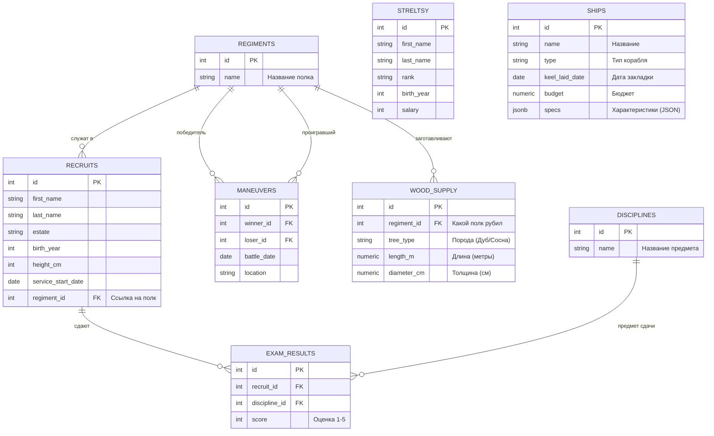

<script setup>
import Conversation from "../../../../components/Conversation.vue";
import alexey from "../../../assets/databases/heroes/clerk_alexey.png";
import ivan from "../../../assets/databases/heroes/clerk_fedor.png";
import petr from "../../../assets/databases/heroes/petr_young.png";
import { defineAsyncComponent } from "vue";

const Repl = defineAsyncComponent(() => import("../../../../components/Repl.vue"))
</script>

# Разработка запросов с функциями

## Генеральная репетиция

**Весна 1696 года.** Воронежская верфь гудит, как растревоженный улей. Лед на реке тронулся, и первые струги уже закачались на свинцовой воде. До отплытия на Азов остаются считанные дни.

В штабную избу, снося дверь сапогом, влетает Петр. В руках у него кипа заморских чертежей, смет и донесений от лесорубов. Царь в бешенстве: казначейство требует итоговый баланс, голландцы просят перевести метры в футы, а адмирал Лефорт не может понять, на каких галерах пушек больше.

Федор, уже привыкший к авралам, спокойно достает чистый пергамент. Алексей молча пододвигает к нему свежую чернильницу.

<Conversation :phrases="[
    {
        name: 'Петр',
        position: 'left',
        text: 'Так, цифирная команда! Флот на воде, а на бумаге — дыры! Казначей ждет бюджеты нарастающим комом, голландцы путаются в наших размерах, а мне нужен точный рейтинг галер! До заката не сведете всё в единый реестр — отправлю матросами на брандеры!',
        photo: petr
    },
    {
        name: 'Федор',
        position: 'right',
        text: 'Сделаем в лучшем виде, мин херц. Голландские матрешки-чертежи я из JSON-сундуков достану, лес округлим математикой, а бюджеты раскатаем оконными функциями по отсекам. База выдержит.',
        photo: ivan
    },
    {
        name: 'Алексей',
        position: 'right',
        text: 'Верно мыслишь, Федор. Только смотри не споткнись, когда будешь задержки между закладками судов считать и функции смещения с агрегацией скрещивать. Инструменты мы изучили, теперь покажи государю высший пилотаж.',
        photo: alexey
    }
]"/>

Твоя задача — помочь Федору составить сложнейшие аналитические запросы, комбинируя встроенные и оконные функции. Обычным `SELECT` тут уже не отделаешься.



::: details Структура БД

```sql
-- === 0. СОЗДАЕМ И ЗАПОЛНЯЕМ РЕКРУТОВ И СТРЕЛЬЦОВ ===
CREATE TABLE recruits (
    id SERIAL PRIMARY KEY,
    first_name VARCHAR(50),
    last_name VARCHAR(50),
    estate VARCHAR(50), -- Сословие: Дворянин, Мещанин, Крестьянин, Иноземец
    birth_year INTEGER,
    height_cm INTEGER,
    service_start_date DATE
);
INSERT INTO recruits (first_name, last_name, estate, birth_year, height_cm, service_start_date) VALUES
-- Реальные исторические личности
('Сергей', 'Бухвостов', 'Дворянин', 1659, 198, '1683-01-01'), -- Первый солдат, высокий!
('Александр', 'Меншиков', 'Мещанин', 1673, 185, '1686-02-12'), -- Алексашка, молодой
('Франц', 'Лефорт', 'Иноземец', 1656, 178, '1680-05-10'), -- Наставник
('Патрик', 'Гордон', 'Иноземец', 1635, 175, '1680-01-15'), -- Самый старший
('Федор', 'Апраксин', 'Дворянин', 1661, 180, '1683-04-20'),
('Михаил', 'Голицын', 'Дворянин', 1675, 176, '1687-06-01'), -- Совсем юный
('Яков', 'Брюс', 'Иноземец', 1669, 182, '1686-08-14'), -- Брюс
('Аникита', 'Репнин', 'Дворянин', 1668, 184, '1685-03-30'),
('Автоном', 'Головин', 'Дворянин', 1667, 179, '1684-11-20'),
('Иван', 'Бутурлин', 'Дворянин', 1661, 177, '1683-09-12'),
-- Массовка (Дворяне)
('Петр', 'Волков', 'Дворянин', 1668, 185, '1683-06-12'),
('Дмитрий', 'Морозов', 'Дворянин', 1671, 190, '1684-03-01'),
('Николай', 'Новиков', 'Дворянин', 1673, 182, '1685-02-10'),
('Сергей', 'Соловьев', 'Дворянин', 1667, 188, '1683-09-30'),
('Яков', 'Семенов', 'Дворянин', 1669, 184, '1684-05-25'),
('Гаврила', 'Романов', 'Дворянин', 1675, 192, '1685-04-12'),
('Ефим', 'Никитин', 'Дворянин', 1668, 186, '1683-12-01'),
-- Массовка (Крестьяне - их много, они пониже, но есть богатыри)
('Алексей', 'Смирнов', 'Крестьянин', 1665, 175, '1683-05-10'),
('Федор', 'Козлов', 'Крестьянин', 1662, 168, '1683-05-20'),
('Михаил', 'Соколов', 'Крестьянин', 1669, 178, '1683-07-07'),
('Андрей', 'Зайцев', 'Крестьянин', 1660, 165, '1683-04-12'),
('Григорий', 'Титов', 'Крестьянин', 1664, 176, '1683-06-18'),
('Степан', 'Кузнецов', 'Крестьянин', 1661, 169, '1683-05-05'),
('Макар', 'Егоров', 'Крестьянин', 1666, 173, '1683-08-01'),
('Лука', 'Антонов', 'Крестьянин', 1671, 177, '1685-01-20'),
('Илья', 'Муромец', 'Крестьянин', 1660, 195, '1683-02-02'), -- Пасхалка, очень высокий
('Савелий', 'Громов', 'Крестьянин', 1665, 188, '1684-07-15'),
('Прохор', 'Дубов', 'Крестьянин', 1670, 180, '1686-03-03'),
-- Массовка (Мещане)
('Иван', 'Попов', 'Мещанин', 1670, 172, '1684-01-15'),
('Василий', 'Лебедев', 'Мещанин', 1665, 170, '1683-08-22'),
('Павел', 'Борисов', 'Мещанин', 1672, 174, '1684-11-05'),
('Александр', 'Виноградов', 'Мещанин', 1670, 171, '1684-02-14'),
('Тихон', 'Медведев', 'Мещанин', 1663, 167, '1683-10-10'),
('Кузьма', 'Минин', 'Мещанин', 1662, 176, '1683-09-09'), -- Тезка знаменитого
('Ермолай', 'Рыбаков', 'Мещанин', 1668, 169, '1685-06-20'),
-- Еще Иноземцы (для статистики)
('Иоганн', 'Вейс', 'Иноземец', 1660, 176, '1684-01-01'),
('Петер', 'Шмидт', 'Иноземец', 1665, 181, '1685-12-12');

CREATE TABLE streltsy (
    id SERIAL PRIMARY KEY,
    first_name VARCHAR(50),
    last_name VARCHAR(50),
    rank VARCHAR(50),
    birth_year INTEGER,
    salary INTEGER
);
INSERT INTO streltsy (first_name, last_name, rank, birth_year, salary) VALUES
('Лаврентий', 'Сухарев', 'Полковник', 1655, 150),
('Иван', 'Цыклер', 'Полковник', 1660, 140),
('Кузьма', 'Борода', 'Стрелец', 1670, 10),
('Ерофей', 'Хабаров', 'Стрелец', 1665, 12),
('Агап', 'Тихий', 'Стрелец', 1672, 10),
('Прокоп', 'Громкий', 'Десятник', 1668, 25),
('Сидор', 'Лютый', 'Стрелец', 1660, 10),
('Фома', 'Кистенев', 'Стрелец', 1669, 11),
('Епифан', 'Коловрат', 'Стрелец', 1667, 10),
('Никита', 'Пустосвят', 'Стрелец', 1659, 10),
('Савва', 'Морозов', 'Стрелец', 1671, 15),
('Тихон', 'Хренников', 'Стрелец', 1668, 10),
('Елизар', 'Молот', 'Стрелец', 1666, 12),
('Акакий', 'Башмачкин', 'Писарь', 1675, 8),
('Остап', 'Бендер', 'Десятник', 1673, 50),
('Паниковский', 'Михаил', 'Стрелец', 1660, 5),
('Шура', 'Балаганов', 'Стрелец', 1674, 10),
('Алексей', 'Смирнов', 'Стрелец', 1665, 10),
('Федор', 'Козлов', 'Стрелец', 1662, 10),
('Иван', 'Иванов', 'Сотник', 1670, 45),
('Михаил', 'Соколов', 'Десятник', 1669, 30),
('Андрей', 'Зайцев', 'Стрелец', 1660, 10),
('Григорий', 'Титов', 'Стрелец', 1664, 10),
('Василий', 'Теркин', 'Стрелец', 1675, 12),
('Степан', 'Калашников', 'Стрелец', 1670, 15),
('Кирилл', 'Туров', 'Стрелец', 1668, 10),
('Мефодий', 'Буквоед', 'Писарь', 1660, 9),
('Добрыня', 'Никитич', 'Сотник', 1655, 100),
('Алеша', 'Попович', 'Десятник', 1678, 30),
('Илья', 'Муромец', 'Стрелец', 1650, 20),
('Соловей', 'Разбойник', 'Стрелец', 1665, 10),
('Кощей', 'Бессмертный', 'Полковник', 1600, 200),
('Яга', 'Костяная', 'Стряпуха', 1620, 5);

-- === 1. СОЗДАЕМ И ЗАПОЛНЯЕМ ПОЛКИ ===
CREATE TABLE regiments (
id SERIAL PRIMARY KEY,
name VARCHAR(50) -- Название полка (Преображенский, Семеновский)
);

INSERT INTO regiments (name) VALUES
('Преображенский полк'),
('Семеновский полк'),
('Лефортовский полк'),
('Бутырский полк');


-- === 2. РАСПРЕДЕЛЯЕМ ЛЮДЕЙ (UPDATE) ===

-- Привязываем рекрутов к полкам (Добавляем внешний ключ)
ALTER TABLE recruits ADD COLUMN regiment_id INTEGER;

-- А. Исторические личности (Точечное распределение)
UPDATE recruits SET regiment_id = 1 WHERE last_name IN ('Бухвостов', 'Меншиков', 'Брюс', 'Репнин', 'Головин', 'Бутурлин'); -- Преображенцы
UPDATE recruits SET regiment_id = 2 WHERE last_name IN ('Апраксин', 'Голицын'); -- Семеновцы
UPDATE recruits SET regiment_id = 3 WHERE last_name = 'Лефорт'; -- Лефортовский
UPDATE recruits SET regiment_id = 4 WHERE last_name = 'Гордон'; -- Бутырский

-- Б. Массовка - Дворяне (Все офицеры должны быть при деле)
UPDATE recruits
SET regiment_id = floor(random() * 4 + 1)::int
WHERE estate = 'Дворянин' AND id > 10;


-- В. Массовка - Крестьяне и Мещане (Солдаты)
UPDATE recruits
SET regiment_id = floor(random() * 2 + 1)::int -- Только в Преображенский или Семеновский (пехота)
WHERE estate IN ('Крестьянин', 'Мещанин')
AND id > 10
AND random() > 0.3;

-- ВАЖНО: Иноземец Петер Шмидт - зачислим его к Лефорту
UPDATE recruits SET regiment_id = 3 WHERE last_name = 'Шмидт';

-- 3. Добавляем ДИСЦИПЛИНЫ
CREATE TABLE disciplines (
id SERIAL PRIMARY KEY,
name VARCHAR(50)
);

INSERT INTO disciplines (name) VALUES
('Мушкетная стрельба'),
('Фехтование'),
('Инженерное дело'),
('Метание гранат'); -- Эту дисциплину еще никто не сдавал

-- === 3. ЗАПОЛНЯЕМ ОЦЕНКИ (INSERT) ===
CREATE TABLE exam_results (
id SERIAL PRIMARY KEY,
recruit_id INTEGER, -- Ссылка на recruits
discipline_id INTEGER, -- Ссылка на disciplines
score INTEGER -- Оценка (от 1 до 5)
);

-- А. Исторические личности (Сдали все)
INSERT INTO exam_results (recruit_id, discipline_id, score) VALUES
-- Сергей Бухвостов (Преображенец, 1-й солдат) - Отличник
(1, 1, 5), -- Стрельба
(1, 2, 5), -- Фехтование
(1, 3, 4), -- Инженерное

-- Александр Меншиков (Преображенец) - Хитрый, но не усидчивый
(2, 1, 3), -- Стрельба (руки дрожали)
(2, 2, 5), -- Фехтование (дерзкий)
(2, 3, 5), -- Инженерное (смекалка)

-- Франц Лефорт (Командир)
(3, 1, 5),
(3, 2, 5),
(3, 3, 5),

-- Патрик Гордон (Старый вояка)
(4, 1, 5), -- Стрельба (опыт)
(4, 3, 5), -- Инженерное (фортификация - его конек)

-- Яков Брюс (Ученый)
(7, 1, 2), -- Стрельба (слеповат)
(7, 3, 5); -- Инженерное (Гений!)

-- Б. Дворяне (Массовка)
INSERT INTO exam_results (recruit_id, discipline_id, score)
SELECT id, 1, floor(random() * 3 + 3)::int -- Стрельба (оценки 3, 4, 5)
FROM recruits
WHERE estate = 'Дворянин' AND id > 10 AND random() > 0.5;

INSERT INTO exam_results (recruit_id, discipline_id, score)
SELECT id, 2, floor(random() * 4 + 2)::int -- Фехтование
FROM recruits
WHERE estate = 'Дворянин' AND id > 10 AND random() > 0.5;

-- В. Крестьяне (Массовка) - Сдали немногие (только стрельбу)
INSERT INTO exam_results (recruit_id, discipline_id, score)
SELECT id, 1, floor(random() * 5 + 1)::int -- Стрельба (оценки 1-5, как повезет)
FROM recruits
WHERE estate = 'Крестьянин' AND regiment_id IS NOT NULL AND random() > 0.7;

-- Г. Специально добавим "Двоечника" для примера
INSERT INTO exam_results (recruit_id, discipline_id, score)
VALUES ((SELECT id FROM recruits WHERE estate='Крестьянин' LIMIT 1), 3, 1); -- Инженерное дело - 1

-- === 4. УЧЕБНЫЕ МАНЕВРЫ (Новая таблица!) ===
CREATE TABLE maneuvers (
    id SERIAL PRIMARY KEY,
    winner_id INTEGER, -- Кто победил (ссылка на regiments)
    loser_id INTEGER,  -- Кто проиграл (ссылка на regiments)
    battle_date DATE,
    location VARCHAR(50)
);

INSERT INTO maneuvers (winner_id, loser_id, battle_date, location) VALUES
(1, 2, '1694-10-01', 'Кожухово'), -- Преображенский побил Семеновский
(3, 4, '1694-10-02', 'Яуза'),     -- Лефортовский побил Бутырский
(1, 3, '1694-10-03', 'Кожухово'), -- Преображенский побил Лефортовский
(2, 4, '1694-10-04', 'Пресбург'), -- Семеновский побил Бутырский
(4, 1, '1694-10-05', 'Яуза'),     -- Бутырский (внезапно) побил Преображенский (реванш)
(3, 2, '1694-10-06', 'Пресбург'),
(1, 4, '1694-10-07', 'Кожухово'),
(2, 3, '1694-10-08', 'Яуза'),
(4, 3, '1694-10-09', 'Пресбург'),
(1, 2, '1694-10-10', 'Финал'),    -- Гранд-финал
(3, 1, '1694-10-11', 'Утешительный'),
(4, 2, '1694-10-12', 'Пьяная драка');

-- === 5. ФЛОТ (Корабли) ===
CREATE TABLE ships (
    id SERIAL PRIMARY KEY,
    name VARCHAR(50),
    type VARCHAR(50),
    keel_laid_date DATE,
    budget NUMERIC(10, 2),
    specs JSONB -- колонка для хитрых голландских чертежей
);

INSERT INTO ships (name, type, keel_laid_date, budget, specs) VALUES
('Апостол Петр', 'Галера', '1695-11-01', 5000.00, '{"crew": 150, "captain": {"name": "Лефорт", "rank": "Адмирал"}, "weapons": ["пушки", "мушкетоны"]}'),
('Апостол Павел', 'Галера', '1695-11-15', 5200.50, '{"crew": 140, "captain": {"name": "Головин", "rank": "Капитан"}, "weapons": ["пушки"]}'),
('Страх', 'Брандер', '1695-12-01', 1500.00, '{"explosives_kg": 500, "crew": 5, "weapons": ["греческий огонь"]}'),
('Смелость', 'Брандер', '1695-12-05', 1450.75, '{"explosives_kg": 600, "crew": 4, "weapons": []}'),
('Святой Марк', 'Струг', '1696-01-10', 800.00, '{"cargo_capacity_tons": 50, "captain": {"name": "Смирнов", "rank": "Боцман"}}'),
('Святой Лука', 'Струг', '1696-01-12', NULL, '{"cargo_capacity_tons": 60}'); -- Бюджет еще не утвержден

-- === 6. ЛЕСОЗАГОТОВКИ ===
CREATE TABLE wood_supply (
id SERIAL PRIMARY KEY,
regiment_id INTEGER, -- Какой полк рубил
tree_type VARCHAR(50),
length_m NUMERIC(5, 2), -- Длина в метрах
diameter_cm NUMERIC(5, 2) -- Диаметр в сантиметрах
);

-- Полки рубят лес (Преображенцы и Семеновцы)
INSERT INTO wood_supply (regiment_id, tree_type, length_m, diameter_cm) VALUES
(1, 'Дуб', 8.5, 45.0),
(1, 'Дуб', 9.0, 50.5),
(1, 'Сосна', 12.0, 30.0),
(2, 'Сосна', 11.5, 28.5),
(2, 'Дуб', 7.8, 42.0),
(2, 'Сосна', 13.0, 35.0),
(1, 'Дуб', 8.0, 48.0),
(3, 'Сосна', 10.0, 25.0);
```

:::

<ClientOnly>
<Repl :initial-queries="[
`CREATE TABLE recruits (
    id SERIAL PRIMARY KEY,
    first_name VARCHAR(50),
    last_name VARCHAR(50),
    estate VARCHAR(50),
    birth_year INTEGER,
    height_cm INTEGER,
    service_start_date DATE
);`,
`INSERT INTO recruits (first_name, last_name, estate, birth_year, height_cm, service_start_date) VALUES
('Сергей', 'Бухвостов', 'Дворянин', 1659, 198, '1683-01-01'), 
('Александр', 'Меншиков', 'Мещанин', 1673, 185, '1686-02-12'),
('Франц', 'Лефорт', 'Иноземец', 1656, 178, '1680-05-10'),
('Патрик', 'Гордон', 'Иноземец', 1635, 175, '1680-01-15'),
('Федор', 'Апраксин', 'Дворянин', 1661, 180, '1683-04-20'),
('Михаил', 'Голицын', 'Дворянин', 1675, 176, '1687-06-01'),
('Яков', 'Брюс', 'Иноземец', 1669, 182, '1686-08-14'),
('Аникита', 'Репнин', 'Дворянин', 1668, 184, '1685-03-30'),
('Автоном', 'Головин', 'Дворянин', 1667, 179, '1684-11-20'),
('Иван', 'Бутурлин', 'Дворянин', 1661, 177, '1683-09-12'),
('Петр', 'Волков', 'Дворянин', 1668, 185, '1683-06-12'),
('Дмитрий', 'Морозов', 'Дворянин', 1671, 190, '1684-03-01'),
('Николай', 'Новиков', 'Дворянин', 1673, 182, '1685-02-10'),
('Сергей', 'Соловьев', 'Дворянин', 1667, 188, '1683-09-30'),
('Яков', 'Семенов', 'Дворянин', 1669, 184, '1684-05-25'),
('Гаврила', 'Романов', 'Дворянин', 1675, 192, '1685-04-12'),
('Ефим', 'Никитин', 'Дворянин', 1668, 186, '1683-12-01'),
('Алексей', 'Смирнов', 'Крестьянин', 1665, 175, '1683-05-10'),
('Федор', 'Козлов', 'Крестьянин', 1662, 168, '1683-05-20'),
('Михаил', 'Соколов', 'Крестьянин', 1669, 178, '1683-07-07'),
('Андрей', 'Зайцев', 'Крестьянин', 1660, 165, '1683-04-12'),
('Григорий', 'Титов', 'Крестьянин', 1664, 176, '1683-06-18'),
('Степан', 'Кузнецов', 'Крестьянин', 1661, 169, '1683-05-05'),
('Макар', 'Егоров', 'Крестьянин', 1666, 173, '1683-08-01'),
('Лука', 'Антонов', 'Крестьянин', 1671, 177, '1685-01-20'),
('Илья', 'Муромец', 'Крестьянин', 1660, 195, '1683-02-02'),
('Савелий', 'Громов', 'Крестьянин', 1665, 188, '1684-07-15'),
('Прохор', 'Дубов', 'Крестьянин', 1670, 180, '1686-03-03'),
('Иван', 'Попов', 'Мещанин', 1670, 172, '1684-01-15'),
('Василий', 'Лебедев', 'Мещанин', 1665, 170, '1683-08-22'),
('Павел', 'Борисов', 'Мещанин', 1672, 174, '1684-11-05'),
('Александр', 'Виноградов', 'Мещанин', 1670, 171, '1684-02-14'),
('Тихон', 'Медведев', 'Мещанин', 1663, 167, '1683-10-10'),
('Кузьма', 'Минин', 'Мещанин', 1662, 176, '1683-09-09'), 
('Ермолай', 'Рыбаков', 'Мещанин', 1668, 169, '1685-06-20'),
('Иоганн', 'Вейс', 'Иноземец', 1660, 176, '1684-01-01'),
('Петер', 'Шмидт', 'Иноземец', 1665, 181, '1685-12-12');`,
`CREATE TABLE streltsy (
    id SERIAL PRIMARY KEY,
    first_name VARCHAR(50),
    last_name VARCHAR(50),
    rank VARCHAR(50),
    birth_year INTEGER,
    salary INTEGER
);`,
`INSERT INTO streltsy (first_name, last_name, rank, birth_year, salary) VALUES
('Лаврентий', 'Сухарев', 'Полковник', 1655, 150),
('Иван', 'Цыклер', 'Полковник', 1660, 140),
('Кузьма', 'Борода', 'Стрелец', 1670, 10),
('Ерофей', 'Хабаров', 'Стрелец', 1665, 12),
('Агап', 'Тихий', 'Стрелец', 1672, 10),
('Прокоп', 'Громкий', 'Десятник', 1668, 25),
('Сидор', 'Лютый', 'Стрелец', 1660, 10),
('Фома', 'Кистенев', 'Стрелец', 1669, 11),
('Епифан', 'Коловрат', 'Стрелец', 1667, 10),
('Никита', 'Пустосвят', 'Стрелец', 1659, 10),
('Савва', 'Морозов', 'Стрелец', 1671, 15),
('Тихон', 'Хренников', 'Стрелец', 1668, 10),
('Елизар', 'Молот', 'Стрелец', 1666, 12),
('Акакий', 'Башмачкин', 'Писарь', 1675, 8),
('Остап', 'Бендер', 'Десятник', 1673, 50),
('Паниковский', 'Михаил', 'Стрелец', 1660, 5),
('Шура', 'Балаганов', 'Стрелец', 1674, 10),
('Алексей', 'Смирнов', 'Стрелец', 1665, 10),
('Федор', 'Козлов', 'Стрелец', 1662, 10),
('Иван', 'Иванов', 'Сотник', 1670, 45),
('Михаил', 'Соколов', 'Десятник', 1669, 30),
('Андрей', 'Зайцев', 'Стрелец', 1660, 10),
('Григорий', 'Титов', 'Стрелец', 1664, 10),
('Василий', 'Теркин', 'Стрелец', 1675, 12),
('Степан', 'Калашников', 'Стрелец', 1670, 15),
('Кирилл', 'Туров', 'Стрелец', 1668, 10),
('Мефодий', 'Буквоед', 'Писарь', 1660, 9),
('Добрыня', 'Никитич', 'Сотник', 1655, 100),
('Алеша', 'Попович', 'Десятник', 1678, 30),
('Илья', 'Муромец', 'Стрелец', 1650, 20),
('Соловей', 'Разбойник', 'Стрелец', 1665, 10),
('Кощей', 'Бессмертный', 'Полковник', 1600, 200),
('Яга', 'Костяная', 'Стряпуха', 1620, 5);`,
`CREATE TABLE regiments (
id SERIAL PRIMARY KEY,
name VARCHAR(50)
);`,
`INSERT INTO regiments (name) VALUES
('Преображенский полк'),
('Семеновский полк'),
('Лефортовский полк'),
('Бутырский полк');`,
`ALTER TABLE recruits ADD COLUMN regiment_id INTEGER;`,
`UPDATE recruits SET regiment_id = 1 WHERE last_name IN ('Бухвостов', 'Меншиков', 'Брюс', 'Репнин', 'Головин', 'Бутурлин');`,
`UPDATE recruits SET regiment_id = 2 WHERE last_name IN ('Апраксин', 'Голицын');`,
`UPDATE recruits SET regiment_id = 3 WHERE last_name = 'Лефорт'; `,
`UPDATE recruits SET regiment_id = 4 WHERE last_name = 'Гордон';`,
`UPDATE recruits
SET regiment_id = floor(random() * 4 + 1)::int
WHERE estate = 'Дворянин' AND id > 10;`,
`UPDATE recruits
SET regiment_id = floor(random() * 2 + 1)::int 
WHERE estate IN ('Крестьянин', 'Мещанин')
AND id > 10
AND random() > 0.3;`,
`UPDATE recruits SET regiment_id = 3 WHERE last_name = 'Шмидт';`,
`CREATE TABLE disciplines (
id SERIAL PRIMARY KEY,
name VARCHAR(50)
);`,
`INSERT INTO disciplines (name) VALUES
('Мушкетная стрельба'),
('Фехтование'),
('Инженерное дело'),
('Метание гранат'); `,
`CREATE TABLE exam_results (
id SERIAL PRIMARY KEY,
recruit_id INTEGER, 
discipline_id INTEGER, 
score INTEGER 
);`,
`INSERT INTO exam_results (recruit_id, discipline_id, score) VALUES
(1, 1, 5), -- Стрельба
(1, 2, 5), -- Фехтование
(1, 3, 4), -- Инженерное
(2, 1, 3), -- Стрельба (руки дрожали)
(2, 2, 5), -- Фехтование (дерзкий)
(2, 3, 5), -- Инженерное (смекалка)
(3, 1, 5),
(3, 2, 5),
(3, 3, 5),
(4, 1, 5), 
(4, 3, 5),
(7, 1, 2),
(7, 3, 5);`,
`INSERT INTO exam_results (recruit_id, discipline_id, score)
SELECT id, 1, floor(random() * 3 + 3)::int
FROM recruits
WHERE estate = 'Дворянин' AND id > 10 AND random() > 0.5;`,
`INSERT INTO exam_results (recruit_id, discipline_id, score)
SELECT id, 2, floor(random() * 4 + 2)::int 
FROM recruits
WHERE estate = 'Дворянин' AND id > 10 AND random() > 0.5;`,
`INSERT INTO exam_results (recruit_id, discipline_id, score)
SELECT id, 1, floor(random() * 5 + 1)::int 
FROM recruits
WHERE estate = 'Крестьянин' AND regiment_id IS NOT NULL AND random() > 0.7;`,
`INSERT INTO exam_results (recruit_id, discipline_id, score)
VALUES ((SELECT id FROM recruits WHERE estate='Крестьянин' LIMIT 1), 3, 1); `,
`CREATE TABLE maneuvers (
    id SERIAL PRIMARY KEY,
    winner_id INTEGER,
    loser_id INTEGER, 
    battle_date DATE,
    location VARCHAR(50)
);`,
`INSERT INTO maneuvers (winner_id, loser_id, battle_date, location) VALUES
(1, 2, '1694-10-01', 'Кожухово'), 
(3, 4, '1694-10-02', 'Яуза'),    
(1, 3, '1694-10-03', 'Кожухово'), 
(2, 4, '1694-10-04', 'Пресбург'), 
(4, 1, '1694-10-05', 'Яуза'),    
(3, 2, '1694-10-06', 'Пресбург'),
(1, 4, '1694-10-07', 'Кожухово'),
(2, 3, '1694-10-08', 'Яуза'),
(4, 3, '1694-10-09', 'Пресбург'),
(1, 2, '1694-10-10', 'Финал'),   
(3, 1, '1694-10-11', 'Утешительный'),
(4, 2, '1694-10-12', 'Пьяная драка');`,
`CREATE TABLE ships (
id SERIAL PRIMARY KEY,
name VARCHAR(50),
type VARCHAR(50),
keel_laid_date DATE,
budget NUMERIC(10, 2),
specs JSONB 
);`,
`INSERT INTO ships (name, type, keel_laid_date, budget, specs) VALUES
('Апостол Петр', 'Галера', '1695-11-01', 5000.00, '{&quot;crew&quot;: 150, &quot;captain&quot;: {&quot;name&quot;: &quot;Лефорт&quot;, &quot;rank&quot;: &quot;Адмирал&quot;}, &quot;weapons&quot;: [&quot;пушки&quot;, &quot;мушкетоны&quot;]}'),
('Апостол Павел', 'Галера', '1695-11-15', 5200.50, '{&quot;crew&quot;: 140, &quot;captain&quot;: {&quot;name&quot;: &quot;Головин&quot;, &quot;rank&quot;: &quot;Капитан&quot;}, &quot;weapons&quot;: [&quot;пушки&quot;]}'),
('Страх', 'Брандер', '1695-12-01', 1500.00, '{&quot;explosives_kg&quot;: 500, &quot;crew&quot;: 5, &quot;weapons&quot;: [&quot;греческий огонь&quot;]}'),
('Смелость', 'Брандер', '1695-12-05', 1450.75, '{&quot;explosives_kg&quot;: 600, &quot;crew&quot;: 4, &quot;weapons&quot;: []}'),
('Святой Марк', 'Струг', '1696-01-10', 800.00, '{&quot;cargo_capacity_tons&quot;: 50, &quot;captain&quot;: {&quot;name&quot;: &quot;Смирнов&quot;, &quot;rank&quot;: &quot;Боцман&quot;}}'),
('Святой Лука', 'Струг', '1696-01-12', NULL, '{&quot;cargo_capacity_tons&quot;: 60}');`,
`CREATE TABLE wood_supply (
id SERIAL PRIMARY KEY,
regiment_id INTEGER, -- Какой полк рубил
tree_type VARCHAR(50),
length_m NUMERIC(5, 2), -- Длина в метрах
diameter_cm NUMERIC(5, 2) -- Диаметр в сантиметрах
);`,
`INSERT INTO wood_supply (regiment_id, tree_type, length_m, diameter_cm) VALUES
(1, 'Дуб', 8.5, 45.0),
(1, 'Дуб', 9.0, 50.5),
(1, 'Сосна', 12.0, 30.0),
(2, 'Сосна', 11.5, 28.5),
(2, 'Дуб', 7.8, 42.0),
(2, 'Сосна', 13.0, 35.0),
(1, 'Дуб', 8.0, 48.0),
(3, 'Сосна', 10.0, 25.0);`
]"/>
</ClientOnly>

## Блок 1: Плотницкая математика и писарские шифры

**Задача 1. Тайные позывные**
Для секретной переписки Петр приказал сгенерировать позывные для каждого рекрута.
_Выведите оригинальные имя и фамилию, а также столбец `callsign`. Позывной формируется так: первая буква имени + последние 2 буквы фамилии + дефис + год рождения. (Например, для Сергея Бухвостова: `Стов-1659`)._

**Задача 2. Смоляная геометрия (Новая формула)**
Днища кораблей нужно покрыть смолой, а бревна — обработать от гнили. Федору нужно знать **площадь боковой поверхности** каждого бревна. Формула: $S = \pi \cdot d \cdot l$.
_Выведите ID бревна, породу дерева и площадь его поверхности в квадратных метрах. Не забудьте, что диаметр в базе указан в сантиметрах, его нужно перевести в метры (разделить на 100). Число $\pi$ берите как `3.14`. Результат округлите до 2 знаков после запятой._

**Задача 3. Налог на пустоту**
В казне дыра. Петр ввел "налог на неопределенность". Если у корабля не указан бюджет (он равен `NULL`), казначейство автоматически списывает на него штрафные 1500 рублей.
_Выведите название корабля и итоговый бюджет к оплате: если бюджет есть, берите его; если нет — ставьте 1500._

**Задача 4. Борьба с кумовством**
Петр ненавидит длинные родовые фамилии бояр. Он приказал найти всех дворян в таблице рекрутов, чья фамилия длиннее 7 символов, и заменить в ней букву 'о' на 'а' (чтобы звучало проще).
_Выведите оригинальную фамилию и "исправленную" фамилию только для дворян с фамилией длиннее 7 символов._

**Задача 5. Артиллерийский полигон (Генератор)**
Для пристрелки пушек нужны мишени на разных дистанциях.
_С помощью генератора `GENERATE_SERIES` создайте таблицу из одного столбца `distance_paces`, где будут указаны дистанции в шагах: от 50 до 300 с шагом ровно в 50._

## Блок 2: Игры со временем и заморские чертежи

**Задача 6. Возраст призыва**
Петр хочет знать, во сколько лет каждый рекрут поступил на службу.
_Используя встроенную функцию или математику с датами, выведите имя, фамилию и вычисленный возраст на момент даты `service_start_date` (год начала службы минус год рождения)._

**Задача 7. Парадный календарь**
Для летописи маневров даты нужно привести в красивый вид.
_Выведите место сражения (`location`) и дату битвы в формате: "Месяц DD, YYYY" (Например: "October 01, 1694")._

**Задача 8. Глубокое погружение в JSONB**
Лефорт забыл, кто командует галерой «Апостол Павел».
_Извлеките из столбца `specs` (объект `captain`) ранг (`rank`) и имя (`name`) капитана. Склейте их в одну строку вида: `Капитан Головин`. Корабли без капитанов не выводить._

**Задача 9. Арсенальная ревизия**
Нам нужно найти все корабли, на которых установлено хоть какое-то оружие. Оружие в JSONB хранится в массиве `weapons`.
_Выведите название корабля и самый первый элемент из массива `weapons` (индекс 0). Отфильтруйте так, чтобы пустые значения не выводились._

**Задача 10. Пороховой ценз**
Для брандеров критически важен вес пороха (`explosives_kg` в JSONB).
_Выведите название корабля и вес взрывчатки. Важно: извлеченное значение нужно привести к числу (`::INT`), чтобы отфильтровать только те корабли, где пороха больше или равно 500 кг._

## Блок 3: Оконная магия

**Задача 11. Внутренняя конкуренция**
Петр хочет сравнить рост каждого солдата со средним ростом его сословия.
_Выведите фамилию рекрута, его сословие, его личный рост и средний рост **только по его сословию** (через окно). Округлите средний рост до целого._

**Задача 12. Динамика жалованья**
Казначею нужно выдать зарплату стрельцам, начиная с самых старых ветеранов.
_Выведите фамилию стрельца, год его рождения, размер жалованья и **нарастающий итог** выплаченного жалованья, отсортированный по году рождения (от самых старых к молодым)._

**Задача 13. Распил леса по корзинам**
Заготовленные бревна нужно отсортировать по длине и разбить на 3 равные кучи (короткие, средние, длинные) для разных нужд верфи.
_Используя оконную функцию, разбейте бревна на 3 группы, отсортировав их по длине (`length_m`). Выведите ID бревна, породу, длину и номер корзины._

**Задача 14. Элитный взвод**
Нужно отобрать самых высоких крестьян в личную гвардию, присвоив им ранги. Если рост одинаковый — места делятся поровну без пропусков нумерации.
_Отфильтруйте только крестьян. Выведите фамилию, рост и ранг, отсортированный по росту по убыванию._

**Задача 15. Эталонная толщина**
Плотники хотят знать, насколько каждое бревно тоньше или толще самого первого срубленного бревна в базе (сортировка по ID).
_Выведите ID бревна, диаметр и разницу в сантиметрах между текущим диаметром и диаметром бревна, полученным через оконную функцию (без партицирования, окно на всю таблицу)._

## Блок 4: Адские своды (Финальный экзамен)

_Здесь пощады не будет. Федор, держись._

**Задача 16. Анализ задержек закладки флота**
Петр подозревает, что корабелы ленятся.
_Для каждого типа корабля (`PARTITION BY type`) найдите, сколько дней прошло с момента закладки ПРЕДЫДУЩЕГО корабля **того же типа**. Выведите название, тип, дату закладки и разницу в днях._

**Задача 17. Гонка бюджетов по экипажам**
Выведите названия всех кораблей и их бюджеты. Но теперь нужно вытащить количество экипажа (`crew`) из JSONB, перевести его в число `::INT` и использовать для оконной сортировки!
_Посчитайте нарастающий итог бюджета флота, где первыми идут корабли с самым маленьким экипажем. Корабли без параметра `crew` отфильтруйте._

**Задача 18. Социальный лифт**
Для каждого рекрута высчитайте индекс его "отклонения от нормы": его личный рост минус средний рост по всему войску.
_Затем проранжируйте рекрутов по этому отклонению (от самого большого отклонения в плюс до самого большого в минус). Выведите фамилию, сословие, отклонение и ранг._

**Задача 19. Динамика рубки леса**
Посмотрим на темпы заготовки дерева.
_Выведите ID поставки, название полка, который рубил лес, породу дерева и нарастающий итог суммарной длины бревен (`length_m`), которые нарубил **ИМЕННО ЭТОТ ПОЛК**, сортируя по ID поставки._

**Задача 20. Ультимативный отчет Государя (Свести всё воедино)**
Казначейство, адмиралы и лично Петр требуют единый реестр.
Напишите запрос, который выводит таблицу со следующими столбцами:

1. `ship_code`: Название корабля в верхнем регистре.
2. `captain_info`: Имя капитана из `JSONB`. Если его там нет, выведите текст `'Не назначен'`.
3. `days_to_build`: Разница в днях между датой спуска флота на воду (`'1696-05-01'`) и датой закладки корабля.
4. `budget_percent`: Какой процент составляет бюджет этого судна от бюджета **всего флота** (Округление до 1 знака).
5. `price_diff`: Разница в стоимости текущего корабля и следующего за ним по дате закладки. Если следующего корабля нет, выведите 0.
