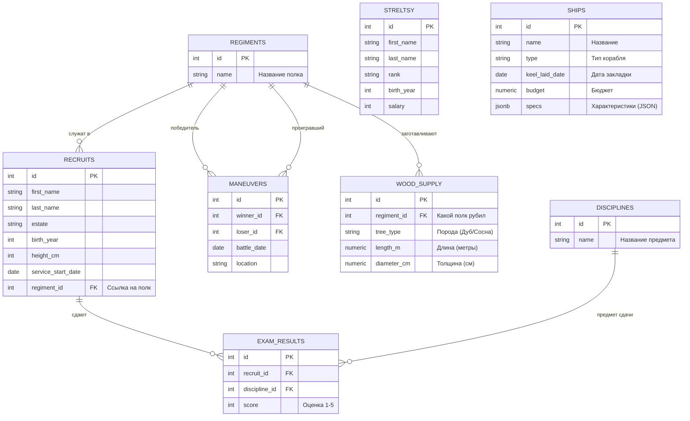

<script setup>
import Conversation from "../../../../components/Conversation.vue";
import alexey from "../../../assets/databases/heroes/clerk_alexey.png";
import ivan from "../../../assets/databases/heroes/clerk_fedor.png";
import petr from "../../../assets/databases/heroes/petr_young.png";
import { defineAsyncComponent } from "vue";

const Repl = defineAsyncComponent(() => import("../../../../components/Repl.vue"))
</script>

# Оконные функции

## Введение

**Весна 1696 года.** Снег на берегах Воронежа начал таять, превращая верфь в непролазное месиво из грязи, щепок и конского навоза. Работа идет на износ, топоры стучат круглосуточно. Сам Петр машет инструментом наравне с плотниками, лично участвуя в рубке своей любимой боевой галеры «Принципиум». Флот строится стахановскими, нечеловеческими темпами — ведь как только вскроется лед на Дону, армада должна немедленно двинуться на Азов.

Но у этой грандиозной стройки есть суровая обратная сторона — деньги. Казна тает с ужасающей скоростью. Железо из Тулы, канаты и парусина из Москвы, пушки, жалованье тысячам иностранных мастеров и простым мужикам — всё это стоит очень много. В столичных Приказах (министерствах того времени) сидят седобородые бояре и дьяки, у которых волосы встают дыбом от воронежских смет. Россия еще никогда не тратила столько денег в одном месте за столь короткий срок.

Чтобы понять, куда улетают золотые рубли, из Москвы присылают сурового ревизора из Приказа Большой казны. Этому душниле плевать на патриотизм и военные стратегии. Ему нужен хитрый финансовый отчет: список абсолютно всех строящихся судов с их ценниками, но так, чтобы прямо напротив каждого корабля стояла **общая сумма расходов на весь флот**. Ревизор хочет с одного взгляда понимать: вот конкретная галера, вот ее цена, а вот столько это составляет от общих трат всей страны.

Ночь. В штабной избе накурено так, что топор можно вешать. Дьяк Федор и его наставник Алексей сидят над пергаментами при свете огарка свечи. В избу забегает Петр.

<Conversation :phrases="[
    {
        name: 'Петр',
        position: 'left',
        text: 'Алексей, Федька! Ревизор из Москвы уже спать лег, а на рассвете ждет бумагу. Если он не увидит в одной таблице и цену каждой галеры, и общий итог по флоту — решит, что мы воруем, и перекроет финансирование. К утру отчет должен быть на столе!',
        photo: petr
    },
    {
        name: 'Алексей',
        position: 'right',
        text: 'Государь, задача — дрянь. По старому голландскому стандарту SQL-92 такое в лоб не пишется. Обычный GROUP BY работает как мясорубка: он схлопнет нам все названия кораблей в одну строку ради суммы. Придется городить костыли с подзапросами, база будет тупить до обеда...',
        photo: alexey
    },
    {
        name: 'Петр',
        position: 'left',
        text: 'Мне плевать на ваши стандарты! Сделайте хоть на бересте, хоть кровью пишите, но чтобы ревизор всё понял с одного взгляда! (Уходит, громко хлопнув дверью)',
        photo: petr
    },
    {
        name: 'Федор',
        position: 'right',
        text: '(Копается в стопке свежих европейских книг) Алексей, погоди... Тут заморские инженеры передали черновики нового стандарта SQL:2003. Глянь-ка сюда! Тут завезли какую-то штуку под названием «Оконные функции». Пишут, что можно использовать OVER().',
        photo: ivan
    },
    {
        name: 'Алексей',
        position: 'right',
        text: '(Выхватывает лист, читает, брови ползут вверх) Да ладно?! То есть она считает сумму по группе, но при этом НЕ СХЛОПЫВАЕТ строки? Исходная таблица остается целой, а сумма просто прилипает сбоку новой колонкой?!',
        photo: alexey
    },
    {
        name: 'Федор',
        position: 'right',
        text: 'Во-во! Работает не как мясорубка, а как рентген! Видишь детали, но знаешь общий вес. Заваривай крепкий чай, наставник. Сейчас мы эту магию заставим работать на благо флота!',
        photo: ivan
    }
]"/>

Оконные функции (Window Functions) — это настоящая магия SQL. Они позволяют делать сложные вычисления над набором строк (как агрегатные функции вроде `SUM` или `AVG`), **НО** при этом они не объединяют эти строки в одну! Исходная таблица остается такой же длинной и подробной, просто сбоку появляются новые умные колонки.

_Если `GROUP BY` грубо схлопывает данные, то оконные функции нежно скользят по ним, заглядывая в соседние строки._

Для работы нам понадобятся наши старые таблицы с флотом, лесом и стрельцами.



::: details Структура БД

```sql
-- === 0. СОЗДАЕМ И ЗАПОЛНЯЕМ РЕКРУТОВ И СТРЕЛЬЦОВ ===
CREATE TABLE recruits (
    id SERIAL PRIMARY KEY,
    first_name VARCHAR(50),
    last_name VARCHAR(50),
    estate VARCHAR(50), -- Сословие: Дворянин, Мещанин, Крестьянин, Иноземец
    birth_year INTEGER,
    height_cm INTEGER,
    service_start_date DATE
);
INSERT INTO recruits (first_name, last_name, estate, birth_year, height_cm, service_start_date) VALUES
-- Реальные исторические личности
('Сергей', 'Бухвостов', 'Дворянин', 1659, 198, '1683-01-01'), -- Первый солдат, высокий!
('Александр', 'Меншиков', 'Мещанин', 1673, 185, '1686-02-12'), -- Алексашка, молодой
('Франц', 'Лефорт', 'Иноземец', 1656, 178, '1680-05-10'), -- Наставник
('Патрик', 'Гордон', 'Иноземец', 1635, 175, '1680-01-15'), -- Самый старший
('Федор', 'Апраксин', 'Дворянин', 1661, 180, '1683-04-20'),
('Михаил', 'Голицын', 'Дворянин', 1675, 176, '1687-06-01'), -- Совсем юный
('Яков', 'Брюс', 'Иноземец', 1669, 182, '1686-08-14'), -- Брюс
('Аникита', 'Репнин', 'Дворянин', 1668, 184, '1685-03-30'),
('Автоном', 'Головин', 'Дворянин', 1667, 179, '1684-11-20'),
('Иван', 'Бутурлин', 'Дворянин', 1661, 177, '1683-09-12'),
-- Массовка (Дворяне)
('Петр', 'Волков', 'Дворянин', 1668, 185, '1683-06-12'),
('Дмитрий', 'Морозов', 'Дворянин', 1671, 190, '1684-03-01'),
('Николай', 'Новиков', 'Дворянин', 1673, 182, '1685-02-10'),
('Сергей', 'Соловьев', 'Дворянин', 1667, 188, '1683-09-30'),
('Яков', 'Семенов', 'Дворянин', 1669, 184, '1684-05-25'),
('Гаврила', 'Романов', 'Дворянин', 1675, 192, '1685-04-12'),
('Ефим', 'Никитин', 'Дворянин', 1668, 186, '1683-12-01'),
-- Массовка (Крестьяне - их много, они пониже, но есть богатыри)
('Алексей', 'Смирнов', 'Крестьянин', 1665, 175, '1683-05-10'),
('Федор', 'Козлов', 'Крестьянин', 1662, 168, '1683-05-20'),
('Михаил', 'Соколов', 'Крестьянин', 1669, 178, '1683-07-07'),
('Андрей', 'Зайцев', 'Крестьянин', 1660, 165, '1683-04-12'),
('Григорий', 'Титов', 'Крестьянин', 1664, 176, '1683-06-18'),
('Степан', 'Кузнецов', 'Крестьянин', 1661, 169, '1683-05-05'),
('Макар', 'Егоров', 'Крестьянин', 1666, 173, '1683-08-01'),
('Лука', 'Антонов', 'Крестьянин', 1671, 177, '1685-01-20'),
('Илья', 'Муромец', 'Крестьянин', 1660, 195, '1683-02-02'), -- Пасхалка, очень высокий
('Савелий', 'Громов', 'Крестьянин', 1665, 188, '1684-07-15'),
('Прохор', 'Дубов', 'Крестьянин', 1670, 180, '1686-03-03'),
-- Массовка (Мещане)
('Иван', 'Попов', 'Мещанин', 1670, 172, '1684-01-15'),
('Василий', 'Лебедев', 'Мещанин', 1665, 170, '1683-08-22'),
('Павел', 'Борисов', 'Мещанин', 1672, 174, '1684-11-05'),
('Александр', 'Виноградов', 'Мещанин', 1670, 171, '1684-02-14'),
('Тихон', 'Медведев', 'Мещанин', 1663, 167, '1683-10-10'),
('Кузьма', 'Минин', 'Мещанин', 1662, 176, '1683-09-09'), -- Тезка знаменитого
('Ермолай', 'Рыбаков', 'Мещанин', 1668, 169, '1685-06-20'),
-- Еще Иноземцы (для статистики)
('Иоганн', 'Вейс', 'Иноземец', 1660, 176, '1684-01-01'),
('Петер', 'Шмидт', 'Иноземец', 1665, 181, '1685-12-12');

CREATE TABLE streltsy (
    id SERIAL PRIMARY KEY,
    first_name VARCHAR(50),
    last_name VARCHAR(50),
    rank VARCHAR(50),
    birth_year INTEGER,
    salary INTEGER
);
INSERT INTO streltsy (first_name, last_name, rank, birth_year, salary) VALUES
('Лаврентий', 'Сухарев', 'Полковник', 1655, 150),
('Иван', 'Цыклер', 'Полковник', 1660, 140),
('Кузьма', 'Борода', 'Стрелец', 1670, 10),
('Ерофей', 'Хабаров', 'Стрелец', 1665, 12),
('Агап', 'Тихий', 'Стрелец', 1672, 10),
('Прокоп', 'Громкий', 'Десятник', 1668, 25),
('Сидор', 'Лютый', 'Стрелец', 1660, 10),
('Фома', 'Кистенев', 'Стрелец', 1669, 11),
('Епифан', 'Коловрат', 'Стрелец', 1667, 10),
('Никита', 'Пустосвят', 'Стрелец', 1659, 10),
('Савва', 'Морозов', 'Стрелец', 1671, 15),
('Тихон', 'Хренников', 'Стрелец', 1668, 10),
('Елизар', 'Молот', 'Стрелец', 1666, 12),
('Акакий', 'Башмачкин', 'Писарь', 1675, 8),
('Остап', 'Бендер', 'Десятник', 1673, 50),
('Паниковский', 'Михаил', 'Стрелец', 1660, 5),
('Шура', 'Балаганов', 'Стрелец', 1674, 10),
('Алексей', 'Смирнов', 'Стрелец', 1665, 10),
('Федор', 'Козлов', 'Стрелец', 1662, 10),
('Иван', 'Иванов', 'Сотник', 1670, 45),
('Михаил', 'Соколов', 'Десятник', 1669, 30),
('Андрей', 'Зайцев', 'Стрелец', 1660, 10),
('Григорий', 'Титов', 'Стрелец', 1664, 10),
('Василий', 'Теркин', 'Стрелец', 1675, 12),
('Степан', 'Калашников', 'Стрелец', 1670, 15),
('Кирилл', 'Туров', 'Стрелец', 1668, 10),
('Мефодий', 'Буквоед', 'Писарь', 1660, 9),
('Добрыня', 'Никитич', 'Сотник', 1655, 100),
('Алеша', 'Попович', 'Десятник', 1678, 30),
('Илья', 'Муромец', 'Стрелец', 1650, 20),
('Соловей', 'Разбойник', 'Стрелец', 1665, 10),
('Кощей', 'Бессмертный', 'Полковник', 1600, 200),
('Яга', 'Костяная', 'Стряпуха', 1620, 5);

-- === 1. СОЗДАЕМ И ЗАПОЛНЯЕМ ПОЛКИ ===
CREATE TABLE regiments (
id SERIAL PRIMARY KEY,
name VARCHAR(50) -- Название полка (Преображенский, Семеновский)
);

INSERT INTO regiments (name) VALUES
('Преображенский полк'),
('Семеновский полк'),
('Лефортовский полк'),
('Бутырский полк');


-- === 2. РАСПРЕДЕЛЯЕМ ЛЮДЕЙ (UPDATE) ===

-- Привязываем рекрутов к полкам (Добавляем внешний ключ)
ALTER TABLE recruits ADD COLUMN regiment_id INTEGER;

-- А. Исторические личности (Точечное распределение)
UPDATE recruits SET regiment_id = 1 WHERE last_name IN ('Бухвостов', 'Меншиков', 'Брюс', 'Репнин', 'Головин', 'Бутурлин'); -- Преображенцы
UPDATE recruits SET regiment_id = 2 WHERE last_name IN ('Апраксин', 'Голицын'); -- Семеновцы
UPDATE recruits SET regiment_id = 3 WHERE last_name = 'Лефорт'; -- Лефортовский
UPDATE recruits SET regiment_id = 4 WHERE last_name = 'Гордон'; -- Бутырский

-- Б. Массовка - Дворяне (Все офицеры должны быть при деле)
UPDATE recruits
SET regiment_id = floor(random() * 4 + 1)::int
WHERE estate = 'Дворянин' AND id > 10;


-- В. Массовка - Крестьяне и Мещане (Солдаты)
UPDATE recruits
SET regiment_id = floor(random() * 2 + 1)::int -- Только в Преображенский или Семеновский (пехота)
WHERE estate IN ('Крестьянин', 'Мещанин')
AND id > 10
AND random() > 0.3;

-- ВАЖНО: Иноземец Петер Шмидт - зачислим его к Лефорту
UPDATE recruits SET regiment_id = 3 WHERE last_name = 'Шмидт';

-- 3. Добавляем ДИСЦИПЛИНЫ
CREATE TABLE disciplines (
id SERIAL PRIMARY KEY,
name VARCHAR(50)
);

INSERT INTO disciplines (name) VALUES
('Мушкетная стрельба'),
('Фехтование'),
('Инженерное дело'),
('Метание гранат'); -- Эту дисциплину еще никто не сдавал

-- === 3. ЗАПОЛНЯЕМ ОЦЕНКИ (INSERT) ===
CREATE TABLE exam_results (
id SERIAL PRIMARY KEY,
recruit_id INTEGER, -- Ссылка на recruits
discipline_id INTEGER, -- Ссылка на disciplines
score INTEGER -- Оценка (от 1 до 5)
);

-- А. Исторические личности (Сдали все)
INSERT INTO exam_results (recruit_id, discipline_id, score) VALUES
-- Сергей Бухвостов (Преображенец, 1-й солдат) - Отличник
(1, 1, 5), -- Стрельба
(1, 2, 5), -- Фехтование
(1, 3, 4), -- Инженерное

-- Александр Меншиков (Преображенец) - Хитрый, но не усидчивый
(2, 1, 3), -- Стрельба (руки дрожали)
(2, 2, 5), -- Фехтование (дерзкий)
(2, 3, 5), -- Инженерное (смекалка)

-- Франц Лефорт (Командир)
(3, 1, 5),
(3, 2, 5),
(3, 3, 5),

-- Патрик Гордон (Старый вояка)
(4, 1, 5), -- Стрельба (опыт)
(4, 3, 5), -- Инженерное (фортификация - его конек)

-- Яков Брюс (Ученый)
(7, 1, 2), -- Стрельба (слеповат)
(7, 3, 5); -- Инженерное (Гений!)

-- Б. Дворяне (Массовка)
INSERT INTO exam_results (recruit_id, discipline_id, score)
SELECT id, 1, floor(random() * 3 + 3)::int -- Стрельба (оценки 3, 4, 5)
FROM recruits
WHERE estate = 'Дворянин' AND id > 10 AND random() > 0.5;

INSERT INTO exam_results (recruit_id, discipline_id, score)
SELECT id, 2, floor(random() * 4 + 2)::int -- Фехтование
FROM recruits
WHERE estate = 'Дворянин' AND id > 10 AND random() > 0.5;

-- В. Крестьяне (Массовка) - Сдали немногие (только стрельбу)
INSERT INTO exam_results (recruit_id, discipline_id, score)
SELECT id, 1, floor(random() * 5 + 1)::int -- Стрельба (оценки 1-5, как повезет)
FROM recruits
WHERE estate = 'Крестьянин' AND regiment_id IS NOT NULL AND random() > 0.7;

-- Г. Специально добавим "Двоечника" для примера
INSERT INTO exam_results (recruit_id, discipline_id, score)
VALUES ((SELECT id FROM recruits WHERE estate='Крестьянин' LIMIT 1), 3, 1); -- Инженерное дело - 1

-- === 4. УЧЕБНЫЕ МАНЕВРЫ (Новая таблица!) ===
CREATE TABLE maneuvers (
    id SERIAL PRIMARY KEY,
    winner_id INTEGER, -- Кто победил (ссылка на regiments)
    loser_id INTEGER,  -- Кто проиграл (ссылка на regiments)
    battle_date DATE,
    location VARCHAR(50)
);

INSERT INTO maneuvers (winner_id, loser_id, battle_date, location) VALUES
(1, 2, '1694-10-01', 'Кожухово'), -- Преображенский побил Семеновский
(3, 4, '1694-10-02', 'Яуза'),     -- Лефортовский побил Бутырский
(1, 3, '1694-10-03', 'Кожухово'), -- Преображенский побил Лефортовский
(2, 4, '1694-10-04', 'Пресбург'), -- Семеновский побил Бутырский
(4, 1, '1694-10-05', 'Яуза'),     -- Бутырский (внезапно) побил Преображенский (реванш)
(3, 2, '1694-10-06', 'Пресбург'),
(1, 4, '1694-10-07', 'Кожухово'),
(2, 3, '1694-10-08', 'Яуза'),
(4, 3, '1694-10-09', 'Пресбург'),
(1, 2, '1694-10-10', 'Финал'),    -- Гранд-финал
(3, 1, '1694-10-11', 'Утешительный'),
(4, 2, '1694-10-12', 'Пьяная драка');

-- === 5. ФЛОТ (Корабли) ===
CREATE TABLE ships (
    id SERIAL PRIMARY KEY,
    name VARCHAR(50),
    type VARCHAR(50),
    keel_laid_date DATE,
    budget NUMERIC(10, 2),
    specs JSONB -- колонка для хитрых голландских чертежей
);

INSERT INTO ships (name, type, keel_laid_date, budget, specs) VALUES
('Апостол Петр', 'Галера', '1695-11-01', 5000.00, '{"crew": 150, "captain": {"name": "Лефорт", "rank": "Адмирал"}, "weapons": ["пушки", "мушкетоны"]}'),
('Апостол Павел', 'Галера', '1695-11-15', 5200.50, '{"crew": 140, "captain": {"name": "Головин", "rank": "Капитан"}, "weapons": ["пушки"]}'),
('Страх', 'Брандер', '1695-12-01', 1500.00, '{"explosives_kg": 500, "crew": 5, "weapons": ["греческий огонь"]}'),
('Смелость', 'Брандер', '1695-12-05', 1450.75, '{"explosives_kg": 600, "crew": 4, "weapons": []}'),
('Святой Марк', 'Струг', '1696-01-10', 800.00, '{"cargo_capacity_tons": 50, "captain": {"name": "Смирнов", "rank": "Боцман"}}'),
('Святой Лука', 'Струг', '1696-01-12', NULL, '{"cargo_capacity_tons": 60}'); -- Бюджет еще не утвержден

-- === 6. ЛЕСОЗАГОТОВКИ ===
CREATE TABLE wood_supply (
id SERIAL PRIMARY KEY,
regiment_id INTEGER, -- Какой полк рубил
tree_type VARCHAR(50),
length_m NUMERIC(5, 2), -- Длина в метрах
diameter_cm NUMERIC(5, 2) -- Диаметр в сантиметрах
);

-- Полки рубят лес (Преображенцы и Семеновцы)
INSERT INTO wood_supply (regiment_id, tree_type, length_m, diameter_cm) VALUES
(1, 'Дуб', 8.5, 45.0),
(1, 'Дуб', 9.0, 50.5),
(1, 'Сосна', 12.0, 30.0),
(2, 'Сосна', 11.5, 28.5),
(2, 'Дуб', 7.8, 42.0),
(2, 'Сосна', 13.0, 35.0),
(1, 'Дуб', 8.0, 48.0),
(3, 'Сосна', 10.0, 25.0);
```

:::

<ClientOnly>
<Repl :initial-queries="[
`CREATE TABLE recruits (
    id SERIAL PRIMARY KEY,
    first_name VARCHAR(50),
    last_name VARCHAR(50),
    estate VARCHAR(50),
    birth_year INTEGER,
    height_cm INTEGER,
    service_start_date DATE
);`,
`INSERT INTO recruits (first_name, last_name, estate, birth_year, height_cm, service_start_date) VALUES
('Сергей', 'Бухвостов', 'Дворянин', 1659, 198, '1683-01-01'), 
('Александр', 'Меншиков', 'Мещанин', 1673, 185, '1686-02-12'),
('Франц', 'Лефорт', 'Иноземец', 1656, 178, '1680-05-10'),
('Патрик', 'Гордон', 'Иноземец', 1635, 175, '1680-01-15'),
('Федор', 'Апраксин', 'Дворянин', 1661, 180, '1683-04-20'),
('Михаил', 'Голицын', 'Дворянин', 1675, 176, '1687-06-01'),
('Яков', 'Брюс', 'Иноземец', 1669, 182, '1686-08-14'),
('Аникита', 'Репнин', 'Дворянин', 1668, 184, '1685-03-30'),
('Автоном', 'Головин', 'Дворянин', 1667, 179, '1684-11-20'),
('Иван', 'Бутурлин', 'Дворянин', 1661, 177, '1683-09-12'),
('Петр', 'Волков', 'Дворянин', 1668, 185, '1683-06-12'),
('Дмитрий', 'Морозов', 'Дворянин', 1671, 190, '1684-03-01'),
('Николай', 'Новиков', 'Дворянин', 1673, 182, '1685-02-10'),
('Сергей', 'Соловьев', 'Дворянин', 1667, 188, '1683-09-30'),
('Яков', 'Семенов', 'Дворянин', 1669, 184, '1684-05-25'),
('Гаврила', 'Романов', 'Дворянин', 1675, 192, '1685-04-12'),
('Ефим', 'Никитин', 'Дворянин', 1668, 186, '1683-12-01'),
('Алексей', 'Смирнов', 'Крестьянин', 1665, 175, '1683-05-10'),
('Федор', 'Козлов', 'Крестьянин', 1662, 168, '1683-05-20'),
('Михаил', 'Соколов', 'Крестьянин', 1669, 178, '1683-07-07'),
('Андрей', 'Зайцев', 'Крестьянин', 1660, 165, '1683-04-12'),
('Григорий', 'Титов', 'Крестьянин', 1664, 176, '1683-06-18'),
('Степан', 'Кузнецов', 'Крестьянин', 1661, 169, '1683-05-05'),
('Макар', 'Егоров', 'Крестьянин', 1666, 173, '1683-08-01'),
('Лука', 'Антонов', 'Крестьянин', 1671, 177, '1685-01-20'),
('Илья', 'Муромец', 'Крестьянин', 1660, 195, '1683-02-02'),
('Савелий', 'Громов', 'Крестьянин', 1665, 188, '1684-07-15'),
('Прохор', 'Дубов', 'Крестьянин', 1670, 180, '1686-03-03'),
('Иван', 'Попов', 'Мещанин', 1670, 172, '1684-01-15'),
('Василий', 'Лебедев', 'Мещанин', 1665, 170, '1683-08-22'),
('Павел', 'Борисов', 'Мещанин', 1672, 174, '1684-11-05'),
('Александр', 'Виноградов', 'Мещанин', 1670, 171, '1684-02-14'),
('Тихон', 'Медведев', 'Мещанин', 1663, 167, '1683-10-10'),
('Кузьма', 'Минин', 'Мещанин', 1662, 176, '1683-09-09'), 
('Ермолай', 'Рыбаков', 'Мещанин', 1668, 169, '1685-06-20'),
('Иоганн', 'Вейс', 'Иноземец', 1660, 176, '1684-01-01'),
('Петер', 'Шмидт', 'Иноземец', 1665, 181, '1685-12-12');`,
`CREATE TABLE streltsy (
    id SERIAL PRIMARY KEY,
    first_name VARCHAR(50),
    last_name VARCHAR(50),
    rank VARCHAR(50),
    birth_year INTEGER,
    salary INTEGER
);`,
`INSERT INTO streltsy (first_name, last_name, rank, birth_year, salary) VALUES
('Лаврентий', 'Сухарев', 'Полковник', 1655, 150),
('Иван', 'Цыклер', 'Полковник', 1660, 140),
('Кузьма', 'Борода', 'Стрелец', 1670, 10),
('Ерофей', 'Хабаров', 'Стрелец', 1665, 12),
('Агап', 'Тихий', 'Стрелец', 1672, 10),
('Прокоп', 'Громкий', 'Десятник', 1668, 25),
('Сидор', 'Лютый', 'Стрелец', 1660, 10),
('Фома', 'Кистенев', 'Стрелец', 1669, 11),
('Епифан', 'Коловрат', 'Стрелец', 1667, 10),
('Никита', 'Пустосвят', 'Стрелец', 1659, 10),
('Савва', 'Морозов', 'Стрелец', 1671, 15),
('Тихон', 'Хренников', 'Стрелец', 1668, 10),
('Елизар', 'Молот', 'Стрелец', 1666, 12),
('Акакий', 'Башмачкин', 'Писарь', 1675, 8),
('Остап', 'Бендер', 'Десятник', 1673, 50),
('Паниковский', 'Михаил', 'Стрелец', 1660, 5),
('Шура', 'Балаганов', 'Стрелец', 1674, 10),
('Алексей', 'Смирнов', 'Стрелец', 1665, 10),
('Федор', 'Козлов', 'Стрелец', 1662, 10),
('Иван', 'Иванов', 'Сотник', 1670, 45),
('Михаил', 'Соколов', 'Десятник', 1669, 30),
('Андрей', 'Зайцев', 'Стрелец', 1660, 10),
('Григорий', 'Титов', 'Стрелец', 1664, 10),
('Василий', 'Теркин', 'Стрелец', 1675, 12),
('Степан', 'Калашников', 'Стрелец', 1670, 15),
('Кирилл', 'Туров', 'Стрелец', 1668, 10),
('Мефодий', 'Буквоед', 'Писарь', 1660, 9),
('Добрыня', 'Никитич', 'Сотник', 1655, 100),
('Алеша', 'Попович', 'Десятник', 1678, 30),
('Илья', 'Муромец', 'Стрелец', 1650, 20),
('Соловей', 'Разбойник', 'Стрелец', 1665, 10),
('Кощей', 'Бессмертный', 'Полковник', 1600, 200),
('Яга', 'Костяная', 'Стряпуха', 1620, 5);`,
`CREATE TABLE regiments (
id SERIAL PRIMARY KEY,
name VARCHAR(50)
);`,
`INSERT INTO regiments (name) VALUES
('Преображенский полк'),
('Семеновский полк'),
('Лефортовский полк'),
('Бутырский полк');`,
`ALTER TABLE recruits ADD COLUMN regiment_id INTEGER;`,
`UPDATE recruits SET regiment_id = 1 WHERE last_name IN ('Бухвостов', 'Меншиков', 'Брюс', 'Репнин', 'Головин', 'Бутурлин');`,
`UPDATE recruits SET regiment_id = 2 WHERE last_name IN ('Апраксин', 'Голицын');`,
`UPDATE recruits SET regiment_id = 3 WHERE last_name = 'Лефорт'; `,
`UPDATE recruits SET regiment_id = 4 WHERE last_name = 'Гордон';`,
`UPDATE recruits
SET regiment_id = floor(random() * 4 + 1)::int
WHERE estate = 'Дворянин' AND id > 10;`,
`UPDATE recruits
SET regiment_id = floor(random() * 2 + 1)::int 
WHERE estate IN ('Крестьянин', 'Мещанин')
AND id > 10
AND random() > 0.3;`,
`UPDATE recruits SET regiment_id = 3 WHERE last_name = 'Шмидт';`,
`CREATE TABLE disciplines (
id SERIAL PRIMARY KEY,
name VARCHAR(50)
);`,
`INSERT INTO disciplines (name) VALUES
('Мушкетная стрельба'),
('Фехтование'),
('Инженерное дело'),
('Метание гранат'); `,
`CREATE TABLE exam_results (
id SERIAL PRIMARY KEY,
recruit_id INTEGER, 
discipline_id INTEGER, 
score INTEGER 
);`,
`INSERT INTO exam_results (recruit_id, discipline_id, score) VALUES
(1, 1, 5), -- Стрельба
(1, 2, 5), -- Фехтование
(1, 3, 4), -- Инженерное
(2, 1, 3), -- Стрельба (руки дрожали)
(2, 2, 5), -- Фехтование (дерзкий)
(2, 3, 5), -- Инженерное (смекалка)
(3, 1, 5),
(3, 2, 5),
(3, 3, 5),
(4, 1, 5), 
(4, 3, 5),
(7, 1, 2),
(7, 3, 5);`,
`INSERT INTO exam_results (recruit_id, discipline_id, score)
SELECT id, 1, floor(random() * 3 + 3)::int
FROM recruits
WHERE estate = 'Дворянин' AND id > 10 AND random() > 0.5;`,
`INSERT INTO exam_results (recruit_id, discipline_id, score)
SELECT id, 2, floor(random() * 4 + 2)::int 
FROM recruits
WHERE estate = 'Дворянин' AND id > 10 AND random() > 0.5;`,
`INSERT INTO exam_results (recruit_id, discipline_id, score)
SELECT id, 1, floor(random() * 5 + 1)::int 
FROM recruits
WHERE estate = 'Крестьянин' AND regiment_id IS NOT NULL AND random() > 0.7;`,
`INSERT INTO exam_results (recruit_id, discipline_id, score)
VALUES ((SELECT id FROM recruits WHERE estate='Крестьянин' LIMIT 1), 3, 1); `,
`CREATE TABLE maneuvers (
    id SERIAL PRIMARY KEY,
    winner_id INTEGER,
    loser_id INTEGER, 
    battle_date DATE,
    location VARCHAR(50)
);`,
`INSERT INTO maneuvers (winner_id, loser_id, battle_date, location) VALUES
(1, 2, '1694-10-01', 'Кожухово'), 
(3, 4, '1694-10-02', 'Яуза'),    
(1, 3, '1694-10-03', 'Кожухово'), 
(2, 4, '1694-10-04', 'Пресбург'), 
(4, 1, '1694-10-05', 'Яуза'),    
(3, 2, '1694-10-06', 'Пресбург'),
(1, 4, '1694-10-07', 'Кожухово'),
(2, 3, '1694-10-08', 'Яуза'),
(4, 3, '1694-10-09', 'Пресбург'),
(1, 2, '1694-10-10', 'Финал'),   
(3, 1, '1694-10-11', 'Утешительный'),
(4, 2, '1694-10-12', 'Пьяная драка');`,
`CREATE TABLE ships (
id SERIAL PRIMARY KEY,
name VARCHAR(50),
type VARCHAR(50),
keel_laid_date DATE,
budget NUMERIC(10, 2),
specs JSONB 
);`,
`INSERT INTO ships (name, type, keel_laid_date, budget, specs) VALUES
('Апостол Петр', 'Галера', '1695-11-01', 5000.00, '{&quot;crew&quot;: 150, &quot;captain&quot;: {&quot;name&quot;: &quot;Лефорт&quot;, &quot;rank&quot;: &quot;Адмирал&quot;}, &quot;weapons&quot;: [&quot;пушки&quot;, &quot;мушкетоны&quot;]}'),
('Апостол Павел', 'Галера', '1695-11-15', 5200.50, '{&quot;crew&quot;: 140, &quot;captain&quot;: {&quot;name&quot;: &quot;Головин&quot;, &quot;rank&quot;: &quot;Капитан&quot;}, &quot;weapons&quot;: [&quot;пушки&quot;]}'),
('Страх', 'Брандер', '1695-12-01', 1500.00, '{&quot;explosives_kg&quot;: 500, &quot;crew&quot;: 5, &quot;weapons&quot;: [&quot;греческий огонь&quot;]}'),
('Смелость', 'Брандер', '1695-12-05', 1450.75, '{&quot;explosives_kg&quot;: 600, &quot;crew&quot;: 4, &quot;weapons&quot;: []}'),
('Святой Марк', 'Струг', '1696-01-10', 800.00, '{&quot;cargo_capacity_tons&quot;: 50, &quot;captain&quot;: {&quot;name&quot;: &quot;Смирнов&quot;, &quot;rank&quot;: &quot;Боцман&quot;}}'),
('Святой Лука', 'Струг', '1696-01-12', NULL, '{&quot;cargo_capacity_tons&quot;: 60}');`,
`CREATE TABLE wood_supply (
id SERIAL PRIMARY KEY,
regiment_id INTEGER, -- Какой полк рубил
tree_type VARCHAR(50),
length_m NUMERIC(5, 2), -- Длина в метрах
diameter_cm NUMERIC(5, 2) -- Диаметр в сантиметрах
);`,
`INSERT INTO wood_supply (regiment_id, tree_type, length_m, diameter_cm) VALUES
(1, 'Дуб', 8.5, 45.0),
(1, 'Дуб', 9.0, 50.5),
(1, 'Сосна', 12.0, 30.0),
(2, 'Сосна', 11.5, 28.5),
(2, 'Дуб', 7.8, 42.0),
(2, 'Сосна', 13.0, 35.0),
(1, 'Дуб', 8.0, 48.0),
(3, 'Сосна', 10.0, 25.0);`
]"/>
</ClientOnly>

## Пустое окно: `OVER ()`

Первое, что Федор вычитал в заморском мануале — это магическое слово **`OVER`**. Оно ставится сразу после обычной агрегатной функции (например, `SUM`) и сообщает базе данных: «Эй, не схлопывай строки! Просто создай окно, посмотри на данные и приклей результат рядом».

<Conversation :phrases="[
    {
        name: 'Алексей',
        position: 'left',
        text: 'Так, давай проверим на самом простом. Ревизор хочет видеть цену каждого корабля и общую сумму флота. По старинке я бы писал подзапрос в SELECT, и база бы тормозила, высчитывая сумму для каждой строки заново...',
        photo: alexey
    },
    {
        name: 'Федор',
        position: 'right',
        text: 'А теперь смотри, как изящно! Мы пишем обычную сумму, но добавляем пустые скобки OVER(). База один раз пробежится по таблице, запомнит итог и просто проставит его в каждую строку. Никаких подзапросов, всё летает!',
        photo: ivan
    }
]"/>

### Синтаксис пустого окна

Когда скобки после `OVER` пустые — это значит, что наше "окно" открыто на **всю таблицу целиком**. База видит все строки сразу.

```sql
SELECT name,
type,
budget,
-- Считаем сумму по всему окну (по всей таблице)
SUM(budget) OVER () AS total_fleet_budget
FROM ships;
```

### Сравнение с классическим подходом

До появления оконных функций для решения такой задачи требовалось объединять таблицу саму с собой. Необходимо было отдельно вычислить общую сумму и через `JOIN` приклеить это число к каждой строке. Более того, для этого пришлось бы использовать **подзапросы** (вложенные запросы `SELECT` внутри другого `SELECT`), которые мы еще даже не изучали.

Сравните, насколько сложно и громоздко выглядит запрос старой школы без использования `OVER()`:

```sql
-- Старый способ через JOIN
SELECT s.name,
s.type,
s.budget,
total.total_fleet_budget
FROM ships s
CROSS JOIN (
  SELECT SUM(budget) AS total_fleet_budget
  FROM ships
) AS total;
```

Оконная функция позволяет добиться того же результата за один проход по данным, делая код значительно чище и понятнее. Это также открывает возможность выполнять расчеты «на лету» прямо в блоке `SELECT`. Например, можно вычислить **долю** расходов на каждый корабль в процентах от общего бюджета:

```sql
SELECT name,
budget,
SUM(budget) OVER () AS total_sum,
-- Расчет процента от общей суммы
ROUND((budget / SUM(budget) OVER ()) * 100, 2) || '%' AS budget_percent
FROM ships
WHERE budget IS NOT NULL;
```

::: tip Принцип работы
Важно понимать: использование оконной функции не требует оператора `GROUP BY`. Все строки таблицы остаются на своих местах, но каждая из них обогащается дополнительной информацией, рассчитанной по всему набору данных. В данном примере в колонке `total_sum` для каждой записи будет выведено общее число `13951.25`.
:::

## Разделение на группы: PARTITION BY

Ревизор изучил первую ведомость с общими суммами, но остался недоволен. Его следующая задача — понять, не слишком ли много денег уходит на конкретные типы судов. Ему недостаточно знать общую стоимость флота; он хочет видеть бюджет каждой галеры рядом с итоговой суммой расходов именно на **все галеры**, а бюджет брандера — рядом с суммой на **все брандеры**.

<Conversation :phrases="[
    {
        name: 'Федор',
        position: 'left',
        text: 'Алексей, гляди! Ревизор требует разбить суммы по типам судов. Если я буду делать это старым способом, мне придется делать отдельный JOIN для каждого типа корабля. Это же с ума сойти можно!',
        photo: ivan
    },
    {
        name: 'Алексей',
        position: 'right',
        text: 'Да, в стандарте SQL-92 это превратилось бы в нагромождение кода. Но в твоем новом мануале наверняка есть способ «нарезать» это общее окно на отдельные части.',
        photo: alexey
    },
    {
        name: 'Федор',
        position: 'left',
        text: 'Именно! Тут есть команда PARTITION BY. Она работает как внутренние перегородки в трюме корабля: данные в таблице разделяются на изолированные отсеки по какому-то признаку. Сумма считается внутри каждого отсека отдельно, но строки при этом не схлопываются.',
        photo: ivan
    }
]"/>

### Механика работы PARTITION BY

Инструкция `PARTITION BY` позволяет разделить результирующий набор строк на группы. Оконная функция будет применяться к каждой группе независимо.

Если в предыдущем примере окно было открыто на всю таблицу, то теперь оно ограничено рамками одного типа судна (`type`).

```sql
SELECT name,
type,
budget,
-- Сумма рассчитывается только внутри группы одинаковых типов судов
SUM(budget) OVER (PARTITION BY type) AS type_total_budget
FROM ships;
```

### Аналитическая ценность

Такой подход позволяет проводить глубокий анализ данных в рамках одного запроса. Например, можно рассчитать, сколько золотых рублей отделяет конкретное судно от **средней стоимости** кораблей его класса. Это позволяет быстро выявить «раздутые» сметы.

```sql
SELECT name,
type,
budget,
-- Средний бюджет для данного типа судов
AVG(budget) OVER (PARTITION BY type)::NUMERIC(10,2) AS avg_type_budget,
-- Разница между конкретным бюджетом и средним по классу
budget - AVG(budget) OVER (PARTITION BY type) AS budget_deviation
FROM ships
WHERE budget IS NOT NULL;
```

::: tip Сравнение с GROUP BY
Главное отличие заключается в сохранении детализации. `GROUP BY type` выдал бы всего три строки (Галера, Брандер, Струг). Оконная функция с `PARTITION BY type` оставляет все строки на месте, позволяя сравнивать характеристики конкретного объекта с агрегированными показателями его группы.
:::

## Нарастающий итог: ORDER BY в окне

Помимо разделения данных на группы, ревизор поставил еще одну задачу. Ему необходимо проследить хронологию трат: сколько золотых рублей было израсходовано суммарно к моменту закладки каждого нового судна. Это позволяет увидеть «динамику разорения» казны — так называемый нарастающий итог.

<Conversation :phrases="[
    {
        name: 'Алексей',
        position: 'left',
        text: 'Сумма по типам судов готова. Но теперь казначей хочет видеть «снежный ком»: сколько всего было потрачено денег на момент закладки «Павла», учитывая бюджет предыдущего «Петра».',
        photo: alexey
    },
    {
        name: 'Федор',
        position: 'right',
        text: 'Для этого в инструкции OVER предусмотрена сортировка ORDER BY. Она меняет поведение окна. Теперь база данных не просто смотрит на таблицу, а идет по ней строка за строкой в строгом порядке, прибавляя текущее значение к сумме предыдущих.',
        photo: ivan
    }
]"/>

### Механика накопительного итога

Когда внутри `OVER()` появляется `ORDER BY`, окно перестает быть статичным. Оно становится «скользящим»: для первой строки окно включает только саму эту строку, для второй — первую и вторую, и так далее до самого конца.

В данном примере сортировка выполняется по дате закладки киля (`keel_laid_date`).

```sql
SELECT name,
keel_laid_date,
budget,
-- Нарастающий итог: сумма от начала времен до текущей строки
SUM(budget) OVER (ORDER BY keel_laid_date) AS running_total
FROM ships
WHERE budget IS NOT NULL;
```

### Совмещение PARTITION BY и ORDER BY

Эти две инструкции можно использовать одновременно. В таком случае СУБД сначала разделит данные на группы (отсеки), а затем внутри каждой группы начнет считать нарастающий итог с нуля. Это полезно, чтобы увидеть, как расходовался бюджет отдельно на галеры и отдельно на брандеры.

```sql
SELECT name,
type,
keel_laid_date,
budget,
-- Нарастающий итог отдельно внутри каждого типа судов
SUM(budget) OVER (PARTITION BY type ORDER BY keel_laid_date) AS type_running_total
FROM ships
WHERE budget IS NOT NULL;
```

::: tip Технический нюанс: Рамки окна (Frames)
По умолчанию, когда используется `ORDER BY`, СУБД применяет правило: «включить все строки от начала раздела до текущей позиции». В SQL это называется определением рамки: `ROWS BETWEEN UNBOUNDED PRECEDING AND CURRENT ROW`. Если сортировка не уникальна (например, у двух кораблей одинаковая дата), база данных может просуммировать их одновременно. Чтобы этого избежать, в `ORDER BY` часто добавляют уникальный `id`.
:::

## Определение лучших: Функции ранжирования

Помимо финансовых отчетов, Петр решил продемонстрировать московскому ревизору боевую выучку своих полков. Были проведены большие стрельбы, результаты которых занесли в таблицу `exam_results`. Однако возникла трудность: сразу несколько десятков гвардейцев получили высший балл. Петру требовалось составить четкий рейтинг, чтобы распределить награды, но было неясно, как делить призовые места при равных результатах.

<Conversation :phrases="[
    {
        name: 'Петр',
        position: 'left',
        text: 'Федор! Посмотри на этот список стрелков. У Бухвостова — пять, у Гордона — пять, у Лефорта — пять. Кто из них первый? Кто второй? Я не могу наградить всех золотой медалью, казна и так пуста. Мне нужен четкий ранжир!',
        photo: petr
    },
    {
        name: 'Федор',
        position: 'right',
        text: 'Государь, наука SQL предусматривает три разных способа расставить людей по местам. Мы можем пронумеровать их жестко по порядку, а можем позволить им разделить пьедестал.',
        photo: ivan
    },
    {
        name: 'Федор',
        position: 'right',
        text: 'Я подготовил запрос, в котором показаны все варианты. Извольте взглянуть: вы сами выберете тот способ, который покажете ревизору как самый справедливый.',
        photo: ivan
    }
]"/>

Для решения задачи ранжирования используются три основные функции: `ROW_NUMBER()`, `RANK()` и `DENSE_RANK()`. Все они работают в паре с `ORDER BY`, который указывает, по какому признаку мы распределяем места.

### Сравнение функций ранжирования

Для наглядности объединим данные о рекрутах и их оценках по стрельбе, применив все три функции в одном запросе.

```sql
SELECT
  r.last_name,
  e.score,
  -- 1. Просто порядковый номер строки (всегда уникален)
  ROW_NUMBER() OVER (ORDER BY e.score DESC) AS row_num,
  -- 2. Ранг с пропусками (1, 1, 3)
  RANK() OVER (ORDER BY e.score DESC) AS rank_num,
  -- 3. Плотный ранг без пропусков (1, 1, 2)
  DENSE_RANK() OVER (ORDER BY e.score DESC) AS dense_rank_num
FROM recruits r
JOIN exam_results e ON r.id = e.recruit_id
WHERE e.discipline_id = 1
ORDER BY score DESC, r.last_name;
```

### Различия в логике

Внимательный анализ результата показывает, как СУБД обрабатывает ситуацию с одинаковыми баллами:

- **`ROW_NUMBER()`**: Работает как обычный счетчик. Даже если у солдат одинаковые баллы, функция присвоит им разные номера (1, 2, 3...). Это полезно, если нужно просто пронумеровать строки, не обращая внимания на "ничью".
- **`RANK()`**: Присваивает одинаковые места тем, у кого одинаковый результат. Однако после группы «лидеров» происходит скачок. Если два человека заняли 1-е место, следующий за ними получит сразу 3-е. 2-е место будет пропущено.
- **`DENSE_RANK()`**: Также позволяет делить места при равных баллах, но не делает пропусков в нумерации. Если три человека получили 1-е место, следующий за ними получит 2-е.

::: tip Выбор Петра
Для награждения Петр выбрал `DENSE_RANK()`. Эта функция позволяет отметить всех отличников высшей наградой, но при этом не "терять" места для тех, кто идет следом, сохраняя плотность рейтинга. Ревизор оценил такой подход как наиболее логичный для армейского устава.
:::

## Машина времени: LAG() и LEAD() (Смещение)

Ревизор уже пакует сундуки, но Петр не унимается. Ему мало знать, сколько денег ушло — он хочет понять **темп работы**. Стали ли мастера в Воронеже работать быстрее по сравнению с осенью? Чтобы это выяснить, нужно сравнить дату закладки текущего корабля с датой закладки предыдущего.

<Conversation :phrases="[
    {
        name: 'Петр',
        position: 'left',
        text: 'Федор, смотри: «Апостол Петр» заложен первого ноября, а «Апостол Павел» — пятнадцатого. Между ними две недели. А какая пауза была перед следующим? Мы разгоняемся или спим на ходу? Выведи мне отчет, где рядом с каждым кораблем будет стоять дата предыдущей закладки!',
        photo: petr
    },
    {
        name: 'Алексей',
        position: 'right',
        text: '(Чешет затылок) Вот тут я пас. В старом SQL, чтобы сравнить строку с предыдущей строкой, мне пришлось бы джойнить таблицу саму с собой со смещением по ID. Это такой костыль, что база на коленях ползать будет...',
        photo: alexey
    },
    {
        name: 'Федор',
        position: 'right',
        text: '(С сияющим лицом) Не надо костылей, Алексей! В моем «мануале будущего» есть функции смещения. LAG() — позволяет заглянуть в прошлую строку, а LEAD() — в будущую. Мы просто берем данные из окна, которое уже пролетело мимо!',
        photo: ivan
    }
]"/>

### Функции LAG и LEAD

Эти функции позволяют получить доступ к данным из строки, которая находится на определенном расстоянии (смещении) от текущей.

- **`LAG(столбец)`** — возвращает значение из **предыдущей** строки.
- **`LEAD(столбец)`** — возвращает значение из **следующей** строки.

Для их работы критически важен `ORDER BY` внутри окна, иначе база не поймет, что считать "предыдущим".

```sql
SELECT name,
keel_laid_date,
-- "Заглядываем" в дату предыдущей строки
LAG(keel_laid_date) OVER (ORDER BY keel_laid_date) AS prev_ship_date,
-- "Заглядываем" в дату следующей строки
LEAD(keel_laid_date) OVER (ORDER BY keel_laid_date) AS next_ship_date
FROM ships;
```

### Расчет темпа верфи

Теперь, когда Федор умеет вытаскивать дату предыдущей закладки в текущую строку, вычислить разницу в днях — дело секунд. Достаточно просто вычесть одну дату из другой.

```sql
SELECT name,
keel_laid_date,
-- Считаем разницу между текущей и предыдущей закладкой
keel_laid_date - LAG(keel_laid_date) OVER (ORDER BY keel_laid_date) AS days_since_last_build
FROM ships
ORDER BY keel_laid_date;
```

::: tip Пустота в первой строке
Обратите внимание: у самого первого корабля в колонке `LAG` всегда будет `NULL`, потому что перед ним ничего нет. Чтобы заменить `NULL` на что-то вменяемое, можно передать второй и третий параметры: `LAG(column, offset, default_value)`. Например: `LAG(keel_laid_date, 1, '1695-01-01')`.
:::

Федор едва не плачет от счастья: задача, на которую раньше уходил целый рабочий день и три литра костыльного кода, решилась одной изящной функцией. Это победа.

## Крайние точки: FIRST_VALUE() и LAST_VALUE()

Ревизор уже пакует сундуки, но Петру пришла в голову последняя мысль. Он хочет понять: учимся ли мы в процессе стройки? Становятся ли новые галеры дешевле по мере того, как плотники набивают руку, или расходы только растут? Для этого необходимо взять бюджет **самого первого** корабля в каждом классе (эталон) и сравнить его с бюджетом **последнего** заложенного судна.

<Conversation :phrases="[
    {
        name: 'Петр',
        position: 'left',
        text: 'Алексей, Федор, последний рывок. Возьмите «Апостола Петра» — это наша первая галера, наш «золотой стандарт». Выведите мне список всех судов, а рядом — цену самого первого корабля их типа и самого последнего. Я хочу видеть разницу между прототипом и тем, к чему мы пришли сейчас.',
        photo: petr
    },
    {
        name: 'Алексей',
        position: 'right',
        text: 'Государь, я как раз полночи заморскую книгу от голландских мастеров штудировал. Старым методом через самообъединение таблиц мы бы до осени этот отчет считали — база бы просто колом встала от таких перегрузок.',
        photo: alexey
    },
    {
        name: 'Федор',
        position: 'right',
        text: 'Во-во! Я тоже в тех новых мануалах, что по обмену прислали, наткнулся на диковинные функции. Похоже, мы с наставником об одном и том же думаем.',
        photo: ivan
    },
    {
        name: 'Алексей',
        position: 'right',
        text: 'Именно, Федя. Там есть такие «крайние» функции — FIRST_VALUE и LAST_VALUE. Они позволяют зацепить значение из самой первой или самой последней строки в окне и протащить его через весь отчет. Никаких вложенных монстров с MIN и MAX датами.',
        photo: alexey
    },
    {
        name: 'Федор',
        position: 'right',
        text: 'Точно! Я как раз этот запрос уже на черновике набросал. Работает как часы: берем «голову» и «хвост» отсека и приклеиваем к каждой строчке. Сейчас всё оформим в лучшем виде!',
        photo: ivan
    }
]"/>

### Работа с FIRST_VALUE()

Функция **`FIRST_VALUE(столбец)`** возвращает значение указанного столбца из первой строки в окне. Чтобы гарантированно получить бюджет «первенца» серии, данные делятся на отсеки по типу судна (`PARTITION BY type`) и сортируются по дате закладки (`ORDER BY keel_laid_date`).

```sql
SELECT name,
type,
budget,
-- Бюджет самого первого судна в этом типе (эталон)
FIRST_VALUE(budget) OVER (
PARTITION BY type
ORDER BY keel_laid_date
) AS prototype_budget
FROM ships
WHERE budget IS NOT NULL;
```

### Работа с LAST_VALUE() и рамки окна

С функцией **`LAST_VALUE()`** есть важный технический нюанс. Как мы помним, при использовании `ORDER BY` окно по умолчанию расширяется от начала раздела до **текущей строки**. Поэтому обычный `LAST_VALUE` просто вернет значение текущей строки, так как для базы данных она и является «последней» на данный момент.

Чтобы функция нашла действительно последнее значение во всем разделе, необходимо явно расширить рамки окна (Frames) до конца группы с помощью инструкции `ROWS BETWEEN UNBOUNDED PRECEDING AND UNBOUNDED FOLLOWING`.

```sql
SELECT name,
type,
budget,
-- Берем бюджет самого первого корабля
FIRST_VALUE(budget) OVER (
PARTITION BY type
ORDER BY keel_laid_date
) AS first_price,
-- Берем бюджет последнего корабля (с расширением рамок окна)
LAST_VALUE(budget) OVER (
PARTITION BY type
ORDER BY keel_laid_date
ROWS BETWEEN UNBOUNDED PRECEDING AND UNBOUNDED FOLLOWING
) AS latest_price
FROM ships
WHERE budget IS NOT NULL;
```

::: tip Анатомия оконных рамок (Window Frames)
По умолчанию база данных «жадничает» и при сортировке видит окно только от первой строки до текущей. Инструкция `ROWS BETWEEN` позволяет нам вручную раздвинуть границы этого обзора.

Вот основные «кирпичики», из которых можно собрать рамку любой сложности:

- **`UNBOUNDED PRECEDING`** — самая первая строка раздела (начало времен).
- **`UNBOUNDED FOLLOWING`** — самая последняя строка раздела (конец времен).
- **`CURRENT ROW`** — текущая строка, на которой сейчас стоит база.
- **`[N] PRECEDING / FOLLOWING`** — фиксированное количество строк назад или вперед (например, `1 PRECEDING` — это ровно одна строка сверху).

**Другие полезные варианты рамок:**

1.  `ROWS BETWEEN 1 PRECEDING AND 1 FOLLOWING` — окно видит «соседей»: одну строку сверху, текущую и одну снизу (полезно для вычисления скользящего среднего).
2.  `ROWS BETWEEN UNBOUNDED PRECEDING AND CURRENT ROW` — поведение по умолчанию (от начала до текущей точки).
3.  `ROWS BETWEEN CURRENT ROW AND UNBOUNDED FOLLOWING` — от текущей точки и до самого победного конца.

:::

### Анализ эффективности

Теперь Федор может легко вычислить, насколько поменялась стоимость производства от прототипа к последним образцам.

```sql
SELECT name,
type,
budget,
FIRST_VALUE(budget) OVER (PARTITION BY type ORDER BY keel_laid_date) AS prototype_budget,
-- Считаем разницу между текущим бюджетом и первым
budget - FIRST_VALUE(budget) OVER (PARTITION BY type ORDER BY keel_laid_date) AS diff_with_prototype
FROM ships
WHERE budget IS NOT NULL;
```

::: tip Коротко о главном

- **`FIRST_VALUE`** — берет «голову» окна.
- **`LAST_VALUE`** — берет «хвост» окна (требует указания рамок `ROWS BETWEEN...`).
  Эти функции незаменимы, когда нужно сравнить текущий показатель с историческим началом или финальной целью в рамках одной таблицы.

:::

## Распределение по корзинам: NTILE()

Когда все детальные отчеты были готовы, Петр задумался о будущем. Ему нужно было планировать следующие закупки и понимать, какие корабли считать дешевыми, какие — средними, а какие — дорогими. Он захотел разделить весь строящийся флот на три равные ценовые категории (корзины).

<Conversation :phrases="[
    {
        name: 'Петр',
        position: 'left',
        text: 'Федор, у нас бюджеты скачут от 800 до 5000 рублей. Разбей-ка мне весь список кораблей на три равные группы: дешевые, средние и элита. Хочу понимать, кто в какой весовой категории.',
        photo: petr
    },
    {
        name: 'Федор',
        position: 'right',
        text: 'Сделаем в лучшем виде, мин херц! В SQL для этого есть специальный инструмент — NTILE. Он берет отсортированный список и аккуратно рубит его на заданное количество равных кусков.',
        photo: ivan
    }
]"/>

### Механика работы NTILE()

Функция **`NTILE(n)`** (от слова _percentile_ — процентиль) принимает один аргумент `n` — количество групп (корзин), на которое нужно разбить данные. База данных сортирует строки согласно инструкции `ORDER BY`, а затем равномерно распределяет их по этим `n` группам, присваивая каждой строке номер ее корзины.

В нашем случае у нас 6 кораблей, и мы хотим разбить их на 3 ценовые категории по стоимости (`budget`).

```sql
SELECT name,
type,
budget,
-- Разбиваем все корабли на 3 группы по возрастанию бюджета
NTILE(3) OVER (ORDER BY budget ASC) AS price_category
FROM ships
WHERE budget IS NOT NULL;
```

::: tip Неравные корзины
Если общее количество строк не делится нацело на количество корзин (например, 7 кораблей на 3 группы), SQL всё равно справится. Он сделает первые группы чуть больше остальных (в нашем примере получились бы группы по 3, 2 и 2 корабля). Главное правило `NTILE` — разница в размере между корзинами не может быть больше одной строки.
:::

## Выводы по второму вопросу

Рассвет застал Федора и Алексея за финальной проверкой ведомостей. Ревизор из Приказа Большой казны, изучив отчеты, был поражен: он впервые видел документ, где на одной странице уживались и подробные списки, и нарастающие итоги, и сравнения с эталонами. Никакой путаницы, никаких приписок — голая математика оконных функций.

<Conversation :phrases="[
    {
        name: 'Федор',
        position: 'right',
        text: 'Гляди, Алексей, как быстро скачет! Пыль из-под копыт столбом. Видать, не ожидал столичный гость, что мы тут не просто бревна тешем, а расчеты такой точности ведем.',
        photo: ivan
    },
    {
        name: 'Алексей',
        position: 'right',
        text: 'Математика — великая сила. Без этих новых функций мы бы сейчас в кандалах до Москвы пешком шли, оправдываясь за каждую копейку. А так — дебет с кредитом сошелся, и отчет чист, как слеза.',
        photo: alexey
    },
    {
        name: 'Петр',
        position: 'left',
        text: 'Добро сработали. Казначей в столице теперь не посмеет сказать, что мы деньги впустую тратим. Раз ревизор доволен, значит, стройка продолжается без помех. Продолжайте службу!',
        photo: petr
    }
]"/>

**Чему мы научились:**

1.  **Создавать "рентген" таблиц (`OVER ()`)**: Выполнять агрегацию (сумму, среднее), сохраняя детализацию исходных строк.
2.  **Разделять на отсеки (`PARTITION BY`)**: Вычислять итоги не по всей таблице, а независимо внутри заданных групп (например, по типу судна).
3.  **Считать "снежный ком" (`ORDER BY` в окне)**: Формировать нарастающий итог, отслеживая динамику изменений во времени.
4.  **Справедливо награждать лучших (`RANK` и `DENSE_RANK`)**: Строить рейтинги с учетом одинаковых результатов, не теряя места.
5.  **Путешествовать во времени (`LAG` и `LEAD`)**: Сравнивать текущую строку с предыдущими или последующими без сложных самосоединений.
6.  **Работать с эталонами (`FIRST_VALUE` и `LAST_VALUE`)**: Фиксировать начальные и конечные значения в группе для анализа эффективности.
7.  **Раскладывать по корзинам (`NTILE`)**: Равномерно распределять данные на заданное количество категорий.


### Триумф на бумаге и гниль в трюмах

На бумаге и в тот конкретный момент это была безоговорочная победа. В июле **1696 года** Азов пал. Появление под стенами крепости регулярного флота стало для османского командования полной неожиданностью и ключевым фактором поражения. Петр I стал первым русским государем, успешно продемонстрировавшим военную мощь страны на море. Это был триумф государственной воли и инженерной мысли, ставший возможным благодаря колоссальному труду на воронежских верфях. Однако у «колыбели русского флота» был печальный финал.

Главная проблема заключалась в **чрезвычайной спешке**. Корабли строились из свежесрубленного, «сырого» леса. Древесина не проходила многолетнюю просушку, как того требовали европейские кораблестроительные каноны. В результате уже через несколько лет в условиях теплого климата корпуса судов начали стремительно гнить. Грибковое поражение разрушало корабли изнутри гораздо эффективнее вражеских ядер.

Кроме того, Петр I быстро осознал стратегическую ограниченность региона: Азовское море представляло собой закрытый бассейн с единственным выходом через Керченский пролив, который оставался под контролем Османской империи. Для превращения России в великую морскую державу был необходим выход к Балтике. Внимание царя переключилось на Северную войну, и ресурсы Воронежского адмиралтейства были переброшены на строительство Санкт-Петербурга и Балтийского флота.

Финальный удар по Азовскому флоту нанес **Прутский поход 1711 года**. Оказавшись в окружении, Петр I был вынужден подписать тяжелый мирный договор. По его условиям Россия возвращала Азов и обязывалась полностью уничтожить свой южный флот. Те самые галеры и брандеры, которые дьяки так тщательно учитывали в своих ведомостях, были сожжены, проданы за бесценок или оставлены гнить на мелководье.

Тем не менее этот опыт не прошел даром. Именно в Воронеже Россия научилась серийному строительству судов, работе со сложными чертежами и ведению масштабной логистики. Навыки, которые специалисты освоили на берегах Дона, позволили позже создать мощный флот на Балтике. А оконные функции... они пережили и эпоху петровских преобразований, и саму империю, оставшись золотым стандартом для любого, кто стремится эффективно управлять данными, а не просто вести формальный учет.
