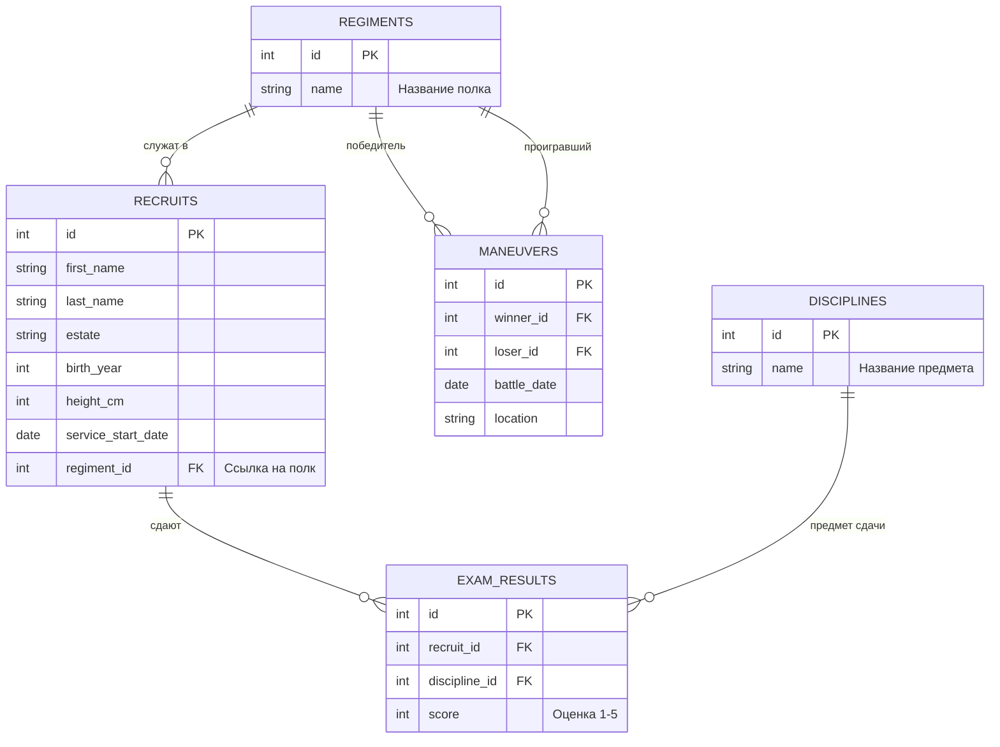
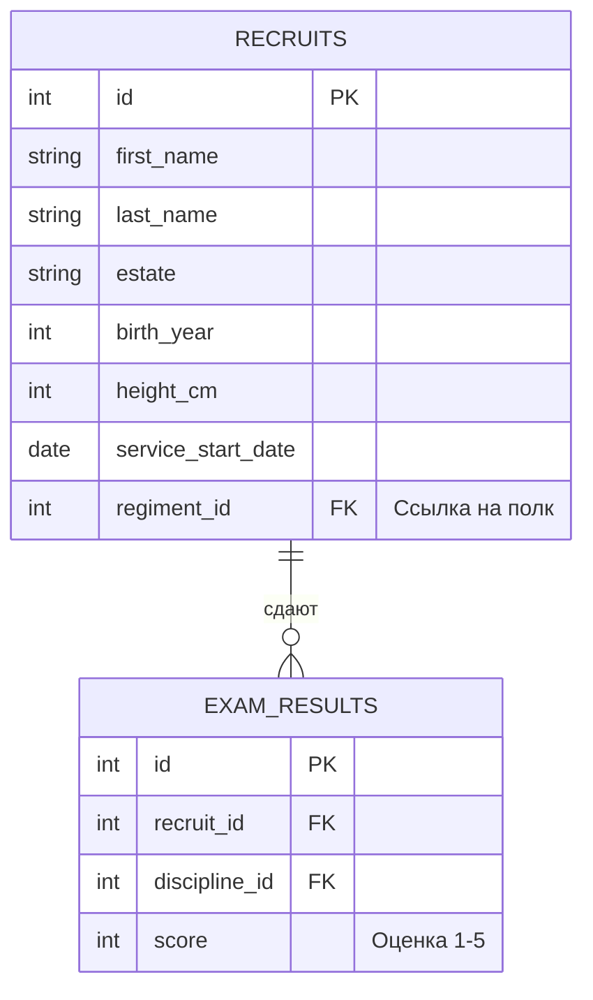
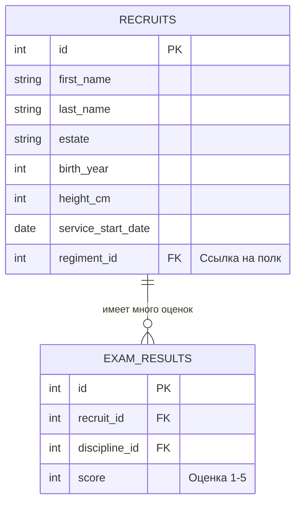
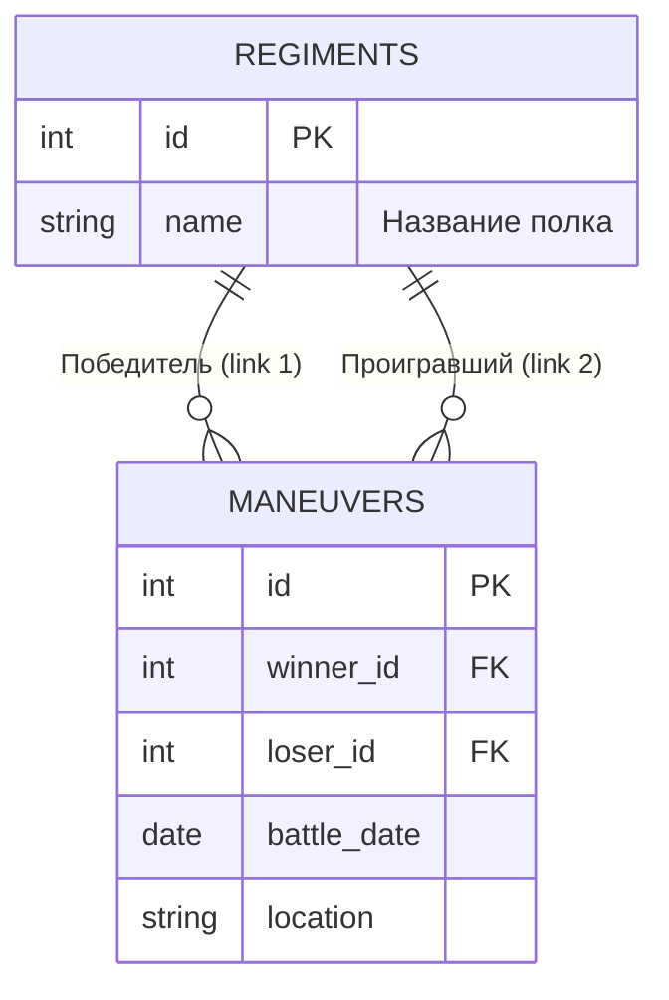
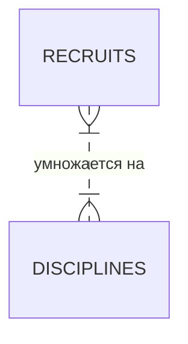

<script setup>
import Conversation from "../../../../components/Conversation.vue";
import alexey from "../../../assets/databases/heroes/clerk_alexey.png";
import ivan from "../../../assets/databases/heroes/clerk_fedor.png";
import petr from "../../../assets/databases/heroes/petr_young.png";
import { defineAsyncComponent } from "vue";

const Repl = defineAsyncComponent(() => import("../../../../components/Repl.vue"))
</script>

# Основы многотабличных запросов

## Экзамен перед боем

Списки составлены, люди посчитаны. Казалось бы, живи и радуйся. Но Петру не сидится на месте. Кожуховский поход — это не просто прогулка с ружьями, это проверка боеготовности.

Царь решил устроить **аттестацию**. Каждый солдат должен сдать нормативы: стрельба из мушкета, фехтование на бердышах и (внезапно) инженерное дело. Оценки записываются в отдельную ведомость.

В штабной избе снова паника. Федор держит в руках два разных документа: в одном — список рекрутов, в другом — какие-то цифры и номера.

<Conversation :phrases="[
    {
        name: 'Петр',
        position: 'left',
        text: 'Федька! Я вижу в ведомости оценки: 5, 2, 4... Но кто эти люди? Тут только номера! «Солдат №1 получил кол по стрельбе». Кто такой №1? Бухвостов? Или Меншиков? Соедини мне эти таблицы, хочу знать фамилии двоечников!',
        photo: petr
    },
    {
        name: 'Федор',
        position: 'right',
        text: 'Государь, так это ж надо пальцем водить: берем номер отсюда, ищем имя там... Я к утру ослепну!',
        photo: ivan
    },
    {
        name: 'Алексей',
        position: 'right',
        text: 'Отставить пальцем. Это называется «Связывание таблиц». У нас есть Ключ (ID). Вот им и будем отпирать двери между данными. И да, Федор, наш лекарь опять отличился — пролил эликсир бодрости на ведомость, так что часть оценок смыло. Будем восстанавливать по памяти.',
        photo: alexey
    }
]"/>

Для работы нам нужно расширить нашу базу данных. Мы добавим полки, дисциплины и журнал оценок.



::: details Обновление структуры БД

Мы добавим рекрутам привязку к полку (`regiment_id`), создадим справочник дисциплин и таблицу с оценками.

```sql
-- === 0. СОЗДАЕМ И ЗАПОЛНЯЕМ РЕКРУТОВ ===
CREATE TABLE recruits (
    id SERIAL PRIMARY KEY,
    first_name VARCHAR(50),
    last_name VARCHAR(50),
    estate VARCHAR(50), -- Сословие: Дворянин, Мещанин, Крестьянин, Иноземец
    birth_year INTEGER,
    height_cm INTEGER,
    service_start_date DATE
);
INSERT INTO recruits (first_name, last_name, estate, birth_year, height_cm, service_start_date) VALUES
-- Реальные исторические личности
('Сергей', 'Бухвостов', 'Дворянин', 1659, 198, '1683-01-01'), -- Первый солдат, высокий!
('Александр', 'Меншиков', 'Мещанин', 1673, 185, '1686-02-12'), -- Алексашка, молодой
('Франц', 'Лефорт', 'Иноземец', 1656, 178, '1680-05-10'), -- Наставник
('Патрик', 'Гордон', 'Иноземец', 1635, 175, '1680-01-15'), -- Самый старший
('Федор', 'Апраксин', 'Дворянин', 1661, 180, '1683-04-20'),
('Михаил', 'Голицын', 'Дворянин', 1675, 176, '1687-06-01'), -- Совсем юный
('Яков', 'Брюс', 'Иноземец', 1669, 182, '1686-08-14'), -- Брюс
('Аникита', 'Репнин', 'Дворянин', 1668, 184, '1685-03-30'),
('Автоном', 'Головин', 'Дворянин', 1667, 179, '1684-11-20'),
('Иван', 'Бутурлин', 'Дворянин', 1661, 177, '1683-09-12'),
-- Массовка (Дворяне)
('Петр', 'Волков', 'Дворянин', 1668, 185, '1683-06-12'),
('Дмитрий', 'Морозов', 'Дворянин', 1671, 190, '1684-03-01'),
('Николай', 'Новиков', 'Дворянин', 1673, 182, '1685-02-10'),
('Сергей', 'Соловьев', 'Дворянин', 1667, 188, '1683-09-30'),
('Яков', 'Семенов', 'Дворянин', 1669, 184, '1684-05-25'),
('Гаврила', 'Романов', 'Дворянин', 1675, 192, '1685-04-12'),
('Ефим', 'Никитин', 'Дворянин', 1668, 186, '1683-12-01'),
-- Массовка (Крестьяне - их много, они пониже, но есть богатыри)
('Алексей', 'Смирнов', 'Крестьянин', 1665, 175, '1683-05-10'),
('Федор', 'Козлов', 'Крестьянин', 1662, 168, '1683-05-20'),
('Михаил', 'Соколов', 'Крестьянин', 1669, 178, '1683-07-07'),
('Андрей', 'Зайцев', 'Крестьянин', 1660, 165, '1683-04-12'),
('Григорий', 'Титов', 'Крестьянин', 1664, 176, '1683-06-18'),
('Степан', 'Кузнецов', 'Крестьянин', 1661, 169, '1683-05-05'),
('Макар', 'Егоров', 'Крестьянин', 1666, 173, '1683-08-01'),
('Лука', 'Антонов', 'Крестьянин', 1671, 177, '1685-01-20'),
('Илья', 'Муромец', 'Крестьянин', 1660, 195, '1683-02-02'), -- Пасхалка, очень высокий
('Савелий', 'Громов', 'Крестьянин', 1665, 188, '1684-07-15'),
('Прохор', 'Дубов', 'Крестьянин', 1670, 180, '1686-03-03'),
-- Массовка (Мещане)
('Иван', 'Попов', 'Мещанин', 1670, 172, '1684-01-15'),
('Василий', 'Лебедев', 'Мещанин', 1665, 170, '1683-08-22'),
('Павел', 'Борисов', 'Мещанин', 1672, 174, '1684-11-05'),
('Александр', 'Виноградов', 'Мещанин', 1670, 171, '1684-02-14'),
('Тихон', 'Медведев', 'Мещанин', 1663, 167, '1683-10-10'),
('Кузьма', 'Минин', 'Мещанин', 1662, 176, '1683-09-09'), -- Тезка знаменитого
('Ермолай', 'Рыбаков', 'Мещанин', 1668, 169, '1685-06-20'),
-- Еще Иноземцы (для статистики)
('Иоганн', 'Вейс', 'Иноземец', 1660, 176, '1684-01-01'),
('Петер', 'Шмидт', 'Иноземец', 1665, 181, '1685-12-12');

-- === 1. СОЗДАЕМ И ЗАПОЛНЯЕМ ПОЛКИ ===
CREATE TABLE regiments (
id SERIAL PRIMARY KEY,
name VARCHAR(50) -- Название полка (Преображенский, Семеновский)
);

INSERT INTO regiments (name) VALUES
('Преображенский полк'),
('Семеновский полк'),
('Лефортовский полк'),
('Бутырский полк');


-- === 2. РАСПРЕДЕЛЯЕМ ЛЮДЕЙ (UPDATE) ===

-- Привязываем рекрутов к полкам (Добавляем внешний ключ)
ALTER TABLE recruits ADD COLUMN regiment_id INTEGER;

-- А. Исторические личности (Точечное распределение)
UPDATE recruits SET regiment_id = 1 WHERE last_name IN ('Бухвостов', 'Меншиков', 'Брюс', 'Репнин', 'Головин', 'Бутурлин'); -- Преображенцы
UPDATE recruits SET regiment_id = 2 WHERE last_name IN ('Апраксин', 'Голицын'); -- Семеновцы
UPDATE recruits SET regiment_id = 3 WHERE last_name = 'Лефорт'; -- Лефортовский
UPDATE recruits SET regiment_id = 4 WHERE last_name = 'Гордон'; -- Бутырский

-- Б. Массовка - Дворяне (Все офицеры должны быть при деле)
UPDATE recruits
SET regiment_id = floor(random() * 4 + 1)::int
WHERE estate = 'Дворянин' AND id > 10;


-- В. Массовка - Крестьяне и Мещане (Солдаты)
UPDATE recruits
SET regiment_id = floor(random() * 2 + 1)::int -- Только в Преображенский или Семеновский (пехота)
WHERE estate IN ('Крестьянин', 'Мещанин')
AND id > 10
AND random() > 0.3;

-- ВАЖНО: Иноземец Петер Шмидт - зачислим его к Лефорту
UPDATE recruits SET regiment_id = 3 WHERE last_name = 'Шмидт';

-- 3. Добавляем ДИСЦИПЛИНЫ
CREATE TABLE disciplines (
id SERIAL PRIMARY KEY,
name VARCHAR(50)
);

INSERT INTO disciplines (name) VALUES
('Мушкетная стрельба'),
('Фехтование'),
('Инженерное дело'),
('Метание гранат'); -- Эту дисциплину еще никто не сдавал

-- === 3. ЗАПОЛНЯЕМ ОЦЕНКИ (INSERT) ===
CREATE TABLE exam_results (
id SERIAL PRIMARY KEY,
recruit_id INTEGER, -- Ссылка на recruits
discipline_id INTEGER, -- Ссылка на disciplines
score INTEGER -- Оценка (от 1 до 5)
);

-- А. Исторические личности (Сдали все)
INSERT INTO exam_results (recruit_id, discipline_id, score) VALUES
-- Сергей Бухвостов (Преображенец, 1-й солдат) - Отличник
(1, 1, 5), -- Стрельба
(1, 2, 5), -- Фехтование
(1, 3, 4), -- Инженерное

-- Александр Меншиков (Преображенец) - Хитрый, но не усидчивый
(2, 1, 3), -- Стрельба (руки дрожали)
(2, 2, 5), -- Фехтование (дерзкий)
(2, 3, 5), -- Инженерное (смекалка)

-- Франц Лефорт (Командир)
(3, 1, 5),
(3, 2, 5),
(3, 3, 5),

-- Патрик Гордон (Старый вояка)
(4, 1, 5), -- Стрельба (опыт)
(4, 3, 5), -- Инженерное (фортификация - его конек)

-- Яков Брюс (Ученый)
(7, 1, 2), -- Стрельба (слеповат)
(7, 3, 5); -- Инженерное (Гений!)

-- Б. Дворяне (Массовка)
INSERT INTO exam_results (recruit_id, discipline_id, score)
SELECT id, 1, floor(random() * 3 + 3)::int -- Стрельба (оценки 3, 4, 5)
FROM recruits
WHERE estate = 'Дворянин' AND id > 10 AND random() > 0.5;

INSERT INTO exam_results (recruit_id, discipline_id, score)
SELECT id, 2, floor(random() * 4 + 2)::int -- Фехтование
FROM recruits
WHERE estate = 'Дворянин' AND id > 10 AND random() > 0.5;

-- В. Крестьяне (Массовка) - Сдали немногие (только стрельбу)
INSERT INTO exam_results (recruit_id, discipline_id, score)
SELECT id, 1, floor(random() * 5 + 1)::int -- Стрельба (оценки 1-5, как повезет)
FROM recruits
WHERE estate = 'Крестьянин' AND regiment_id IS NOT NULL AND random() > 0.7;

-- Г. Специально добавим "Двоечника" для примера
INSERT INTO exam_results (recruit_id, discipline_id, score)
VALUES ((SELECT id FROM recruits WHERE estate='Крестьянин' LIMIT 1), 3, 1); -- Инженерное дело - 1

-- === 4. УЧЕБНЫЕ МАНЕВРЫ (Новая таблица!) ===
CREATE TABLE maneuvers (
    id SERIAL PRIMARY KEY,
    winner_id INTEGER, -- Кто победил (ссылка на regiments)
    loser_id INTEGER,  -- Кто проиграл (ссылка на regiments)
    battle_date DATE,
    location VARCHAR(50)
);

INSERT INTO maneuvers (winner_id, loser_id, battle_date, location) VALUES
(1, 2, '1694-10-01', 'Кожухово'), -- Преображенский побил Семеновский
(3, 4, '1694-10-02', 'Яуза'),     -- Лефортовский побил Бутырский
(1, 3, '1694-10-03', 'Кожухово'), -- Преображенский побил Лефортовский
(2, 4, '1694-10-04', 'Пресбург'), -- Семеновский побил Бутырский
(4, 1, '1694-10-05', 'Яуза'),     -- Бутырский (внезапно) побил Преображенский (реванш)
(3, 2, '1694-10-06', 'Пресбург'),
(1, 4, '1694-10-07', 'Кожухово'),
(2, 3, '1694-10-08', 'Яуза'),
(4, 3, '1694-10-09', 'Пресбург'),
(1, 2, '1694-10-10', 'Финал'),    -- Гранд-финал
(3, 1, '1694-10-11', 'Утешительный'),
(4, 2, '1694-10-12', 'Пьяная драка');
```

:::

<ClientOnly>
<Repl :initial-queries="[
`CREATE TABLE recruits (
    id SERIAL PRIMARY KEY,
    first_name VARCHAR(50),
    last_name VARCHAR(50),
    estate VARCHAR(50),
    birth_year INTEGER,
    height_cm INTEGER,
    service_start_date DATE
);`,
`INSERT INTO recruits (first_name, last_name, estate, birth_year, height_cm, service_start_date) VALUES
('Сергей', 'Бухвостов', 'Дворянин', 1659, 198, '1683-01-01'), 
('Александр', 'Меншиков', 'Мещанин', 1673, 185, '1686-02-12'),
('Франц', 'Лефорт', 'Иноземец', 1656, 178, '1680-05-10'),
('Патрик', 'Гордон', 'Иноземец', 1635, 175, '1680-01-15'),
('Федор', 'Апраксин', 'Дворянин', 1661, 180, '1683-04-20'),
('Михаил', 'Голицын', 'Дворянин', 1675, 176, '1687-06-01'),
('Яков', 'Брюс', 'Иноземец', 1669, 182, '1686-08-14'),
('Аникита', 'Репнин', 'Дворянин', 1668, 184, '1685-03-30'),
('Автоном', 'Головин', 'Дворянин', 1667, 179, '1684-11-20'),
('Иван', 'Бутурлин', 'Дворянин', 1661, 177, '1683-09-12'),
('Петр', 'Волков', 'Дворянин', 1668, 185, '1683-06-12'),
('Дмитрий', 'Морозов', 'Дворянин', 1671, 190, '1684-03-01'),
('Николай', 'Новиков', 'Дворянин', 1673, 182, '1685-02-10'),
('Сергей', 'Соловьев', 'Дворянин', 1667, 188, '1683-09-30'),
('Яков', 'Семенов', 'Дворянин', 1669, 184, '1684-05-25'),
('Гаврила', 'Романов', 'Дворянин', 1675, 192, '1685-04-12'),
('Ефим', 'Никитин', 'Дворянин', 1668, 186, '1683-12-01'),
('Алексей', 'Смирнов', 'Крестьянин', 1665, 175, '1683-05-10'),
('Федор', 'Козлов', 'Крестьянин', 1662, 168, '1683-05-20'),
('Михаил', 'Соколов', 'Крестьянин', 1669, 178, '1683-07-07'),
('Андрей', 'Зайцев', 'Крестьянин', 1660, 165, '1683-04-12'),
('Григорий', 'Титов', 'Крестьянин', 1664, 176, '1683-06-18'),
('Степан', 'Кузнецов', 'Крестьянин', 1661, 169, '1683-05-05'),
('Макар', 'Егоров', 'Крестьянин', 1666, 173, '1683-08-01'),
('Лука', 'Антонов', 'Крестьянин', 1671, 177, '1685-01-20'),
('Илья', 'Муромец', 'Крестьянин', 1660, 195, '1683-02-02'),
('Савелий', 'Громов', 'Крестьянин', 1665, 188, '1684-07-15'),
('Прохор', 'Дубов', 'Крестьянин', 1670, 180, '1686-03-03'),
('Иван', 'Попов', 'Мещанин', 1670, 172, '1684-01-15'),
('Василий', 'Лебедев', 'Мещанин', 1665, 170, '1683-08-22'),
('Павел', 'Борисов', 'Мещанин', 1672, 174, '1684-11-05'),
('Александр', 'Виноградов', 'Мещанин', 1670, 171, '1684-02-14'),
('Тихон', 'Медведев', 'Мещанин', 1663, 167, '1683-10-10'),
('Кузьма', 'Минин', 'Мещанин', 1662, 176, '1683-09-09'), 
('Ермолай', 'Рыбаков', 'Мещанин', 1668, 169, '1685-06-20'),
('Иоганн', 'Вейс', 'Иноземец', 1660, 176, '1684-01-01'),
('Петер', 'Шмидт', 'Иноземец', 1665, 181, '1685-12-12');`,
`CREATE TABLE regiments (
id SERIAL PRIMARY KEY,
name VARCHAR(50)
);`,
`INSERT INTO regiments (name) VALUES
('Преображенский полк'),
('Семеновский полк'),
('Лефортовский полк'),
('Бутырский полк');`,
`ALTER TABLE recruits ADD COLUMN regiment_id INTEGER;`,
`UPDATE recruits SET regiment_id = 1 WHERE last_name IN ('Бухвостов', 'Меншиков', 'Брюс', 'Репнин', 'Головин', 'Бутурлин');`,
`UPDATE recruits SET regiment_id = 2 WHERE last_name IN ('Апраксин', 'Голицын');`,
`UPDATE recruits SET regiment_id = 3 WHERE last_name = 'Лефорт'; `,
`UPDATE recruits SET regiment_id = 4 WHERE last_name = 'Гордон';`,
`UPDATE recruits
SET regiment_id = floor(random() * 4 + 1)::int
WHERE estate = 'Дворянин' AND id > 10;`,
`UPDATE recruits
SET regiment_id = floor(random() * 2 + 1)::int 
WHERE estate IN ('Крестьянин', 'Мещанин')
AND id > 10
AND random() > 0.3;`,
`UPDATE recruits SET regiment_id = 3 WHERE last_name = 'Шмидт';`,
`CREATE TABLE disciplines (
id SERIAL PRIMARY KEY,
name VARCHAR(50)
);`,
`INSERT INTO disciplines (name) VALUES
('Мушкетная стрельба'),
('Фехтование'),
('Инженерное дело'),
('Метание гранат'); `,
`CREATE TABLE exam_results (
id SERIAL PRIMARY KEY,
recruit_id INTEGER, 
discipline_id INTEGER, 
score INTEGER 
);`,
`INSERT INTO exam_results (recruit_id, discipline_id, score) VALUES
(1, 1, 5), -- Стрельба
(1, 2, 5), -- Фехтование
(1, 3, 4), -- Инженерное
(2, 1, 3), -- Стрельба (руки дрожали)
(2, 2, 5), -- Фехтование (дерзкий)
(2, 3, 5), -- Инженерное (смекалка)
(3, 1, 5),
(3, 2, 5),
(3, 3, 5),
(4, 1, 5), 
(4, 3, 5),
(7, 1, 2),
(7, 3, 5);`,
`INSERT INTO exam_results (recruit_id, discipline_id, score)
SELECT id, 1, floor(random() * 3 + 3)::int
FROM recruits
WHERE estate = 'Дворянин' AND id > 10 AND random() > 0.5;`,
`INSERT INTO exam_results (recruit_id, discipline_id, score)
SELECT id, 2, floor(random() * 4 + 2)::int 
FROM recruits
WHERE estate = 'Дворянин' AND id > 10 AND random() > 0.5;`,
`INSERT INTO exam_results (recruit_id, discipline_id, score)
SELECT id, 1, floor(random() * 5 + 1)::int 
FROM recruits
WHERE estate = 'Крестьянин' AND regiment_id IS NOT NULL AND random() > 0.7;`,
`INSERT INTO exam_results (recruit_id, discipline_id, score)
VALUES ((SELECT id FROM recruits WHERE estate='Крестьянин' LIMIT 1), 3, 1); `,
`CREATE TABLE maneuvers (
    id SERIAL PRIMARY KEY,
    winner_id INTEGER,
    loser_id INTEGER, 
    battle_date DATE,
    location VARCHAR(50)
);`,
`INSERT INTO maneuvers (winner_id, loser_id, battle_date, location) VALUES
(1, 2, '1694-10-01', 'Кожухово'), 
(3, 4, '1694-10-02', 'Яуза'),    
(1, 3, '1694-10-03', 'Кожухово'), 
(2, 4, '1694-10-04', 'Пресбург'), 
(4, 1, '1694-10-05', 'Яуза'),    
(3, 2, '1694-10-06', 'Пресбург'),
(1, 4, '1694-10-07', 'Кожухово'),
(2, 3, '1694-10-08', 'Яуза'),
(4, 3, '1694-10-09', 'Пресбург'),
(1, 2, '1694-10-10', 'Финал'),   
(3, 1, '1694-10-11', 'Утешительный'),
(4, 2, '1694-10-12', 'Пьяная драка');`
]"/>
</ClientOnly>

## Старый и новый синтаксис (WHERE vs JOIN)

Федор, копаясь в старых сундуках приказной избы, нашел пожелтевшую грамоту своего деда-подьячего. Там тоже велись подсчеты, но способ записи показался Федору странным.

<Conversation :phrases="[
    {
        name: 'Федор',
        position: 'left',
        text: 'Алексей, гляди! Дед писал запрос иначе: просто перечислял таблицы через запятую, а потом в WHERE ставил условие, что id равны. И ведь работало!',
        photo: ivan
    },
    {
        name: 'Алексей',
        position: 'right',
        text: 'Работало, Федя, не спорю. Это «дедовский метод». Но он опасен, как заряженный мушкет в руках пьяного. Забудешь условие в WHERE — и база данных перемножит всех солдат на все оценки. Получится каша. Мы, люди просвещенные, используем слово JOIN.',
        photo: alexey
    }
]"/>

Чтобы понять, о чем спорят дьяки, давайте взглянем на схему. У нас есть две таблицы. В одной (`recruits`) живут люди и их фамилии, в другой (`exam_results`) — сухие цифры оценок. Нам нужно проложить мостик между ними, используя общий ключ: `id` рекрута должен совпасть с `recruit_id` в журнале.



### Дедовский метод (Неявное соединение)

Раньше, на заре становления баз данных (и в старых версиях стандарта SQL-89), писали так: в блоке `FROM` просто перечисляли все нужные таблицы через запятую. База данных сначала смешивала всё в одну кучу, а потом фильтровала результат через `WHERE`.

```sql
SELECT r.last_name, e.score
FROM recruits r, exam_results e
WHERE r.id = e.recruit_id;
```

Это работает, но считается дурным тоном. Стоит вам случайно удалить строчку `WHERE`, и вы получите **Декартово произведение**: если у вас 100 солдат и 100 оценок, база вернет 10 000 строк, где каждому солдату приписаны все чужие оценки сразу.

### Современный метод (Явный JOIN)

В современном стандарте (SQL-92 и новее) мы явно указываем, как именно мы хотим соединять данные. Для этого используется оператор **`JOIN`** (или `INNER JOIN`).

Это самый частый, самый надежный и "строгий" тип соединения. Он работает как фейс-контроль: в итоговую таблицу попадают только те записи, для которых **нашлась пара**.

- Если у рекрута нет оценок — его не покажут.
- Если есть бесхозная оценка (без рекрута) — её тоже не покажут.

```sql
SELECT r.last_name, e.score
FROM recruits r
JOIN exam_results e ON r.id = e.recruit_id;
```

Теперь запрос читается как человеческая речь: _"Выбери фамилию и оценку из рекрутов, присоединив к ним оценки, где идентификаторы совпадают"_.

::: tip Алиасы (Псевдонимы)
Обратите внимание на буквы `r` и `e` после названий таблиц. Это **псевдонимы**.
Чтобы не писать каждый раз громоздкое `recruits.last_name`, мы даем таблице короткое имя `r` прямо в запросе: `FROM recruits r`. Это экономит чернила, место на экране и нервы программиста.
:::

## Агрегация в джойнах

Петр просмотрел список оценок и нахмурился. Листы с цифрами напоминали ему шифровку.

<Conversation :phrases="[
    {
        name: 'Петр',
        position: 'left',
        text: 'Слишком много цифр! Меншиков — 3, Меншиков — 5... Что мне с этого? Скажи мне среднее! Хочу знать, кто у меня отличник, а кого розгами пороть. И дай мне список лучших полков!',
        photo: petr
    },
    {
        name: 'Федор',
        position: 'right',
        text: 'Мин херц, так я сейчас... в уме прикину...',
        photo: ivan
    },
    {
        name: 'Алексей',
        position: 'right',
        text: 'В уме ты до вечера считать будешь. Здесь нужно объединить мощь JOIN (чтобы знать имена) и силу GROUP BY (чтобы схлопнуть оценки в одно число).',
        photo: alexey
    }
]"/>

Чтобы построить рейтинг, нам нужно:

1.  **Соединить** таблицу рекрутов с оценками (`JOIN`).
2.  **Сгруппировать** строки по каждому рекруту (`GROUP BY`).
3.  **Посчитать** средний балл (`AVG`).



### Личный рейтинг

Узнаем, кто учится лучше всех. Отсортируем список от отличников к двоечникам.

```sql
SELECT r.last_name,
       COUNT(e.score) as exams_taken,       -- Сколько экзаменов сдал
       AVG(e.score)::numeric(3,2) as avg_score -- Средний балл (округлим)
FROM recruits r
JOIN exam_results e ON r.id = e.recruit_id
GROUP BY r.id, r.last_name
ORDER BY avg_score DESC;
```

### Поиск двоечников

Петр требует список "штрафников" — тех, чей средний балл ниже тройки.
Здесь нам не поможет `WHERE`, потому что `WHERE` фильтрует строки **до** группировки (сырые оценки). А нам нужно фильтровать **результат** (средний балл). Для этого есть `HAVING`.

```sql
SELECT r.last_name,
       AVG(e.score)::numeric(3,2) as avg_score
FROM recruits r
JOIN exam_results e ON r.id = e.recruit_id
GROUP BY r.id, r.last_name
HAVING AVG(e.score) < 3 -- Оставляем только двоечников
ORDER BY avg_score ASC;
```

### Битва Полков

А теперь задача со звездочкой. Петр хочет наградить **лучший полк**.
Для этого нужно:

1.  Взять Полки (`regiments`).
2.  Присоединить к ним Рекрутов (`recruits`).
3.  Присоединить Оценки (`exam_results`).
4.  Сгруппировать по Названию полка.
5.  Посчитать среднее по всему полку.

<Conversation :phrases="[
    {
        name: 'Петр',
        position: 'left',
        text: 'Какой полк самый умный? Преображенский или Семеновский? Выдай мне только ТОП-1, победителю — бочку вина!',
        photo: petr
    }
]"/>

```sql
SELECT reg.name AS regiment_name,
       COUNT(r.id) AS soldiers_count,       -- Сколько солдат сдавало
       AVG(e.score)::numeric(3,2) AS regiment_rating
FROM regiments reg
JOIN recruits r ON reg.id = r.regiment_id
JOIN exam_results e ON r.id = e.recruit_id
GROUP BY reg.id, reg.name
ORDER BY regiment_rating DESC
LIMIT 1; -- Берем только первую строку (Чемпиона)
```

### Вторая лига

Победитель получил вино. Но Петр хочет поощрить и тех, кто занял второе и третье место.
Для этого мы пропускаем лидера (`OFFSET 1`) и берем следующие 2 полка (`LIMIT 2`).

```sql
SELECT reg.name AS regiment_name,
       AVG(e.score)::numeric(3,2) AS regiment_rating
FROM regiments reg
JOIN recruits r ON reg.id = r.regiment_id
JOIN exam_results e ON r.id = e.recruit_id
GROUP BY reg.id, reg.name
ORDER BY regiment_rating DESC
LIMIT 2 OFFSET 1; -- Пропустить 1 строку, взять следующие 2
```

::: tip Полный порядок действий
Запомни порядок команд в сложном запросе:

1.  `FROM` + `JOIN` (собрали данные)
2.  `WHERE` (отфильтровали лишние строки)
3.  `GROUP BY` (схлопнули в группы)
4.  `HAVING` (отфильтровали группы)
5.  `SELECT` (посчитали функции и выбрали столбцы)
6.  `ORDER BY` (отсортировали)
7.  `LIMIT` / `OFFSET` (обрезали результат)

:::

## Self-Join: Учебные маневры

Кульминация похода. Полки идут друг на друга. Вчера Преображенский штурмовал крепость, которую оборонял Семеновский. Завтра — наоборот.

Петр требует сводку побед. Федор приносит пергамент, где записаны результаты сражений. Но царь снова недоволен.

<Conversation :phrases="[
    {
        name: 'Петр',
        position: 'left',
        text: 'Федор! Ты надо мной издеваешься? Читаю: «1 побил 2», «3 побил 4». Это что, арифметика? Я хочу читать: «Преображенцы побили Семеновцев»! Переведи мне цифры в названия!',
        photo: petr
    },
    {
        name: 'Федор',
        position: 'right',
        text: 'Мин херц, я пытался... Но у нас и Победитель — это Полк, и Проигравший — это Полк. Они же все в одной таблице regiments живут. Как мне к ней два раза сразу обратиться?',
        photo: ivan
    },
    {
        name: 'Алексей',
        position: 'right',
        text: 'А тут, Федя, нужна хитрость. Представь, что ты взял список полков и переписал его на два разных листа. На одном написал «Победители», на другом — «Проигравшие». В базе это делается через псевдонимы.',
        photo: alexey
    }
]"/>

Взглянем на схему. Таблица `maneuvers` ссылается на таблицу `regiments` **дважды**. Это называется **Self-Join** (соединение таблицы самой с собой).



Чтобы расшифровать этот отчет, нам нужно в запросе «притвориться», что у нас есть две таблицы полков.

1.  Первую копию назовем **`w`** (от _Winner_ — Победитель).
2.  Вторую копию назовем **`l`** (от _Loser_ — Проигравший).

```sql
SELECT m.battle_date,
       w.name AS winner_regiment, -- Берем имя из "таблицы победителей"
       l.name AS loser_regiment   -- Берем имя из "таблицы проигравших"
FROM maneuvers m
JOIN regiments w ON m.winner_id = w.id -- Соединяем победителя
JOIN regiments l ON m.loser_id = l.id; -- Соединяем проигравшего
```

Теперь база данных понимает:

- Когда мы просим `w.name`, она берет `id` победителя (например, 1) и ищет его название.
- Когда просим `l.name`, она берет `id` проигравшего (например, 2) и ищет его название.

В итоге Петр получает понятный отчет: _"1694-10-01: Преображенский полк (winner) победил Семеновский полк (loser)"_.

## Внешние соединения

В отчетах что-то не сходится. Петр пересчитывает людей по головам и сверяет с ведомостью оценок.

<Conversation :phrases="[
    {
        name: 'Петр',
        position: 'left',
        text: 'Федор! В полку сотня человек, а оценок — кот наплакал. Где остальные? Кто прогулял стрельбы? И по каким предметам мы вообще не проводили экзамен? Твой JOIN скрыл от меня правду!',
        photo: petr
    },
    {
        name: 'Алексей',
        position: 'right',
        text: 'Все верно, государь. Обычный (INNER) JOIN работает как строгий вахтер: он пускает в отчет только тех, у кого есть пара «Солдат + Оценка». Если пары нет — строка исчезает. Чтобы найти «сирот» и прогульщиков, нам нужны Внешние соединения (OUTER JOIN).',
        photo: alexey
    }
]"/>

### Поиск прогульщиков (`LEFT JOIN`)

**Задача:** Вывести список **ВСЕХ** рекрутов. Если у рекрута есть оценка — показать её. Если нет — оставить пустоту (`NULL`), но самого рекрута из списка не выкидывать.

Для этого мы используем `LEFT JOIN`. Он говорит базе: «Возьми **всё** из Левой таблицы (`recruits`), а из Правой (`exam_results`) подтяни только то, что найдется. Если не найдется — пиши NULL».

```sql
SELECT r.last_name, e.score
FROM recruits r
LEFT JOIN exam_results e ON r.id = e.recruit_id;
```

Теперь мы видим всех. Но Петру нужны только прогульщики.
Чтобы найти их, мы добавим фильтр: «Оставь только тех, у кого Оценка — это Пустота».

```sql
SELECT r.last_name, 'Прогулял!' as status
FROM recruits r
LEFT JOIN exam_results e ON r.id = e.recruit_id
WHERE e.score IS NULL; -- Самый важный фильтр!
```

### Невостребованные дисциплины (`RIGHT JOIN`)

Теперь задача наоборот. Петр хочет проверить учебный план. Есть ли такие предметы, которые заявлены в расписании (`disciplines`), но по которым никто не получил ни одной оценки?

Здесь главной становится Правая таблица (`disciplines`).

```sql
SELECT d.name, e.score
FROM exam_results e
RIGHT JOIN disciplines d ON e.discipline_id = d.id
WHERE e.id IS NULL; -- Ищем дисциплины без привязанных оценок
```

**Результат:** «Метание гранат».
Оценок нет. Видимо, учебные гранаты не завезли. Или наш лекарь, перепутав их с флягами, расстворил.

### Декартово произведение (`CROSS JOIN`)

Петр хочет составить идеальное расписание на завтра. Каждый рекрут должен пройти Каждую дисциплину.

Это называется **Декартово произведение**. Мы берем список рекрутов и умножаем его на список дисциплин.



```sql
SELECT r.last_name, d.name
FROM recruits r
CROSS JOIN disciplines d;
```

::: warning Осторожно!
`CROSS JOIN` — это мощное заклинание.
Если у вас 100 рекрутов и 4 дисциплины, вы получите 400 строк.
А если 1000 рекрутов и 100 дисциплин — таблица распухнет до 100 000 записей! Используйте с умом, иначе писарь Федор сойдет с ума переписывать это на бумагу.
:::

## Выводы по второму вопросу

Петр отложил перо и потер переносицу. Перед ним лежала не просто стопка разрозненных листов, а **Система**. Он видел, как имя солдата тянет за собой название полка, как полк связан с победами в маневрах, а оценка по стрельбе обретает фамилию стрелка.

Хаос превратился в структуру.


<Conversation :phrases="[
    {
        name: 'Петр',
        position: 'left',
        text: 'Добро, Федор. Теперь я вижу армию насквозь. Знаю, кто в каком полку, кто мажет, а кто прогуливает. Но в штабе сидеть — не мешки ворочать. Сейчас начнется «сражение», и приказы будут сыпаться градом!',
        photo: petr
    },
    {
        name: 'Федор',
        position: 'right',
        text: 'Чернила свежие, перья очинены. Готов писать запросы на лету, мин херц!',
        photo: ivan
    },
    {
        name: 'Алексей',
        position: 'right',
        text: 'Не спеши хвастать. Государь подготовил тебе список боевых задач. Это будет твой экзамен. Справишься — поедешь с нами в Воронеж флот строить. Нет — пойдешь в обоз хвосты лошадям крутить.',
        photo: alexey
    }
]"/>

**Чему мы научились в этом разделе:**

1.  **Строить мосты (`INNER JOIN`)**: Соединять людей с их полками и оценками, отсекая лишнее.
2.  **Искать пропавших (`LEFT / RIGHT JOIN`)**: Находить солдат без оценок и дисциплины, которые никто не сдавал.
3.  **Воевать с самими собой (`Self-Join`)**: Использовать одну таблицу дважды, чтобы понять, кто кого победил.
4.  **Мыслить множествами (`UNION / EXCEPT`)**: Склеивать разные армии в одну и вычислять "двойных агентов".

### Путь на Воронеж

Кожуховский поход 1694 года стал триумфом "Нового строя". Петр доказал (в первую очередь себе), что его потешные полки — это грозная сила, способная действовать слаженно.

Но на горизонте сгущаются тучи. Впереди — **Азовские походы**. И там Петр столкнется с проблемой, которую штыками не решить: у России нет флота.
Придется ехать в Воронеж, рубить лес, строить галеры и струги. А там, на верфях, нужна уже не просто логика связей, а суровая инженерная математика.

Но это будет в следующей главе. А пока мы остаемся в лагере под Кожухово. Трубы трубят сбор на **Учебный вопрос №3: Разработку многотабличных запросов.** Петр ждет решений, и на этот раз подсказок от Алексея не будет!
