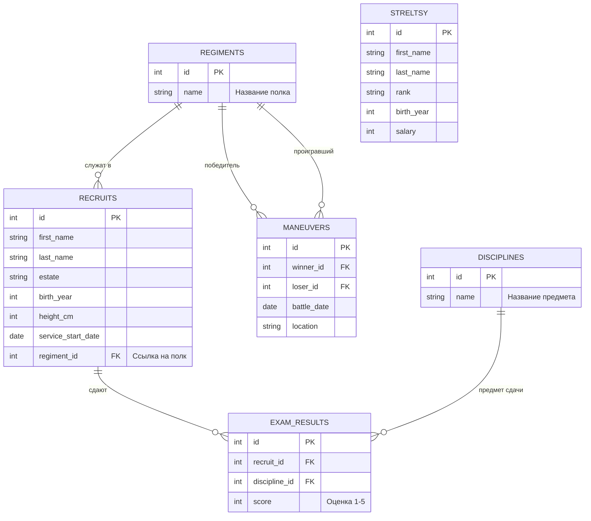

<script setup>
import Conversation from "../../../../components/Conversation.vue";
import alexey from "../../../assets/databases/heroes/clerk_alexey.png";
import ivan from "../../../assets/databases/heroes/clerk_fedor.png";
import petr from "../../../assets/databases/heroes/petr_young.png";
import { defineAsyncComponent } from "vue";

const Repl = defineAsyncComponent(() => import("../../../../components/Repl.vue"))
</script>

# Разработка многотабличных запросов

## Бюрократия на войне

Маневры в разгаре. Пушки палят, барабаны бьют, а Федор сходит с ума. Теперь у него не просто список людей, а целая паутина данных: полки, дисциплины, оценки, маневры...

Петр врывается в палатку, требуя немедленных отчетов. Ему мало знать, кто победил. Ему нужна аналитика: какой полк самый меткий? Кто из дворян прогулял фехтование? И правда ли, что стрельцы получают больше денег, чем наши офицеры?

<Conversation :phrases="[
    {
        name: 'Петр',
        position: 'left',
        text: 'Федор! Почему я должен гадать на кофейной гуще? Я хочу видеть полную картину! Соедини мне людей с их полками, оценками и жалованьем! И чтобы ни одна цифра не пропала!',
        photo: petr
    },
    {
        name: 'Федор',
        position: 'right',
        text: 'Мин херц, я стараюсь... Но таблицы разбегаются как тараканы! Я соединяю рекрутов с оценками, а пропадают те, кто не сдавал... Соединяю с полками — вылезают дубли...',
        photo: ivan
    },
    {
        name: 'Алексей',
        position: 'right',
        text: 'Спокойно. Вдохни пороху и пиши. Используй JOIN для связей, UNION для слияния списков, и не забывай про GROUP BY, когда государь просит «среднее по больнице».',
        photo: alexey
    }
]"/>

Твоя задача — помочь Федору составить сложные запросы, связывающие несколько таблиц.



::: details Структура БД

```sql
-- === 0. СОЗДАЕМ И ЗАПОЛНЯЕМ РЕКРУТОВ И СТРЕЛЬЦОВ ===
CREATE TABLE recruits (
    id SERIAL PRIMARY KEY,
    first_name VARCHAR(50),
    last_name VARCHAR(50),
    estate VARCHAR(50), -- Сословие: Дворянин, Мещанин, Крестьянин, Иноземец
    birth_year INTEGER,
    height_cm INTEGER,
    service_start_date DATE
);
INSERT INTO recruits (first_name, last_name, estate, birth_year, height_cm, service_start_date) VALUES
-- Реальные исторические личности
('Сергей', 'Бухвостов', 'Дворянин', 1659, 198, '1683-01-01'), -- Первый солдат, высокий!
('Александр', 'Меншиков', 'Мещанин', 1673, 185, '1686-02-12'), -- Алексашка, молодой
('Франц', 'Лефорт', 'Иноземец', 1656, 178, '1680-05-10'), -- Наставник
('Патрик', 'Гордон', 'Иноземец', 1635, 175, '1680-01-15'), -- Самый старший
('Федор', 'Апраксин', 'Дворянин', 1661, 180, '1683-04-20'),
('Михаил', 'Голицын', 'Дворянин', 1675, 176, '1687-06-01'), -- Совсем юный
('Яков', 'Брюс', 'Иноземец', 1669, 182, '1686-08-14'), -- Брюс
('Аникита', 'Репнин', 'Дворянин', 1668, 184, '1685-03-30'),
('Автоном', 'Головин', 'Дворянин', 1667, 179, '1684-11-20'),
('Иван', 'Бутурлин', 'Дворянин', 1661, 177, '1683-09-12'),
-- Массовка (Дворяне)
('Петр', 'Волков', 'Дворянин', 1668, 185, '1683-06-12'),
('Дмитрий', 'Морозов', 'Дворянин', 1671, 190, '1684-03-01'),
('Николай', 'Новиков', 'Дворянин', 1673, 182, '1685-02-10'),
('Сергей', 'Соловьев', 'Дворянин', 1667, 188, '1683-09-30'),
('Яков', 'Семенов', 'Дворянин', 1669, 184, '1684-05-25'),
('Гаврила', 'Романов', 'Дворянин', 1675, 192, '1685-04-12'),
('Ефим', 'Никитин', 'Дворянин', 1668, 186, '1683-12-01'),
-- Массовка (Крестьяне - их много, они пониже, но есть богатыри)
('Алексей', 'Смирнов', 'Крестьянин', 1665, 175, '1683-05-10'),
('Федор', 'Козлов', 'Крестьянин', 1662, 168, '1683-05-20'),
('Михаил', 'Соколов', 'Крестьянин', 1669, 178, '1683-07-07'),
('Андрей', 'Зайцев', 'Крестьянин', 1660, 165, '1683-04-12'),
('Григорий', 'Титов', 'Крестьянин', 1664, 176, '1683-06-18'),
('Степан', 'Кузнецов', 'Крестьянин', 1661, 169, '1683-05-05'),
('Макар', 'Егоров', 'Крестьянин', 1666, 173, '1683-08-01'),
('Лука', 'Антонов', 'Крестьянин', 1671, 177, '1685-01-20'),
('Илья', 'Муромец', 'Крестьянин', 1660, 195, '1683-02-02'), -- Пасхалка, очень высокий
('Савелий', 'Громов', 'Крестьянин', 1665, 188, '1684-07-15'),
('Прохор', 'Дубов', 'Крестьянин', 1670, 180, '1686-03-03'),
-- Массовка (Мещане)
('Иван', 'Попов', 'Мещанин', 1670, 172, '1684-01-15'),
('Василий', 'Лебедев', 'Мещанин', 1665, 170, '1683-08-22'),
('Павел', 'Борисов', 'Мещанин', 1672, 174, '1684-11-05'),
('Александр', 'Виноградов', 'Мещанин', 1670, 171, '1684-02-14'),
('Тихон', 'Медведев', 'Мещанин', 1663, 167, '1683-10-10'),
('Кузьма', 'Минин', 'Мещанин', 1662, 176, '1683-09-09'), -- Тезка знаменитого
('Ермолай', 'Рыбаков', 'Мещанин', 1668, 169, '1685-06-20'),
-- Еще Иноземцы (для статистики)
('Иоганн', 'Вейс', 'Иноземец', 1660, 176, '1684-01-01'),
('Петер', 'Шмидт', 'Иноземец', 1665, 181, '1685-12-12');

CREATE TABLE streltsy (
    id SERIAL PRIMARY KEY,
    first_name VARCHAR(50),
    last_name VARCHAR(50),
    rank VARCHAR(50),
    birth_year INTEGER,
    salary INTEGER
);
INSERT INTO streltsy (first_name, last_name, rank, birth_year, salary) VALUES
('Лаврентий', 'Сухарев', 'Полковник', 1655, 150),
('Иван', 'Цыклер', 'Полковник', 1660, 140),
('Кузьма', 'Борода', 'Стрелец', 1670, 10),
('Ерофей', 'Хабаров', 'Стрелец', 1665, 12),
('Агап', 'Тихий', 'Стрелец', 1672, 10),
('Прокоп', 'Громкий', 'Десятник', 1668, 25),
('Сидор', 'Лютый', 'Стрелец', 1660, 10),
('Фома', 'Кистенев', 'Стрелец', 1669, 11),
('Епифан', 'Коловрат', 'Стрелец', 1667, 10),
('Никита', 'Пустосвят', 'Стрелец', 1659, 10),
('Савва', 'Морозов', 'Стрелец', 1671, 15),
('Тихон', 'Хренников', 'Стрелец', 1668, 10),
('Елизар', 'Молот', 'Стрелец', 1666, 12),
('Акакий', 'Башмачкин', 'Писарь', 1675, 8),
('Остап', 'Бендер', 'Десятник', 1673, 50),
('Паниковский', 'Михаил', 'Стрелец', 1660, 5),
('Шура', 'Балаганов', 'Стрелец', 1674, 10),
('Алексей', 'Смирнов', 'Стрелец', 1665, 10),
('Федор', 'Козлов', 'Стрелец', 1662, 10),
('Иван', 'Иванов', 'Сотник', 1670, 45),
('Михаил', 'Соколов', 'Десятник', 1669, 30),
('Андрей', 'Зайцев', 'Стрелец', 1660, 10),
('Григорий', 'Титов', 'Стрелец', 1664, 10),
('Василий', 'Теркин', 'Стрелец', 1675, 12),
('Степан', 'Калашников', 'Стрелец', 1670, 15),
('Кирилл', 'Туров', 'Стрелец', 1668, 10),
('Мефодий', 'Буквоед', 'Писарь', 1660, 9),
('Добрыня', 'Никитич', 'Сотник', 1655, 100),
('Алеша', 'Попович', 'Десятник', 1678, 30),
('Илья', 'Муромец', 'Стрелец', 1650, 20),
('Соловей', 'Разбойник', 'Стрелец', 1665, 10),
('Кощей', 'Бессмертный', 'Полковник', 1600, 200),
('Яга', 'Костяная', 'Стряпуха', 1620, 5);

-- === 1. СОЗДАЕМ И ЗАПОЛНЯЕМ ПОЛКИ ===
CREATE TABLE regiments (
id SERIAL PRIMARY KEY,
name VARCHAR(50) -- Название полка (Преображенский, Семеновский)
);

INSERT INTO regiments (name) VALUES
('Преображенский полк'),
('Семеновский полк'),
('Лефортовский полк'),
('Бутырский полк');


-- === 2. РАСПРЕДЕЛЯЕМ ЛЮДЕЙ (UPDATE) ===

-- Привязываем рекрутов к полкам (Добавляем внешний ключ)
ALTER TABLE recruits ADD COLUMN regiment_id INTEGER;

-- А. Исторические личности (Точечное распределение)
UPDATE recruits SET regiment_id = 1 WHERE last_name IN ('Бухвостов', 'Меншиков', 'Брюс', 'Репнин', 'Головин', 'Бутурлин'); -- Преображенцы
UPDATE recruits SET regiment_id = 2 WHERE last_name IN ('Апраксин', 'Голицын'); -- Семеновцы
UPDATE recruits SET regiment_id = 3 WHERE last_name = 'Лефорт'; -- Лефортовский
UPDATE recruits SET regiment_id = 4 WHERE last_name = 'Гордон'; -- Бутырский

-- Б. Массовка - Дворяне (Все офицеры должны быть при деле)
UPDATE recruits
SET regiment_id = floor(random() * 4 + 1)::int
WHERE estate = 'Дворянин' AND id > 10;


-- В. Массовка - Крестьяне и Мещане (Солдаты)
UPDATE recruits
SET regiment_id = floor(random() * 2 + 1)::int -- Только в Преображенский или Семеновский (пехота)
WHERE estate IN ('Крестьянин', 'Мещанин')
AND id > 10
AND random() > 0.3;

-- ВАЖНО: Иноземец Петер Шмидт - зачислим его к Лефорту
UPDATE recruits SET regiment_id = 3 WHERE last_name = 'Шмидт';

-- 3. Добавляем ДИСЦИПЛИНЫ
CREATE TABLE disciplines (
id SERIAL PRIMARY KEY,
name VARCHAR(50)
);

INSERT INTO disciplines (name) VALUES
('Мушкетная стрельба'),
('Фехтование'),
('Инженерное дело'),
('Метание гранат'); -- Эту дисциплину еще никто не сдавал

-- === 3. ЗАПОЛНЯЕМ ОЦЕНКИ (INSERT) ===
CREATE TABLE exam_results (
id SERIAL PRIMARY KEY,
recruit_id INTEGER, -- Ссылка на recruits
discipline_id INTEGER, -- Ссылка на disciplines
score INTEGER -- Оценка (от 1 до 5)
);

-- А. Исторические личности (Сдали все)
INSERT INTO exam_results (recruit_id, discipline_id, score) VALUES
-- Сергей Бухвостов (Преображенец, 1-й солдат) - Отличник
(1, 1, 5), -- Стрельба
(1, 2, 5), -- Фехтование
(1, 3, 4), -- Инженерное

-- Александр Меншиков (Преображенец) - Хитрый, но не усидчивый
(2, 1, 3), -- Стрельба (руки дрожали)
(2, 2, 5), -- Фехтование (дерзкий)
(2, 3, 5), -- Инженерное (смекалка)

-- Франц Лефорт (Командир)
(3, 1, 5),
(3, 2, 5),
(3, 3, 5),

-- Патрик Гордон (Старый вояка)
(4, 1, 5), -- Стрельба (опыт)
(4, 3, 5), -- Инженерное (фортификация - его конек)

-- Яков Брюс (Ученый)
(7, 1, 2), -- Стрельба (слеповат)
(7, 3, 5); -- Инженерное (Гений!)

-- Б. Дворяне (Массовка)
INSERT INTO exam_results (recruit_id, discipline_id, score)
SELECT id, 1, floor(random() * 3 + 3)::int -- Стрельба (оценки 3, 4, 5)
FROM recruits
WHERE estate = 'Дворянин' AND id > 10 AND random() > 0.5;

INSERT INTO exam_results (recruit_id, discipline_id, score)
SELECT id, 2, floor(random() * 4 + 2)::int -- Фехтование
FROM recruits
WHERE estate = 'Дворянин' AND id > 10 AND random() > 0.5;

-- В. Крестьяне (Массовка) - Сдали немногие (только стрельбу)
INSERT INTO exam_results (recruit_id, discipline_id, score)
SELECT id, 1, floor(random() * 5 + 1)::int -- Стрельба (оценки 1-5, как повезет)
FROM recruits
WHERE estate = 'Крестьянин' AND regiment_id IS NOT NULL AND random() > 0.7;

-- Г. Специально добавим "Двоечника" для примера
INSERT INTO exam_results (recruit_id, discipline_id, score)
VALUES ((SELECT id FROM recruits WHERE estate='Крестьянин' LIMIT 1), 3, 1); -- Инженерное дело - 1

-- === 4. УЧЕБНЫЕ МАНЕВРЫ (Новая таблица!) ===
CREATE TABLE maneuvers (
    id SERIAL PRIMARY KEY,
    winner_id INTEGER, -- Кто победил (ссылка на regiments)
    loser_id INTEGER,  -- Кто проиграл (ссылка на regiments)
    battle_date DATE,
    location VARCHAR(50)
);

INSERT INTO maneuvers (winner_id, loser_id, battle_date, location) VALUES
(1, 2, '1694-10-01', 'Кожухово'), -- Преображенский побил Семеновский
(3, 4, '1694-10-02', 'Яуза'),     -- Лефортовский побил Бутырский
(1, 3, '1694-10-03', 'Кожухово'), -- Преображенский побил Лефортовский
(2, 4, '1694-10-04', 'Пресбург'), -- Семеновский побил Бутырский
(4, 1, '1694-10-05', 'Яуза'),     -- Бутырский (внезапно) побил Преображенский (реванш)
(3, 2, '1694-10-06', 'Пресбург'),
(1, 4, '1694-10-07', 'Кожухово'),
(2, 3, '1694-10-08', 'Яуза'),
(4, 3, '1694-10-09', 'Пресбург'),
(1, 2, '1694-10-10', 'Финал'),    -- Гранд-финал
(3, 1, '1694-10-11', 'Утешительный'),
(4, 2, '1694-10-12', 'Пьяная драка');
```

:::

<ClientOnly>
<Repl :initial-queries="[
`CREATE TABLE recruits (
    id SERIAL PRIMARY KEY,
    first_name VARCHAR(50),
    last_name VARCHAR(50),
    estate VARCHAR(50),
    birth_year INTEGER,
    height_cm INTEGER,
    service_start_date DATE
);`,
`INSERT INTO recruits (first_name, last_name, estate, birth_year, height_cm, service_start_date) VALUES
('Сергей', 'Бухвостов', 'Дворянин', 1659, 198, '1683-01-01'), 
('Александр', 'Меншиков', 'Мещанин', 1673, 185, '1686-02-12'),
('Франц', 'Лефорт', 'Иноземец', 1656, 178, '1680-05-10'),
('Патрик', 'Гордон', 'Иноземец', 1635, 175, '1680-01-15'),
('Федор', 'Апраксин', 'Дворянин', 1661, 180, '1683-04-20'),
('Михаил', 'Голицын', 'Дворянин', 1675, 176, '1687-06-01'),
('Яков', 'Брюс', 'Иноземец', 1669, 182, '1686-08-14'),
('Аникита', 'Репнин', 'Дворянин', 1668, 184, '1685-03-30'),
('Автоном', 'Головин', 'Дворянин', 1667, 179, '1684-11-20'),
('Иван', 'Бутурлин', 'Дворянин', 1661, 177, '1683-09-12'),
('Петр', 'Волков', 'Дворянин', 1668, 185, '1683-06-12'),
('Дмитрий', 'Морозов', 'Дворянин', 1671, 190, '1684-03-01'),
('Николай', 'Новиков', 'Дворянин', 1673, 182, '1685-02-10'),
('Сергей', 'Соловьев', 'Дворянин', 1667, 188, '1683-09-30'),
('Яков', 'Семенов', 'Дворянин', 1669, 184, '1684-05-25'),
('Гаврила', 'Романов', 'Дворянин', 1675, 192, '1685-04-12'),
('Ефим', 'Никитин', 'Дворянин', 1668, 186, '1683-12-01'),
('Алексей', 'Смирнов', 'Крестьянин', 1665, 175, '1683-05-10'),
('Федор', 'Козлов', 'Крестьянин', 1662, 168, '1683-05-20'),
('Михаил', 'Соколов', 'Крестьянин', 1669, 178, '1683-07-07'),
('Андрей', 'Зайцев', 'Крестьянин', 1660, 165, '1683-04-12'),
('Григорий', 'Титов', 'Крестьянин', 1664, 176, '1683-06-18'),
('Степан', 'Кузнецов', 'Крестьянин', 1661, 169, '1683-05-05'),
('Макар', 'Егоров', 'Крестьянин', 1666, 173, '1683-08-01'),
('Лука', 'Антонов', 'Крестьянин', 1671, 177, '1685-01-20'),
('Илья', 'Муромец', 'Крестьянин', 1660, 195, '1683-02-02'),
('Савелий', 'Громов', 'Крестьянин', 1665, 188, '1684-07-15'),
('Прохор', 'Дубов', 'Крестьянин', 1670, 180, '1686-03-03'),
('Иван', 'Попов', 'Мещанин', 1670, 172, '1684-01-15'),
('Василий', 'Лебедев', 'Мещанин', 1665, 170, '1683-08-22'),
('Павел', 'Борисов', 'Мещанин', 1672, 174, '1684-11-05'),
('Александр', 'Виноградов', 'Мещанин', 1670, 171, '1684-02-14'),
('Тихон', 'Медведев', 'Мещанин', 1663, 167, '1683-10-10'),
('Кузьма', 'Минин', 'Мещанин', 1662, 176, '1683-09-09'), 
('Ермолай', 'Рыбаков', 'Мещанин', 1668, 169, '1685-06-20'),
('Иоганн', 'Вейс', 'Иноземец', 1660, 176, '1684-01-01'),
('Петер', 'Шмидт', 'Иноземец', 1665, 181, '1685-12-12');`,
`CREATE TABLE streltsy (
    id SERIAL PRIMARY KEY,
    first_name VARCHAR(50),
    last_name VARCHAR(50),
    rank VARCHAR(50),
    birth_year INTEGER,
    salary INTEGER
);`,
`INSERT INTO streltsy (first_name, last_name, rank, birth_year, salary) VALUES
('Лаврентий', 'Сухарев', 'Полковник', 1655, 150),
('Иван', 'Цыклер', 'Полковник', 1660, 140),
('Кузьма', 'Борода', 'Стрелец', 1670, 10),
('Ерофей', 'Хабаров', 'Стрелец', 1665, 12),
('Агап', 'Тихий', 'Стрелец', 1672, 10),
('Прокоп', 'Громкий', 'Десятник', 1668, 25),
('Сидор', 'Лютый', 'Стрелец', 1660, 10),
('Фома', 'Кистенев', 'Стрелец', 1669, 11),
('Епифан', 'Коловрат', 'Стрелец', 1667, 10),
('Никита', 'Пустосвят', 'Стрелец', 1659, 10),
('Савва', 'Морозов', 'Стрелец', 1671, 15),
('Тихон', 'Хренников', 'Стрелец', 1668, 10),
('Елизар', 'Молот', 'Стрелец', 1666, 12),
('Акакий', 'Башмачкин', 'Писарь', 1675, 8),
('Остап', 'Бендер', 'Десятник', 1673, 50),
('Паниковский', 'Михаил', 'Стрелец', 1660, 5),
('Шура', 'Балаганов', 'Стрелец', 1674, 10),
('Алексей', 'Смирнов', 'Стрелец', 1665, 10),
('Федор', 'Козлов', 'Стрелец', 1662, 10),
('Иван', 'Иванов', 'Сотник', 1670, 45),
('Михаил', 'Соколов', 'Десятник', 1669, 30),
('Андрей', 'Зайцев', 'Стрелец', 1660, 10),
('Григорий', 'Титов', 'Стрелец', 1664, 10),
('Василий', 'Теркин', 'Стрелец', 1675, 12),
('Степан', 'Калашников', 'Стрелец', 1670, 15),
('Кирилл', 'Туров', 'Стрелец', 1668, 10),
('Мефодий', 'Буквоед', 'Писарь', 1660, 9),
('Добрыня', 'Никитич', 'Сотник', 1655, 100),
('Алеша', 'Попович', 'Десятник', 1678, 30),
('Илья', 'Муромец', 'Стрелец', 1650, 20),
('Соловей', 'Разбойник', 'Стрелец', 1665, 10),
('Кощей', 'Бессмертный', 'Полковник', 1600, 200),
('Яга', 'Костяная', 'Стряпуха', 1620, 5);`,
`CREATE TABLE regiments (
id SERIAL PRIMARY KEY,
name VARCHAR(50)
);`,
`INSERT INTO regiments (name) VALUES
('Преображенский полк'),
('Семеновский полк'),
('Лефортовский полк'),
('Бутырский полк');`,
`ALTER TABLE recruits ADD COLUMN regiment_id INTEGER;`,
`UPDATE recruits SET regiment_id = 1 WHERE last_name IN ('Бухвостов', 'Меншиков', 'Брюс', 'Репнин', 'Головин', 'Бутурлин');`,
`UPDATE recruits SET regiment_id = 2 WHERE last_name IN ('Апраксин', 'Голицын');`,
`UPDATE recruits SET regiment_id = 3 WHERE last_name = 'Лефорт'; `,
`UPDATE recruits SET regiment_id = 4 WHERE last_name = 'Гордон';`,
`UPDATE recruits
SET regiment_id = floor(random() * 4 + 1)::int
WHERE estate = 'Дворянин' AND id > 10;`,
`UPDATE recruits
SET regiment_id = floor(random() * 2 + 1)::int 
WHERE estate IN ('Крестьянин', 'Мещанин')
AND id > 10
AND random() > 0.3;`,
`UPDATE recruits SET regiment_id = 3 WHERE last_name = 'Шмидт';`,
`CREATE TABLE disciplines (
id SERIAL PRIMARY KEY,
name VARCHAR(50)
);`,
`INSERT INTO disciplines (name) VALUES
('Мушкетная стрельба'),
('Фехтование'),
('Инженерное дело'),
('Метание гранат'); `,
`CREATE TABLE exam_results (
id SERIAL PRIMARY KEY,
recruit_id INTEGER, 
discipline_id INTEGER, 
score INTEGER 
);`,
`INSERT INTO exam_results (recruit_id, discipline_id, score) VALUES
(1, 1, 5), -- Стрельба
(1, 2, 5), -- Фехтование
(1, 3, 4), -- Инженерное
(2, 1, 3), -- Стрельба (руки дрожали)
(2, 2, 5), -- Фехтование (дерзкий)
(2, 3, 5), -- Инженерное (смекалка)
(3, 1, 5),
(3, 2, 5),
(3, 3, 5),
(4, 1, 5), 
(4, 3, 5),
(7, 1, 2),
(7, 3, 5);`,
`INSERT INTO exam_results (recruit_id, discipline_id, score)
SELECT id, 1, floor(random() * 3 + 3)::int
FROM recruits
WHERE estate = 'Дворянин' AND id > 10 AND random() > 0.5;`,
`INSERT INTO exam_results (recruit_id, discipline_id, score)
SELECT id, 2, floor(random() * 4 + 2)::int 
FROM recruits
WHERE estate = 'Дворянин' AND id > 10 AND random() > 0.5;`,
`INSERT INTO exam_results (recruit_id, discipline_id, score)
SELECT id, 1, floor(random() * 5 + 1)::int 
FROM recruits
WHERE estate = 'Крестьянин' AND regiment_id IS NOT NULL AND random() > 0.7;`,
`INSERT INTO exam_results (recruit_id, discipline_id, score)
VALUES ((SELECT id FROM recruits WHERE estate='Крестьянин' LIMIT 1), 3, 1); `,
`CREATE TABLE maneuvers (
    id SERIAL PRIMARY KEY,
    winner_id INTEGER,
    loser_id INTEGER, 
    battle_date DATE,
    location VARCHAR(50)
);`,
`INSERT INTO maneuvers (winner_id, loser_id, battle_date, location) VALUES
(1, 2, '1694-10-01', 'Кожухово'), 
(3, 4, '1694-10-02', 'Яуза'),    
(1, 3, '1694-10-03', 'Кожухово'), 
(2, 4, '1694-10-04', 'Пресбург'), 
(4, 1, '1694-10-05', 'Яуза'),    
(3, 2, '1694-10-06', 'Пресбург'),
(1, 4, '1694-10-07', 'Кожухово'),
(2, 3, '1694-10-08', 'Яуза'),
(4, 3, '1694-10-09', 'Пресбург'),
(1, 2, '1694-10-10', 'Финал'),   
(3, 1, '1694-10-11', 'Утешительный'),
(4, 2, '1694-10-12', 'Пьяная драка');`
]"/>
</ClientOnly>

## Блок 1: Сборная солянка

**Задача 1. Великая перепись**
Петр хочет видеть общий список всех, кто носит оружие.
_Выведите фамилию и год рождения всех людей из таблиц рекрутов и стрельцов. Дубликаты убрать._

**Задача 2. Полные тезки**
Найдем тех, кто умудрился попасть в оба списка (или просто однофамильцев).
_Найдите фамилии и имена, которые встречаются и в таблице ректрутов, и в таблице стрельцов._

**Задача 3. Только новая гвардия**
Петр хочет наградить только "своих", но так, чтобы случайно не наградить бывших стрельцов.
_Выведите фамилии и имена рекрутов, которых НЕТ в списке стрельцов._

**Задача 4. Сводный отчет с меткой**
Нужно не просто смешать списки, а понимать, кто есть кто.
_Выведите фамилию, имя и строчку-метку: для рекрутов пишите 'Новый строй', для стрельцов — 'Старая гвардия'._

## Блок 2: Связи и отношения

**Задача 5. Кто где служит?**
Петр хочет знать, в каком полку служит каждый конкретный солдат.
_Выведите фамилию рекрута и название его полка. Тех, кто без полка, не показывать._

**Задача 6. Потеряшки**
Найдем новобранцев, которых еще не распределили по полкам (они сидят в карантине).
_Выведите фамилию рекрута и название полка. Если полка нет — пусть будет пусто. Отфильтруйте так, чтобы остались только "безполковые"._

**Задача 7. Личная карточка**
Федору нужно заполнить аттестат: Солдат — Предмет — Оценка.
_Выведите фамилию рекрута, название дисциплины и оценку._

**Задача 8. Отличники**
Найдите лучших из лучших.
_Выведите фамилии тех, кто получил оценку '5' по предмету 'Мушкетная стрельба'._

**Задача 9. Прогульщики экзаменов**
Кто из зачисленных в полки солдат не сдал ни одного экзамена?
_Выведите фамилии рекрутов, у которых нет ни одной записи в таблице результатов экзаменов._

## Блок 3: Аналитика и статистика

**Задача 10. Кадровый голод (Ловушка с COUNT)**
Петр хочет проверить укомплектованность. Ему нужны две цифры: общее число рекрутов в базе и число рекрутов, которые реально зачислены в полки.
_Выведите два числа в одной строке._

**Задача 11. Рейтинг предметов**
Какой предмет дается солдатам легче всего?
_Выведите название дисциплины и средний балл по ней. Отсортируйте от самого легкого (высокий балл) к самому сложному._

**Задача 12. Личная успеваемость**
Для каждого солдата посчитайте, сколько экзаменов он сдал и какой у него средний балл.
_Выведите фамилию и средний балл._

**Задача 13. Список двоечников**
Найти тех, чей средний балл ниже 3.5. Этих отправим чистить конюшни.
_Используйте запрос из задачи 12, но добавьте фильтрацию результата._

**Задача 14. Самый умный полк**
Петр хочет знать, какой полк лучший по результатам экзаменов.
_Выведите название полка и средний балл всех солдат этого полка. Отсортируйте полки от лучших к худшим._

## Блок 4: Высший пилотаж

**Задача 15. Кто кого победил?**
Расшифруйте таблицу маневров.
_Выведите дату сражения, название полка-победителя и название полка-проигравшего._

**Задача 16. Непобедимые**
Посчитайте, сколько побед одержал каждый полк.
_Выведите Название полка и Количество побед._

**Задача 17. Дисциплина-призрак**
Проверьте, есть ли предметы, которые никто не сдавал.
_Выведите название, если такая есть._

**Задача 18. Полный фарш**
Для планирования будущих учений Петру нужна матрица: каждый полк против каждого полка.
_Выведите такую матрицу. Полк не может воевать сам с собой._

**Задача 19. Глобальный отчет**
Вывести топ-3 солдат (Фамилия, Полк, Средний балл), но только из тех полков, которые одержали хотя бы одну победу в маневрах.
_Это сложная задача на логику, попробуйте решить её поэтапно._

**Задача 20. Финальная смета (UNION + Aggregation)**
Петр хочет видеть одним списком:

1.  Всех солдат Нового строя (Фамилия, 'Рекрут').
2.  Всех Стрельцов (Фамилия, 'Стрелец').
3.  И в самом низу — итоговую строку: 'ВСЕГО БОЙЦОВ', [Общее число].

_Это комбинированный запрос на UNION._
