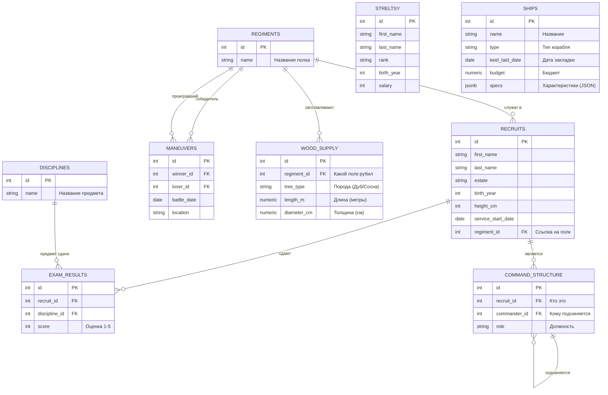

<script setup>
import Conversation from "../../../../components/Conversation.vue";
import alexey from "../../../assets/databases/heroes/clerk_alexey.png";
import ivan from "../../../assets/databases/heroes/clerk_fedor.png";
import petr from "../../../assets/databases/heroes/petr_young.png";
import doctor from "../../../assets/databases/heroes/doctor.png";
import { defineAsyncComponent } from "vue";

const Repl = defineAsyncComponent(() => import("../../../../components/Repl.vue"))
</script>

# Основы применения подзапросов

## Введение

**Март 1697 года.** Азов взят, первый флот построен, но Петр понимает: чтобы удержать море и стать полноценной европейской державой, России нужны союзники, передовые технологии и мастера. Начинается беспрецедентная дипломатическая миссия — «Великое посольство». Официально его возглавляют Франц Лефорт и Федор Головин. Сам же Петр едет инкогнито, под видом простого урядника Преображенского полка Петра Михайлова. Царь хочет без лишних церемоний учиться корабельному делу на верфях, нанимать инженеров и закупать вооружение.

Посольство прибывает в Европу, и русская делегация сталкивается с тем, чего не ожидала — с чудовищной бюрократией. В России учет велся в амбарных книгах: долго, грязно, но всё лежало в одном месте. В Европе же данные разбросаны по гильдиям, магистратам, банкам и архивам адмиралтейств. Запросы переплетаются друг с другом, словно корабельные снасти.

Чтобы получить простой ответ, нужно сначала сделать запрос в один архив, дождаться ответа, а уже с этим ответом идти в другой. Дьяк Федор, привыкший к прямым приказам, в отчаянии рвет на себе волосы. База данных посольства растет, появляются сложные иерархии подчинения (чтобы скрыть личность царя), и обычных запросов SELECT становится катастрофически мало.

В амстердамской ратуше, среди пыльных фолиантов и запаха сургуча, назревает бунт.

<Conversation :phrases="[
    {
        name: 'Лекарь',
        position: 'left',
        text: 'Mein Gott! Я отказываюсь работать в таких условиях! Я послал запрос голландским аптекарям, чтобы найти снадобья дешевле, чем у самого дорогого лекаря в Москве. И знаете, что они мне ответили?!',
        photo: doctor
    },
    {
        name: 'Федор',
        position: 'right',
        text: 'Дай угадаю. Они попросили сначала назвать им точную цену этого самого дорогого лекаря? У меня то же самое с корабельным лесом! Я не могу фильтровать данные, пока не узнаю условие, а чтобы узнать условие, мне нужно отфильтровать данные!',
        photo: ivan
    },
    {
        name: 'Алексей',
        position: 'right',
        text: 'Успокойтесь оба. Вы пытаетесь решить европейские задачи нашими старыми методами. Зачем бегать из архива в архив дважды? Мы заставим базу данных саму искать ответы и подставлять их в наши вопросы на лету.',
        photo: alexey
    },
    {
        name: 'Федор',
        position: 'right',
        text: 'Это как? Написать запрос внутри другого запроса? Звучит как колдовство, Алексей. База же с ума сойдет от такой матрешки.',
        photo: ivan
    },
    {
        name: 'Алексей',
        position: 'right',
        text: 'Не сойдет. Это называется «Подзапросы». База сначала вычислит внутренний ответ, а потом передаст его наружу. И перестаньте дергать царя по пустякам, он сейчас на верфи пилит доски. Мы разберемся с этой бюрократией сами.',
        photo: alexey
    },
    {
        name: 'Лекарь',
        position: 'left',
        text: 'Wunderbar! Если эта ваша матрешка сработает, я смогу вытащить рецепт той спиртовой настойки на тюльпанах, скрытый в архивах гильдии! Показывайте, как это работает!',
        photo: doctor
    }
]"/>

Снова расширяем нашу базу данных - добавляем таблицу с информацией о подчинености `command_structure`.



::: details Структура БД

```sql
-- === 0. СОЗДАЕМ И ЗАПОЛНЯЕМ РЕКРУТОВ И СТРЕЛЬЦОВ ===
CREATE TABLE recruits (
    id SERIAL PRIMARY KEY,
    first_name VARCHAR(50),
    last_name VARCHAR(50),
    estate VARCHAR(50), -- Сословие: Дворянин, Мещанин, Крестьянин, Иноземец
    birth_year INTEGER,
    height_cm INTEGER,
    service_start_date DATE
);
INSERT INTO recruits (first_name, last_name, estate, birth_year, height_cm, service_start_date) VALUES
-- Реальные исторические личности
('Сергей', 'Бухвостов', 'Дворянин', 1659, 198, '1683-01-01'), -- Первый солдат, высокий!
('Александр', 'Меншиков', 'Мещанин', 1673, 185, '1686-02-12'), -- Алексашка, молодой
('Франц', 'Лефорт', 'Иноземец', 1656, 178, '1680-05-10'), -- Наставник
('Патрик', 'Гордон', 'Иноземец', 1635, 175, '1680-01-15'), -- Самый старший
('Федор', 'Апраксин', 'Дворянин', 1661, 180, '1683-04-20'),
('Михаил', 'Голицын', 'Дворянин', 1675, 176, '1687-06-01'), -- Совсем юный
('Яков', 'Брюс', 'Иноземец', 1669, 182, '1686-08-14'), -- Брюс
('Аникита', 'Репнин', 'Дворянин', 1668, 184, '1685-03-30'),
('Автоном', 'Головин', 'Дворянин', 1667, 179, '1684-11-20'),
('Иван', 'Бутурлин', 'Дворянин', 1661, 177, '1683-09-12'),
-- Массовка (Дворяне)
('Петр', 'Волков', 'Дворянин', 1668, 185, '1683-06-12'),
('Дмитрий', 'Морозов', 'Дворянин', 1671, 190, '1684-03-01'),
('Николай', 'Новиков', 'Дворянин', 1673, 182, '1685-02-10'),
('Сергей', 'Соловьев', 'Дворянин', 1667, 188, '1683-09-30'),
('Яков', 'Семенов', 'Дворянин', 1669, 184, '1684-05-25'),
('Гаврила', 'Романов', 'Дворянин', 1675, 192, '1685-04-12'),
('Ефим', 'Никитин', 'Дворянин', 1668, 186, '1683-12-01'),
-- Массовка (Крестьяне - их много, они пониже, но есть богатыри)
('Алексей', 'Смирнов', 'Крестьянин', 1665, 175, '1683-05-10'),
('Федор', 'Козлов', 'Крестьянин', 1662, 168, '1683-05-20'),
('Михаил', 'Соколов', 'Крестьянин', 1669, 178, '1683-07-07'),
('Андрей', 'Зайцев', 'Крестьянин', 1660, 165, '1683-04-12'),
('Григорий', 'Титов', 'Крестьянин', 1664, 176, '1683-06-18'),
('Степан', 'Кузнецов', 'Крестьянин', 1661, 169, '1683-05-05'),
('Макар', 'Егоров', 'Крестьянин', 1666, 173, '1683-08-01'),
('Лука', 'Антонов', 'Крестьянин', 1671, 177, '1685-01-20'),
('Илья', 'Муромец', 'Крестьянин', 1660, 195, '1683-02-02'), -- Пасхалка, очень высокий
('Савелий', 'Громов', 'Крестьянин', 1665, 188, '1684-07-15'),
('Прохор', 'Дубов', 'Крестьянин', 1670, 180, '1686-03-03'),
-- Массовка (Мещане)
('Иван', 'Попов', 'Мещанин', 1670, 172, '1684-01-15'),
('Василий', 'Лебедев', 'Мещанин', 1665, 170, '1683-08-22'),
('Павел', 'Борисов', 'Мещанин', 1672, 174, '1684-11-05'),
('Александр', 'Виноградов', 'Мещанин', 1670, 171, '1684-02-14'),
('Тихон', 'Медведев', 'Мещанин', 1663, 167, '1683-10-10'),
('Кузьма', 'Минин', 'Мещанин', 1662, 176, '1683-09-09'), -- Тезка знаменитого
('Ермолай', 'Рыбаков', 'Мещанин', 1668, 169, '1685-06-20'),
-- Еще Иноземцы (для статистики)
('Иоганн', 'Вейс', 'Иноземец', 1660, 176, '1684-01-01'),
('Петер', 'Шмидт', 'Иноземец', 1665, 181, '1685-12-12');

CREATE TABLE streltsy (
    id SERIAL PRIMARY KEY,
    first_name VARCHAR(50),
    last_name VARCHAR(50),
    rank VARCHAR(50),
    birth_year INTEGER,
    salary INTEGER
);
INSERT INTO streltsy (first_name, last_name, rank, birth_year, salary) VALUES
('Лаврентий', 'Сухарев', 'Полковник', 1655, 150),
('Иван', 'Цыклер', 'Полковник', 1660, 140),
('Кузьма', 'Борода', 'Стрелец', 1670, 10),
('Ерофей', 'Хабаров', 'Стрелец', 1665, 12),
('Агап', 'Тихий', 'Стрелец', 1672, 10),
('Прокоп', 'Громкий', 'Десятник', 1668, 25),
('Сидор', 'Лютый', 'Стрелец', 1660, 10),
('Фома', 'Кистенев', 'Стрелец', 1669, 11),
('Епифан', 'Коловрат', 'Стрелец', 1667, 10),
('Никита', 'Пустосвят', 'Стрелец', 1659, 10),
('Савва', 'Морозов', 'Стрелец', 1671, 15),
('Тихон', 'Хренников', 'Стрелец', 1668, 10),
('Елизар', 'Молот', 'Стрелец', 1666, 12),
('Акакий', 'Башмачкин', 'Писарь', 1675, 8),
('Остап', 'Бендер', 'Десятник', 1673, 50),
('Паниковский', 'Михаил', 'Стрелец', 1660, 5),
('Шура', 'Балаганов', 'Стрелец', 1674, 10),
('Алексей', 'Смирнов', 'Стрелец', 1665, 10),
('Федор', 'Козлов', 'Стрелец', 1662, 10),
('Иван', 'Иванов', 'Сотник', 1670, 45),
('Михаил', 'Соколов', 'Десятник', 1669, 30),
('Андрей', 'Зайцев', 'Стрелец', 1660, 10),
('Григорий', 'Титов', 'Стрелец', 1664, 10),
('Василий', 'Теркин', 'Стрелец', 1675, 12),
('Степан', 'Калашников', 'Стрелец', 1670, 15),
('Кирилл', 'Туров', 'Стрелец', 1668, 10),
('Мефодий', 'Буквоед', 'Писарь', 1660, 9),
('Добрыня', 'Никитич', 'Сотник', 1655, 100),
('Алеша', 'Попович', 'Десятник', 1678, 30),
('Илья', 'Муромец', 'Стрелец', 1650, 20),
('Соловей', 'Разбойник', 'Стрелец', 1665, 10),
('Кощей', 'Бессмертный', 'Полковник', 1600, 200),
('Яга', 'Костяная', 'Стряпуха', 1620, 5);

-- === 1. СОЗДАЕМ И ЗАПОЛНЯЕМ ПОЛКИ ===
CREATE TABLE regiments (
id SERIAL PRIMARY KEY,
name VARCHAR(50) -- Название полка (Преображенский, Семеновский)
);

INSERT INTO regiments (name) VALUES
('Преображенский полк'),
('Семеновский полк'),
('Лефортовский полк'),
('Бутырский полк');


-- === 2. РАСПРЕДЕЛЯЕМ ЛЮДЕЙ (UPDATE) ===

-- Привязываем рекрутов к полкам (Добавляем внешний ключ)
ALTER TABLE recruits ADD COLUMN regiment_id INTEGER;

-- А. Исторические личности (Точечное распределение)
UPDATE recruits SET regiment_id = 1 WHERE last_name IN ('Бухвостов', 'Меншиков', 'Брюс', 'Репнин', 'Головин', 'Бутурлин'); -- Преображенцы
UPDATE recruits SET regiment_id = 2 WHERE last_name IN ('Апраксин', 'Голицын'); -- Семеновцы
UPDATE recruits SET regiment_id = 3 WHERE last_name = 'Лефорт'; -- Лефортовский
UPDATE recruits SET regiment_id = 4 WHERE last_name = 'Гордон'; -- Бутырский

-- Б. Массовка - Дворяне (Все офицеры должны быть при деле)
UPDATE recruits
SET regiment_id = floor(random() * 4 + 1)::int
WHERE estate = 'Дворянин' AND id > 10;


-- В. Массовка - Крестьяне и Мещане (Солдаты)
UPDATE recruits
SET regiment_id = floor(random() * 2 + 1)::int -- Только в Преображенский или Семеновский (пехота)
WHERE estate IN ('Крестьянин', 'Мещанин')
AND id > 10
AND random() > 0.3;

-- ВАЖНО: Иноземец Петер Шмидт - зачислим его к Лефорту
UPDATE recruits SET regiment_id = 3 WHERE last_name = 'Шмидт';

-- 3. Добавляем ДИСЦИПЛИНЫ
CREATE TABLE disciplines (
id SERIAL PRIMARY KEY,
name VARCHAR(50)
);

INSERT INTO disciplines (name) VALUES
('Мушкетная стрельба'),
('Фехтование'),
('Инженерное дело'),
('Метание гранат'); -- Эту дисциплину еще никто не сдавал

-- === 3. ЗАПОЛНЯЕМ ОЦЕНКИ (INSERT) ===
CREATE TABLE exam_results (
id SERIAL PRIMARY KEY,
recruit_id INTEGER, -- Ссылка на recruits
discipline_id INTEGER, -- Ссылка на disciplines
score INTEGER -- Оценка (от 1 до 5)
);

-- А. Исторические личности (Сдали все)
INSERT INTO exam_results (recruit_id, discipline_id, score) VALUES
-- Сергей Бухвостов (Преображенец, 1-й солдат) - Отличник
(1, 1, 5), -- Стрельба
(1, 2, 5), -- Фехтование
(1, 3, 4), -- Инженерное

-- Александр Меншиков (Преображенец) - Хитрый, но не усидчивый
(2, 1, 3), -- Стрельба (руки дрожали)
(2, 2, 5), -- Фехтование (дерзкий)
(2, 3, 5), -- Инженерное (смекалка)

-- Франц Лефорт (Командир)
(3, 1, 5),
(3, 2, 5),
(3, 3, 5),

-- Патрик Гордон (Старый вояка)
(4, 1, 5), -- Стрельба (опыт)
(4, 3, 5), -- Инженерное (фортификация - его конек)

-- Яков Брюс (Ученый)
(7, 1, 2), -- Стрельба (слеповат)
(7, 3, 5); -- Инженерное (Гений!)

-- Б. Дворяне (Массовка)
INSERT INTO exam_results (recruit_id, discipline_id, score)
SELECT id, 1, floor(random() * 3 + 3)::int -- Стрельба (оценки 3, 4, 5)
FROM recruits
WHERE estate = 'Дворянин' AND id > 10 AND random() > 0.5;

INSERT INTO exam_results (recruit_id, discipline_id, score)
SELECT id, 2, floor(random() * 4 + 2)::int -- Фехтование
FROM recruits
WHERE estate = 'Дворянин' AND id > 10 AND random() > 0.5;

-- В. Крестьяне (Массовка) - Сдали немногие (только стрельбу)
INSERT INTO exam_results (recruit_id, discipline_id, score)
SELECT id, 1, floor(random() * 5 + 1)::int -- Стрельба (оценки 1-5, как повезет)
FROM recruits
WHERE estate = 'Крестьянин' AND regiment_id IS NOT NULL AND random() > 0.7;

-- Г. Специально добавим "Двоечника" для примера
INSERT INTO exam_results (recruit_id, discipline_id, score)
VALUES ((SELECT id FROM recruits WHERE estate='Крестьянин' LIMIT 1), 3, 1); -- Инженерное дело - 1

-- === 4. УЧЕБНЫЕ МАНЕВРЫ (Новая таблица!) ===
CREATE TABLE maneuvers (
    id SERIAL PRIMARY KEY,
    winner_id INTEGER, -- Кто победил (ссылка на regiments)
    loser_id INTEGER,  -- Кто проиграл (ссылка на regiments)
    battle_date DATE,
    location VARCHAR(50)
);

INSERT INTO maneuvers (winner_id, loser_id, battle_date, location) VALUES
(1, 2, '1694-10-01', 'Кожухово'), -- Преображенский побил Семеновский
(3, 4, '1694-10-02', 'Яуза'),     -- Лефортовский побил Бутырский
(1, 3, '1694-10-03', 'Кожухово'), -- Преображенский побил Лефортовский
(2, 4, '1694-10-04', 'Пресбург'), -- Семеновский побил Бутырский
(4, 1, '1694-10-05', 'Яуза'),     -- Бутырский (внезапно) побил Преображенский (реванш)
(3, 2, '1694-10-06', 'Пресбург'),
(1, 4, '1694-10-07', 'Кожухово'),
(2, 3, '1694-10-08', 'Яуза'),
(4, 3, '1694-10-09', 'Пресбург'),
(1, 2, '1694-10-10', 'Финал'),    -- Гранд-финал
(3, 1, '1694-10-11', 'Утешительный'),
(4, 2, '1694-10-12', 'Пьяная драка');

-- === 5. ФЛОТ (Корабли) ===
CREATE TABLE ships (
    id SERIAL PRIMARY KEY,
    name VARCHAR(50),
    type VARCHAR(50),
    keel_laid_date DATE,
    budget NUMERIC(10, 2),
    specs JSONB -- колонка для хитрых голландских чертежей
);

INSERT INTO ships (name, type, keel_laid_date, budget, specs) VALUES
('Апостол Петр', 'Галера', '1695-11-01', 5000.00, '{"crew": 150, "captain": {"name": "Лефорт", "rank": "Адмирал"}, "weapons": ["пушки", "мушкетоны"]}'),
('Апостол Павел', 'Галера', '1695-11-15', 5200.50, '{"crew": 140, "captain": {"name": "Головин", "rank": "Капитан"}, "weapons": ["пушки"]}'),
('Страх', 'Брандер', '1695-12-01', 1500.00, '{"explosives_kg": 500, "crew": 5, "weapons": ["греческий огонь"]}'),
('Смелость', 'Брандер', '1695-12-05', 1450.75, '{"explosives_kg": 600, "crew": 4, "weapons": []}'),
('Святой Марк', 'Струг', '1696-01-10', 800.00, '{"cargo_capacity_tons": 50, "captain": {"name": "Смирнов", "rank": "Боцман"}}'),
('Святой Лука', 'Струг', '1696-01-12', NULL, '{"cargo_capacity_tons": 60}'); -- Бюджет еще не утвержден

-- === 6. ЛЕСОЗАГОТОВКИ ===
CREATE TABLE wood_supply (
id SERIAL PRIMARY KEY,
regiment_id INTEGER, -- Какой полк рубил
tree_type VARCHAR(50),
length_m NUMERIC(5, 2), -- Длина в метрах
diameter_cm NUMERIC(5, 2) -- Диаметр в сантиметрах
);

-- Полки рубят лес (Преображенцы и Семеновцы)
INSERT INTO wood_supply (regiment_id, tree_type, length_m, diameter_cm) VALUES
(1, 'Дуб', 8.5, 45.0),
(1, 'Дуб', 9.0, 50.5),
(1, 'Сосна', 12.0, 30.0),
(2, 'Сосна', 11.5, 28.5),
(2, 'Дуб', 7.8, 42.0),
(2, 'Сосна', 13.0, 35.0),
(1, 'Дуб', 8.0, 48.0),
(3, 'Сосна', 10.0, 25.0);


-- === 7. ИЕРАРХИЯ КОМАНДОВАНИЯ (Для рекурсивных CTE) ===
CREATE TABLE command_structure (
id SERIAL PRIMARY KEY,
recruit_id INTEGER REFERENCES recruits(id), -- Кто это (связь с рекрутами)
commander_id INTEGER REFERENCES command_structure(id), -- Кому подчиняется (связь сама на себя)
role VARCHAR(50) -- Должность
);

-- Петр Волков (id=11) будет у нас Петром Михайловым (царем под прикрытием)
INSERT INTO command_structure (recruit_id, commander_id, role) VALUES
(11, NULL, 'Десятник Петр Михайлов (Бомбардир)'), -- Самый главный, начальника нет (NULL)
(3, 1, 'Великий посол (Лефорт)'), -- Подчиняется Петру (id записи = 1)
(9, 2, 'Второй посол (Головин)'), -- Подчиняется Лефорту (id записи = 2)
(2, 1, 'Денщик (Меншиков)'), -- Лично при Петре (id записи = 1)
(7, 2, 'Ученый при посольстве (Брюс)'), -- При Лефорте
(1, 3, 'Сержант охраны (Бухвостов)'), -- Охрана при Головине
(18, 6, 'Солдат охраны (Смирнов)'); -- Подчиняется Бухвостову
```

:::

<ClientOnly>
<Repl :initial-queries="[
`CREATE TABLE recruits (
    id SERIAL PRIMARY KEY,
    first_name VARCHAR(50),
    last_name VARCHAR(50),
    estate VARCHAR(50),
    birth_year INTEGER,
    height_cm INTEGER,
    service_start_date DATE
);`,
`INSERT INTO recruits (first_name, last_name, estate, birth_year, height_cm, service_start_date) VALUES
('Сергей', 'Бухвостов', 'Дворянин', 1659, 198, '1683-01-01'), 
('Александр', 'Меншиков', 'Мещанин', 1673, 185, '1686-02-12'),
('Франц', 'Лефорт', 'Иноземец', 1656, 178, '1680-05-10'),
('Патрик', 'Гордон', 'Иноземец', 1635, 175, '1680-01-15'),
('Федор', 'Апраксин', 'Дворянин', 1661, 180, '1683-04-20'),
('Михаил', 'Голицын', 'Дворянин', 1675, 176, '1687-06-01'),
('Яков', 'Брюс', 'Иноземец', 1669, 182, '1686-08-14'),
('Аникита', 'Репнин', 'Дворянин', 1668, 184, '1685-03-30'),
('Автоном', 'Головин', 'Дворянин', 1667, 179, '1684-11-20'),
('Иван', 'Бутурлин', 'Дворянин', 1661, 177, '1683-09-12'),
('Петр', 'Волков', 'Дворянин', 1668, 185, '1683-06-12'),
('Дмитрий', 'Морозов', 'Дворянин', 1671, 190, '1684-03-01'),
('Николай', 'Новиков', 'Дворянин', 1673, 182, '1685-02-10'),
('Сергей', 'Соловьев', 'Дворянин', 1667, 188, '1683-09-30'),
('Яков', 'Семенов', 'Дворянин', 1669, 184, '1684-05-25'),
('Гаврила', 'Романов', 'Дворянин', 1675, 192, '1685-04-12'),
('Ефим', 'Никитин', 'Дворянин', 1668, 186, '1683-12-01'),
('Алексей', 'Смирнов', 'Крестьянин', 1665, 175, '1683-05-10'),
('Федор', 'Козлов', 'Крестьянин', 1662, 168, '1683-05-20'),
('Михаил', 'Соколов', 'Крестьянин', 1669, 178, '1683-07-07'),
('Андрей', 'Зайцев', 'Крестьянин', 1660, 165, '1683-04-12'),
('Григорий', 'Титов', 'Крестьянин', 1664, 176, '1683-06-18'),
('Степан', 'Кузнецов', 'Крестьянин', 1661, 169, '1683-05-05'),
('Макар', 'Егоров', 'Крестьянин', 1666, 173, '1683-08-01'),
('Лука', 'Антонов', 'Крестьянин', 1671, 177, '1685-01-20'),
('Илья', 'Муромец', 'Крестьянин', 1660, 195, '1683-02-02'),
('Савелий', 'Громов', 'Крестьянин', 1665, 188, '1684-07-15'),
('Прохор', 'Дубов', 'Крестьянин', 1670, 180, '1686-03-03'),
('Иван', 'Попов', 'Мещанин', 1670, 172, '1684-01-15'),
('Василий', 'Лебедев', 'Мещанин', 1665, 170, '1683-08-22'),
('Павел', 'Борисов', 'Мещанин', 1672, 174, '1684-11-05'),
('Александр', 'Виноградов', 'Мещанин', 1670, 171, '1684-02-14'),
('Тихон', 'Медведев', 'Мещанин', 1663, 167, '1683-10-10'),
('Кузьма', 'Минин', 'Мещанин', 1662, 176, '1683-09-09'), 
('Ермолай', 'Рыбаков', 'Мещанин', 1668, 169, '1685-06-20'),
('Иоганн', 'Вейс', 'Иноземец', 1660, 176, '1684-01-01'),
('Петер', 'Шмидт', 'Иноземец', 1665, 181, '1685-12-12');`,
`CREATE TABLE streltsy (
    id SERIAL PRIMARY KEY,
    first_name VARCHAR(50),
    last_name VARCHAR(50),
    rank VARCHAR(50),
    birth_year INTEGER,
    salary INTEGER
);`,
`INSERT INTO streltsy (first_name, last_name, rank, birth_year, salary) VALUES
('Лаврентий', 'Сухарев', 'Полковник', 1655, 150),
('Иван', 'Цыклер', 'Полковник', 1660, 140),
('Кузьма', 'Борода', 'Стрелец', 1670, 10),
('Ерофей', 'Хабаров', 'Стрелец', 1665, 12),
('Агап', 'Тихий', 'Стрелец', 1672, 10),
('Прокоп', 'Громкий', 'Десятник', 1668, 25),
('Сидор', 'Лютый', 'Стрелец', 1660, 10),
('Фома', 'Кистенев', 'Стрелец', 1669, 11),
('Епифан', 'Коловрат', 'Стрелец', 1667, 10),
('Никита', 'Пустосвят', 'Стрелец', 1659, 10),
('Савва', 'Морозов', 'Стрелец', 1671, 15),
('Тихон', 'Хренников', 'Стрелец', 1668, 10),
('Елизар', 'Молот', 'Стрелец', 1666, 12),
('Акакий', 'Башмачкин', 'Писарь', 1675, 8),
('Остап', 'Бендер', 'Десятник', 1673, 50),
('Паниковский', 'Михаил', 'Стрелец', 1660, 5),
('Шура', 'Балаганов', 'Стрелец', 1674, 10),
('Алексей', 'Смирнов', 'Стрелец', 1665, 10),
('Федор', 'Козлов', 'Стрелец', 1662, 10),
('Иван', 'Иванов', 'Сотник', 1670, 45),
('Михаил', 'Соколов', 'Десятник', 1669, 30),
('Андрей', 'Зайцев', 'Стрелец', 1660, 10),
('Григорий', 'Титов', 'Стрелец', 1664, 10),
('Василий', 'Теркин', 'Стрелец', 1675, 12),
('Степан', 'Калашников', 'Стрелец', 1670, 15),
('Кирилл', 'Туров', 'Стрелец', 1668, 10),
('Мефодий', 'Буквоед', 'Писарь', 1660, 9),
('Добрыня', 'Никитич', 'Сотник', 1655, 100),
('Алеша', 'Попович', 'Десятник', 1678, 30),
('Илья', 'Муромец', 'Стрелец', 1650, 20),
('Соловей', 'Разбойник', 'Стрелец', 1665, 10),
('Кощей', 'Бессмертный', 'Полковник', 1600, 200),
('Яга', 'Костяная', 'Стряпуха', 1620, 5);`,
`CREATE TABLE regiments (
id SERIAL PRIMARY KEY,
name VARCHAR(50)
);`,
`INSERT INTO regiments (name) VALUES
('Преображенский полк'),
('Семеновский полк'),
('Лефортовский полк'),
('Бутырский полк');`,
`ALTER TABLE recruits ADD COLUMN regiment_id INTEGER;`,
`UPDATE recruits SET regiment_id = 1 WHERE last_name IN ('Бухвостов', 'Меншиков', 'Брюс', 'Репнин', 'Головин', 'Бутурлин');`,
`UPDATE recruits SET regiment_id = 2 WHERE last_name IN ('Апраксин', 'Голицын');`,
`UPDATE recruits SET regiment_id = 3 WHERE last_name = 'Лефорт'; `,
`UPDATE recruits SET regiment_id = 4 WHERE last_name = 'Гордон';`,
`UPDATE recruits
SET regiment_id = floor(random() * 4 + 1)::int
WHERE estate = 'Дворянин' AND id > 10;`,
`UPDATE recruits
SET regiment_id = floor(random() * 2 + 1)::int 
WHERE estate IN ('Крестьянин', 'Мещанин')
AND id > 10
AND random() > 0.3;`,
`UPDATE recruits SET regiment_id = 3 WHERE last_name = 'Шмидт';`,
`CREATE TABLE disciplines (
id SERIAL PRIMARY KEY,
name VARCHAR(50)
);`,
`INSERT INTO disciplines (name) VALUES
('Мушкетная стрельба'),
('Фехтование'),
('Инженерное дело'),
('Метание гранат'); `,
`CREATE TABLE exam_results (
id SERIAL PRIMARY KEY,
recruit_id INTEGER, 
discipline_id INTEGER, 
score INTEGER 
);`,
`INSERT INTO exam_results (recruit_id, discipline_id, score) VALUES
(1, 1, 5), -- Стрельба
(1, 2, 5), -- Фехтование
(1, 3, 4), -- Инженерное
(2, 1, 3), -- Стрельба (руки дрожали)
(2, 2, 5), -- Фехтование (дерзкий)
(2, 3, 5), -- Инженерное (смекалка)
(3, 1, 5),
(3, 2, 5),
(3, 3, 5),
(4, 1, 5), 
(4, 3, 5),
(7, 1, 2),
(7, 3, 5);`,
`INSERT INTO exam_results (recruit_id, discipline_id, score)
SELECT id, 1, floor(random() * 3 + 3)::int
FROM recruits
WHERE estate = 'Дворянин' AND id > 10 AND random() > 0.5;`,
`INSERT INTO exam_results (recruit_id, discipline_id, score)
SELECT id, 2, floor(random() * 4 + 2)::int 
FROM recruits
WHERE estate = 'Дворянин' AND id > 10 AND random() > 0.5;`,
`INSERT INTO exam_results (recruit_id, discipline_id, score)
SELECT id, 1, floor(random() * 5 + 1)::int 
FROM recruits
WHERE estate = 'Крестьянин' AND regiment_id IS NOT NULL AND random() > 0.7;`,
`INSERT INTO exam_results (recruit_id, discipline_id, score)
VALUES ((SELECT id FROM recruits WHERE estate='Крестьянин' LIMIT 1), 3, 1); `,
`CREATE TABLE maneuvers (
    id SERIAL PRIMARY KEY,
    winner_id INTEGER,
    loser_id INTEGER, 
    battle_date DATE,
    location VARCHAR(50)
);`,
`INSERT INTO maneuvers (winner_id, loser_id, battle_date, location) VALUES
(1, 2, '1694-10-01', 'Кожухово'), 
(3, 4, '1694-10-02', 'Яуза'),    
(1, 3, '1694-10-03', 'Кожухово'), 
(2, 4, '1694-10-04', 'Пресбург'), 
(4, 1, '1694-10-05', 'Яуза'),    
(3, 2, '1694-10-06', 'Пресбург'),
(1, 4, '1694-10-07', 'Кожухово'),
(2, 3, '1694-10-08', 'Яуза'),
(4, 3, '1694-10-09', 'Пресбург'),
(1, 2, '1694-10-10', 'Финал'),   
(3, 1, '1694-10-11', 'Утешительный'),
(4, 2, '1694-10-12', 'Пьяная драка');`,
`CREATE TABLE ships (
id SERIAL PRIMARY KEY,
name VARCHAR(50),
type VARCHAR(50),
keel_laid_date DATE,
budget NUMERIC(10, 2),
specs JSONB 
);`,
`INSERT INTO ships (name, type, keel_laid_date, budget, specs) VALUES
('Апостол Петр', 'Галера', '1695-11-01', 5000.00, '{&quot;crew&quot;: 150, &quot;captain&quot;: {&quot;name&quot;: &quot;Лефорт&quot;, &quot;rank&quot;: &quot;Адмирал&quot;}, &quot;weapons&quot;: [&quot;пушки&quot;, &quot;мушкетоны&quot;]}'),
('Апостол Павел', 'Галера', '1695-11-15', 5200.50, '{&quot;crew&quot;: 140, &quot;captain&quot;: {&quot;name&quot;: &quot;Головин&quot;, &quot;rank&quot;: &quot;Капитан&quot;}, &quot;weapons&quot;: [&quot;пушки&quot;]}'),
('Страх', 'Брандер', '1695-12-01', 1500.00, '{&quot;explosives_kg&quot;: 500, &quot;crew&quot;: 5, &quot;weapons&quot;: [&quot;греческий огонь&quot;]}'),
('Смелость', 'Брандер', '1695-12-05', 1450.75, '{&quot;explosives_kg&quot;: 600, &quot;crew&quot;: 4, &quot;weapons&quot;: []}'),
('Святой Марк', 'Струг', '1696-01-10', 800.00, '{&quot;cargo_capacity_tons&quot;: 50, &quot;captain&quot;: {&quot;name&quot;: &quot;Смирнов&quot;, &quot;rank&quot;: &quot;Боцман&quot;}}'),
('Святой Лука', 'Струг', '1696-01-12', NULL, '{&quot;cargo_capacity_tons&quot;: 60}');`,
`CREATE TABLE wood_supply (
id SERIAL PRIMARY KEY,
regiment_id INTEGER, -- Какой полк рубил
tree_type VARCHAR(50),
length_m NUMERIC(5, 2), -- Длина в метрах
diameter_cm NUMERIC(5, 2) -- Диаметр в сантиметрах
);`,
`INSERT INTO wood_supply (regiment_id, tree_type, length_m, diameter_cm) VALUES
(1, 'Дуб', 8.5, 45.0),
(1, 'Дуб', 9.0, 50.5),
(1, 'Сосна', 12.0, 30.0),
(2, 'Сосна', 11.5, 28.5),
(2, 'Дуб', 7.8, 42.0),
(2, 'Сосна', 13.0, 35.0),
(1, 'Дуб', 8.0, 48.0),
(3, 'Сосна', 10.0, 25.0);`,
`CREATE TABLE command_structure (
id SERIAL PRIMARY KEY,
recruit_id INTEGER REFERENCES recruits(id), 
commander_id INTEGER REFERENCES command_structure(id), 
role VARCHAR(50) 
);`,
`INSERT INTO command_structure (recruit_id, commander_id, role) VALUES
(11, NULL, 'Десятник Петр Михайлов (Бомбардир)'), 
(3, 1, 'Великий посол (Лефорт)'), 
(9, 2, 'Второй посол (Головин)'),
(2, 1, 'Денщик (Меншиков)'), 
(7, 2, 'Ученый при посольстве (Брюс)'),
(1, 3, 'Сержант охраны (Бухвостов)'),
(18, 6, 'Солдат охраны (Смирнов)'); `
]"/>
</ClientOnly>

## Введение в подзапросы

В Европе Федор быстро понял главную проблему местной бюрократии: чтобы получить нужную справку, нужно сначала предъявить другую справку, которую выдают в соседнем окне.

В базах данных часто возникает похожая ситуация. Представьте, что государь приказал: _«Федор, найди мне всех рекрутов, чей рост больше, чем у Александра Меншикова!»_

Как бы писарь решал эту задачу по старинке?

- **Шаг 1:** Сделал бы отдельный запрос, чтобы узнать точный рост Меншикова (185 см).
- **Шаг 2:** Написал бы второй, итоговый запрос: `SELECT * FROM recruits WHERE height_cm > 185;`.

Это долго, неудобно, и самое главное — ненадежно. Если Меншиков вдруг подрастет или данные в базе изменятся, наш второй запрос устареет, так как число `185` было вбито в него вручную («захардкожено»).

Здесь на сцену выходят **подзапросы (subqueries)**.

**Подзапрос (вложенный запрос)** — это полноценная инструкция `SELECT`, которая встраивается прямо внутрь другого (основного) запроса SQL.

Подзапросы жизненно необходимы тогда, когда мы заранее **не знаем точного значения** для фильтрации данных и просим саму СУБД вычислить его на лету. База данных работает с ними логично: сначала она полностью выполняет _внутренний_ запрос, а затем подставляет полученный результат во _внешний_ (главный) запрос.

Синтаксически любой подзапрос всегда оборачивается в круглые скобки `()`.

```sql
-- Основной (внешний) запрос
SELECT first_name, last_name, height_cm
FROM recruits
WHERE height_cm > (
    -- Вложенный (внутренний) запрос
    SELECT height_cm
    FROM recruits
    WHERE last_name = 'Меншиков'
);
```

В этом примере нам абсолютно не нужно держать в голове рост Алексашки. База сама «сходит» в таблицу, достанет его 185 сантиметров, невидимо для нас подставит их в условие `WHERE height_cm > ...` и выдаст итоговый список гвардейцев. Никаких промежуточных бумажек!

## Скалярные подзапросы (одно значение)

<Conversation :phrases="[
    {
        name: 'Алексей',
        position: 'right',
        text: 'Главное правило, Федор: если подзапрос стоит там, где база ожидает увидеть ровно одну цифру или одно слово, он обязан вернуть строго одну строку и один столбец. Ни больше, ни меньше. Такие подзапросы называют скалярными.',
        photo: alexey
    },
    {
        name: 'Федор',
        position: 'left',
        text: 'А если он вернет два значения? Например, если я буду искать рост не по уникальной фамилии, а по имени Иван, которых у нас половина полка?',
        photo: ivan
    },
    {
        name: 'Алексей',
        position: 'right',
        text: 'Тогда база данных выдаст ошибку и больно ударит тебя по рукам. Скалярный подзапрос должен быть снайперским выстрелом — точно в одну цель.',
        photo: alexey
    }
]"/>

Скалярные подзапросы чаще всего используются вместе с агрегатными функциями (`MAX`, `MIN`, `AVG`), потому что они гарантированно сворачивают данные в одно значение. Но их можно использовать и для поиска конкретных записей, если мы уверены в их уникальности.

Встраивать такие подзапросы можно в три разных блока: `WHERE`, `HAVING` и `SELECT`.

### Подзапросы в блоке WHERE

Это классика. Мы используем подзапрос в правой части обычного математического оператора (`=`, `>`, `<`, `>=`, `<=`, `<>`).

**Задача:** Государь формирует отряд почетного караула для встречи с бургомистром. Ему нужны гренадеры. Федору приказано: _«Найти всех рекрутов, чей рост больше, чем у Александра Меншикова!»_

```sql
SELECT first_name, last_name, height_cm
FROM recruits
WHERE height_cm > (
    -- Внутренний запрос: находим рост Меншикова (вернет 185)
    SELECT height_cm
    FROM recruits
    WHERE last_name = 'Меншиков'
);
```

### Подзапросы в блоке HAVING

Мы помним, что `HAVING` фильтрует данные **после** их группировки. Подзапросы здесь бесценны, когда нам нужно сравнить показатели какой-то конкретной группы с общим показателем по всей базе.

**Задача:** Вычислить средний балл за экзамены по каждому полку, но показать только те полки, которые учатся лучше, чем «в среднем по больнице» (выше среднего балла по всей армии).

```sql
SELECT r.name AS regiment_name, AVG(e.score) AS avg_score
FROM regiments r
JOIN recruits rec ON r.id = rec.regiment_id
JOIN exam_results e ON rec.id = e.recruit_id
GROUP BY r.name
HAVING AVG(e.score) > (
    -- Внутренний запрос: вычисляет средний балл вообще всех сданных экзаменов
    SELECT AVG(score) FROM exam_results
);
```

### Подзапросы в блоке SELECT

Иногда нам не нужно ничего фильтровать. Нам нужно просто вывести какое-то глобальное значение прямо рядом с обычными строками таблицы, чтобы визуально их сравнить. В таком случае подзапрос пишется прямо в списке выводимых колонок `SELECT`.

**Задача:** Казначейство просит показать список всех стрельцов с их жалованьем, а в соседней колонке для справки вывести максимальное жалованье во всем стрелецком войске, чтобы понимать разрыв в доходах.

```sql
SELECT
    first_name,
    last_name,
    salary,
    -- Этот подзапрос приклеится отдельной колонкой к каждой строке
    (SELECT MAX(salary) FROM streltsy) AS max_salary_in_army,
    -- Можно даже сразу делать математику с подзапросом!
    (SELECT MAX(salary) FROM streltsy) - salary AS difference
FROM streltsy
WHERE rank = 'Стрелец';
```

::: tip Внимание на производительность
Использовать скалярные подзапросы в блоке `SELECT` очень удобно, но нужно помнить: база данных будет вычислять этот подзапрос _для каждой выводимой строки_. В современных СУБД вроде PostgreSQL встроен мощный оптимизатор, который кеширует такие простые запросы, но на очень больших таблицах и сложной математике это может замедлить работу.
:::

## Возврат столбца (множества значений): операторы IN и NOT IN

Далеко не всегда внутренний запрос бьет точно в одну цифру. Чаще всего нам нужно вытащить целый список.

<Conversation :phrases="[
    {
        name: 'Федор',
        position: 'left',
        text: 'Наставник, у меня база ругается! Пишет: «Subquery returns more than 1 row». Я всего-то хотел найти солдат из тех полков, которые побеждали в маневрах. Написал WHERE regiment_id = (SELECT winner_id FROM maneuvers). Что не так?',
        photo: ivan
    },
    {
        name: 'Алексей',
        position: 'right',
        text: 'А ты логику включи. У нас победителей несколько: и Преображенский, и Семеновский, и Лефортовский полки выигрывали. Твой вложенный запрос выплюнул целый столбец с номерами. А ты пытаешься приравнять один конкретный полк солдата к целому списку через знак равенства. Нельзя впихнуть невпихуемое.',
        photo: alexey
    },
    {
        name: 'Федор',
        position: 'left',
        text: 'А как тогда проверить, есть ли полк в этом списке победителей?',
        photo: ivan
    },
    {
        name: 'Алексей',
        position: 'right',
        text: 'Использовать операторы принадлежности ко множеству — IN или NOT IN. Они специально для этого и придуманы.',
        photo: alexey
    }
]"/>

Если подзапрос возвращает **один столбец, но несколько строк**, он формирует множество (список) значений. В таком случае использовать обычные знаки сравнения (`=`, `>`, `<`) нельзя.

### Оператор IN

Оператор `IN` проверяет, совпадает ли значение из основного запроса **хотя бы с одним** элементом из списка, который вернул подзапрос.

**Задача:** Показать имена солдат, которые служат в полках, победивших в маневрах (одержавших хотя бы одну победу).

```sql
SELECT first_name, last_name, regiment_id
FROM recruits
WHERE regiment_id IN (
    -- Подзапрос возвращает список ID полков (1, 2, 3, 4, 1, 3...),
    -- которые побеждали. База проверит каждого рекрута:
    -- "Его regiment_id есть в этом списке?"
    SELECT winner_id
    FROM maneuvers
);
```

### Оператор NOT IN

Обратная ситуация: оператор `NOT IN` пропустит строку во внешний результат только в том случае, если искомого значения **вообще нет** в результатах подзапроса.

**Задача:** Вычислить «отстающих». Найти тех рекрутов, которые умудрились получить двойки, и мы не хотим брать их в элитную охрану посольства. Или, если сформулировать иначе: показать солдат, чьих ID нет в списке двоечников.

```sql
SELECT first_name, last_name
FROM recruits
WHERE id NOT IN (
    -- Подзапрос собирает "черный список" ID всех, кто получил оценку 2
    SELECT recruit_id
    FROM exam_results
    WHERE score = 2
);
```

::: tip Осторожно с NULL в NOT IN!
У оператора `NOT IN` есть подлая ловушка. Если подзапрос вернет список, в котором затесалось хотя бы одно пустое значение (`NULL`), то весь внешний запрос **не выведет вообще ни одной строки**. База данных рассуждает так: «Я не могу гарантировать, что твоего значения нет в списке, потому что в списке есть неизвестность».
Поэтому всегда старайтесь отфильтровывать пустые значения во вложенном запросе (например, добавляя `WHERE column IS NOT NULL`).
:::

## Продвинутые проверки: ANY, ALL и скоростной EXISTS

Европейские архивы оказались не просто огромными, а необъятными. Когда Федор попытался использовать `IN`, чтобы проверить наличие нужных товаров в списках из тысяч позиций, база задумалась на добрых десять минут.

<Conversation :phrases="[
    {
        name: 'Федор',
        position: 'left',
        text: 'Алексей, я сейчас усну! Пока этот IN переберет весь список голландских складов, мы уже обратно в Москву уедем. И вообще, зачем нужны еще какие-то ANY и ALL, если IN нормально ищет совпадения?',
        photo: ivan
    },
    {
        name: 'Алексей',
        position: 'right',
        text: 'IN ищет только строгое равенство. А если тебе нужно найти кого-то, кто ВЫШЕ или МЛАДШЕ целого списка людей? Тут IN бессилен. А по поводу тормозов — ты просто микроскопом гвозди забиваешь. Для проверки «есть ли там вообще хоть что-то» умные люди используют EXISTS. Это местный чит-код на скорость.',
        photo: alexey
    }
]"/>

### Операторы ANY (SOME) и ALL

Когда подзапрос возвращает столбец значений, мы можем захотеть сравнить наше значение с этим списком не на равенство, а на больше/меньше.

- **`> ANY (подзапрос)`** — больше, чем **хотя бы одно** значение из списка (по сути, больше самого маленького). Синоним `ANY` — оператор `SOME`, они работают абсолютно одинаково.
- **`> ALL (подзапрос)`** — больше, чем **каждое** значение в списке (то есть больше самого большого).

**Задача:** Государь ищет богатырей для личной охраны посольства. Нужно найти рекрутов, чей рост больше, чем у _любого_ из иноземцев (то есть выше самого высокого иностранца в нашей базе).

```sql
SELECT first_name, last_name, height_cm
FROM recruits
WHERE height_cm > ALL (
    -- Подзапрос возвращает список роста всех иноземцев: 178, 175, 182, 176, 181
    SELECT height_cm
    FROM recruits
    WHERE estate = 'Иноземец'
);

```

База найдет максимальный рост иноземца — 182 см, и выведет только тех рекрутов, кто строго выше 182).

А если бы мы написали `> ANY`, то база вывела бы всех, кто выше _хотя бы самого низкого_ иноземца (выше 175 см).

::: tip IN — это частный случай ANY
Конструкция `= ANY (подзапрос)` — это точная копия оператора `IN`. Выражение «равно хотя бы одному из списка» означает «входит в этот список».
:::

::: tip В чем разница между ANY и SOME?
Никакой разницы нет. `SOME` — это полный синоним `ANY`. Разработчики стандарта SQL добавили оба варианта исключительно для того, чтобы запросы читались как грамотный английский текст. Можете использовать то слово, которое вам больше нравится — СУБД обработает их абсолютно одинаково.
:::

## Коррелированные подзапросы

До сих пор мы рассматривали независимые (некоррелированные) подзапросы. База данных вычисляла их ровно один раз, получала результат (число или список) и подставляла его в главное условие. Но европейская бюрократия требует более тонкого подхода.

<Conversation :phrases="[
    {
        name: 'Петр',
        position: 'left',
        text: 'Федор, мне нужен список особых людей. Найди солдат, чей рост выше среднего. НО не в среднем по всему войску, а выше среднего ВНУТРИ ИХ СОБСТВЕННОГО СОСЛОВИЯ. Для дворянина считай среднее по дворянам, для крестьянина — по крестьянам.',
        photo: petr
    },
    {
        name: 'Федор',
        position: 'right',
        text: 'Мин херц, так это же... Мне что, для каждого человека заново пересчитывать средний рост его группы? Да я тут до второго пришествия счетами щелкать буду!',
        photo: ivan
    },
    {
        name: 'Алексей',
        position: 'right',
        text: 'Ты — будешь. А база данных справится за секунду. Нам нужно написать такой подзапрос, который будет ссылаться на текущую проверяемую строку из внешнего запроса. Это называется коррелированный подзапрос.',
        photo: alexey
    }
]"/>

**Коррелированный подзапрос** — это вложенный запрос, который использует значения из внешнего запроса. Из-за этой связи база данных не может выполнить его один раз. Она вынуждена выполнять внутренний запрос **заново для каждой строки** внешней таблицы.

```sql
SELECT r1.first_name, r1.last_name, r1.estate, r1.height_cm
FROM recruits r1
WHERE r1.height_cm > (
    -- Этот подзапрос выполняется ЗАНОВО для каждой строки таблицы r1
    SELECT AVG(r2.height_cm)
    FROM recruits r2
    -- Вот она, магия связи! Внутренний запрос смотрит на сословие внешнего!
    WHERE r2.estate = r1.estate
);
```

::: tip Псевдонимы обязательны!
Обратите внимание: мы обращаемся к одной и той же таблице `recruits` дважды — и снаружи, и внутри. Чтобы база данных не сошла с ума и поняла, чье именно сословие с чем сравнивать, мы обязаны дать таблицам разные псевдонимы (например, `r1` и `r2`).
:::

::: danger Как «положить» боевую базу
Коррелированные подзапросы — это мощный инструмент, но в неумелых руках он превращается в оружие массового поражения для вашей СУБД.

Вспомните механику: внутренний запрос выполняется **заново для каждой строки** внешнего запроса. Если в вашей таблице полков всего 4 записи — база сделает 4 подзапроса, вы даже не заметите. Но если на реальном проекте у вас таблица логов на 1 миллион строк, база попытается сделать **1 000 000 отдельных запросов** внутрь! Время выполнения вырастет по экспоненте (математически это сложность $O(N \times M)$), процессор сервера уйдет в 100%, и база «ляжет».

**Золотое правило аналитика:** всегда старайтесь заменять коррелированные подзапросы на классические `JOIN` или оконные функции (`OVER()`). Движок базы данных оптимизирован так, чтобы объединять множества целиком за один проход, а не бегать за каждой строчкой по отдельности. Используйте коррелированные подзапросы только там, где без них реально не обойтись (например, в связке с `EXISTS`).
:::

## Оператор EXISTS и ленивые вычисления

Теперь, когда мы знаем, как внутренний запрос может ссылаться на внешний, пришло время поговорить о производительности.

Часто нам не нужно ничего сравнивать или вычислять суммы. Нам нужно просто узнать: **«Есть ли там вообще хоть кто-то?»**. Например, проверить наличие нужных товаров в списках из тысяч позиций амстердамских складов.

Для таких задач существует оператор **`EXISTS`** (существует).

Он кардинально отличается от `IN`, `ANY` и `ALL`:

1. `EXISTS` не возвращает никаких данных из подзапроса. Он возвращает только логическое значение: **`TRUE`** (да, строки найдены) или **`FALSE`** (нет, там пусто).
2. **«Ленивое вычисление» (short-circuit evaluation).** Если вы используете `IN`, база данных честно собирает _весь_ список в память. Но если вы используете `EXISTS`, база начинает выполнять подзапрос, и **как только находит первую же подходящую строку — она мгновенно останавливается** и возвращает `TRUE`.

Чаще всего `EXISTS` используется именно в паре с коррелированными подзапросами.

**Задача:** Вывести названия тех полков, в которых служит **хотя бы один** солдат крестьянского сословия.

```sql
SELECT r.name
FROM regiments r
WHERE EXISTS (
    -- Нам не важно, ЧТО именно выбрать, поэтому часто пишут просто SELECT 1 или SELECT *
    SELECT 1
    FROM recruits rec
    -- Связываем внутренний запрос с внешним полком (корреляция)
    WHERE rec.regiment_id = r.id
      AND rec.estate = 'Крестьянин'
);
```

В этом запросе база берет первый полк (например, Преображенский) и идет в таблицу рекрутов. Как только она видит _первого попавшегося_ крестьянина с `regiment_id` Преображенского полка, она тут же прекращает поиск и выводит этот полк на экран. Это колоссальная экономия времени на больших объемах данных!

## Подзапросы в FROM

Европейские архивы таили в себе еще одну неприятную особенность: иногда нужной таблицы просто не существовало в природе. Ее нужно было создать на лету из обрывков других документов.

<Conversation :phrases="[
    {
        name: 'Федор',
        position: 'left',
        text: 'Алексей, я сейчас точно сброшу этот архив в канал! Государь хочет знать абсолютный рекорд — самый высокий средний балл среди всех наших солдат. Я пишу SELECT MAX(AVG(score)), а база плюется ошибками и говорит, что так нельзя!',
        photo: ivan
    },
    {
        name: 'Алексей',
        position: 'right',
        text: 'И правильно делает. Нельзя вкладывать агрегатные функции друг в друга, как матрешки. База не может одновременно и группировать данные по солдатам, и искать среди них максимум в одном предложении SELECT.',
        photo: alexey
    },
    {
        name: 'Федор',
        position: 'left',
        text: 'И что делать? Создавать новую реальную таблицу, записывать туда все средние баллы, а потом искать в ней максимум?',
        photo: ivan
    },
    {
        name: 'Алексей',
        position: 'right',
        text: 'Зачем пачкать диск? Мы создадим виртуальную таблицу прямо в памяти. Напишем подзапрос там, где база ожидает увидеть имя таблицы — в блоке FROM.',
        photo: alexey
    }
]"/>

Подзапросы можно использовать не только для фильтрации в `WHERE`, но и как **источник данных**. Если мы поместим `SELECT`-запрос в блок `FROM`, база данных выполнит его, сохранит результат в оперативной памяти и будет относиться к нему как к полноценной (хоть и временной) таблице.

В SQL это называется **Встроенным представлением (Inline View)** или производной таблицей (Derived Table).

**Задача:** Найти максимальный средний балл среди всех рекрутов.

Поскольку мы не можем написать `MAX(AVG(score))`, мы разобьем задачу на два этапа:

1. Вычислим средний балл для каждого рекрута (это будет наш подзапрос).
2. Найдем максимум из полученных результатов (это будет внешний запрос).

```sql
SELECT MAX(avg_score) AS absolute_record
FROM (
    -- Этот подзапрос создает виртуальную таблицу в памяти
    SELECT recruit_id, AVG(score) AS avg_score
    FROM exam_results
    GROUP BY recruit_id
) AS recruit_averages; -- Виртуальной таблице ОБЯЗАТЕЛЬНО нужно дать имя!
```

::: tip Главное правило подзапросов в FROM
Любому подзапросу в блоке `FROM` **обязательно нужно присвоить псевдоним (алиас)** с помощью ключевого слова `AS` (в нашем примере это `AS recruit_averages`). Даже если вы ни разу не обратитесь к этому имени во внешнем запросе, без алиаса база данных выдаст синтаксическую ошибку. Ей нужно знать, как называть эту временную сущность в памяти.
:::

Встроенные представления невероятно полезны, когда нужно:

- Сделать агрегацию (группировку) до того, как присоединять таблицу через `JOIN`.
- Обойти ограничения SQL (как в примере с `MAX(AVG())`).
- Отфильтровать данные перед тяжелыми вычислениями, чтобы уменьшить объем работы для базы.

Но когда таких подзапросов в `FROM` становится два, три или больше, запрос превращается в нечитаемую «лапшу». И здесь на помощь приходят современные инструменты голландских инженеров — обобщенные табличные выражения (CTE).

## Обобщенные табличные выражения (CTE) и конструкция WITH

Двери в архиве с грохотом распахиваются. На пороге стоит лекарь, сжимая в руках охапку рецептов и счетов от амстердамских аптекарей. Выглядит он так, будто не спал как минимум неделю.

<Conversation :phrases="[
    {
        name: 'Лекарь',
        position: 'left',
        text: 'Я сдаюсь! Я написал три SELECT\'а один внутри другого, чтобы посчитать бюджет на закупку хинина. У меня от этих вложенных скобок уже в глазах рябит, я забыл, где начинается первый запрос и где заканчивается третий!',
        photo: doctor 
    },
    {
        name: 'Федор',
        position: 'right',
        text: 'Воистину так. Эта путаница из подзапросов в FROM с ума сводит. Пока до сути доберешься — забудешь, что вообще искал. Сплошная головоломка для глаз, а не документ.',
        photo: ivan
    },
    {
        name: 'Алексей',
        position: 'right',
        text: 'Вот поэтому передовые голландские инженеры используют конструкцию WITH. Это называется CTE — обобщенные табличные выражения. Вытаскиваешь свои логические куски наверх, даешь им понятные имена, а потом собираешь итоговый запрос как конструктор. Код становится чистым и строгим, как строй гвардейского полка.',
        photo: alexey
    }
]"/>

**CTE (Common Table Expressions)** — это временные виртуальные таблицы, которые существуют только в оперативной памяти и только во время выполнения одного конкретного запроса.

Они решают главную проблему сложных SQL-запросов — плохую читаемость. Когда вы вкладываете подзапросы в `FROM` друг в друга (как матрешки), код начинает расти вправо, обрастая бесконечными скобками и алиасами. Понять логику такого запроса через месяц будет невероятно сложно даже тому, кто его написал.

Конструкция `WITH` позволяет вытащить эту логику _наверх_, прямо перед основным `SELECT`. Вы объявляете подзапрос, даете ему имя, и дальше в коде обращаетесь к нему так, будто это обычная физическая таблица в базе.

Давайте посмотрим на контрасте.

**Задача:** Найти полки, в которых средний рост солдат выше, чем средний рост вообще всех рекрутов в войске.

### Использование вложенных подзапросов

Здесь мы помещаем подзапросы внутрь друг друга. Читать такой код приходится изнутри наружу, постоянно сверяя открытые и закрытые скобки.

```sql
SELECT reg_name, avg_h
FROM (
    -- Внутренний запрос в FROM (виртуальная таблица)
    SELECT r.name AS reg_name, AVG(rec.height_cm) AS avg_h
    FROM regiments r
    JOIN recruits rec ON r.id = rec.regiment_id
    GROUP BY r.name
) AS reg_stats
WHERE avg_h > (
    -- Еще один скалярный подзапрос, теперь в WHERE
    SELECT AVG(height_cm) FROM recruits
);
```

### Использование CTE

А теперь перепишем ту же самую логику через `WITH`. Мы разбиваем сложную задачу на два понятных, изолированных логических блока (два CTE), а затем просто соединяем их в лаконичном итоговом `SELECT`.

```sql
-- Объявляем первый CTE (статистика по полкам)
WITH reg_stats AS (
    SELECT r.name AS reg_name, AVG(rec.height_cm) AS avg_h
    FROM regiments r
    JOIN recruits rec ON r.id = rec.regiment_id
    GROUP BY r.name
),
-- Объявляем второй CTE через запятую (общая статистика)
overall_stats AS (
    SELECT AVG(height_cm) AS overall_avg FROM recruits
)

-- Основной запрос, который выглядит предельно просто и читается сверху вниз
SELECT reg_name, avg_h
FROM reg_stats, overall_stats
WHERE avg_h > overall_avg;
```

Разница очевидна. С CTE код читается строго сверху вниз, шаг за шагом. Сначала мы подготовили данные, назвали их понятными именами (`reg_stats` и `overall_stats`), а затем элегантно свели их вместе. Это стандарт написания сложных аналитических запросов в современных СУБД.

Обратите внимание, что в блоке `WITH` можно создать целый конвейер обработки данных. Каждое последующее табличное выражение (CTE) «видит» все предыдущие выражения, объявленные выше него.

**Задача:** Сначала посчитать количество рекрутов в каждом полку. Затем из полученного результата выбрать только крупные полки (где больше 5 человек). И уже в конце вывести их красивые названия.

```sql
WITH
-- Первый шаг: считаем людей
regiment_counts AS (
    SELECT regiment_id, COUNT(*) AS total_men
    FROM recruits
    WHERE regiment_id IS NOT NULL
    GROUP BY regiment_id
),
-- Второй шаг: фильтруем результаты ПЕРВОГО шага
large_regiments AS (
    SELECT regiment_id, total_men
    FROM regiment_counts -- Обращаемся к CTE, объявленному выше!
    WHERE total_men > 5
)

-- Итоговый запрос: объединяем финальный CTE с реальной таблицей
SELECT r.name, lr.total_men
FROM regiments r
JOIN large_regiments lr ON r.id = lr.regiment_id;
```

Такой подход позволяет строить сложнейшие аналитические конвейеры (Data Pipelines), где каждый шаг выполняет строго одну логическую задачу.

### Именование столбцов прямо в объявлении CTE

Иногда в самом подзапросе столбцы называются не очень понятно, или мы используем агрегатные функции вроде `COUNT(*)`, которые по умолчанию не имеют красивых имен. Вместо того чтобы прописывать оператор `AS` внутри `SELECT`, мы можем задать имена столбцов прямо в круглых скобках при объявлении CTE.

```sql
-- Указываем желаемые имена столбцов сразу после названия CTE
WITH reg_stats (reg_id, average_height, max_score) AS (
    SELECT
        c.regiment_id,
        AVG(c.height_cm),
        MAX(e.score)
    FROM recruits c
    JOIN exam_results e ON c.id = e.recruit_id
    GROUP BY c.regiment_id
)

-- Теперь мы можем обращаться к этим красивым именам
SELECT reg_id, average_height
FROM reg_stats
WHERE max_score = 5;
```

::: tip Что под капотом?
На первый взгляд может показаться, что CTE — это просто «синтаксический сахар» (красивое оформление) для обычных подзапросов в `FROM`. Но технически базы данных (в частности, PostgreSQL) обрабатывают их по-разному.

**Материализация (кэширование):**
Если вы используете обычный подзапрос несколько раз в одном и том же SQL-коде, база данных, скорее всего, будет **заново вычислять его каждый раз**.
В случае с CTE, если планировщик PostgreSQL видит, что вы обращаетесь к одному и тому же CTE несколько раз в основном запросе, он вычисляет это выражение **ровно один раз**, сохраняет (материализует) результат во временную память сервера и далее просто отдает готовые данные из кэша.

_Примечание для специалистов:_ Начиная с версии PostgreSQL 12, оптимизатор стал еще умнее. Если CTE используется только один раз, он автоматически «встраивает» его в основной запрос (inline), чтобы применить индексы. Но если вам нужно жестко заставить базу закэшировать тяжелый расчет в память, вы можете использовать ключевое слово `MATERIALIZED`:
`WITH my_cte AS MATERIALIZED (SELECT ...)`

Зачем вообще принудительно заставлять базу кэшировать данные? Представьте, что внутри CTE вы написали невероятно тяжелый запрос: объединили несколько таблиц с миллионами строк, рассчитали сложную математику и сгруппировали данные. Если этот промежуточный результат нужен в итоговом запросе дважды или трижды, постоянный пересчет «положит» процессор сервера. Указание `MATERIALIZED` говорит базе: «Выполни эту тяжелую работу один раз, сохрани итог в оперативную память и дальше читай оттуда».

Однако у материализации есть обратная, «темная» сторона. Закэшированный CTE создает так называемый «барьер оптимизации» (optimization fence). Это означает, что планировщик запросов не может заглянуть внутрь CTE, чтобы оптимизировать его с учетом внешних условий. Если ваш CTE вычисляет сложную статистику для всего регулярного войска, а во внешнем запросе вы ставите условие `WHERE last_name = 'Меншиков'`, база данных всё равно сначала честно рассчитает и сохранит в память статистику по всем десяткам тысяч солдат, и лишь потом отфильтрует из кэша одну нужную строку. Без материализации база бы «провалила» условие внутрь и рассчитала статистику только для одного человека.

Поэтому золотое правило работы с CTE таково: **доверяйте встроенному планировщику PostgreSQL**. По умолчанию он сам принимает оптимальные решения, анализируя статистику таблиц. Использовать принудительное `AS MATERIALIZED` следует только тогда, когда вы профилируете запрос (с помощью команды `EXPLAIN ANALYZE`) и видите, что база данных ошибается, запуская тяжелый расчет по кругу.
:::

## Рекурсивные CTE

Посольство разрасталось. Чтобы скрыть личность царя, была выстроена сложная и запутанная иерархия подчинения. Лефорт подчинялся Петру (который числился простым десятником), Головин подчинялся Лефорту, охрана подчинялась Головину, а рядовые солдаты — начальнику охраны.

<Conversation :phrases="[
    {
        name: 'Петр',
        position: 'left',
        text: 'Писари! У меня проблема политическая. Мне нужно видеть всю цепь субординации, сверху донизу. Кто кому приказы передает, начиная от меня и заканчивая последним караульным Смирновым.',
        photo: petr
    },
    {
        name: 'Федор',
        position: 'right',
        text: 'Государь, но как я это напишу? Я могу сделать JOIN таблицы саму на себя, чтобы найти вашего прямого подчиненного. Могу сделать еще один JOIN, чтобы найти подчиненного вашего подчиненного... Но я же не знаю, сколько всего там звеньев! А если цепь из десяти человек? Мне писать десять JOIN-ов?!',
        photo: ivan
    },
    {
        name: 'Алексей',
        position: 'right',
        text: 'Не паникуй, Федор. Для обхода деревьев и иерархий обычные JOIN-ы не годятся. Нам нужна магия высшего порядка — рекурсия. Мы заставим базу данных саму присоединять таблицу по кругу, пока она не дойдет до самого низа.',
        photo: alexey
    }
]"/>

**Рекурсивные CTE (`WITH RECURSIVE`)** — это самый сложный и мощный инструмент в SQL. Он используется для работы с иерархическими данными: структурами подчинения (начальник-сотрудник), деревьями (категории и подкатегории товаров), графами и маршрутами.

Синтаксис рекурсивного запроса всегда состоит из трех строгих частей:

1. **Базовая часть:** Обычный `SELECT`, с которого всё начинается (например, находим самого главного начальника).
2. **`UNION ALL`:** Оператор объединения, который склеивает результаты.
3. **Рекурсивная часть:** Запрос, который ссылается на _само имя нашего CTE_. Это и есть цикл!

**Условие остановки:**
Рекурсия останавливается автоматически в тот момент, когда рекурсивная часть (шаг 3) возвращает пустой результат (то есть, когда база не находит ни одного нового подчиненного).

**Задача:** Развернуть цепочку командования Великого посольства сверху вниз — от десятника Петра Михайлова (у которого нет начальника) до самых низов. Заодно мы будем считать «уровень» (level) каждого человека в этой иерархии.

```sql
WITH RECURSIVE command_chain AS (
    -- 1. СТАРТОВАЯ (ЯКОРНАЯ) ЧАСТЬ:
    -- Находим царя. В нашей таблице у него commander_id IS NULL
    SELECT
        id,
        commander_id,
        role,
        1 AS level -- Задаем стартовый уровень иерархии
    FROM command_structure
    WHERE commander_id IS NULL

    UNION ALL

    -- 2. РЕКУРСИВНАЯ ЧАСТЬ (Цикл):
    -- Ищем подчиненных для тех, кого уже нашли на предыдущем шаге
    SELECT
        cs.id,
        cs.commander_id,
        cs.role,
        cc.level + 1 -- Увеличиваем уровень с каждым шагом вниз
    FROM command_structure cs
    -- МАГИЯ ЗДЕСЬ: Присоединяем исходную таблицу к нашему CTE!
    -- Условие: "ID начальника в текущей строке = ID человека из предыдущего шага"
    JOIN command_chain cc ON cs.commander_id = cc.id
)

-- 3. ОСНОВНОЙ ЗАПРОС:
SELECT level, role
FROM command_chain
ORDER BY level;
```

### Как это работает под капотом (Пошагово):

1. **Шаг 1 (Базовый):** База выполняет первый запрос. Находит Десятника Петра Михайлова. Записывает его во временную таблицу `command_chain` с `level = 1`.
2. **Шаг 2 (Рекурсия):** База берет результат Шага 1 (Петра) и выполняет второй запрос, подставляя Петра в `JOIN`. Она находит тех, у кого `commander_id` равен ID Петра (это Лефорт и Меншиков). Записывает их в `command_chain` с `level = 2`.
3. **Шаг 3 (Рекурсия):** База берет Лефорта и Меншикова и снова выполняет второй запрос, ища _их_ подчиненных. Находит Головина и Брюса (`level = 3`).
4. **Шаг 4 и далее:** База спускается всё ниже, находя Бухвостова, а затем солдата Смирнова.
5. **Остановка:** Когда база пытается найти подчиненных для солдата Смирнова, запрос возвращает пустоту (ему никто не подчиняется). Рекурсия останавливается.

::: danger Бесконечный цикл
Рекурсия — обоюдоострый меч. Если в ваших данных есть циклическая ссылка (ошибка, при которой солдат Смирнов вдруг стал бы командиром Петра Михайлова), рекурсивный запрос уйдет в бесконечный цикл.
Сервер будет крутить этот запрос, пока не кончится оперативная память, после чего база данных «упадет». На боевых серверах администраторы часто ограничивают глубину рекурсии или добавляют в запрос проверку пройденных путей (например, накапливая ID в массив и проверяя `WHERE id != ALL(path_array)`).
:::

Федор смотрел на результат запроса. Перед ним на экране стройными рядами выстроилась вся структура посольства. Без единого лишнего документа и без десятков вложенных подзапросов в `FROM`. Европейская бюрократия была повержена силой чистого SQL.

## Выводы по первому вопросу

Последний тяжелый фолиант амстердамского архива с глухим стуком закрылся. Пыль медленно оседала в лучах утреннего солнца. На столе лежали аккуратные стопки отчетов, выстроенные с помощью обобщенных табличных выражений. Вся сложнейшая иерархия посольства, расчеты закупок и списки нанятых мастеров были разложены по полочкам. Никакой путаницы, никаких дублирующих бумаг.

<Conversation :phrases="[
    {
        name: 'Федор',
        position: 'right',
        text: 'Слава создателю, мы это сделали. Я уж думал, мы навсегда сгинем в этих их реестрах. Зато теперь я могу одним запросом вытащить данные с трех разных верфей, не плодя лишние свитки!',
        photo: ivan
    },
    {
        name: 'Лекарь',
        position: 'left',
        text: 'Фантастика! Моя матрешка из подзапросов сработала! Я нашел и рецепт настойки, и скупил весь хинин строго по ценам ниже среднего амстердамского рынка. Ни один гульден не потрачен зря!',
        photo: doctor
    },
    {
        name: 'Алексей',
        position: 'right',
        text: 'Порядок в запросах — порядок в голове и в казне. Конструкция WITH сделала наш код читаемым, а рекурсия позволила увидеть то, что скрыто в бесконечных связях. Европейцам есть чему у нас поучиться.',
        photo: alexey
    },
    {
        name: 'Петр',
        position: 'left',
        text: 'Добро! Цепь командования ясна, списки готовы, мастера наняты. Здесь мы взяли всё, что могли. Сворачиваем пергаменты, господа. Нас ждет Англия и новые чертежи!',
        photo: petr
    }
]"/>

**Чему мы научились:**

1. **Делегировать вычисления базе данных**: Использовать скалярные подзапросы в `WHERE`, `HAVING` и `SELECT`, чтобы фильтровать и выводить данные по условиям, которые заранее неизвестны.
2. **Работать с динамическими списками (`IN` / `NOT IN`)**: Отбирать строки, сверяя их с множеством значений, сгенерированных другим запросом.
3. **Применять продвинутые сравнения (`ANY` / `ALL`)**: Находить записи, превосходящие минимальные или максимальные пороги в группе.
4. **Связывать запросы воедино (Коррелированные подзапросы)**: Создавать гибкие фильтры, где внутренний запрос опирается на данные внешней строки, заново пересчитывая результат для каждого прохода.
5. **Ускорять поиск (`EXISTS`)**: Использовать механизм «ленивых вычислений» для мгновенной проверки наличия данных без загрузки огромных массивов в память.
6. **Создавать виртуальные таблицы (Inline Views)**: Группировать и агрегировать данные на лету прямо в блоке `FROM`.
7. **Наводить порядок в коде (`CTE / WITH`)**: Выносить сложную логику наверх, разбивать гигантские запросы на понятные логические блоки и переиспользовать их.
8. **Разворачивать графы и деревья (`WITH RECURSIVE`)**: Строить иерархии подчинения и маршруты любой глубины, используя циклические отсылки таблицы самой к себе.

### Дипломатический провал и технологический триумф

На бумаге и в коде всё складывалось идеально, однако в реальной истории итоги Великого посольства оказались парадоксальными. Главная политическая и дипломатическая цель миссии **полностью провалилась**.

Петр I ехал в Европу, чтобы создать мощную антиосманскую коалицию, найти союзников и деньги для продолжения войны с турками за выход к Черному морю. Но Европа жила своими проблемами: назревала грандиозная Война за испанское наследство. Ни Голландия, ни Англия, ни Священная Римская империя не хотели тратить ресурсы на помощь далекой России в борьбе с султаном. Оставшись в политической изоляции на южном направлении, Петр осознал, что Азовский флот заперт во внутреннем море. Именно тогда вектор русской внешней политики резко развернулся на северо-запад — к Балтийскому морю и грядущему столкновению со Швецией.

Однако неофициальная, **технологическая часть посольства увенчалась абсолютным триумфом**. Петр I (под именем урядника Петра Михайлова) и его волонтеры не теряли времени даром. Они трудились простыми плотниками на верфях Ост-Индской компании в Саардаме и Амстердаме, изучали теорию кораблестроения в Англии, осматривали арсеналы, анатомические театры, обсерватории и мануфактуры.

В Россию было нанято более 800 иностранных специалистов: от капитанов и инженеров до лекарей и мастеров компасного дела. Были закуплены тысячи ружей, современные станки и навигационные приборы. Посольство прорубило то самое «окно в Европу» для обмена знаниями. Вернувшись домой в 1698 году, Петр начал радикальную ломку старых порядков, перестройку армии и государственного аппарата, которая навсегда изменила ход российской истории.

А инструменты работы со сложными иерархиями и вложенными структурами данных, которые мы сегодня освоили, остались неизменным фундаментом для построения логики любой современной информационной системы.
