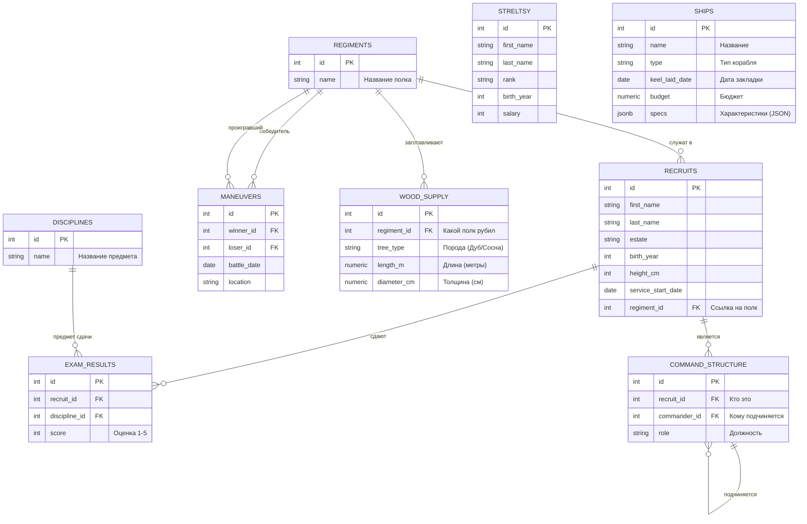

<script setup>
import Conversation from "../../../../components/Conversation.vue";
import alexey from "../../../assets/databases/heroes/clerk_alexey.png";
import ivan from "../../../assets/databases/heroes/clerk_fedor.png";
import petr from "../../../assets/databases/heroes/petr_young.png";
import { defineAsyncComponent } from "vue";

const Repl = defineAsyncComponent(() => import("../../../../components/Repl.vue"))
</script>

# Разработка запросов с подзапросами

## Заморская бюрократия

**Конец апреля 1697 года.** Амстердамская ратуша. За окном хлещет ледяной дождь, а внутри кипит работа. Великое посольство собрало столько данных, чертежей и расписок, что старые амбарные книги начали трещать по швам.

Государь, переодетый в плотницкое платье, врывается в архив. В руках у него кипа мокрых пергаментов: списки рекрутов вперемешку с голландскими сметами на порох и чертежами фрегатов. Казначейство требует отчетов, адмиралы путаются в субординации, а голландские мастера отказываются строить корабли, пока не увидят четкий бюджет.

<Conversation :phrases="[
    {
        name: 'Петр',
        position: 'left',
        text: 'Так, хватит штаны протирать! У меня на верфи лес гниет, а вы не можете свести дебет с кредитом! Мне нужен полный анализ: кто кому подчиняется, какой полк лучше рубит мачты, кто самый меткий стрелок и на каком корабле капитан жрет больше всего бюджета! До утра не сведете всё в единую систему — отправлю всех чистить трюмы на галерах!',
        photo: petr
    },
    {
        name: 'Федор',
        position: 'right',
        text: 'Государь, помилуй! Тут же данные из пяти разных ведомств! Голландские чертежи в этих бесовских JSON-форматах, иерархия запутана так, что сам черт ногу сломит, а рекруты сдают экзамены вперемешку с рубкой леса!',
        photo: ivan
    },
    {
        name: 'Алексей',
        position: 'right',
        text: 'Отставить панику, Федор. Доставай обобщенные табличные выражения. Будем строить конвейеры, гонять рекурсию и наслаивать оконные функции. База данных всё стерпит. Покажем европейцам, как работают русские инженеры.',
        photo: alexey
    }
]"/>

Твоя задача — помочь Федору выжить в эту ночь. Поначалу запросы будут простыми, но чем глубже в ночь, тем безумнее станут требования царя.



::: details Структура БД

```sql
-- === 0. СОЗДАЕМ И ЗАПОЛНЯЕМ РЕКРУТОВ И СТРЕЛЬЦОВ ===
CREATE TABLE recruits (
    id SERIAL PRIMARY KEY,
    first_name VARCHAR(50),
    last_name VARCHAR(50),
    estate VARCHAR(50), -- Сословие: Дворянин, Мещанин, Крестьянин, Иноземец
    birth_year INTEGER,
    height_cm INTEGER,
    service_start_date DATE
);
INSERT INTO recruits (first_name, last_name, estate, birth_year, height_cm, service_start_date) VALUES
-- Реальные исторические личности
('Сергей', 'Бухвостов', 'Дворянин', 1659, 198, '1683-01-01'), -- Первый солдат, высокий!
('Александр', 'Меншиков', 'Мещанин', 1673, 185, '1686-02-12'), -- Алексашка, молодой
('Франц', 'Лефорт', 'Иноземец', 1656, 178, '1680-05-10'), -- Наставник
('Патрик', 'Гордон', 'Иноземец', 1635, 175, '1680-01-15'), -- Самый старший
('Федор', 'Апраксин', 'Дворянин', 1661, 180, '1683-04-20'),
('Михаил', 'Голицын', 'Дворянин', 1675, 176, '1687-06-01'), -- Совсем юный
('Яков', 'Брюс', 'Иноземец', 1669, 182, '1686-08-14'), -- Брюс
('Аникита', 'Репнин', 'Дворянин', 1668, 184, '1685-03-30'),
('Автоном', 'Головин', 'Дворянин', 1667, 179, '1684-11-20'),
('Иван', 'Бутурлин', 'Дворянин', 1661, 177, '1683-09-12'),
-- Массовка (Дворяне)
('Петр', 'Волков', 'Дворянин', 1668, 185, '1683-06-12'),
('Дмитрий', 'Морозов', 'Дворянин', 1671, 190, '1684-03-01'),
('Николай', 'Новиков', 'Дворянин', 1673, 182, '1685-02-10'),
('Сергей', 'Соловьев', 'Дворянин', 1667, 188, '1683-09-30'),
('Яков', 'Семенов', 'Дворянин', 1669, 184, '1684-05-25'),
('Гаврила', 'Романов', 'Дворянин', 1675, 192, '1685-04-12'),
('Ефим', 'Никитин', 'Дворянин', 1668, 186, '1683-12-01'),
-- Массовка (Крестьяне - их много, они пониже, но есть богатыри)
('Алексей', 'Смирнов', 'Крестьянин', 1665, 175, '1683-05-10'),
('Федор', 'Козлов', 'Крестьянин', 1662, 168, '1683-05-20'),
('Михаил', 'Соколов', 'Крестьянин', 1669, 178, '1683-07-07'),
('Андрей', 'Зайцев', 'Крестьянин', 1660, 165, '1683-04-12'),
('Григорий', 'Титов', 'Крестьянин', 1664, 176, '1683-06-18'),
('Степан', 'Кузнецов', 'Крестьянин', 1661, 169, '1683-05-05'),
('Макар', 'Егоров', 'Крестьянин', 1666, 173, '1683-08-01'),
('Лука', 'Антонов', 'Крестьянин', 1671, 177, '1685-01-20'),
('Илья', 'Муромец', 'Крестьянин', 1660, 195, '1683-02-02'), -- Пасхалка, очень высокий
('Савелий', 'Громов', 'Крестьянин', 1665, 188, '1684-07-15'),
('Прохор', 'Дубов', 'Крестьянин', 1670, 180, '1686-03-03'),
-- Массовка (Мещане)
('Иван', 'Попов', 'Мещанин', 1670, 172, '1684-01-15'),
('Василий', 'Лебедев', 'Мещанин', 1665, 170, '1683-08-22'),
('Павел', 'Борисов', 'Мещанин', 1672, 174, '1684-11-05'),
('Александр', 'Виноградов', 'Мещанин', 1670, 171, '1684-02-14'),
('Тихон', 'Медведев', 'Мещанин', 1663, 167, '1683-10-10'),
('Кузьма', 'Минин', 'Мещанин', 1662, 176, '1683-09-09'), -- Тезка знаменитого
('Ермолай', 'Рыбаков', 'Мещанин', 1668, 169, '1685-06-20'),
-- Еще Иноземцы (для статистики)
('Иоганн', 'Вейс', 'Иноземец', 1660, 176, '1684-01-01'),
('Петер', 'Шмидт', 'Иноземец', 1665, 181, '1685-12-12');

CREATE TABLE streltsy (
    id SERIAL PRIMARY KEY,
    first_name VARCHAR(50),
    last_name VARCHAR(50),
    rank VARCHAR(50),
    birth_year INTEGER,
    salary INTEGER
);
INSERT INTO streltsy (first_name, last_name, rank, birth_year, salary) VALUES
('Лаврентий', 'Сухарев', 'Полковник', 1655, 150),
('Иван', 'Цыклер', 'Полковник', 1660, 140),
('Кузьма', 'Борода', 'Стрелец', 1670, 10),
('Ерофей', 'Хабаров', 'Стрелец', 1665, 12),
('Агап', 'Тихий', 'Стрелец', 1672, 10),
('Прокоп', 'Громкий', 'Десятник', 1668, 25),
('Сидор', 'Лютый', 'Стрелец', 1660, 10),
('Фома', 'Кистенев', 'Стрелец', 1669, 11),
('Епифан', 'Коловрат', 'Стрелец', 1667, 10),
('Никита', 'Пустосвят', 'Стрелец', 1659, 10),
('Савва', 'Морозов', 'Стрелец', 1671, 15),
('Тихон', 'Хренников', 'Стрелец', 1668, 10),
('Елизар', 'Молот', 'Стрелец', 1666, 12),
('Акакий', 'Башмачкин', 'Писарь', 1675, 8),
('Остап', 'Бендер', 'Десятник', 1673, 50),
('Паниковский', 'Михаил', 'Стрелец', 1660, 5),
('Шура', 'Балаганов', 'Стрелец', 1674, 10),
('Алексей', 'Смирнов', 'Стрелец', 1665, 10),
('Федор', 'Козлов', 'Стрелец', 1662, 10),
('Иван', 'Иванов', 'Сотник', 1670, 45),
('Михаил', 'Соколов', 'Десятник', 1669, 30),
('Андрей', 'Зайцев', 'Стрелец', 1660, 10),
('Григорий', 'Титов', 'Стрелец', 1664, 10),
('Василий', 'Теркин', 'Стрелец', 1675, 12),
('Степан', 'Калашников', 'Стрелец', 1670, 15),
('Кирилл', 'Туров', 'Стрелец', 1668, 10),
('Мефодий', 'Буквоед', 'Писарь', 1660, 9),
('Добрыня', 'Никитич', 'Сотник', 1655, 100),
('Алеша', 'Попович', 'Десятник', 1678, 30),
('Илья', 'Муромец', 'Стрелец', 1650, 20),
('Соловей', 'Разбойник', 'Стрелец', 1665, 10),
('Кощей', 'Бессмертный', 'Полковник', 1600, 200),
('Яга', 'Костяная', 'Стряпуха', 1620, 5);

-- === 1. СОЗДАЕМ И ЗАПОЛНЯЕМ ПОЛКИ ===
CREATE TABLE regiments (
id SERIAL PRIMARY KEY,
name VARCHAR(50) -- Название полка (Преображенский, Семеновский)
);

INSERT INTO regiments (name) VALUES
('Преображенский полк'),
('Семеновский полк'),
('Лефортовский полк'),
('Бутырский полк');


-- === 2. РАСПРЕДЕЛЯЕМ ЛЮДЕЙ (UPDATE) ===

-- Привязываем рекрутов к полкам (Добавляем внешний ключ)
ALTER TABLE recruits ADD COLUMN regiment_id INTEGER;

-- А. Исторические личности (Точечное распределение)
UPDATE recruits SET regiment_id = 1 WHERE last_name IN ('Бухвостов', 'Меншиков', 'Брюс', 'Репнин', 'Головин', 'Бутурлин'); -- Преображенцы
UPDATE recruits SET regiment_id = 2 WHERE last_name IN ('Апраксин', 'Голицын'); -- Семеновцы
UPDATE recruits SET regiment_id = 3 WHERE last_name = 'Лефорт'; -- Лефортовский
UPDATE recruits SET regiment_id = 4 WHERE last_name = 'Гордон'; -- Бутырский

-- Б. Массовка - Дворяне (Все офицеры должны быть при деле)
UPDATE recruits
SET regiment_id = floor(random() * 4 + 1)::int
WHERE estate = 'Дворянин' AND id > 10;


-- В. Массовка - Крестьяне и Мещане (Солдаты)
UPDATE recruits
SET regiment_id = floor(random() * 2 + 1)::int -- Только в Преображенский или Семеновский (пехота)
WHERE estate IN ('Крестьянин', 'Мещанин')
AND id > 10
AND random() > 0.3;

-- ВАЖНО: Иноземец Петер Шмидт - зачислим его к Лефорту
UPDATE recruits SET regiment_id = 3 WHERE last_name = 'Шмидт';

-- 3. Добавляем ДИСЦИПЛИНЫ
CREATE TABLE disciplines (
id SERIAL PRIMARY KEY,
name VARCHAR(50)
);

INSERT INTO disciplines (name) VALUES
('Мушкетная стрельба'),
('Фехтование'),
('Инженерное дело'),
('Метание гранат'); -- Эту дисциплину еще никто не сдавал

-- === 3. ЗАПОЛНЯЕМ ОЦЕНКИ (INSERT) ===
CREATE TABLE exam_results (
id SERIAL PRIMARY KEY,
recruit_id INTEGER, -- Ссылка на recruits
discipline_id INTEGER, -- Ссылка на disciplines
score INTEGER -- Оценка (от 1 до 5)
);

-- А. Исторические личности (Сдали все)
INSERT INTO exam_results (recruit_id, discipline_id, score) VALUES
-- Сергей Бухвостов (Преображенец, 1-й солдат) - Отличник
(1, 1, 5), -- Стрельба
(1, 2, 5), -- Фехтование
(1, 3, 4), -- Инженерное

-- Александр Меншиков (Преображенец) - Хитрый, но не усидчивый
(2, 1, 3), -- Стрельба (руки дрожали)
(2, 2, 5), -- Фехтование (дерзкий)
(2, 3, 5), -- Инженерное (смекалка)

-- Франц Лефорт (Командир)
(3, 1, 5),
(3, 2, 5),
(3, 3, 5),

-- Патрик Гордон (Старый вояка)
(4, 1, 5), -- Стрельба (опыт)
(4, 3, 5), -- Инженерное (фортификация - его конек)

-- Яков Брюс (Ученый)
(7, 1, 2), -- Стрельба (слеповат)
(7, 3, 5); -- Инженерное (Гений!)

-- Б. Дворяне (Массовка)
INSERT INTO exam_results (recruit_id, discipline_id, score)
SELECT id, 1, floor(random() * 3 + 3)::int -- Стрельба (оценки 3, 4, 5)
FROM recruits
WHERE estate = 'Дворянин' AND id > 10 AND random() > 0.5;

INSERT INTO exam_results (recruit_id, discipline_id, score)
SELECT id, 2, floor(random() * 4 + 2)::int -- Фехтование
FROM recruits
WHERE estate = 'Дворянин' AND id > 10 AND random() > 0.5;

-- В. Крестьяне (Массовка) - Сдали немногие (только стрельбу)
INSERT INTO exam_results (recruit_id, discipline_id, score)
SELECT id, 1, floor(random() * 5 + 1)::int -- Стрельба (оценки 1-5, как повезет)
FROM recruits
WHERE estate = 'Крестьянин' AND regiment_id IS NOT NULL AND random() > 0.7;

-- Г. Специально добавим "Двоечника" для примера
INSERT INTO exam_results (recruit_id, discipline_id, score)
VALUES ((SELECT id FROM recruits WHERE estate='Крестьянин' LIMIT 1), 3, 1); -- Инженерное дело - 1

-- === 4. УЧЕБНЫЕ МАНЕВРЫ (Новая таблица!) ===
CREATE TABLE maneuvers (
    id SERIAL PRIMARY KEY,
    winner_id INTEGER, -- Кто победил (ссылка на regiments)
    loser_id INTEGER,  -- Кто проиграл (ссылка на regiments)
    battle_date DATE,
    location VARCHAR(50)
);

INSERT INTO maneuvers (winner_id, loser_id, battle_date, location) VALUES
(1, 2, '1694-10-01', 'Кожухово'), -- Преображенский побил Семеновский
(3, 4, '1694-10-02', 'Яуза'),     -- Лефортовский побил Бутырский
(1, 3, '1694-10-03', 'Кожухово'), -- Преображенский побил Лефортовский
(2, 4, '1694-10-04', 'Пресбург'), -- Семеновский побил Бутырский
(4, 1, '1694-10-05', 'Яуза'),     -- Бутырский (внезапно) побил Преображенский (реванш)
(3, 2, '1694-10-06', 'Пресбург'),
(1, 4, '1694-10-07', 'Кожухово'),
(2, 3, '1694-10-08', 'Яуза'),
(4, 3, '1694-10-09', 'Пресбург'),
(1, 2, '1694-10-10', 'Финал'),    -- Гранд-финал
(3, 1, '1694-10-11', 'Утешительный'),
(4, 2, '1694-10-12', 'Пьяная драка');

-- === 5. ФЛОТ (Корабли) ===
CREATE TABLE ships (
    id SERIAL PRIMARY KEY,
    name VARCHAR(50),
    type VARCHAR(50),
    keel_laid_date DATE,
    budget NUMERIC(10, 2),
    specs JSONB -- колонка для хитрых голландских чертежей
);

INSERT INTO ships (name, type, keel_laid_date, budget, specs) VALUES
('Апостол Петр', 'Галера', '1695-11-01', 5000.00, '{"crew": 150, "captain": {"name": "Лефорт", "rank": "Адмирал"}, "weapons": ["пушки", "мушкетоны"]}'),
('Апостол Павел', 'Галера', '1695-11-15', 5200.50, '{"crew": 140, "captain": {"name": "Головин", "rank": "Капитан"}, "weapons": ["пушки"]}'),
('Страх', 'Брандер', '1695-12-01', 1500.00, '{"explosives_kg": 500, "crew": 5, "weapons": ["греческий огонь"]}'),
('Смелость', 'Брандер', '1695-12-05', 1450.75, '{"explosives_kg": 600, "crew": 4, "weapons": []}'),
('Святой Марк', 'Струг', '1696-01-10', 800.00, '{"cargo_capacity_tons": 50, "captain": {"name": "Смирнов", "rank": "Боцман"}}'),
('Святой Лука', 'Струг', '1696-01-12', NULL, '{"cargo_capacity_tons": 60}'); -- Бюджет еще не утвержден

-- === 6. ЛЕСОЗАГОТОВКИ ===
CREATE TABLE wood_supply (
id SERIAL PRIMARY KEY,
regiment_id INTEGER, -- Какой полк рубил
tree_type VARCHAR(50),
length_m NUMERIC(5, 2), -- Длина в метрах
diameter_cm NUMERIC(5, 2) -- Диаметр в сантиметрах
);

-- Полки рубят лес (Преображенцы и Семеновцы)
INSERT INTO wood_supply (regiment_id, tree_type, length_m, diameter_cm) VALUES
(1, 'Дуб', 8.5, 45.0),
(1, 'Дуб', 9.0, 50.5),
(1, 'Сосна', 12.0, 30.0),
(2, 'Сосна', 11.5, 28.5),
(2, 'Дуб', 7.8, 42.0),
(2, 'Сосна', 13.0, 35.0),
(1, 'Дуб', 8.0, 48.0),
(3, 'Сосна', 10.0, 25.0);


-- === 7. ИЕРАРХИЯ КОМАНДОВАНИЯ (Для рекурсивных CTE) ===
CREATE TABLE command_structure (
id SERIAL PRIMARY KEY,
recruit_id INTEGER REFERENCES recruits(id), -- Кто это (связь с рекрутами)
commander_id INTEGER REFERENCES command_structure(id), -- Кому подчиняется (связь сама на себя)
role VARCHAR(50) -- Должность
);

-- Петр Волков (id=11) будет у нас Петром Михайловым (царем под прикрытием)
INSERT INTO command_structure (recruit_id, commander_id, role) VALUES
(11, NULL, 'Десятник Петр Михайлов (Бомбардир)'), -- Самый главный, начальника нет (NULL)
(3, 1, 'Великий посол (Лефорт)'), -- Подчиняется Петру (id записи = 1)
(9, 2, 'Второй посол (Головин)'), -- Подчиняется Лефорту (id записи = 2)
(2, 1, 'Денщик (Меншиков)'), -- Лично при Петре (id записи = 1)
(7, 2, 'Ученый при посольстве (Брюс)'), -- При Лефорте
(1, 3, 'Сержант охраны (Бухвостов)'), -- Охрана при Головине
(18, 6, 'Солдат охраны (Смирнов)'); -- Подчиняется Бухвостову
```

:::

<ClientOnly>
<Repl :initial-queries="[
`CREATE TABLE recruits (
    id SERIAL PRIMARY KEY,
    first_name VARCHAR(50),
    last_name VARCHAR(50),
    estate VARCHAR(50),
    birth_year INTEGER,
    height_cm INTEGER,
    service_start_date DATE
);`,
`INSERT INTO recruits (first_name, last_name, estate, birth_year, height_cm, service_start_date) VALUES
('Сергей', 'Бухвостов', 'Дворянин', 1659, 198, '1683-01-01'), 
('Александр', 'Меншиков', 'Мещанин', 1673, 185, '1686-02-12'),
('Франц', 'Лефорт', 'Иноземец', 1656, 178, '1680-05-10'),
('Патрик', 'Гордон', 'Иноземец', 1635, 175, '1680-01-15'),
('Федор', 'Апраксин', 'Дворянин', 1661, 180, '1683-04-20'),
('Михаил', 'Голицын', 'Дворянин', 1675, 176, '1687-06-01'),
('Яков', 'Брюс', 'Иноземец', 1669, 182, '1686-08-14'),
('Аникита', 'Репнин', 'Дворянин', 1668, 184, '1685-03-30'),
('Автоном', 'Головин', 'Дворянин', 1667, 179, '1684-11-20'),
('Иван', 'Бутурлин', 'Дворянин', 1661, 177, '1683-09-12'),
('Петр', 'Волков', 'Дворянин', 1668, 185, '1683-06-12'),
('Дмитрий', 'Морозов', 'Дворянин', 1671, 190, '1684-03-01'),
('Николай', 'Новиков', 'Дворянин', 1673, 182, '1685-02-10'),
('Сергей', 'Соловьев', 'Дворянин', 1667, 188, '1683-09-30'),
('Яков', 'Семенов', 'Дворянин', 1669, 184, '1684-05-25'),
('Гаврила', 'Романов', 'Дворянин', 1675, 192, '1685-04-12'),
('Ефим', 'Никитин', 'Дворянин', 1668, 186, '1683-12-01'),
('Алексей', 'Смирнов', 'Крестьянин', 1665, 175, '1683-05-10'),
('Федор', 'Козлов', 'Крестьянин', 1662, 168, '1683-05-20'),
('Михаил', 'Соколов', 'Крестьянин', 1669, 178, '1683-07-07'),
('Андрей', 'Зайцев', 'Крестьянин', 1660, 165, '1683-04-12'),
('Григорий', 'Титов', 'Крестьянин', 1664, 176, '1683-06-18'),
('Степан', 'Кузнецов', 'Крестьянин', 1661, 169, '1683-05-05'),
('Макар', 'Егоров', 'Крестьянин', 1666, 173, '1683-08-01'),
('Лука', 'Антонов', 'Крестьянин', 1671, 177, '1685-01-20'),
('Илья', 'Муромец', 'Крестьянин', 1660, 195, '1683-02-02'),
('Савелий', 'Громов', 'Крестьянин', 1665, 188, '1684-07-15'),
('Прохор', 'Дубов', 'Крестьянин', 1670, 180, '1686-03-03'),
('Иван', 'Попов', 'Мещанин', 1670, 172, '1684-01-15'),
('Василий', 'Лебедев', 'Мещанин', 1665, 170, '1683-08-22'),
('Павел', 'Борисов', 'Мещанин', 1672, 174, '1684-11-05'),
('Александр', 'Виноградов', 'Мещанин', 1670, 171, '1684-02-14'),
('Тихон', 'Медведев', 'Мещанин', 1663, 167, '1683-10-10'),
('Кузьма', 'Минин', 'Мещанин', 1662, 176, '1683-09-09'), 
('Ермолай', 'Рыбаков', 'Мещанин', 1668, 169, '1685-06-20'),
('Иоганн', 'Вейс', 'Иноземец', 1660, 176, '1684-01-01'),
('Петер', 'Шмидт', 'Иноземец', 1665, 181, '1685-12-12');`,
`CREATE TABLE streltsy (
    id SERIAL PRIMARY KEY,
    first_name VARCHAR(50),
    last_name VARCHAR(50),
    rank VARCHAR(50),
    birth_year INTEGER,
    salary INTEGER
);`,
`INSERT INTO streltsy (first_name, last_name, rank, birth_year, salary) VALUES
('Лаврентий', 'Сухарев', 'Полковник', 1655, 150),
('Иван', 'Цыклер', 'Полковник', 1660, 140),
('Кузьма', 'Борода', 'Стрелец', 1670, 10),
('Ерофей', 'Хабаров', 'Стрелец', 1665, 12),
('Агап', 'Тихий', 'Стрелец', 1672, 10),
('Прокоп', 'Громкий', 'Десятник', 1668, 25),
('Сидор', 'Лютый', 'Стрелец', 1660, 10),
('Фома', 'Кистенев', 'Стрелец', 1669, 11),
('Епифан', 'Коловрат', 'Стрелец', 1667, 10),
('Никита', 'Пустосвят', 'Стрелец', 1659, 10),
('Савва', 'Морозов', 'Стрелец', 1671, 15),
('Тихон', 'Хренников', 'Стрелец', 1668, 10),
('Елизар', 'Молот', 'Стрелец', 1666, 12),
('Акакий', 'Башмачкин', 'Писарь', 1675, 8),
('Остап', 'Бендер', 'Десятник', 1673, 50),
('Паниковский', 'Михаил', 'Стрелец', 1660, 5),
('Шура', 'Балаганов', 'Стрелец', 1674, 10),
('Алексей', 'Смирнов', 'Стрелец', 1665, 10),
('Федор', 'Козлов', 'Стрелец', 1662, 10),
('Иван', 'Иванов', 'Сотник', 1670, 45),
('Михаил', 'Соколов', 'Десятник', 1669, 30),
('Андрей', 'Зайцев', 'Стрелец', 1660, 10),
('Григорий', 'Титов', 'Стрелец', 1664, 10),
('Василий', 'Теркин', 'Стрелец', 1675, 12),
('Степан', 'Калашников', 'Стрелец', 1670, 15),
('Кирилл', 'Туров', 'Стрелец', 1668, 10),
('Мефодий', 'Буквоед', 'Писарь', 1660, 9),
('Добрыня', 'Никитич', 'Сотник', 1655, 100),
('Алеша', 'Попович', 'Десятник', 1678, 30),
('Илья', 'Муромец', 'Стрелец', 1650, 20),
('Соловей', 'Разбойник', 'Стрелец', 1665, 10),
('Кощей', 'Бессмертный', 'Полковник', 1600, 200),
('Яга', 'Костяная', 'Стряпуха', 1620, 5);`,
`CREATE TABLE regiments (
id SERIAL PRIMARY KEY,
name VARCHAR(50)
);`,
`INSERT INTO regiments (name) VALUES
('Преображенский полк'),
('Семеновский полк'),
('Лефортовский полк'),
('Бутырский полк');`,
`ALTER TABLE recruits ADD COLUMN regiment_id INTEGER;`,
`UPDATE recruits SET regiment_id = 1 WHERE last_name IN ('Бухвостов', 'Меншиков', 'Брюс', 'Репнин', 'Головин', 'Бутурлин');`,
`UPDATE recruits SET regiment_id = 2 WHERE last_name IN ('Апраксин', 'Голицын');`,
`UPDATE recruits SET regiment_id = 3 WHERE last_name = 'Лефорт'; `,
`UPDATE recruits SET regiment_id = 4 WHERE last_name = 'Гордон';`,
`UPDATE recruits
SET regiment_id = floor(random() * 4 + 1)::int
WHERE estate = 'Дворянин' AND id > 10;`,
`UPDATE recruits
SET regiment_id = floor(random() * 2 + 1)::int 
WHERE estate IN ('Крестьянин', 'Мещанин')
AND id > 10
AND random() > 0.3;`,
`UPDATE recruits SET regiment_id = 3 WHERE last_name = 'Шмидт';`,
`CREATE TABLE disciplines (
id SERIAL PRIMARY KEY,
name VARCHAR(50)
);`,
`INSERT INTO disciplines (name) VALUES
('Мушкетная стрельба'),
('Фехтование'),
('Инженерное дело'),
('Метание гранат'); `,
`CREATE TABLE exam_results (
id SERIAL PRIMARY KEY,
recruit_id INTEGER, 
discipline_id INTEGER, 
score INTEGER 
);`,
`INSERT INTO exam_results (recruit_id, discipline_id, score) VALUES
(1, 1, 5), -- Стрельба
(1, 2, 5), -- Фехтование
(1, 3, 4), -- Инженерное
(2, 1, 3), -- Стрельба (руки дрожали)
(2, 2, 5), -- Фехтование (дерзкий)
(2, 3, 5), -- Инженерное (смекалка)
(3, 1, 5),
(3, 2, 5),
(3, 3, 5),
(4, 1, 5), 
(4, 3, 5),
(7, 1, 2),
(7, 3, 5);`,
`INSERT INTO exam_results (recruit_id, discipline_id, score)
SELECT id, 1, floor(random() * 3 + 3)::int
FROM recruits
WHERE estate = 'Дворянин' AND id > 10 AND random() > 0.5;`,
`INSERT INTO exam_results (recruit_id, discipline_id, score)
SELECT id, 2, floor(random() * 4 + 2)::int 
FROM recruits
WHERE estate = 'Дворянин' AND id > 10 AND random() > 0.5;`,
`INSERT INTO exam_results (recruit_id, discipline_id, score)
SELECT id, 1, floor(random() * 5 + 1)::int 
FROM recruits
WHERE estate = 'Крестьянин' AND regiment_id IS NOT NULL AND random() > 0.7;`,
`INSERT INTO exam_results (recruit_id, discipline_id, score)
VALUES ((SELECT id FROM recruits WHERE estate='Крестьянин' LIMIT 1), 3, 1); `,
`CREATE TABLE maneuvers (
    id SERIAL PRIMARY KEY,
    winner_id INTEGER,
    loser_id INTEGER, 
    battle_date DATE,
    location VARCHAR(50)
);`,
`INSERT INTO maneuvers (winner_id, loser_id, battle_date, location) VALUES
(1, 2, '1694-10-01', 'Кожухово'), 
(3, 4, '1694-10-02', 'Яуза'),    
(1, 3, '1694-10-03', 'Кожухово'), 
(2, 4, '1694-10-04', 'Пресбург'), 
(4, 1, '1694-10-05', 'Яуза'),    
(3, 2, '1694-10-06', 'Пресбург'),
(1, 4, '1694-10-07', 'Кожухово'),
(2, 3, '1694-10-08', 'Яуза'),
(4, 3, '1694-10-09', 'Пресбург'),
(1, 2, '1694-10-10', 'Финал'),   
(3, 1, '1694-10-11', 'Утешительный'),
(4, 2, '1694-10-12', 'Пьяная драка');`,
`CREATE TABLE ships (
id SERIAL PRIMARY KEY,
name VARCHAR(50),
type VARCHAR(50),
keel_laid_date DATE,
budget NUMERIC(10, 2),
specs JSONB 
);`,
`INSERT INTO ships (name, type, keel_laid_date, budget, specs) VALUES
('Апостол Петр', 'Галера', '1695-11-01', 5000.00, '{&quot;crew&quot;: 150, &quot;captain&quot;: {&quot;name&quot;: &quot;Лефорт&quot;, &quot;rank&quot;: &quot;Адмирал&quot;}, &quot;weapons&quot;: [&quot;пушки&quot;, &quot;мушкетоны&quot;]}'),
('Апостол Павел', 'Галера', '1695-11-15', 5200.50, '{&quot;crew&quot;: 140, &quot;captain&quot;: {&quot;name&quot;: &quot;Головин&quot;, &quot;rank&quot;: &quot;Капитан&quot;}, &quot;weapons&quot;: [&quot;пушки&quot;]}'),
('Страх', 'Брандер', '1695-12-01', 1500.00, '{&quot;explosives_kg&quot;: 500, &quot;crew&quot;: 5, &quot;weapons&quot;: [&quot;греческий огонь&quot;]}'),
('Смелость', 'Брандер', '1695-12-05', 1450.75, '{&quot;explosives_kg&quot;: 600, &quot;crew&quot;: 4, &quot;weapons&quot;: []}'),
('Святой Марк', 'Струг', '1696-01-10', 800.00, '{&quot;cargo_capacity_tons&quot;: 50, &quot;captain&quot;: {&quot;name&quot;: &quot;Смирнов&quot;, &quot;rank&quot;: &quot;Боцман&quot;}}'),
('Святой Лука', 'Струг', '1696-01-12', NULL, '{&quot;cargo_capacity_tons&quot;: 60}');`,
`CREATE TABLE wood_supply (
id SERIAL PRIMARY KEY,
regiment_id INTEGER, -- Какой полк рубил
tree_type VARCHAR(50),
length_m NUMERIC(5, 2), -- Длина в метрах
diameter_cm NUMERIC(5, 2) -- Диаметр в сантиметрах
);`,
`INSERT INTO wood_supply (regiment_id, tree_type, length_m, diameter_cm) VALUES
(1, 'Дуб', 8.5, 45.0),
(1, 'Дуб', 9.0, 50.5),
(1, 'Сосна', 12.0, 30.0),
(2, 'Сосна', 11.5, 28.5),
(2, 'Дуб', 7.8, 42.0),
(2, 'Сосна', 13.0, 35.0),
(1, 'Дуб', 8.0, 48.0),
(3, 'Сосна', 10.0, 25.0);`,
`CREATE TABLE command_structure (
id SERIAL PRIMARY KEY,
recruit_id INTEGER REFERENCES recruits(id), 
commander_id INTEGER REFERENCES command_structure(id), 
role VARCHAR(50) 
);`,
`INSERT INTO command_structure (recruit_id, commander_id, role) VALUES
(11, NULL, 'Десятник Петр Михайлов (Бомбардир)'), 
(3, 1, 'Великий посол (Лефорт)'), 
(9, 2, 'Второй посол (Головин)'),
(2, 1, 'Денщик (Меншиков)'), 
(7, 2, 'Ученый при посольстве (Брюс)'),
(1, 3, 'Сержант охраны (Бухвостов)'),
(18, 6, 'Солдат охраны (Смирнов)'); `
]"/>
</ClientOnly>

## Блок 1: Разминка в архивах

**Задача 1. Отсев карликов**

Государь ищет богатырей для показательного строя перед бургомистром.
_Выведите имена и фамилии рекрутов, чей рост строго больше, чем средний рост **всего** войска._

**Задача 2. Зависть и жалованье**

Стрельцы вечно недовольны деньгами.
_Выведите фамилию стрельца, его текущее жалованье, а в третьей колонке — максимальное жалованье среди всех стрельцов. В четвертой колонке посчитайте разницу: сколько этому стрельцу не хватает до максимального оклада._

**Задача 3. Элита из победителей**

Нужно наградить солдат из лучших полков.
_Найдите имена и фамилии рекрутов, которые служат в полках, одержавших **хотя бы одну победу** в маневрах._

**Задача 4. Черный список**

Охрана посольства должна быть безупречной.
_Выведите список всех рекрутов, которые **ни разу** не сдавали экзамен с оценкой «2»._

**Задача 5. Проверка складов**

Лефорт хочет знать, какие полки вообще занимаются полезным делом, а не просто маршируют.
_Выведите названия полков, которые заготовили **хотя бы одно** дубовое бревно_

## Блок 2: Продвинутый поиск и корреляция

**Задача 6. Внутренняя конкуренция**

Сравнивать дворян с крестьянами нечестно.
_Выведите фамилию, сословие и рост рекрутов, которые выше среднего роста **исключительно внутри своего собственного сословия**. Подзапрос должен ссылаться на сословие из внешнего запроса._

**Задача 7. Чемпионские замашки**

Ищем абсолютных рекордсменов по стрельбе.
_Найдите рекрутов, чья оценка по предмету «Мушкетная стрельба» больше или равна оценкам **всех остальных** рекрутов по этому же предмету._

**Задача 8. Выскочки без полка**

_Найдите рекрутов, у которых еще нет полка, но чей рост больше, чем у **любого** солдата из Семеновского полка._

**Задача 9. Виртуальная таблица успеваемости**

_Используя встроенное представление, сначала вычислите средний балл каждого рекрута по всем его экзаменам, а затем выведите только тех, чей средний балл выше `4.0`._

**Задача 10. Коррелированный апгрейд**

_Выведите названия тех предметов, по которым **существует** хотя бы один экзамен, сданный на оценку «5» рекрутом крестьянского сословия._

## Блок 3: Голландские конвейеры

**Задача 11. Чистая статистика**

Перепишем лапшу из подзапросов.
_Создайте CTE с именем `estate_stats`, который считает средний рост по каждому сословию. Затем в основном запросе соедините таблицу рекрутов с вашим CTE и выведите фамилию, сословие, личный рост и средний рост сословия._

**Задача 12. Цепочка расчетов**

Петр требует найти самые продуктивные полки лесорубов.

- 1-й CTE: Считает общий метраж заготовленного леса для каждого полка.
- 2-й CTE: Берет данные из 1-го CTE и оставляет только те ID полков, где общая длина больше 20 метров.
- Главный запрос: Выводит красивые названия этих полков, соединяясь со 2-м CTE.

**Задача 13. Распаковка чертежей**

Голландцы спрятали данные об экипаже в JSON-документах.
_Напишите CTE, который извлекает название корабля и размер экипажа (`crew`) из поля `specs`, приводя его к целому числу (`::INT`). Корабли без экипажа отфильтруйте. В главном запросе найдите средний размер экипажа для всего флота._

**Задача 14. Гонка бюджетов**

Казначей должен знать, на ком сэкономить.
_Создайте CTE, отбирающий только те корабли, у которых есть бюджет. В основном запросе выведите название корабля, бюджет и его **рейтинг** по размеру бюджета (от самого дорогого к дешевому) с помощью оконной функции._

**Задача 15. Кто за кем стоит?**
_Создайте CTE, в котором каждому кораблю присваивается порядковый номер по дате закладки киля. В основном запросе выведите название текущего корабля и название корабля, который был заложен **сразу после него**._

## Блок 4: Адские своды

_Государь требует невозможного. Здесь вам придется скрестить все инструменты SQL в единый аналитический механизм. Слабонервным писарям просьба покинуть архив._

**Задача 16. Разворот Иерархии**

Петр хочет видеть вертикаль власти посольства снизу вверх.
_Используя `WITH RECURSIVE`, начните с солдата Смирнова. Поднимайтесь вверх по цепочке, пока не дойдете до самого царя. Выведите должность (`role`) каждого человека в этой цепи и шаг рекурсии._

**Задача 17. Бюрократический Индекс**

Вычислите "Коэффициент полезности" каждого полка.
_Создайте три CTE:_

1. `exam_stats`: Средний балл рекрутов полка.
2. `wood_stats`: Суммарная длина нарубленного полком леса.
3. `maneuver_stats`: Количество побед полка минус количество поражений.

_В основном запросе соберите это воедино: выведите название полка и итоговый индекс полезности по формуле: `(Средний балл * 10) + (Метраж леса) + (Баланс побед * 5)`. Выведите только те полки, чей индекс больше нуля._

**Задача 18. Военный трибунал**

Ищем самых переоцененных солдат.
_Создайте запрос, который выводит фамилию рекрута, его средний балл за экзамены и разницу между его средним баллом и максимальным баллом среди **всех рекрутов того же сословия**. Решите эту задачу исключительно с помощью оконных функций, обернутых в CTE, чтобы избежать использования `GROUP BY` в основном запросе._

**Задача 19. Анализ арсенала**

Лефорт в бешенстве: пушки закупаются, а куда ставятся — непонятно!
_Таблица `ships` содержит массив оружия `weapons` в JSONB. С помощью функции `jsonb_array_elements_text()` разверните этот массив в строки (сделайте это внутри CTE или подзапроса в FROM). Затем подсчитайте, сколько раз встречается каждый тип оружия (например, "пушки" - 2 раза, "мушкетоны" - 1 раз). В итоге выведите тип оружия и количество кораблей, на которых оно установлено._

**Задача 20. Апокалипсис Приказа Тайных Дел**

_Петр I приказал составить финальный реестр всей экспедиции. Напишите **один гигантский запрос** (допускается использование любого количества CTE), который выводит следующую сводку для КАЖДОГО рекрута (даже если он не сдавал экзамены):_

1. **`full_name`**: Имя и Фамилия рекрута.
2. **`command_level`**: Его уровень в иерархии `command_structure` (1 - Петр, 2 - Лефорт и т.д. Требуется рекурсия!). Если его нет в структуре подчинения, выведите число `99`.
3. **`regiment_status`**: Текстовое поле. Если полк рекрута выиграл маневров больше, чем проиграл — пишем `'Элита'`, иначе `'Пехота'`.
4. **`personal_best`**: Название дисциплины (текстом!), по которой у этого рекрута самая высокая оценка. Если оценок нет — `'Не обучен'`.
5. **`potential_ship`**: Если фамилия рекрута совпадает с именем капитана в JSONB `specs` любого корабля — выведите название этого корабля. Иначе — `NULL`.

_Отсортируйте итоговый отчет сначала по `command_level` (от начальства к рядовым), затем по `personal_best` по алфавиту._
